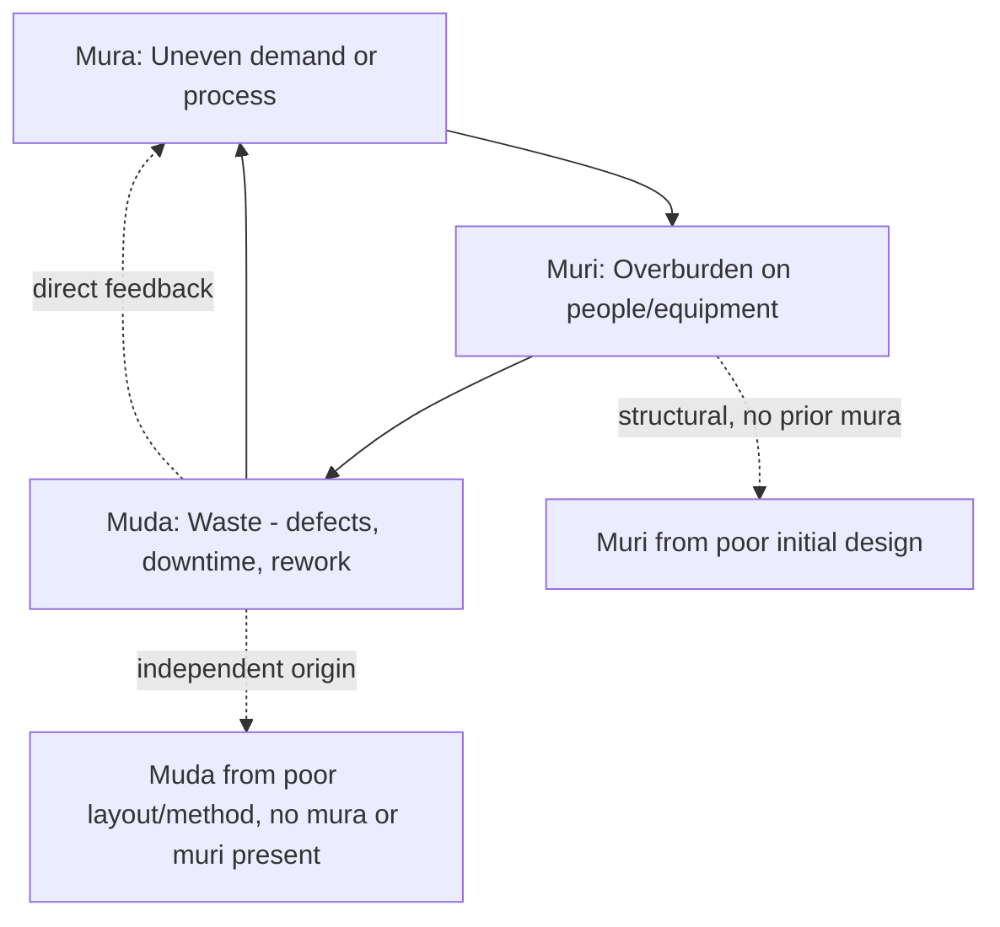

## The Interrelationship Between Muda, Mura, and Muri

### Overview

Muda (無駄, waste), mura (斑/ムラ, unevenness), and muri (無理, overburden) — collectively "the Three M's" — form an interdependent causal system in Toyota Production System thinking rather than three independent waste categories. Each has appeared individually in prior sections of this material; this section addresses their structural relationship, why sequencing matters when applying countermeasures, and where the simple linear model breaks down in practice.

### The Standard Causal Model

The most common pedagogical framing presents a directional chain:

$$\text{Mura} \rightarrow \text{Muri} \rightarrow \text{Muda}$$

- **Mura** (unevenness in demand or process) creates irregular load on a system
- That irregularity forces **muri** (overburden) during peak periods, as people and equipment are pushed beyond sustainable capacity to absorb the variation
- Sustained muri produces **muda** (waste) as its output: defects, breakdowns, absenteeism, rework, and downtime

[Inference] This chain is a widely taught simplification, useful for explaining *why* addressing root causes (mura) is generally more effective than addressing symptoms (muda) directly. It is not, however, a strict law of causation — each of the three can also arise independently, as detailed below.

### Where the Linear Model Breaks Down

**Muda can generate mura directly**, without an intervening muri stage. A machine breakdown (muda: unplanned downtime) creates an immediate irregular gap in output, which is itself mura — the next process downstream now faces an uneven, unpredictable supply of parts.

**Muri can arise without prior mura.** A process can be poorly designed from the outset — understaffed, using undersized equipment, or built around an unrealistic cycle time — and generate chronic overburden even under a perfectly level, unvarying demand signal. In this case there is no unevenness to point to; the overburden is structural, not variability-driven.

**Muda can exist without either mura or muri.** Simple non-value-adding activity — unnecessary motion, over-processing, excess transport — can occur in a perfectly smooth, non-overburdened process purely due to poor layout or method design.

This means the Three M's are better modeled as a **mutually reinforcing system with multiple entry points**, not a single unidirectional pipeline.

### Diagram: Full Interaction Model (svg_diagram)

### Why Toyota Prioritizes Mura Reduction First

Given that mura is frequently (though not universally) the upstream trigger, TPS practice generally emphasizes leveling (heijunka) as a primary intervention point, on the logic that removing demand/process variability prevents the conditions that would otherwise force overburden.

| Priority | Countermeasure | Targets |
| --- | --- | --- |
| 1 | Heijunka (production leveling) | Mura |
| 2 | Standardized work, takt time pacing, TPM | Muri |
| 3 | Kaizen, 5 Whys, defect root-cause analysis | Muda |

[Inference] This priority ordering is a widely cited heuristic in Lean literature (attacking mura before muda), reasoning that eliminating the root cause has higher leverage than repeatedly fixing symptoms. It is a strategic default, not a rule requiring rigid sequencing in every situation — a process exhibiting muda from a fixable method flaw, with no meaningful mura or muri present, should still be corrected directly rather than deferred pending an unrelated leveling initiative.

### Practical Example: Tracing the Full Loop

An assembly line receives customer orders in a highly variable pattern — large weekly spikes followed by near-idle periods (**mura**, demand-side). To hit weekly shipment targets, management responds by running mandatory overtime and increasing line speed during spike weeks (**muri**, both human and equipment overburden). Under this sustained overburden, defect rates rise due to worker fatigue and a machine begins to drift out of calibration from being run above its rated speed (**muda** — scrap, rework, and eventually unplanned downtime when the machine fails outright).

The unplanned downtime itself now creates a new irregular gap in output (**muda feeding back into mura**), which cascades to the next downstream process, restarting the cycle a step further along the line.

Applying a countermeasure only at the muda layer — for instance, tightening quality inspection to catch defects before shipment — treats the visible symptom but leaves the underlying overburden and demand variability untouched; the defect rate stabilizes, but overtime costs and machine wear continue accumulating. The systemic countermeasure instead targets mura first, via heijunka: leveling the order release schedule into the plant so that the line runs at a consistent, sustainable pace regardless of the underlying customer order pattern, which removes the pressure that produced the muri in the first place.

### Interaction Summary Table

| From \ To | Muda | Mura | Muri |
| --- | --- | --- | --- |
| **Muda** | — | Yes (e.g., breakdown creates supply gap) | Rare (indirect, via resulting catch-up pressure) |
| **Mura** | Indirect (via muri) | — | Yes (uneven load forces overburden) |
| **Muri** | Yes (overburden produces defects/downtime) | Rare (overburden itself is not unevenness) | — |

### Diagnostic Approach

**Key Points**

- When investigating a waste (muda) event, ask whether it recurs in a *pattern* (suggesting an upstream mura cause) or is *chronic and constant* (suggesting structural muri, independent of variability)
- Use 5 Whys or similar root-cause tools to trace a specific muda instance back through the chain rather than assuming the standard mura→muri→muda ordering applies
- Address mura through heijunka where demand or process variability is the identified root cause; address muri through standardized work, takt-based pacing, and TPM where overburden exists independent of variability; address muda directly through kaizen where neither of the other two is present

### Common Misconceptions

- **Misconception**: Muda is "the real problem" and mura/muri are secondary academic categories. In practice, treating only visible muda without investigating mura or muri as root causes tends to produce recurring waste that resists permanent elimination.
- **Misconception**: The three always occur in strict mura→muri→muda order. As shown above, muda can originate mura, and muri can arise without any preceding mura.
- **Misconception**: Eliminating mura automatically eliminates all muri and muda. [Inference] Leveling demand removes one common driver of overburden, but muri arising from structural issues (undersized equipment, poor ergonomics) requires its own direct countermeasure even under perfectly leveled demand.

**Related Topics**

- Heijunka (production leveling) mechanics and heijunka box design
- Standardized work as the primary muri countermeasure
- 5 Whys and root-cause analysis technique
- Total Productive Maintenance (TPM)
- The bullwhip effect as a demand-side mura mechanism
- Andon systems for real-time surfacing of overburden and defects