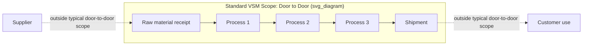

## Purpose and Scope of Value Stream Mapping

### Definition

**Value Stream Mapping (VSM)** is a Lean visualization technique that documents the complete flow of both materials and information required to bring a product or service from raw input (or initial request) to the customer. Developed at Toyota as part of "Material and Information Flow Mapping" and popularized externally by Mike Rother and John Shook's *Learning to See* (1998), VSM produces a single diagram capturing every process step, inventory/queue point, information flow, and timing data along a defined value stream.

### Core Purpose

VSM exists to make the **entire end-to-end flow visible on one page** — something no individual department or role can normally see, since each person typically observes only their local segment of the process. Its central purposes are:

- **Distinguish value-added from non-value-added activity** at each step, using the customer's perspective as the reference point for "value"
- **Reveal the cumulative effect of waste** (muda), unevenness (mura), and overburden (muri) across the whole chain, rather than in isolated steps
- **Provide a shared, fact-based picture** that cross-functional teams can use to agree on where to focus improvement, replacing anecdote and departmental opinion with observed data
- **Connect material flow to information flow** — showing not just how parts/documents move, but how scheduling and control decisions are made and communicated at each step

[Inference] The "one-page, whole-system visibility" characteristic is what most distinguishes VSM from generic flowcharting or process mapping; a flowchart typically documents steps and decision logic, while VSM specifically layers in timing data (cycle time, wait time), inventory levels, and information/scheduling flow simultaneously.

### Scope: What VSM Captures

A properly scoped value stream map documents, for a defined product family or service line:

| Element | What It Captures |
| --- | --- |
| Process boxes | Each discrete processing step, with cycle time, changeover time, uptime, number of operators |
| Inventory triangles | Quantity and (calculated) time of stock sitting between process steps |
| Material flow arrows | Physical movement of parts/materials, including push vs. pull indicators |
| Information flow lines | How scheduling, forecasts, and orders are communicated (manual, electronic, EDI) |
| Timeline (lead time ladder) | A running comparison of value-added time vs. total lead time across the entire stream |
| Customer and supplier icons | Demand signal (customer order pattern) and supply signal (supplier delivery pattern) bracketing the map |

### Two Primary Map Types

1. **Current State Map**: Documents the value stream *as it actually operates today*, built from direct observation (walking the process, gemba) rather than from documented procedures, which frequently diverge from actual practice
2. **Future State Map**: A designed target state incorporating Lean countermeasures (pull systems, heijunka, reduced batch sizes, eliminated non-value-added steps) that the organization intends to implement, typically within a defined near-term horizon (commonly 3–6 months in standard VSM practice, though this window varies by organization)

[Inference] A third map type, the **Ideal State Map**, appears in some extended VSM methodologies to represent a longer-horizon, more aspirational target beyond the immediate future state; this is not universal across all VSM frameworks and is treated as optional/supplementary rather than a core requirement.

### What VSM Deliberately Excludes

VSM is scoped narrowly by design, which is part of what makes it usable:

- It maps a **single product family** or service type sharing similar process steps, not an entire facility's full product mix simultaneously — mixing unrelated product families onto one map produces an unreadable, non-actionable diagram
- It does not capture fine-grained micro-motion analysis (that is the domain of time-and-motion study or work standardization, a separate but complementary tool)
- It is not a real-time monitoring or software system — it is a point-in-time snapshot used for planning, typically redrawn periodically rather than continuously updated

### Boundary Definition ("Door to Door")

A standard VSM scope commonly follows a "door to door" boundary: starting from receipt of raw material/information at the facility and ending at shipment to the customer, rather than extending indefinitely upstream to raw material extraction or downstream to end-consumer use. [Inference] Extended variants — **Supply Chain VSM** or **End-to-End VSM** — deliberately widen this boundary across multiple organizations when the improvement question specifically concerns cross-company flow (e.g., bullwhip effect analysis); this wider scope is a deliberate methodological choice for specific use cases, not the default starting scope for most internal process improvement efforts.

### Diagram: VSM Scope Boundary (svg_diagram)

### When VSM Is the Appropriate Tool

**Key Points**

- Use VSM when the improvement question spans **multiple process steps or departments**, since its value lies in revealing system-level interactions invisible from any single station
- Use VSM when both **material and information flow** are relevant to the problem (e.g., a process suffering from poor scheduling communication as much as physical bottlenecks)
- Avoid VSM for a **single-station problem** with no cross-process interaction — a kaizen event or simple time study is typically more efficient for isolated, local improvements
- Avoid VSM as a one-time artifact — its value comes from periodically redrawing the current state as improvements land, tracking convergence toward the future state

### Example

A furniture manufacturer wants to reduce the time from customer order to delivery for its dining table product line. Rather than optimizing the sanding station in isolation (a local, single-step view), the VSM team walks the entire flow: order entry → material staging → cutting → assembly → finishing → packaging → shipping, recording cycle time, changeover time, and inventory at each stage, alongside how the production schedule is communicated (weekly MRP push vs. real-time pull signal).

The resulting current-state map reveals that while total processing (value-added) time across all stations is roughly 6 hours, the actual order-to-delivery lead time is 11 days — the gap consisting almost entirely of inventory sitting in queue between cutting and assembly, driven by a scheduling practice that batches cutting jobs weekly regardless of downstream assembly capacity. This system-level insight — invisible from any single station's perspective — becomes the basis for the future-state design (e.g., smaller cutting batches synchronized to assembly's actual pull rate).

### Common Scoping Mistakes

- Mapping too broad a product mix, producing a map with so many branching paths it cannot be read or acted upon
- Mapping the documented/idealized process instead of walking the actual current state
- Omitting the information flow half of the map and only capturing material movement, which hides scheduling-driven mura
- Treating the map as a one-time deliverable rather than a living planning tool revisited as the future state is implemented

**Related Topics**

- Current state mapping symbols and data collection method
- Future state design principles (pull systems, pacemaker process, FIFO lanes)
- Lead time ladder construction and value-added ratio calculation
- Kaizen bursts and prioritizing improvements identified on the map
- Extended/supply chain value stream mapping
- Relationship between VSM and takt time calculation