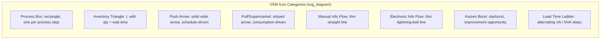

## Value Stream Mapping Symbols and Conventions

### Overview

VSM uses a standardized icon set — originating from Toyota's internal material/information flow mapping practice and formalized externally in Rother and Shook's *Learning to See* — so that maps are readable across teams and organizations without requiring a legend explanation for every diagram. The icon set is grouped into three functional categories: **material flow icons**, **information flow icons**, and **general/timeline icons**.

[Inference] While the Rother/Shook icon set is the most widely referenced standard, minor variations in icon shape and labeling exist across different Lean training organizations and software tools (e.g., some add icons for specific technologies like EDI or kanban post systems not in the original set); the core conventions described below are consistent across the large majority of practitioner references.

### Material Flow Icons

| Icon | Name | Meaning |
| --- | --- | --- |
| Rectangle box | Process box | A single process step where material is transformed; one box per process, even if physically performed at multiple workstations, as long as flow between them is continuous (one-piece or small-batch) with no significant queue |
| Triangle with "I" | Inventory | Quantity of stock (raw material, WIP, or finished goods) waiting between processes; labeled with unit count and calculated wait time |
| Solid wide arrow | Push arrow | Material pushed from one process to the next regardless of downstream need (produced to a schedule, not to actual consumption) |
| Striped arrow | Supermarket pull / FIFO withdrawal | Downstream process pulls material from a controlled buffer (supermarket) as needed |
| Truck icon | Shipment | Movement of material by truck between the plant and external supplier/customer, typically annotated with shipment frequency |
| Data box (below process box) | Process data | Records cycle time (C/T), changeover time (C/O), uptime %, number of operators, and available working time for that process |

### Information Flow Icons

| Icon | Name | Meaning |
| --- | --- | --- |
| Thin straight line | Manual information flow | Information transmitted manually — paper schedules, verbal communication, spreadsheets carried between departments |
| Thin lightning-bolt line | Electronic information flow | Information transmitted electronically — EDI, ERP system updates, automated scheduling feeds |
| Rectangle with a line-signal icon inside | Production control box | Represents the central scheduling department/system (e.g., MRP, production control) that receives and issues information to processes |
| Straight arrow labeled "kanban" | Kanban signal | Represents a kanban card or signal triggering replenishment, distinct from a generic push/pull material arrow |
| Zigzag arrow | Go-see / scheduling adjustment | Informal, in-person scheduling adjustment (e.g., a supervisor physically checking a queue and adjusting the plan) |

### General and Timeline Icons

| Icon | Name | Meaning |
| --- | --- | --- |
| Factory/house icon | Customer or supplier | Placed at top corners of the map — customer typically top right, supplier top left — annotated with demand rate or delivery frequency |
| Burst/starburst icon | Kaizen burst | Marks a specific location on the map identified as an improvement opportunity for the future-state design |
| Operator icon (circle) | Operator | Represents a person staffing a process, with a count indicating number of operators required |
| Timeline ladder (steps below the map) | Lead time ladder | Running horizontal timeline beneath the process flow, alternating between non-value-added time (queue/wait, upper step) and value-added time (processing, lower step) |
| Box with "EPE" or batch data | Production batching data | Records batch size or "Every Part Every [interval]" (EPE) figures relevant to scheduling frequency |

### Diagram: Basic VSM Icon Reference (svg_diagram)

### The Process Data Box Convention

Every process box on a current-state map is paired with a data box directly beneath it, recording a standard set of metrics so that maps remain comparable across an organization:

- **C/T (Cycle Time)**: Time between successive units completing the process
- **C/O (Changeover Time)**: Time to switch the process from producing one variant to another
- **Uptime**: Percentage of scheduled time the process is actually available (accounts for breakdowns, minor stops)
- **# Operators**: Number of people required to run the process at the stated cycle time
- **EPE (Every Part Every...)**: How frequently the process is capable of switching between product variants, expressed as a time interval (e.g., "EPE 2 days" means the process can cycle through its full product mix every two days)

[Inference] Not every VSM includes all five fields in every context — for example, a fully automated process may omit "# Operators," and a single-product line may omit EPE — but C/T and uptime are treated as near-universal minimum data in most published VSM examples.

### The Lead Time Ladder Convention

The timeline running beneath the process flow is the mechanism by which VSM produces its signature summary metric: the ratio of value-added time to total lead time. Convention places:

- **Upper steps**: Non-value-added time (typically inventory wait time between processes), drawn as a wide step proportional to its duration
- **Lower steps**: Value-added time (the cycle time of each process box), drawn as a narrow dip beneath each corresponding process

Total lead time is the sum of all upper and lower steps; total value-added time is the sum of lower steps only.

$$\text{Value-Added Ratio} = \frac{\sum \text{Value-Added (lower step) Time}}{\sum \text{Total Lead Time (upper + lower steps)}} \times 100\%$$

### Arrow Convention Distinctions (Common Point of Confusion)

A frequent error among newcomers is conflating material and information arrows, since both are drawn as lines connecting boxes. The governing convention:

- **Material flow arrows** are drawn along the **bottom** of the map, connecting process boxes and inventory triangles, representing physical movement
- **Information flow arrows** are drawn along the **top** of the map, connecting the production control box to each process and to customer/supplier, representing scheduling and order communication
- Arrow **line weight and style** (solid vs. striped vs. lightning-bolt) carries specific meaning (push vs. pull vs. electronic) and is not interchangeable for visual preference

### Example: Reading a Small Map Segment

A segment showing "Cutting → [Inventory: 400 units, 2 days] → Assembly," with a solid push arrow from Cutting to the inventory triangle, indicates that Cutting produces to a schedule regardless of Assembly's actual consumption rate, resulting in a 2-day buffer of unconsumed WIP. If this were instead drawn with a striped supermarket arrow and a kanban signal icon running from Assembly back to Cutting, it would indicate Assembly pulls only what it consumes, with Cutting replenishing based on an explicit kanban signal rather than a fixed schedule — a materially different (and typically lower-waste) control mechanism, despite both variants showing an inventory triangle of similar size.

### Software vs. Hand-Drawn Convention

[Inference] Rother and Shook's original methodology explicitly recommends hand-drawing maps in pencil during the initial current-state walk, reasoning that the friction of hand-drawing forces the mapper to physically walk the process and observe directly rather than working from assumptions or existing documentation at a desk. Digital VSM tools (Visio stencils, Lucidchart templates, dedicated Lean software) are commonly used for final, shareable versions, but the observational discipline of the hand-drawn draft is considered part of the method by many practitioners, not merely a stylistic preference.

**Related Topics**

- Current-state mapping data collection procedure (direct observation / gemba walk)
- Future-state map symbols (pacemaker process, FIFO lane, load-leveling box)
- Lead time ladder and value-added ratio calculation in depth
- Kanban card design and sizing calculations
- Supermarket pull system sizing
- VSM software tooling comparison (Visio, Lucidchart, dedicated Lean platforms)