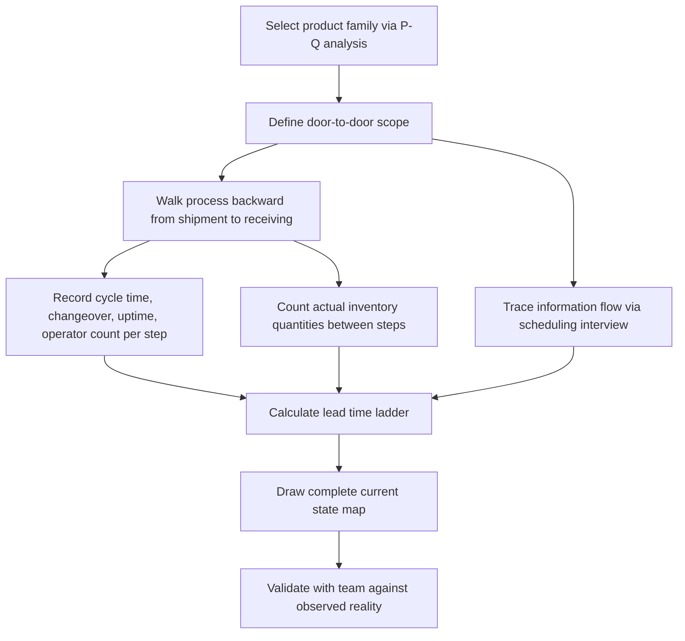

## Conducting a Current State Map

### Purpose

The current state map documents the value stream **exactly as it actually operates**, built from direct observation rather than documented procedure. It serves as the factual foundation from which a future-state design is later built; a current-state map built on assumption or outdated documentation produces a future state solving the wrong problems.

### Prerequisite: Selecting the Product Family

Before walking the floor, the team must define which product or service family the map will cover. A product family is a group of products or services that share similar processing steps and use common equipment downstream, even if they differ in final configuration.

**Key Points**

- Use a **product-quantity (P-Q) analysis** or a product/process matrix to group items by shared process routing, not by superficial similarity (e.g., "all metal parts" may route through entirely different processes)
- Selecting too broad a family produces an unreadable map with excessive branching; selecting too narrow a family produces a map too limited to reveal systemic issues
- High-volume or high-revenue families are commonly prioritized first, since they typically offer the largest improvement leverage, though this is a practical default rather than a fixed rule

### Step 1: Establish the Scope

Define the "door to door" boundary (see prior section on VSM purpose and scope) — typically from raw material or order receipt through to shipment. Confirm this boundary with the mapping team before beginning data collection, since an undefined boundary leads to inconsistent walking paths and incomplete data.

### Step 2: Walk the Process (Gemba)

The defining discipline of current-state mapping is walking the actual physical or digital flow, in person, starting from the shipping/customer end and working backward toward the beginning of the process.

[Inference] Rother and Shook's original methodology specifically recommends walking **backward from shipment to raw material receipt**, reasoning that starting from the customer end keeps the mapper oriented toward the pull/demand perspective rather than a push/scheduling perspective; some practitioner variations walk forward instead, but the backward-walk convention remains the more commonly cited standard in VSM training materials.

During the walk:

- Record each process step in the order product/information actually flows, not the order documented in a procedure manual
- Time actual cycle times with a stopwatch at the workstation rather than relying on standard/rated times from documentation, since actual performance frequently differs from rated capacity
- Count actual inventory/WIP quantities sitting between each step, rather than system-recorded quantities, since real physical counts often diverge from what ERP/MRP systems report
- Note the number of operators actually staffing each step, shift patterns, and any significant variation observed during the walk (e.g., a step that is sometimes staffed by two people and sometimes by one)

### Step 3: Collect Process Data

At each process box, record the standard data set (introduced in the prior section on VSM symbols and conventions):

| Metric | How to Collect |
| --- | --- |
| Cycle Time (C/T) | Direct stopwatch observation of multiple cycles at the workstation, not a single sample |
| Changeover Time (C/O) | Direct observation of an actual changeover event, or interview with the operator if none occurs during the walk |
| Uptime % | Historical downtime/breakdown records combined with operator interview, since uptime issues are often intermittent and unlikely to be directly observed in a single walk |
| # Operators | Direct headcount observed at the station |
| Inventory quantity | Direct physical count at the time of the walk |
| Available working time | Shift length minus scheduled breaks, from the facility's actual schedule |

[Inference] A commonly cited practical guideline is to time at least several cycles (not just one) at each station and use a representative or average value, since single-sample cycle times are prone to being unrepresentative outliers; the specific number of samples considered sufficient varies by practitioner guidance and process variability.

### Step 4: Map the Information Flow

Separately from the physical walk, trace how scheduling and order information moves:

- How does the customer order enter the system (EDI, phone, manual entry)?
- Does a central production control/scheduling function (MRP, ERP, manual scheduler) push instructions to each process individually, or does information flow process-to-process?
- Is any current pull/kanban signal in use, or is the entire flow schedule-driven (push)?
- How far in advance is the schedule communicated, and how frequently does it change?

This is typically traced by interviewing the scheduling/production control function directly, since information flow is rarely visible simply by observing the physical process.

### Step 5: Calculate Total Lead Time and Value-Added Time

Using the inventory counts and cycle time data collected, calculate:

$$\text{Inventory Wait Time} = \frac{\text{Inventory Quantity}}{\text{Daily Customer Demand Rate}}$$

Sum all inventory wait times (non-value-added, upper steps of the timeline ladder) and all cycle times (value-added, lower steps) to build the lead time ladder and compute the overall value-added ratio:

$$\text{Value-Added Ratio} = \frac{\sum \text{Cycle Times}}{\sum \text{Cycle Times} + \sum \text{Inventory Wait Times}} \times 100\%$$

### Step 6: Draw the Map

Assemble the collected data into the standard VSM layout:

1. Customer icon, top right, annotated with demand rate/order pattern
2. Supplier icon, top left, annotated with delivery frequency
3. Production control box, top center, connected to customer and supplier via information flow lines
4. Process boxes with data boxes beneath, arranged left to right in actual process order along the bottom
5. Inventory triangles between process boxes, with observed quantities
6. Material flow arrows (push/pull) connecting processes
7. Lead time ladder beneath the entire flow, summarizing value-added vs. non-value-added time

### Diagram: Current State Mapping Workflow (svg_diagram)

### Common Data Collection Pitfalls

- **Using system/documented data instead of direct observation**: ERP-recorded cycle times or inventory levels frequently diverge from physical reality; the current state map is invalidated if built from assumed rather than observed data
- **Timing only the "best case" cycle**: Observing a single fast cycle rather than a representative sample overstates process capability
- **Skipping the information flow walk**: Focusing only on material movement misses scheduling-driven mura, which is frequently a larger lead-time driver than physical processing time
- **Mapping too much at once**: Attempting to capture every product variant's routing on a single map rather than the defined product family, producing an unreadable result
- **Building the map from a conference room**: [Inference] A map built entirely from interviews or documentation without direct floor observation is a common failure mode explicitly warned against in VSM training, since gaps between documented and actual process are exactly what the walk is designed to surface

### Example

A team mapping an order-fulfillment process for a mid-volume electronics assembly line walks backward from the shipping dock. At the final packaging station, they observe a stopwatch-measured cycle time of 45 seconds per unit and count 600 finished units in a staging area awaiting the next truck pickup (which occurs once daily). At the prior sub-assembly station, they find 1,200 units of WIP inventory, despite the ERP system's dashboard reporting only 400 units — a significant discrepancy traced to a batch of units sitting in an unlabeled quarantine cart pending a quality recheck, which the system never recorded as active WIP.

This single observed discrepancy — invisible from system data alone — becomes a key finding: the "hidden" 800 units represent both excess inventory waste and a defect-driven waiting waste (units stuck pending recheck), neither of which would have appeared had the team built the map from ERP reports rather than walking the actual floor.

### Validating the Map

Once drafted, the current-state map is typically reviewed with the operators and supervisors actually running the process, both to correct any misobserved data and to build shared understanding/buy-in before moving to future-state design. [Inference] This validation step is widely recommended in VSM practice as a check against mapper error and as a mechanism for building frontline ownership of the resulting improvement priorities, though it is a process discipline rather than a mathematically necessary step.

**Related Topics**

- Future state map design and the pacemaker process concept
- P-Q (product-quantity) analysis for product family selection
- Lead time ladder and value-added ratio interpretation
- Kaizen burst identification from current-state findings
- Gemba walk technique and direct observation discipline
- Supermarket and kanban sizing based on observed demand data