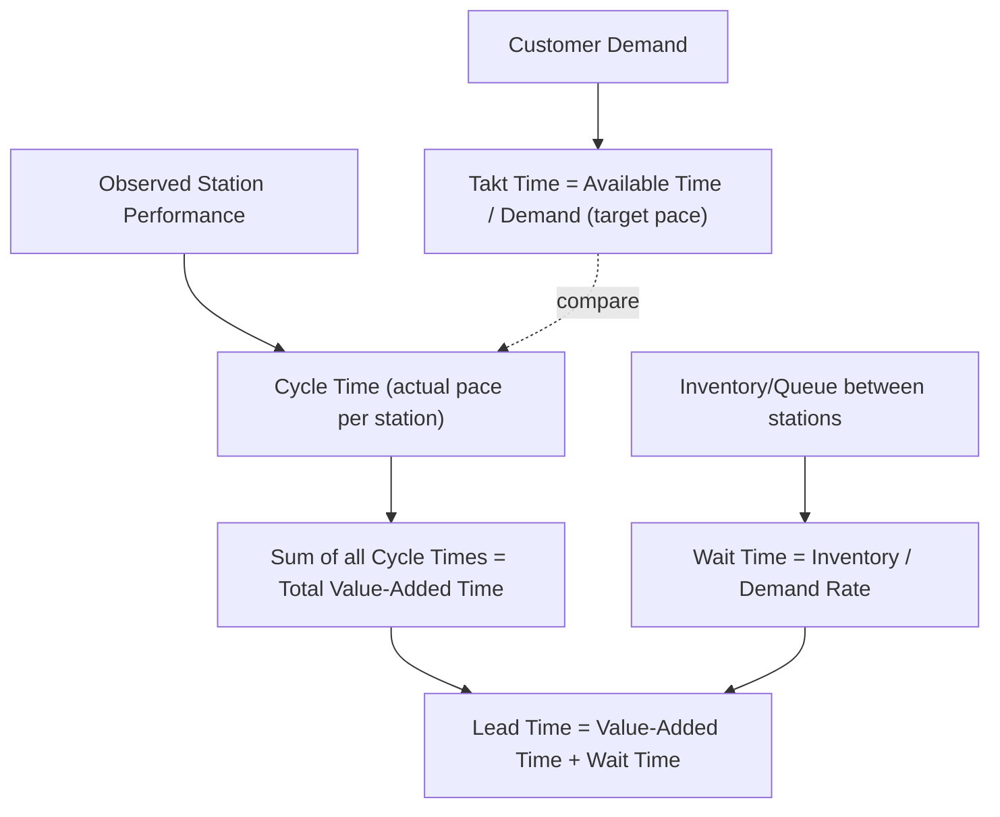

## Calculating Takt Time, Cycle Time, and Lead Time

### Overview

Takt time, cycle time, and lead time are the three core timing metrics used in Lean process analysis, and their relationship to one another is frequently a source of confusion for newcomers because all three are measured in units of time but answer fundamentally different questions. Takt time answers "how fast must we produce to match customer demand?" Cycle time answers "how fast does our process actually produce?" Lead time answers "how long does a unit spend in the system from start to finish?" A functioning Lean system requires understanding all three simultaneously and the gaps between them.

### Takt Time

**Definition**: Takt time is the rate at which a process must complete one unit of output to exactly match customer demand — it is a pacing target derived from demand, not a measurement of the process itself. The term derives from the German *Takt* (musical beat/pulse), reflecting its role as the metronome pace the entire system should synchronize to.

$$\text{Takt Time} = \frac{\text{Available Production Time}}{\text{Customer Demand}}$$

**Components**:

- **Available Production Time**: Total scheduled working time per period, minus planned breaks, meetings, and scheduled maintenance — *not* minus unplanned downtime, since takt time is a target rate, not an achieved rate
- **Customer Demand**: Actual customer requirement for the period, expressed in the same unit count the available time is measured against

**Worked Example**: A facility operates one 8-hour shift per day, with 30 minutes of scheduled breaks. Daily customer demand is 400 units.

$$\text{Available Time} = 8 \text{ hr} \times 60 - 30 \text{ min} = 450 \text{ min} = 27{,}000 \text{ sec}$$

$$\text{Takt Time} = \frac{27{,}000 \text{ sec}}{400 \text{ units}} = 67.5 \text{ sec/unit}$$

This means: to exactly meet daily demand with no overproduction and no shortfall, the line must complete one unit every 67.5 seconds.

**Key Points**

- Takt time changes whenever demand changes or available time changes — it is recalculated periodically (commonly weekly or monthly, depending on demand stability), not fixed permanently
- Takt time is a **planning target**, not a description of what any single machine or station is currently doing
- Producing significantly faster than takt time causes overproduction (muda); producing slower causes an inability to meet demand and typically drives muri (rushing/overtime) to compensate

### Cycle Time

**Definition**: Cycle time is the actual, observed time between successive units completing a given process step — it describes what the process *does*, as distinct from takt time, which describes what the process *should* do to match demand.

Cycle time is measured directly via stopwatch observation at the workstation (as covered in current-state mapping), typically averaged across multiple observed cycles rather than taken from a single sample, since individual cycles vary due to minor stops, operator variation, and material handling differences.

**Relationship to Takt Time**: The central diagnostic comparison in Lean line design is cycle time versus takt time at each station:

| Condition | Implication |
| --- | --- |
| Cycle Time > Takt Time | Station cannot keep pace with demand; becomes the bottleneck, causing shortfall or forcing overtime (muri) |
| Cycle Time < Takt Time | Station produces faster than needed; risks overproduction (muda) unless deliberately paced down or used for other value-added work |
| Cycle Time ≈ Takt Time | Station is balanced to demand — the target condition in takt-based line design |

[Inference] In multi-station lines, the goal is typically to balance every station's cycle time as close to takt time as feasible (line balancing), since a line is only as fast as its slowest station regardless of how far other stations run under takt; achieving exact equality at every station is rarely fully attainable in practice due to differing task content, and small buffers or work redistribution are commonly used to manage the residual imbalance.

### Lead Time

**Definition**: Lead time is the total elapsed time for a unit to travel through the entire value stream, from the triggering event (order placement, or raw material release) to completion (shipment or delivery) — encompassing both value-added processing time and all non-value-added waiting/queue time in between.

$$\text{Lead Time} = \sum(\text{Cycle Times}) + \sum(\text{Wait/Queue Times})$$

Lead time is calculated in current-state mapping using the lead time ladder (see prior section on conducting a current-state map): inventory quantities between process steps are converted to wait time using the customer demand rate, and summed alongside the individual process cycle times.

$$\text{Wait Time at a Given Queue} = \frac{\text{Inventory Quantity at that Point}}{\text{Daily Demand Rate}}$$

**Worked Example**: Continuing the earlier facility (daily demand 400 units), suppose the value stream has three process steps with the following observed data:

| Process | Cycle Time | Preceding Inventory | Wait Time (Inventory ÷ Daily Demand) |
| --- | --- | --- | --- |
| Cutting | 60 sec | 200 units (raw material) | 200 / 400 = 0.5 days |
| Assembly | 65 sec | 800 units (WIP) | 800 / 400 = 2.0 days |
| Packaging | 55 sec | 300 units (WIP) | 300 / 400 = 0.75 days |

$$\text{Total Value-Added Time} = 60 + 65 + 55 = 180 \text{ sec} \approx 0.05 \text{ hr}$$

$$\text{Total Wait Time} = 0.5 + 2.0 + 0.75 = 3.25 \text{ days}$$

$$\text{Total Lead Time} \approx 3.25 \text{ days} + 0.05 \text{ hr} \approx 3.25 \text{ days}$$

$$\text{Value-Added Ratio} = \frac{180 \text{ sec}}{3.25 \text{ days} \times 86{,}400 \text{ sec/day}} \times 100\% \approx 0.064\%$$

This illustrates a pattern commonly observed in unoptimized value streams: total processing (value-added) time is a small fraction of total lead time, with the majority consumed by inventory sitting in queue between steps.

### Diagram: Relationship Between the Three Metrics (svg_diagram)

### Interpreting the Three Together

**Example scenario**: A line has a calculated takt time of 67.5 seconds. The bottleneck station (Assembly) has a measured cycle time of 65 seconds — under takt, meaning the station is theoretically capable of meeting demand. Yet total lead time across the value stream is 3.25 days, driven almost entirely by inventory sitting between stations rather than by any station running slower than takt.

This distinction matters because it points to a different countermeasure than line-balancing would suggest: since no station's cycle time exceeds takt, the problem is not station capacity but excess WIP/batching between stations (mura in scheduling, likely from batch-and-queue production rather than a pull system). The countermeasure is reducing inventory/batch sizes and introducing pull (kanban or FIFO lanes) between stations, not attempting to further speed up an already-under-takt process.

[Inference] This illustrates a general Lean diagnostic principle: cycle-time-vs-takt comparison diagnoses *station capacity* problems, while lead time analysis diagnoses *flow and inventory* problems, and the two require different countermeasures even though both are visible on the same value stream map.

### Common Calculation Errors

- **Using takt time as if it were a target cycle time to design equipment around without margin**: Since available time excludes only planned stoppages, unplanned downtime will cause actual output to fall short if a station is designed to run at exactly takt with zero buffer
- **Confusing cycle time with lead time**: A station can have excellent (under-takt) cycle time while the product still experiences a multi-day lead time due to queueing — the two metrics answer different questions and neither substitutes for the other
- **Averaging cycle time from too few samples**: A single observed cycle, especially if atypically fast or slow, can significantly distort the calculated average
- **Failing to recalculate takt time as demand changes**: Using a stale takt time calculated against outdated demand produces a mismatched pacing target for current conditions

**Next Steps**

- Study line balancing techniques using takt time as the target
- Study lead time ladder construction in current-state mapping
- Explore pull systems (kanban, supermarkets, FIFO lanes) as lead-time-reduction countermeasures
- Study process cycle efficiency as a summary metric derived from these calculations
- Explore takt time in mixed-model production (weighted average demand across variants)
- Study the relationship between batch size, changeover time (SMED), and lead time