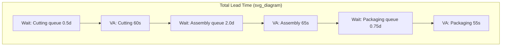

## Process Cycle Efficiency and the Value Added Ratio

### Definition

**Process Cycle Efficiency (PCE)**, also referred to as the **Value-Added Ratio**, is the summary metric produced from a value stream map's lead time ladder, expressing what fraction of total lead time is spent on activity the customer would recognize as value rather than waiting, queuing, or otherwise non-value-adding time.

$$\text{Process Cycle Efficiency} = \frac{\text{Total Value-Added Time}}{\text{Total Lead Time}} \times 100\%$$

Where total value-added time is the sum of all process cycle times, and total lead time is value-added time plus all wait/queue time accumulated across the value stream (as constructed via the lead time ladder covered in prior sections).

### Purpose of the Metric

PCE exists to compress an entire value stream map's worth of timing data into a single, comparable number. Its function in Lean practice is primarily diagnostic and motivational rather than a target to be individually optimized in isolation:

- **Diagnostic**: A low PCE signals that the majority of a product's time in the system is spent waiting rather than being worked on, directing improvement effort toward flow and inventory reduction rather than toward speeding up individual process steps
- **Comparative**: PCE allows rough comparison across different value streams or before/after states of the same stream, since it normalizes away the absolute scale of lead time
- **Communicative**: A single percentage is easier for cross-functional stakeholders to grasp and rally around than a detailed lead time ladder diagram

[Inference] PCE is best treated as a diagnostic indicator rather than a precise engineering specification — because it depends heavily on how inventory-to-wait-time conversion is calculated and where the value stream boundary is drawn, comparing PCE figures across different organizations or industries without matching methodology is of limited validity.

### Determining What Counts as "Value-Added"

Correctly calculating PCE requires a clear definition of value-added time, distinct from merely "time spent doing something." Standard Lean criteria classify an activity as value-added only if all three conditions hold:

1. The customer would be willing to pay for it (or it directly contributes to a requirement the customer cares about)
2. It physically or informationally transforms the product/service toward its final form
3. It is done correctly the first time (rework, even if "doing something," is non-value-added)

Activity that fails any of these three tests — inspection, transport, rework, approval waiting, queue time — is classified as non-value-added, even though the organization may consider some of it necessary under current conditions (e.g., a regulatory inspection step). [Inference] This distinction between "non-value-added but currently necessary" and "purely wasteful non-value-added" is a common refinement in Lean literature (sometimes labeled Type 1 vs. Type 2 muda), since not all non-value-added activity can be immediately eliminated even though it does not meet the strict value-added definition.

### Worked Calculation

Using the value stream example introduced in the prior section on takt/cycle/lead time:

| Process | Cycle Time (Value-Added) | Preceding Wait Time |
| --- | --- | --- |
| Cutting | 60 sec | 0.5 days |
| Assembly | 65 sec | 2.0 days |
| Packaging | 55 sec | 0.75 days |

$$\text{Total Value-Added Time} = 60 + 65 + 55 = 180 \text{ sec}$$

$$\text{Total Lead Time} = 3.25 \text{ days} = 280{,}800 \text{ sec}$$

$$\text{PCE} = \frac{180}{280{,}800} \times 100\% \approx 0.064\%$$

### Industry Reference Ranges

[Inference] Lean literature and case studies commonly cite that unoptimized manufacturing value streams often show PCE figures in the low single-digit percentage range or lower, while well-optimized, highly flow-oriented lines (particularly those using one-piece flow and pull systems) can reach substantially higher figures, sometimes cited in the range of 20–30% or higher in specific published case examples. These figures vary considerably by industry, product complexity, and batch size, and should be treated as illustrative ranges from case literature rather than fixed benchmarks applicable to every process. No universal "good" PCE threshold exists independent of process type — a highly regulated pharmaceutical batch process and a simple assembly line will have structurally different achievable PCE ranges even under excellent management.

### Diagram: PCE as Proportion of Lead Time (svg_diagram)

### PCE and the Three Wastes Framework

PCE connects directly to the mura/muri/muda relationship covered earlier: low PCE is frequently a downstream signature of mura (uneven, batch-driven scheduling creating large queues) rather than a signature of individual process steps being inefficient. [Inference] This is why raising PCE is typically pursued through flow and inventory countermeasures (reducing batch sizes, introducing pull systems, heijunka) rather than through attempts to further compress already-small value-added cycle times — the arithmetic of the ratio means that even a large percentage reduction in cycle time has negligible effect on PCE if wait time dominates the denominator, whereas a proportionally smaller reduction in queue time can move the ratio substantially.

**Key Points**

- PCE improvement efforts should target the **denominator** (wait/queue time) in the overwhelming majority of unoptimized value streams, not the numerator (cycle time), since wait time is typically the dominant term
- Reducing batch sizes and inventory buffers is usually the highest-leverage lever for PCE improvement, since it directly shrinks queue time
- A rising PCE over successive value stream map iterations is commonly used as a leading indicator that Lean implementation is producing structural, not just local, improvement

### Common Countermeasures Ranked by Typical Leverage

| Countermeasure | Primary Mechanism | Effect on PCE |
| --- | --- | --- |
| Reduce batch/lot sizes | Shrinks WIP sitting in queue | High |
| Introduce pull system (kanban/supermarket) | Caps inventory to actual consumption rate | High |
| Heijunka (leveling) | Removes schedule-driven batching and spikes | High |
| SMED (reduce changeover time) | Enables smaller batches economically | Indirect, enables above |
| Speeding up individual cycle times | Reduces numerator only | Low, unless the process is also the bottleneck |
| Eliminating a redundant approval/inspection step | Removes a wait-time contributor directly | Moderate to High |

### Example: Misapplied Improvement Effort

A team, observing a PCE of 0.5% on their value stream map, launches a kaizen event focused on reducing the Assembly station's cycle time from 65 seconds to 50 seconds through method improvement — a genuine, well-executed 23% cycle time reduction. Because the total value-added time was only a few minutes against a multi-day lead time, the resulting PCE improvement is negligible (moving from roughly 0.064% to perhaps 0.061%, i.e., functionally unchanged), and the team is left puzzled why a successful-looking local improvement produced no visible system-level result.

A more effective intervention, given the same map, would target the 2.0-day wait time preceding Assembly — for instance, by reducing the WIP cap between Cutting and Assembly from 800 units to 200 units via a kanban-controlled supermarket, cutting that single wait segment by 1.5 days. Even without touching any cycle time, this single change moves total lead time from 3.25 days to roughly 1.75 days, nearly doubling PCE — illustrating why the diagnostic value of PCE lies specifically in redirecting attention toward flow/inventory work rather than isolated station speed-ups.

### Limitations of PCE as a Metric

- It does not by itself indicate *why* wait time exists (batching, scheduling policy, approval bottlenecks, and equipment unavailability all produce the same PCE symptom differently)
- It can be inadvertently "gamed" by artificially shortening the measured value stream boundary (e.g., excluding a slow upstream stage from the map) rather than genuinely reducing waste
- It does not capture quality or defect performance — a process could have high PCE while still producing significant defect-driven rework within its value-added time, since rework time is sometimes miscounted as value-added if not carefully audited against the three-condition test above

**Related Topics**

- Lead time ladder construction methodology
- Batch size reduction and its relationship to changeover time (SMED)
- Pull systems and supermarket sizing calculations
- Type 1 vs. Type 2 muda (unavoidable vs. purely eliminable non-value-added work)
- Future-state map design targeting flow-based countermeasures
- Heijunka and its effect on queue-driven lead time