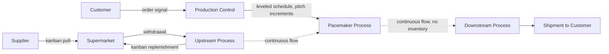

## Building a Future State Map and Identifying Kaizen Bursts

### Purpose

The future state map is the designed target condition for a value stream, built directly from the findings of the current state map, incorporating Lean countermeasures intended to close the gaps identified — excess inventory, push-driven scheduling, imbalanced cycle times relative to takt, and unnecessary process steps. Where the current state map answers "what is actually happening," the future state map answers "what should this value stream look like once identified waste is systematically addressed," typically within a defined near-term implementation horizon.

[Inference] Rother and Shook's original *Learning to See* methodology frames future-state design as an iterative annual cycle — draw current state, design future state, implement, then redraw a new current state reflecting the achieved future state as the starting point for the next iteration — rather than a one-time exercise; this cyclical framing is widely taught, though organizations vary in how strictly they follow an annual cadence versus a more continuous revision practice.

### The Eight Future-State Design Questions

Rother and Shook's methodology structures future-state design around a standard set of questions applied to the current-state findings:

1. **What is the takt time**, based on available working time and customer demand?
2. **Will finished goods be produced to a supermarket for customer pull, or shipped directly** (make-to-stock vs. make-to-order flow)?
3. **Where can continuous flow be introduced?** (i.e., where can process steps be linked directly, one-piece or small-batch, eliminating the inventory triangle between them)
4. **Where is a supermarket pull system needed** where continuous flow isn't feasible (e.g., due to differing cycle times, unreliable processes, or geographic/organizational separation)?
5. **At what single point in the chain will production be scheduled** — the **pacemaker process** — with all upstream steps pulling from and all downstream steps flowing from that point?
6. **How will production be leveled at the pacemaker** (heijunka), both in volume and product mix?
7. **What increment of work will be released and withdrawn** at the pacemaker (pitch — a consistent, manageable work-release interval, often a multiple of takt time)?
8. **What process improvements will be necessary** to achieve the future-state flow (capability, uptime, changeover reductions, etc.)?

[Inference] These eight questions are the standard structure taught across most VSM training programs derived from the Rother/Shook methodology; some adaptations reorder or condense them, but the underlying concepts (pacemaker, pull, leveling, pitch) are consistently present across mainstream VSM practice.

### The Pacemaker Process Concept

The **pacemaker process** is the single point in the value stream where external scheduling information (the customer order or production schedule) enters the flow. Every process upstream of the pacemaker operates on pull signals originating from the pacemaker's rate; every process downstream flows continuously from the pacemaker without further independent scheduling.

[Inference] Selecting the pacemaker is one of the more judgment-dependent steps in future-state design — it is typically placed at the last point in the value stream where continuous flow can be reliably sustained through to shipment, which in practice is often (though not always) the final assembly or finishing stage rather than an earlier upstream process; the specific choice depends on each process's flow capability and reliability, which the current-state data should reveal.

### Core Future-State Design Principles

**Key Points**

- **Produce to takt time**: Pace the pacemaker process (and ideally all processes) to match takt time, avoiding both overproduction and shortfall
- **Develop continuous flow wherever possible**: Link steps directly without an inventory buffer between them whenever cycle times and reliability allow
- **Use supermarkets to control flow where continuous flow isn't feasible**: Cap WIP explicitly via a pull signal (kanban) rather than allowing unconstrained push-driven accumulation
- **Level the production mix and volume at the pacemaker**: Use heijunka to convert an uneven order pattern into a smooth internal schedule
- **Establish pitch**: A consistent, small work-release increment (often a multiple of takt time, e.g., a container quantity's worth of takt time) that paces the pacemaker in manageable, monitorable batches rather than either single-unit release or large uncontrolled batches

### Diagram: Future State Structure (svg_diagram)

### Kaizen Bursts

A **kaizen burst** is a starburst icon placed directly on the map at a specific location identified as requiring a targeted improvement activity in order for the future-state design to function as intended. Kaizen bursts translate the future-state design's requirements into a concrete, prioritized action list.

**Where Kaizen Bursts Typically Appear**:

- At a process whose current uptime is too low to support reliable continuous flow (requiring a TPM/reliability improvement)
- At a process whose changeover time is too long to economically support the smaller batch sizes the future state requires (requiring an SMED initiative)
- At a process whose cycle time exceeds takt time (requiring line balancing or capacity investment)
- At a point where a new pull signal (kanban system) needs to be designed and implemented where none currently exists
- At an information flow point requiring a new communication mechanism (e.g., replacing a weekly manual schedule push with an electronic or visual pull signal)

### Example: From Current State Finding to Kaizen Burst

Referring to the current-state example used in prior sections (Cutting → 2.0-day WIP buffer → Assembly), the current-state map revealed that Cutting produces to a weekly batch schedule irrespective of Assembly's actual consumption, creating the large intervening inventory. Applying the eight future-state questions:

- **Continuous flow?** Cutting and Assembly cycle times (60s and 65s) are close enough to potentially link directly, but Cutting's current changeover time (found in current-state data collection to be 45 minutes) makes frequent small-batch switching between part variants impractical today.
- **Supermarket needed?** Given the changeover constraint, a supermarket pull system between Cutting and Assembly is designed as the interim future-state solution rather than full continuous flow, with a kanban signal replacing the current weekly push schedule.
- **Kaizen burst placed**: A starburst icon is placed directly on the Cutting process box, annotated "Reduce changeover from 45 min to under 10 min (SMED)," since achieving a smaller, kanban-sized batch economically depends on this improvement. A second burst may be placed at the new Cutting–Assembly link marking "Design and implement kanban card system, initial supermarket size TBD from calculated safety stock."

This directly ties a specific, actionable improvement project to a specific map location and a specific reason (enabling the future-state flow design), rather than leaving "reduce changeover time" as a generic, unanchored initiative.

### Prioritizing Kaizen Bursts

Once all bursts are placed on the future-state map, they typically feed into an implementation plan sequenced by:

- **Dependency**: Some bursts must be completed before others are feasible (e.g., changeover reduction typically must precede small-batch kanban implementation)
- **Impact**: Bursts addressing the largest wait-time contributors (per the current-state lead time ladder) are commonly prioritized first, since they offer the greatest PCE improvement leverage
- **Feasibility/resource availability**: Straightforward, high-confidence improvements are sometimes sequenced early to build team momentum, even if their individual leverage is moderate

[Inference] There is no single universally prescribed prioritization formula across VSM literature; most practitioner guidance treats this as a facilitated team planning exercise informed by the data on the map (particularly the lead time ladder) rather than a purely mechanical calculation.

### Common Future-State Design Mistakes

- **Designing a future state disconnected from current-state data**: A future state not grounded in the actual observed cycle times, uptime, and changeover data risks proposing flow designs the current process capability cannot support
- **Attempting full one-piece flow everywhere immediately**: Continuous flow is not always immediately achievable; supermarkets are a legitimate and often necessary interim (or permanent) design choice where flow constraints exist
- **Omitting the pacemaker/pitch design**: Without a clearly defined single scheduling point and release increment, the "pull" system risks reverting to multiple independent, uncoordinated push points
- **Treating kaizen bursts as a wish list rather than a structured, sequenced plan**: Bursts without a prioritization and ownership structure frequently fail to convert into actual implementation

### From Future State to Implementation

**Next Steps**

- Study SMED (Single-Minute Exchange of Die) methodology as a common kaizen burst resolution
- Study kanban card design and supermarket sizing calculations
- Explore pitch calculation and work-release increment design at the pacemaker
- Study TPM (Total Productive Maintenance) for uptime-related kaizen bursts
- Explore the iterative current-state/future-state annual planning cycle
- Study A3 problem-solving as a structured format for individual kaizen burst execution