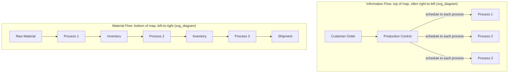

## Distinguishing Material Flow from Information Flow

### Overview

Every value stream map documents two structurally distinct flows moving through the same set of processes: the **material flow**, tracking the physical (or, in service/knowledge contexts, the informational-product) movement of the item being produced, and the **information flow**, tracking how scheduling and control decisions are communicated to direct that movement. A defining characteristic of VSM — as distinct from a simple process flowchart — is that it maps both simultaneously and shows how they interact, since a large proportion of Lean waste originates not in the physical process itself but in a mismatch between how information is communicated and how material actually needs to move.

### Material Flow

Material flow represents the literal, physical (or document/data-object) progression of the unit being produced, from raw input through each transformation step to finished output. On the map, material flow is conventionally drawn along the **bottom**, moving left to right in actual physical sequence, using the process boxes, inventory triangles, and push/pull arrows covered in the section on VSM symbols and conventions.

**Key characteristics**:

- Material flow answers "where is the physical/informational product right now, and how did it get here?"
- It is directly observable by walking the floor (or tracing the document/data path)
- It is captured through direct measurement: cycle times, inventory counts, transport distances
- Its waste signatures are the classical process-level wastes: excess inventory, unnecessary transport, waiting, overproduction

### Information Flow

Information flow represents how the *decision* to move material is communicated — orders, forecasts, schedules, production instructions, and priority signals. On the map, information flow is conventionally drawn along the **top**, often running in the opposite direction (right to left, from customer order back toward the start of production) since scheduling information typically originates from the customer end and cascades backward to trigger production.

**Key characteristics**:

- Information flow answers "who decided this unit should be made now, and how did that decision reach this process?"
- It is generally not directly observable by watching material move; it requires tracing the scheduling/ordering mechanism specifically (interviewing production control, examining ERP/MRP configuration, observing how kanban or work orders are issued)
- Its waste signatures are less physically visible: batch-driven push scheduling, delayed or unclear communication, conflicting priorities issued to different stations, information transmitted through unnecessary intermediary steps

### Why the Distinction Matters

[Inference] A central premise of VSM methodology is that information flow is frequently the *root cause* of material flow waste, even though material flow waste (visible inventory, visible waiting) is what draws attention first. A team observing only material flow might conclude "we need more capacity" or "we need to speed up this station," when the actual driver is a push-based information flow producing batches unrelated to real downstream consumption — a problem no amount of station speed-up resolves.

This is the same underlying logic covered in the muda/mura/muri relationship: uneven, disconnected information flow (mura in scheduling) frequently manifests downstream as material flow waste (muda: excess inventory, waiting), even though the visible symptom and the actual cause sit in different layers of the map.

### Diagram: Material vs. Information Flow Layout (svg_diagram)

### Push vs. Pull as an Information Flow Distinction

The push/pull distinction — visually represented by different material flow arrow styles (solid wide arrow for push, striped arrow for supermarket pull) — is fundamentally an **information flow** characteristic expressed through the material arrow convention:

| Flow Type | Information Trigger | Material Consequence |
| --- | --- | --- |
| Push | A central schedule (MRP/production control) instructs a process to produce, independent of downstream actual consumption | Process produces according to schedule; excess output accumulates as inventory if downstream hasn't consumed at the same rate |
| Pull (kanban/supermarket) | A downstream process's actual consumption triggers a signal (kanban card) back to the upstream process | Upstream process produces only what has actually been withdrawn, capping inventory at a designed maximum |

This is why the arrow style on the material flow line is determined by the information mechanism behind it — a material flow arrow cannot be correctly classified as push or pull without tracing the corresponding information flow that governs it.

### Tracing Information Flow During the Current-State Walk

Unlike material flow, which is captured by walking the physical process, information flow typically requires a separate line of investigation:

**Key Points**

- Interview the scheduling/production control function directly: how far in advance is the schedule set, how frequently does it change, and by what mechanism (ERP system run, manual spreadsheet, verbal instruction) is it communicated to each process?
- Identify whether any point in the current process already uses a pull signal (even informally, such as an operator verbally telling an upstream colleague "send more") versus being entirely push/schedule-driven
- Note how customer orders/forecasts enter the system and how directly (or indirectly, through layers of aggregation and batching) that signal reaches the processes that need it
- Note any electronic vs. manual information transmission (captured via the lightning-bolt vs. straight-line icon distinction), since manual transmission is frequently slower and more error-prone, introducing both delay and defect risk into the information layer itself

### Example: A Mismatch Between the Two Flows

A current-state map shows Cutting producing in weekly batches according to a fixed MRP-generated schedule (information flow: push, weekly, electronic from ERP). Material flow observation shows 800 units of WIP inventory accumulating between Cutting and Assembly. On the surface, this looks like a material flow problem — "too much inventory sitting between stations."

Tracing the information flow reveals the actual mechanism: the MRP system generates Cutting's weekly production quantity based on a rolling demand forecast that is recalculated only once a week, regardless of Assembly's actual day-to-day consumption rate, and Cutting has no visibility into Assembly's real-time WIP level. The 800-unit buffer is not a Cutting capacity problem or an Assembly consumption problem — it is a direct, mechanical consequence of a weekly-batch, forecast-driven information flow disconnected from actual downstream pull.

The corresponding future-state countermeasure (as covered in the prior section on future-state design) is therefore an information flow change — replacing the weekly MRP push with a kanban pull signal directly from Assembly's actual consumption — rather than a material flow change like adding inventory storage capacity or negotiating a different batch size with Cutting's supervisor.

### Common Errors in Distinguishing the Two Flows

- **Mapping only material flow and omitting information flow entirely**: Produces a map that shows *what* is happening (inventory accumulating, waiting occurring) without revealing *why*, since the causal mechanism usually lives in the information layer
- **Assuming information flow mirrors documented policy**: The documented scheduling procedure frequently diverges from actual practice (e.g., a policy stating "produce to kanban" while the floor is observed operating on informal push overrides); information flow must be traced through direct interview and observation, the same discipline applied to material flow
- **Conflating the two when drawing arrows**: Using material flow arrow conventions (push/pull styling) without having actually traced the information mechanism that determines which style applies produces a map that looks complete but encodes unverified assumptions

### Distinguishing Table

| Aspect | Material Flow | Information Flow |
| --- | --- | --- |
| Map position | Bottom of diagram | Top of diagram |
| Typical direction drawn | Left to right (process sequence) | Right to left (customer signal cascading back to production start) |
| What it represents | Physical/document movement | Scheduling/control decisions |
| How it's observed | Walking the process directly | Interviewing scheduling function, tracing system configuration |
| Icons used | Process box, inventory triangle, push/pull arrows | Straight line (manual), lightning bolt (electronic), production control box |
| Typical waste signature | Excess inventory, waiting, unnecessary transport | Batch-driven push scheduling, delayed/unclear communication, conflicting priorities |

**Related Topics**

- VSM symbols and conventions (material vs. information icon set)
- Push vs. pull systems and kanban signal design
- Pacemaker process selection in future-state design
- Conducting a current-state map (data collection for both flow types)
- Heijunka as an information-flow-level countermeasure to mura
- The bullwhip effect as an information flow amplification phenomenon across supply chain tiers