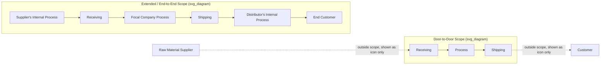

## Door to Door Versus Extended, End to End Value Stream Analysis

### Overview

Value stream mapping requires an explicit boundary decision before mapping begins: how far upstream and downstream the map extends. The two poles of this decision are **door-to-door mapping**, scoped to a single facility's receiving-to-shipping boundary, and **extended (end-to-end) value stream mapping**, which widens the boundary across multiple organizations — suppliers, the focal company, distributors, and sometimes end customers — to reveal waste that exists specifically *between* organizational boundaries rather than within any single facility.

### Door-to-Door Mapping

**Definition**: Door-to-door mapping (introduced in the earlier section on VSM purpose and scope) scopes the value stream from the point raw material or information enters a single facility to the point finished product or completed service leaves that facility, treating supplier delivery and customer receipt as fixed boundary conditions rather than mapped detail.

**Characteristics**:

- Default scope for most internal Lean improvement initiatives, since it is achievable by a single facility's team without requiring cross-organizational coordination or data access
- Supplier and customer are represented as simple icons at the map's edges, annotated with delivery frequency and demand rate, but their internal processes are not mapped
- Faster to execute, since data collection is confined to one facility's gemba walk and one production control interview
- [Inference] This scope is generally recommended as the standard starting point in VSM training precisely because it is achievable by a single team with direct process ownership, without requiring negotiated access to a supplier's or customer's internal operations

### Extended / End-to-End Value Stream Mapping

**Definition**: Extended VSM widens the mapped boundary beyond a single facility to include some combination of upstream suppliers, downstream distributors, and in some cases the end customer's own process, tracing material and information flow across organizational (and often company ownership) boundaries.

**When It's Used**:

- When the improvement question specifically concerns cross-company flow — for example, investigating a **bullwhip effect** pattern where order variance appears to amplify at each supply chain tier
- When a significant portion of total lead time is suspected to occur *outside* the focal facility (e.g., a component sitting in a supplier's finished-goods warehouse for weeks before shipment, or a distributor batching outbound shipments)
- When multiple facilities within the same company (but different physical locations) are part of the same product's value stream, and no single door-to-door map captures the full picture
- In supply chain redesign or supplier relationship initiatives, where the goal is explicitly to reduce total end-to-end lead time rather than one participant's internal lead time

[Inference] Extended VSM is a less frequently executed exercise than door-to-door mapping in general Lean practice, largely because it requires data access and cooperation across organizational boundaries that a single internal improvement team does not automatically have; it is typically undertaken as a deliberate, resourced initiative (often involving supplier/customer relationship managers) rather than a routine departmental activity.

### Diagram: Scope Comparison (svg_diagram)

### Key Differences

| Aspect | Door-to-Door | Extended / End-to-End |
| --- | --- | --- |
| Organizational boundary | Single facility | Multiple organizations/companies |
| Data access required | Internal only | Requires supplier/customer/distributor cooperation |
| Typical initiator | Facility-level Lean team | Supply chain, procurement, or cross-company improvement initiative |
| Execution speed | Days to a few weeks | Weeks to months, given coordination overhead |
| Primary waste revealed | Internal process/queue waste | Cross-boundary batching, information delay, bullwhip amplification |
| Common trigger | Standard departmental Lean initiative | Suspected/observed bullwhip effect, chronic supplier lead time issues, strategic supply chain redesign |

### The Bullwhip Effect as the Primary Motivator for Extended Mapping

As covered in the earlier section on mura, the bullwhip effect describes how small variations in end-customer demand amplify into progressively larger order swings at each upstream supply chain tier, driven by batching practices, forecast error, and lead-time buffering independently applied at each tier. A door-to-door map, scoped to a single facility, cannot reveal this phenomenon directly — it can only show the *symptom* (highly variable incoming orders from the next tier down) without showing *why* that variability exists or how the facility's own batching practices contribute to amplifying it further upstream.

Extended VSM addresses this by tracing the order and information flow across multiple tiers simultaneously, making the amplification pattern visible on a single diagram rather than inferred indirectly from each company's isolated internal data.

### Example: When Door-to-Door Understates the Problem

A manufacturer's door-to-door value stream map shows an internal lead time of 4 days from raw material receipt to shipment — a relatively strong result reflecting genuine internal flow improvement work. However, the finished product does not reach the end customer's shelf for another 18 days, due to a distributor consolidation practice (batching multiple manufacturers' shipments into full-truckload loads before dispatch) and a retailer receiving process that only processes inbound deliveries twice weekly.

A door-to-door map, by design, would not surface this 18-day downstream delay at all — it sits entirely outside the mapped boundary. An extended end-to-end map, tracing the full path from raw material through to retail shelf availability, would reveal that internal manufacturing improvements, however successful, represent a small fraction of the total customer-experienced lead time, redirecting improvement focus toward the distributor consolidation policy and retailer receiving cadence rather than further internal manufacturing optimization.

### Practical Considerations for Extended Mapping

**Key Points**

- Requires securing data-sharing agreements or direct site access with supplier/customer/distributor partners, which is often the primary practical obstacle rather than the mapping technique itself
- Frequently executed as a **joint workshop** with representatives from each organization in the chain present, rather than one company mapping another's process from the outside based on incomplete or estimated data
- May use aggregated or anonymized data where full transparency across competitive boundaries isn't feasible (e.g., a supplier sharing lead time and batch size data without disclosing cost structure)
- Scope creep is a common practical risk — attempting to map an entire multi-tier supply network at full process-level detail in one exercise typically produces an unmanageably complex map; extended VSM is often deliberately kept at a higher level of process aggregation than a single-facility door-to-door map to remain usable

### Choosing the Appropriate Scope

[Inference] A common practical guideline is to begin with door-to-door mapping for most internal improvement work, and to escalate to extended/end-to-end mapping specifically when door-to-door analysis and lead time data suggest that a substantial portion of total customer-experienced lead time sits outside the facility's own boundary — rather than defaulting to extended mapping for every initiative, given its materially higher coordination cost.

**Related Topics**

- The bullwhip effect and supply chain demand amplification
- Purpose and scope of value stream mapping (door-to-door boundary definition)
- Supplier relationship management in Lean supply chains
- Vendor-managed inventory and information-sharing countermeasures to cross-tier mura
- Conducting a current-state map (data collection methodology, applicable at any scope)
- Distinguishing material flow from information flow (relevant across organizational boundaries in extended mapping)