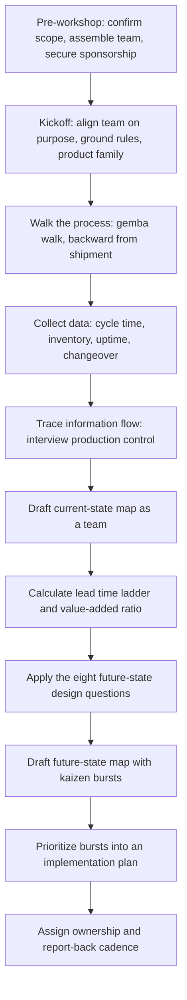

## Facilitating a Value Stream Mapping Workshop

### Purpose

A VSM workshop is the structured, cross-functional event during which a team collectively walks the process, collects data, and builds the current- and future-state maps described in prior sections. Facilitation quality substantially determines whether the resulting maps reflect genuine cross-functional consensus grounded in direct observation, or merely one person's interpretation imposed on a group. This section addresses the workshop's structure, roles, sequencing, and common facilitation failure modes — distinct from the mapping methodology itself, which is covered in the preceding sections.

### Pre-Workshop Preparation

**Key Points**

- **Define scope in advance**: Product family selection (via P-Q analysis) and door-to-door boundary should be settled before the workshop begins, since debating scope during the session itself consumes limited workshop time better spent on data collection
- **Assemble a cross-functional team**: Effective VSM workshops typically include representation from each function touched by the value stream — production, scheduling/production control, quality, maintenance, and where feasible, someone from sales or customer-facing roles who understands actual demand patterns
- **Secure management sponsorship**: [Inference] Because future-state findings frequently require cross-departmental changes (e.g., altering how production control schedules work), workshops without visible management backing risk producing a well-built map that has no organizational authority to act on its findings
- **Block sufficient, uninterrupted time**: Current-state walking and data collection is difficult to do well in fragmented sessions; a common practice is dedicating one or more consecutive days specifically to the floor walk rather than spreading it across unrelated meeting slots

### Workshop Roles

| Role | Responsibility |
| --- | --- |
| Facilitator | Guides the process, keeps the team focused on direct observation over assumption, manages time, prevents the session from drifting into unrelated problem-solving tangents |
| Timekeeper/data recorder | Captures stopwatch cycle time readings, inventory counts, and other data points systematically during the walk |
| Process owners/operators | Provide ground-truth knowledge of how each station actually operates, including informal workarounds not captured in documentation |
| Scheduling/production control representative | Provides the information flow half of the map, since this is rarely visible from the floor walk alone |
| Sponsor/champion | Removes organizational obstacles, confirms scope decisions, and lends authority to subsequent future-state implementation |

[Inference] Facilitator and data recorder are sometimes combined into a single role in smaller workshops, though separating them is commonly recommended so the facilitator can focus on team dynamics and process discipline rather than simultaneously managing detailed data capture.

### Workshop Sequencing

### Facilitation Ground Rules

A well-run workshop typically establishes explicit ground rules at kickoff to prevent common derailments:

- **Observed data only**: No cycle time, inventory count, or uptime figure enters the map unless it was directly observed or measured during the walk — documented/system figures are noted separately as a point of comparison, not substituted for direct observation
- **No solutioning during current-state mapping**: Teams commonly want to jump immediately to "how do we fix this" upon spotting an obvious problem during the walk; disciplined facilitation defers solution discussion to the future-state design phase, since a current state contaminated by premature solution-seeking tends to be incomplete or biased toward whatever fix was first proposed
- **Blame-free observation**: Since the walk frequently surfaces workarounds, informal practices, or deviations from documented procedure, the facilitator sets an explicit expectation that this is data about the system, not a performance review of the people operating within it — the opposite framing tends to make operators and supervisors defensive and less forthcoming with accurate information
- **Walk backward from shipment**: As covered in the section on conducting a current-state map, this convention keeps the team oriented toward the customer/demand perspective throughout

### Common Facilitation Pitfalls

**Key Points**

- **Allowing the workshop to become a desk exercise**: A map built primarily from documentation review or stakeholder interviews in a conference room, without an actual floor walk, undermines the entire premise of current-state accuracy discussed in earlier sections
- **Letting one function dominate the discussion**: A workshop led primarily by, for example, engineering or production management, without genuine floor operator and scheduling input, risks producing a map that reflects that function's assumptions rather than the full cross-functional reality
- **Insufficient data recorder discipline**: If cycle times and inventory counts are estimated or recalled from memory after the walk rather than recorded in real time, the resulting data quality degrades significantly
- **Skipping the information flow trace**: As emphasized in the prior section on material versus information flow, teams under time pressure sometimes abbreviate or skip the information flow interview, producing a map that shows material waste symptoms without their governing cause
- **Rushing to future-state design before current-state validation**: Moving to future-state questions before the team and process owners have reviewed and confirmed the current-state map's accuracy risks designing improvements against an incorrect baseline

### Managing Group Dynamics During Data Collection

[Inference] A frequently observed dynamic in VSM workshops is defensiveness when the walk reveals a gap between documented procedure and actual practice (for example, an informal workaround an operator has used for months to compensate for an upstream defect issue that was never formally reported). Skilled facilitation treats such findings as valuable data — often pointing directly to a root cause the team would otherwise have missed — rather than a compliance failure to be corrected on the spot, since punitive reactions during data collection tend to suppress exactly the kind of ground-truth disclosure the walk depends on.

### Building the Map as a Team Activity

Rather than a single note-taker producing the map afterward from collected data, many practitioners recommend drafting the map live, on a whiteboard or large paper, with the full team present and able to correct or add detail in real time. [Inference] This live-build approach is commonly cited as building shared ownership of the resulting findings — a team that watched the map take shape from their own collected data is generally more invested in acting on its conclusions than a team that receives a finished map as a report — though the specific format (whiteboard, sticky notes, digital collaborative tool) is a practical choice rather than a methodological requirement.

### From Workshop to Implementation

A workshop that concludes with a completed future-state map and a set of kaizen bursts (see prior section) is not yet complete from an organizational standpoint until:

- Each kaizen burst has a named owner, not merely a team-level intention
- A review/report-back cadence is established (commonly weekly or biweekly checkpoints against the implementation plan)
- The sponsor has visibility into progress and authority to unblock cross-departmental obstacles as they arise
- A plan exists for when and how the current state will be re-walked and re-mapped to validate that the future-state design has actually been achieved, rather than assuming implementation success from the plan alone

### Example: A Facilitation Recovery

Partway through a workshop's floor walk, the team discovers that a quality inspection step, documented as a 100% inspection, is actually being performed as a spot-check on roughly one in five units due to chronic understaffing — a significant deviation directly relevant to defect risk. The floor supervisor, present during the walk, becomes visibly anxious, anticipating blame. A facilitator applying the blame-free ground rule explicitly reframes the finding in the moment: "This is exactly the kind of gap we're here to find — it tells us the current process isn't actually delivering the inspection coverage we assumed, which is valuable information for the future-state design, not a mark against anyone in this room." The supervisor, reassured, then volunteers additional detail about *why* the shortfall occurs (a specific shift pattern with a known staffing gap), which becomes directly useful root-cause information for the future-state kaizen burst addressing quality — information that a punitive or dismissive reaction would likely have suppressed.

**Related Topics**

- Conducting a current-state map (the data collection methodology executed during the workshop)
- Building a future-state map and identifying kaizen bursts
- P-Q analysis for pre-workshop product family selection
- Gemba walk discipline and direct observation principles
- A3 problem-solving as a follow-on structure for individual kaizen burst ownership
- Change management and cross-functional buy-in in Lean implementation