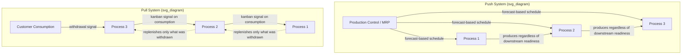

## Push Versus Pull Production Philosophy

### Overview

Push and pull represent two fundamentally different control philosophies governing when and how much a process produces. The distinction is not primarily about physical mechanics but about **what triggers production**: a push system produces according to a forecast or schedule regardless of downstream actual consumption, while a pull system produces only in response to a signal generated by actual downstream consumption. This distinction underlies the material flow arrow conventions introduced in the VSM symbols section and is the central operating philosophy of Just-in-Time (JIT) production.

### Push Production Defined

**Definition**: In a push system, each process produces according to a centrally issued schedule — typically generated by a forecast, an MRP (Material Requirements Planning) run, or a fixed production plan — independent of whether the next downstream process is actually ready to consume that output at that moment.

**Mechanics**:

- A central planning function (production control, MRP/ERP system) calculates what each process should produce and when, based on forecasted demand
- Each process executes its instructions and "pushes" completed work forward to the next step, regardless of that step's current WIP level or readiness
- Information flows from planning outward to each process independently (each station receives its own schedule), rather than flowing from actual consumption backward

**Structural Consequence**: Because each process is scheduled independently based on forecast rather than actual real-time downstream need, mismatches between what is produced and what is actually needed accumulate as inventory at each interface — directly producing the mura (unevenness) and resulting muda (excess inventory, waiting) discussed in earlier sections.

### Pull Production Defined

**Definition**: In a pull system, a process produces only when triggered by an explicit signal from the downstream process indicating that consumption has actually occurred — nothing is produced "just in case," only in direct response to a confirmed need.

**Mechanics**:

- A downstream process withdraws material from a controlled buffer (a supermarket) as it actually consumes it
- That withdrawal generates a signal — classically a **kanban card**, though electronic or visual equivalents are common — sent back to the upstream process
- The upstream process replenishes only what was signaled as withdrawn, and only in that quantity
- Information flow in a pull system runs from actual consumption backward to production, the inverse direction of a push system's forward-cascading schedule

### Diagram: Push vs. Pull Information Direction (svg_diagram)

### Core Philosophical Difference

| Dimension | Push | Pull |
| --- | --- | --- |
| Production trigger | Forecast / schedule | Actual downstream consumption |
| Information flow direction | Forward, from planning to each process independently | Backward, from consumption to upstream production |
| Inventory behavior | Accumulates wherever forecast and actual demand diverge | Capped by design at the supermarket/kanban quantity |
| Responsiveness to demand change | Lagged — bound by forecast update cycle | Immediate — reflects real-time consumption |
| Typical waste risk | Overproduction, excess inventory, obsolescence | Requires disciplined kanban management; risk of stockout if signal design is inadequate |
| System-wide visibility needed | High — central planner needs full system data to forecast accurately | Low — each process only needs to see its immediate downstream signal |

### Why Pull Is the Preferred JIT Philosophy

**Key Points**

- **Directly caps inventory**: Because production only occurs in response to a specific withdrawal, the maximum WIP at any point is bounded by the designed supermarket/kanban size, rather than by however much a forecast happened to specify
- **Reduces forecast dependency**: Push systems are only as good as their forecast accuracy; pull systems respond to what actually happened rather than what was predicted to happen, reducing exposure to forecast error
- **Simplifies planning complexity**: A pull system requires each process to know only its own immediate downstream signal, rather than requiring a central planner to accurately forecast and sequence every process in the entire value stream simultaneously
- **Surfaces problems faster**: Because inventory buffers are deliberately kept small in a pull system, a disruption at any process becomes visible quickly (the downstream supermarket empties), whereas a push system's larger inventory buffers can mask a disruption for an extended period before its effect becomes visible

[Inference] This last point — small buffers surfacing problems quickly — is often cited in Lean literature as a deliberate design feature rather than a drawback: exposing problems immediately, even at the cost of some short-term risk, is generally viewed as preferable to inventory buffers that hide systemic issues indefinitely, though this requires an organizational culture prepared to respond to and fix surfaced problems rather than simply reacting to the resulting disruption.

### When Pure Pull Is Not Fully Achievable

[Inference] Not every process step in a real value stream can be converted to full continuous flow or pull; the future-state design methodology (see the earlier section on future-state mapping) explicitly accounts for this by using supermarkets as an intermediate pull mechanism between processes with mismatched cycle times or reliability, rather than assuming every link in the chain can operate as pure one-piece pull flow. Common limiting factors include:

- Long or highly variable changeover times making frequent small-batch replenishment impractical without prior SMED work
- Processes shared across multiple product families with competing scheduling demands
- Geographic separation (e.g., an overseas supplier) where physical kanban signaling isn't practical, requiring electronic kanban (e-kanban) or other adapted signal mechanisms
- Highly unpredictable or low-volume demand where a stable supermarket size is difficult to calculate reliably

### The Pacemaker as the Push/Pull Boundary

As introduced in the future-state mapping section, the pacemaker process is the single point where external scheduling information enters the value stream. This is precisely the boundary between push and pull in a well-designed Lean value stream: everything downstream of the pacemaker flows continuously without further independent scheduling (effectively pull, triggered by the pacemaker's pace), while everything upstream of the pacemaker operates on pull signals generated by actual consumption at each link, rather than each individual process receiving its own independent forecast-based schedule.

### Example: Push and Pull in the Same Facility

A facility's Cutting process currently operates on a weekly MRP-generated push schedule, producing a fixed quantity of each part variant regardless of Assembly's actual weekly consumption — resulting in the 800-unit WIP buffer discussed in earlier examples. The same facility's Packaging process, by contrast, operates on a simple two-bin kanban system: as soon as one bin of packaging materials is emptied, it is sent back to the supplier as a replenishment signal, and the supplier ships exactly one bin's worth in response.

Both mechanisms coexist within the same value stream, illustrating that push and pull are not necessarily uniform across an entire facility — an organization's Lean maturity is often reflected in how much of its value stream has been converted from push to pull, with full end-to-end pull, anchored by a single pacemaker, representing the target future-state design rather than the universal starting condition.

### Common Misconceptions

- **Misconception**: Pull systems eliminate all inventory. In practice, pull systems deliberately maintain a calculated, capped inventory level (the supermarket) rather than zero inventory — the distinction from push is that this level is designed and bounded, not that inventory is absent
- **Misconception**: Push is always wrong and pull is always right. [Inference] Some contexts — highly customized, low-volume production with no repeatable consumption pattern to pull against, or processes with extremely long, fixed lead times where a supermarket isn't economically viable — may retain push-like scheduling by necessity; pull is the general JIT preference where a stable enough demand pattern exists to support it, not a universal mandate applicable without exception
- **Misconception**: Converting to pull is purely a scheduling change. Effective pull implementation typically depends on prerequisite capability — reduced changeover times (SMED), reasonably stable process uptime, and reliable quality — since a pull system's small buffers offer little tolerance for an unreliable upstream process

**Next Steps**

- Study kanban card design, types, and calculation methodology
- Study supermarket sizing and safety stock calculation for pull systems
- Explore the pacemaker process and its role as the push/pull boundary
- Study SMED as a prerequisite capability for smaller-batch pull implementation
- Explore e-kanban and electronic pull signal mechanisms for geographically distributed supply chains
- Study the relationship between pull systems and heijunka (production leveling)