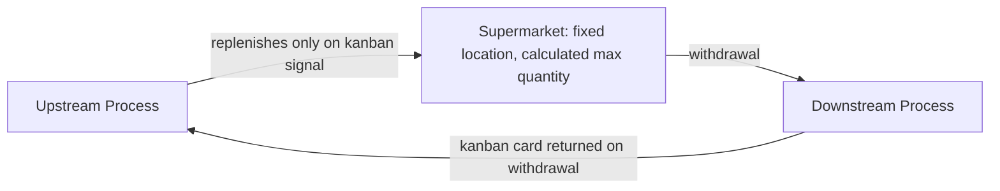

## The Supermarket Concept and Its Origins

### Definition

A **supermarket** in Lean/TPS terminology is a controlled, sized inventory buffer positioned between two processes, from which the downstream process withdraws exactly what it needs, and which the upstream process replenishes only in response to that withdrawal signal (typically a kanban card). It is the physical/organizational mechanism that makes pull production (covered in the prior section) operationally possible where full continuous flow between two processes isn't achievable.

### Origin of the Concept

The supermarket concept is one of the most frequently cited origin stories in TPS history: Taiichi Ohno, developing the Toyota Production System in the years following World War II, is widely credited with drawing direct inspiration from the operating model of American supermarkets, which he observed or studied during visits to the United States.

[Inference] The specific details of this origin story — which stores Ohno visited, the exact timing, and how directly the observation translated into TPS design — vary somewhat across different secondary accounts and Toyota's own historical retrospectives, since Ohno's own writings describe the general principle rather than a single documented visit in precise detail. The core, consistently repeated element across accounts is the underlying insight itself, described below, rather than a single verifiable anecdote.

**The Core Insight**: In a supermarket, a customer takes exactly what they need from the shelf, in the quantity they need, at the time they need it. The store, observing what has been sold (shelf space that has emptied), restocks only that specific item in a quantity matching what was actually taken — not according to a forecast of what customers might buy, but in direct response to what they actually did buy. Ohno recognized this as a structural analog to the production control problem he was trying to solve: rather than each upstream process producing according to a forecast pushed down from central planning, each process could instead treat the downstream process as a "customer," producing only to replace what that customer had actually withdrawn.

### Mapping the Supermarket Analogy to Production

| Supermarket Retail Concept | TPS Production Equivalent |
| --- | --- |
| Shelf stocked with a specific product | A designated storage location holding a specific part number, sized to a calculated maximum |
| Customer takes an item off the shelf | Downstream process withdraws a part/component for its own use |
| Empty shelf space signals what was sold | A kanban card, freed when the part is withdrawn, signals what was consumed |
| Store restocks based on actual sales | Upstream process replenishes based on the kanban signal, not a forecast |
| Shelf never holds unlimited stock of one item | Supermarket has a designed maximum quantity, capping WIP/inventory |

### Structural Characteristics of a Supermarket

**Key Points**

- **Fixed location, fixed maximum capacity**: Each part number has a designated storage location and a calculated maximum quantity, unlike an uncontrolled queue where inventory can accumulate without a defined ceiling
- **FIFO consumption within each location**: Material is typically withdrawn in first-in-first-out order to prevent aging stock and to maintain traceability
- **Replenishment triggered only by withdrawal**: The upstream process does not produce to refill the supermarket unless a kanban signal (or equivalent) indicates actual consumption occurred
- **Positioned at points where continuous flow isn't feasible**: As covered in the future-state mapping section, supermarkets are used specifically where two processes cannot be directly linked in continuous one-piece flow — due to differing cycle times, geographic separation, unreliable uptime, or long changeover times

### Why the Supermarket Solves the Push Problem

Referring back to the push/pull distinction: a push system's core structural weakness is that upstream production is decoupled from actual downstream consumption, relying instead on forecast accuracy. The supermarket directly addresses this by making the *signal* for production the withdrawal itself, not a prediction of future withdrawal.

$$\text{Push System}: \text{Production Quantity} = f(\text{Forecast})$$

$$\text{Pull System (Supermarket)}: \text{Production Quantity} = \text{Actual Withdrawal Quantity}$$

This reformulation is the mechanical basis for why pull systems reduce exposure to forecast error, as discussed in the previous section — the production trigger is replaced entirely with a measured, real fact (what was actually consumed) rather than an estimate.

### Diagram: Supermarket Mechanics (svg_diagram)

### Sizing a Supermarket

A supermarket's maximum quantity is not arbitrary; it is calculated to balance two competing pressures — holding too little risks stockout if downstream demand or upstream replenishment time varies, while holding too much reintroduces the excess inventory waste the pull system is meant to eliminate. A commonly referenced simplified sizing approach considers:

$$\text{Supermarket Size} \approx \text{Average Demand During Replenishment Lead Time} + \text{Safety Stock}$$

Where replenishment lead time includes the upstream process's cycle time, changeover time (if applicable), and any transport/handling delay, and safety stock accounts for observed variability in both demand and replenishment reliability.

[Inference] More detailed sizing calculations (covered in dedicated kanban system design methodology) typically incorporate specific statistical treatment of demand variability and desired service level rather than a single fixed formula; the expression above represents the underlying logical structure of the calculation rather than a complete, ready-to-apply formula for every context.

### Example: Supermarket in Practice

Returning to the recurring value stream example used in prior sections: Cutting currently pushes weekly batches to Assembly based on an MRP schedule, resulting in an observed 800-unit WIP buffer. Converting this link to a supermarket-based pull system would involve:

1. Establishing a designated supermarket location between Cutting and Assembly, sized for a specific part number
2. Calculating the appropriate maximum quantity based on Assembly's actual average daily consumption, Cutting's replenishment lead time (including its changeover time between variants), and a defined safety stock margin
3. Issuing kanban cards sized to that supermarket — for example, if the calculated supermarket size is 200 units held in containers of 20 units each, ten kanban cards would circulate for that part number
4. As Assembly withdraws a container of 20 units, the associated kanban card is returned to Cutting, signaling exactly one container's worth of replenishment — no more, no less
5. Cutting produces only in response to returned kanban cards, rather than according to its previous weekly forecast-driven schedule

This directly reduces the 800-unit buffer to the calculated supermarket maximum (in this example, 200 units) while making the actual consumption pattern, rather than a forecast, the sole driver of Cutting's production quantity.

### Supermarkets Versus FIFO Lanes

[Inference] Supermarkets are one of two primary pull mechanisms used between non-continuous-flow process pairs in standard future-state design methodology; the other is a **FIFO lane** (a capped, strictly ordered queue with no kanban card mechanism, used typically for very short distances or single-part-number connections where a full supermarket/kanban system would be unnecessary overhead). The choice between the two is a future-state design decision based on part variety, distance, and volume at that specific link, rather than one universally preferred mechanism — supermarkets are generally used where multiple part numbers or variants share a connection point, while FIFO lanes suit simpler, single-path connections.

### Common Misconceptions

- **Misconception**: A supermarket is simply "inventory with a different name." The defining distinction is the *replenishment mechanism* — a supermarket's stock is replenished strictly in response to a withdrawal signal with a designed maximum, whereas ordinary inventory in a push system accumulates according to a schedule with no consumption-linked cap
- **Misconception**: Supermarkets eliminate the need for any inventory management. Supermarket sizing, kanban card count calibration, and periodic review of whether the calculated size still matches actual demand patterns are ongoing disciplines, not a one-time setup
- **Misconception**: The supermarket concept only applies to physical manufacturing parts. [Inference] The same withdrawal-triggered replenishment logic has been adapted in Lean Office/service contexts — for example, a document processing queue capped at a fixed WIP limit with new work only released as completed work exits — though this adaptation requires translating the physical shelf/card mechanism into an appropriate digital or visual equivalent for information-based work

**Related Topics**

- Kanban card design, types, and calculation methodology
- Push versus pull production philosophy
- FIFO lanes as an alternative pull mechanism
- Future-state map design and where supermarkets are placed
- Safety stock and demand variability calculations
- SMED as a prerequisite for smaller, more frequent supermarket replenishment cycles