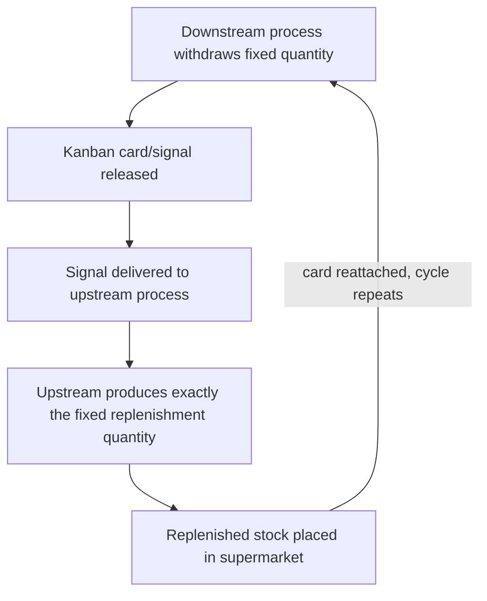

## Principles of Pull Based Replenishment

### Overview

Pull-based replenishment is the operational discipline that converts the supermarket and kanban concepts (covered in prior sections) into a functioning, repeatable production control system. Where the previous sections established *what* a supermarket is and *why* pull is philosophically preferred over push, this section addresses the governing principles that make a pull replenishment system actually work reliably in ongoing operation — the rules that determine when, how much, and under what conditions replenishment occurs.

### Principle 1: Produce Only to Replace What Was Consumed

The foundational rule of pull replenishment is that production is triggered exclusively by a confirmed consumption event, never by a forecast, schedule, or upstream process's own judgment about what might be needed soon.

$$\text{Replenishment Quantity} = \text{Confirmed Withdrawal Quantity}$$

[Inference] This principle is what most sharply distinguishes pull from push at an operational level: a supervisor's discretion to "get ahead" by producing extra in anticipation of a busy period, however well-intentioned, is a direct violation of pull discipline, since it reintroduces forecast-driven production into a system designed specifically to eliminate that dependency. Maintaining this discipline under pressure (e.g., an approaching known demand spike) is frequently cited as one of the harder cultural aspects of sustaining pull systems in practice.

### Principle 2: Fixed, Calculated Replenishment Quantities

Replenishment in a pull system moves in defined, pre-calculated increments — typically a container quantity or kanban lot size — rather than arbitrary amounts determined case by case.

**Key Points**

- Each kanban card or signal represents a fixed, known quantity, established during system design (see the supermarket sizing methodology in the prior section)
- Producing "a little extra just in case" when replenishing a signal breaks the quantity discipline the entire calculation depends on, since supermarket sizing assumes a consistent replenishment unit
- Changing the fixed quantity should be a deliberate re-design decision (recalculating supermarket size based on updated demand or lead time data), not an ad hoc operational adjustment

### Principle 3: Visual, Unambiguous Signaling

A pull system depends on the replenishment signal being immediately visible and unambiguous to the person or process responsible for acting on it — this is why kanban cards, empty containers, or visual markers are the classical mechanism, as opposed to a signal buried in a report or system query that must be actively checked.

[Inference] This principle connects directly to the broader Lean emphasis on visual management: a well-designed pull signal should require no interpretation or calculation by the person receiving it — an empty bin or a kanban card physically arriving is a self-evident instruction, whereas a system requiring someone to check a dashboard, calculate a shortfall, and decide to act introduces both delay and the possibility of human error or oversight into what should be an automatic trigger.

### Principle 4: Capped Maximum Inventory

A pull system's supermarket has a defined, fixed maximum quantity — the sum of all kanban cards in circulation for that part number represents an absolute ceiling on inventory at that point, which cannot be exceeded regardless of upstream production capacity or convenience.

$$\text{Maximum Supermarket Inventory} = \text{Number of Kanban Cards} \times \text{Quantity per Card}$$

This cap is what prevents a pull system from silently reverting to push-like overproduction: an upstream process physically cannot produce beyond the number of active kanban cards, since production without a returned card violates the signaling discipline entirely.

### Principle 5: Replenishment Point, Not Continuous Production

Pull systems typically use a defined trigger point (a kanban card returned, a bin emptied) rather than continuous monitoring and adjustment. This is a deliberately simple, low-overhead control mechanism — the upstream process does not need real-time visibility into downstream inventory levels generally, only a reaction to a specific triggering event.

### Diagram: Pull Replenishment Cycle (svg_diagram)

### Types of Pull Replenishment Signals

| Signal Type | Mechanism | Typical Use Case |
| --- | --- | --- |
| Kanban card (production) | Physical card returned to upstream process specifying part number and quantity to produce | Standard internal process-to-process replenishment |
| Kanban card (withdrawal/transport) | Physical card authorizing movement of a specific quantity from one supermarket to another location | Multi-stage supermarket chains, or supplier-to-plant transport |
| Two-bin system | One bin in use while a second full bin is available; returning the empty bin is itself the signal | Simple, high-frequency, low-value items (e.g., fasteners, small components) |
| Electronic kanban (e-kanban) | Digital signal (barcode scan, system entry) replacing a physical card | Geographically distant suppliers, or environments where physical card circulation is impractical |
| Golf ball / marker signal | A simple physical token (colored ball, flag) dropped into a return chute indicating replenishment need | Very simple, high-frequency shop-floor replenishment |

[Inference] The specific signal mechanism is a design choice suited to the context — physical cards remain common in traditional manufacturing settings, while e-kanban has become more prevalent where distance or system integration makes physical card circulation impractical; no single mechanism is universally preferred across all applications.

### Rules Governing Kanban Circulation

A frequently cited set of operating rules (originating from Toyota's internal kanban system design, later generalized in Lean literature) governs how kanban-based pull replenishment should function day to day:

- **No production without a kanban authorization**: The upstream process does not produce speculatively, even if idle capacity exists
- **No withdrawal without a kanban card**: The downstream process does not take material from the supermarket without the corresponding card, maintaining accurate tracking of what has actually been consumed
- **Produce/deliver the exact quantity specified on the kanban**: Neither more nor less than the card's specified quantity
- **Defective parts are never passed downstream**: A quality defect discovered at any point must be addressed before the material continues through the pull chain, since passing defects downstream in a pull system directly consumes supermarket capacity with unusable stock
- **The number of kanban cards should be minimized over time**: As process reliability and changeover capability improve, the calculated supermarket size (and corresponding card count) can typically be reduced, treating card count reduction as an ongoing kaizen target rather than a fixed, permanent setting

[Inference] This traditional rule set is widely cited across Lean/TPS literature in broadly similar form, though exact wording and emphasis vary somewhat by source; the core intent — production and movement occur only against an explicit, quantity-specific authorization, with continuous pressure to reduce the authorized quantity over time — is consistently represented across mainstream treatments.

### Example: Applying the Principles

A two-bin pull system is established for a fastener used in Assembly. Each bin holds a two-day supply based on average consumption. When the first bin empties, it is physically moved to a designated return location, which is itself the replenishment signal — no card, system entry, or verbal request is needed. The upstream supplier's replenishment process is triggered solely by the presence of an empty bin in that location, and replenishes exactly one bin's worth, no more.

If Assembly's actual consumption temporarily spikes and depletes both bins before the replenishment arrives, this is treated as a signal that the current bin size (supermarket sizing) is miscalibrated against actual demand variability — the correct response under pull principles is to recalculate and adjust the bin size or the number of bins in circulation, not to have the supplier informally "send extra" as a one-time fix, since the latter reintroduces exactly the forecast-driven, undisciplined replenishment pull systems are designed to eliminate.

### Common Failure Modes in Pull Replenishment

- **Informal push creeping back in**: Supervisors or schedulers "helping" by producing ahead of confirmed signals, undermining the discipline the system depends on
- **Card/signal loss or delay**: A physical kanban system depends on the signal actually reaching the upstream process promptly; lost or delayed cards effectively reintroduce a hidden forecast gap
- **Static sizing despite changing demand**: Supermarket sizes and kanban counts calculated once and never revisited become progressively mismatched as actual demand patterns shift over time
- **Passing defects through the system**: Undermines both quality and the inventory accuracy the pull calculation depends on, since defective units occupy supermarket capacity without being usable

**Next Steps**

- Study kanban card design, calculation, and types in detail
- Study supermarket sizing methodology and safety stock calculation
- Explore e-kanban system architecture for distributed supply chains
- Study the relationship between pull replenishment and heijunka scheduling at the pacemaker
- Explore continuous kaizen reduction of kanban card counts over time
- Study two-bin and visual signal systems for high-frequency, low-value items