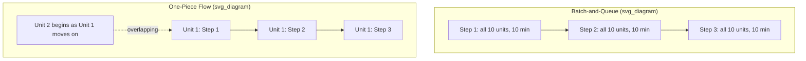
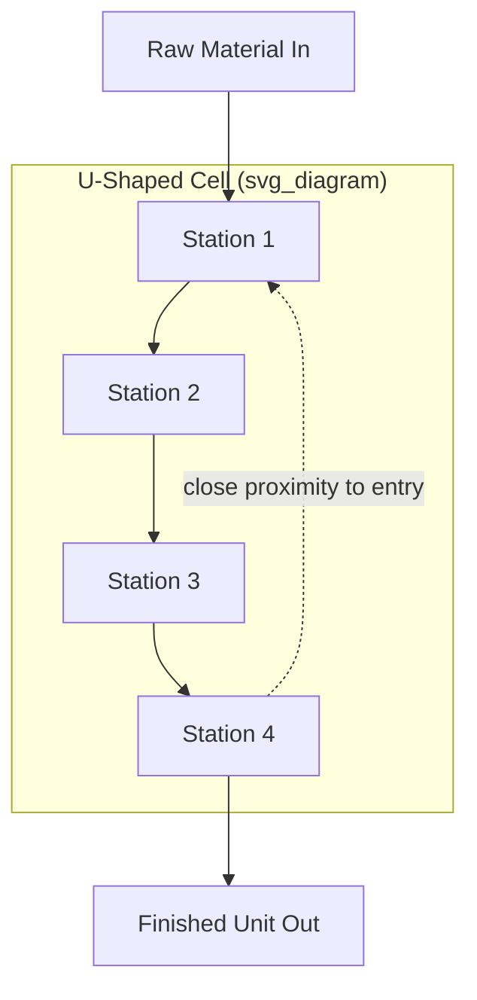

## One Piece Flow and Continuous Flow Design

### Definition

**One-piece flow** (also called **continuous flow**) is a production design principle in which units move through a sequence of processes individually, one at a time, with each unit completing one step and moving immediately to the next, rather than accumulating in batches between steps. It represents the most direct alternative to the batch-and-queue production pattern that generates much of the inventory and waiting waste discussed in earlier sections, and it is generally regarded as the preferred flow design wherever it is technically and economically feasible — preferred even over supermarket-based pull, since it eliminates the intervening inventory buffer entirely rather than merely capping it.

### Contrast with Batch-and-Queue Production

In batch-and-queue production, a process completes an entire batch of units before any of them move to the next step — meaning most units in the batch sit idle, waiting for the rest of the batch to finish, before any downstream work begins on them.

| Aspect | Batch-and-Queue | One-Piece Flow |
| --- | --- | --- |
| Unit movement | Entire batch moves together after full batch completion | Each unit moves individually immediately after its own step completes |
| WIP between steps | Accumulates to batch size | Minimal — typically one unit or a small buffer |
| Lead time per unit | Includes wait time for entire batch to complete at each step | Approaches the sum of actual processing times only |
| Defect detection | Delayed until the batch reaches inspection or the next process | Immediate — a defect is visible at the very next step |
| Changeover frequency | Low (batches minimize changeovers) | Higher (each variant switch requires a changeover, unless changeover time is minimized) |

### The Lead Time Mathematics of Batching

A frequently cited illustration in Lean training demonstrates why batch processing inflates lead time disproportionately to its apparent efficiency. Consider a batch of 10 units, each requiring 1 minute at each of three sequential process steps, processed in full-batch mode:

$$\text{Batch Lead Time for First Unit} = (10 \times 1) + (10 \times 1) + (10 \times 1) = 30 \text{ minutes (last unit)}$$

Under full batching, the *first* unit completed at Step 1 still must wait for all 9 other units to finish Step 1 before the batch moves to Step 2 — meaning even the first unit's actual completion at the final step is delayed by the full batch cycle at each stage.

Under one-piece flow, the first unit moves to Step 2 immediately after its own Step 1 completes:

$$\text{One-Piece Flow Lead Time for First Unit} = 1 + 1 + 1 = 3 \text{ minutes}$$

$$\text{One-Piece Flow Lead Time for Entire Batch of 10} \approx 3 + (10-1) \times 1 = 12 \text{ minutes}$$

[Inference] This illustrative calculation is a standard teaching example in Lean training materials (commonly demonstrated physically with folded paper or poker chips in workshop settings) intended to make the disproportionate lead-time cost of batching viscerally clear; real-world figures vary based on actual process times, changeover overhead, and line balance, but the underlying mathematical principle — that batching multiplies wait time across every unit in the batch at every step — holds generally.

### Diagram: Batch vs. One-Piece Flow Timing (svg_diagram)

### Prerequisites for One-Piece Flow

Continuous flow is not universally achievable without certain enabling conditions being met first; these prerequisites explain why one-piece flow, though preferred, is not always the immediate future-state design choice (as noted in the earlier section on future-state mapping, supermarkets remain the appropriate interim mechanism where these conditions aren't yet met).

**Key Points**

- **Cycle times reasonably balanced across stations**: Stations with widely mismatched cycle times create bottlenecks that undermine smooth single-unit movement; line balancing toward takt time (covered in the earlier section on takt/cycle/lead time) is typically a prerequisite
- **High process reliability/uptime**: In one-piece flow, a breakdown at any single station immediately halts the entire connected line, since there is no buffer inventory to absorb the disruption — this makes equipment reliability (supported by TPM) far more critical than in batch or supermarket-buffered configurations
- **Minimal or eliminated changeover time**: If a station serves multiple product variants, one-piece flow across variants requires very fast changeover (SMED), since switching between units of different types must not introduce significant delay
- **Physical or workflow proximity**: Stations connected by continuous flow are typically located close together (cellular layout) to avoid transport time undermining the flow's continuity
- **Consistent quality at each step**: A defect passed forward in one-piece flow is caught almost immediately at the next station, which is a benefit for detection speed, but the line's stability depends on defects being genuinely rare rather than a frequent occurrence that would otherwise repeatedly interrupt flow

### Cellular Manufacturing as an Enabler

One-piece flow is commonly implemented through **cellular layout** — arranging equipment and workstations in a tight U-shaped or similar configuration by product family rather than by traditional functional department groupings (e.g., all lathes in one area, all drills in another). [Inference] The U-shape in particular is frequently cited in Lean layout literature as advantageous because it allows a small number of cross-trained operators to manage multiple stations within the cell by walking a short, efficient path, and because it keeps the cell's entry and exit points close together, though the specific cell shape used varies by facility constraints and is not a strict requirement of one-piece flow itself.

### Diagram: Cellular Layout for One-Piece Flow (svg_diagram)

### One-Piece Flow and the Other Wastes

Continuous flow simultaneously addresses several waste categories at once, which is part of why it is prioritized over supermarket-based pull wherever feasible:

- **Eliminates inter-process inventory waste**: No WIP buffer exists between connected stations, since each unit moves immediately
- **Reduces motion and transport waste**: Cellular layout typically shortens the physical distance material travels compared to a functional (departmental) layout
- **Surfaces defects immediately**: A defect is caught at the very next station rather than after an entire batch is processed, dramatically shortening the feedback loop for root-cause correction
- **Reduces waiting waste**: As demonstrated in the lead-time calculation above, units spend far less cumulative time waiting compared to batch processing

### Limitations and Trade-offs

- **Higher exposure to disruption**: Without buffer inventory, any single station's downtime immediately stops the connected flow, making reliability (TPM) and rapid problem response essential rather than optional
- **Changeover sensitivity**: Product mix flexibility within a one-piece flow cell depends heavily on how quickly changeovers can be executed; without adequate SMED capability, introducing product variety into a flow cell can reintroduce significant waiting waste
- **Not always economically justified for very low-volume or highly customized production**: [Inference] Extremely low-volume, highly variable custom work may not justify the capital and layout investment a dedicated flow cell requires, though this is a case-by-case economic judgment rather than a fixed volume threshold

### Example

A furniture manufacturer's dining chair assembly, previously run as batch-and-queue (frame assembly batches of 20, followed by upholstery batches of 20, followed by finishing batches of 20), is redesigned into a single U-shaped cell where frame assembly, upholstery, and finishing stations are arranged in sequence with a single operator moving each chair through all three steps before beginning the next. Cycle times at each station were first balanced to within a narrow range of each other (a prerequisite line-balancing exercise against a calculated takt time), and a prior SMED initiative had already reduced the finishing station's color-change time from 20 minutes to under 3 minutes, making mixed-color one-piece flow through the finishing step economically practical.

The result: order-to-completion lead time for a single chair drops from several days (reflecting batch wait time at each of the three original stages) to under two hours, while defects — previously discovered only when an entire finished batch reached final inspection — are now caught by the very next station in the cell, typically within minutes of occurring, substantially shortening the root-cause investigation window.

**Related Topics**

- Cellular manufacturing and U-shaped cell layout design
- SMED (Single-Minute Exchange of Die) as a one-piece flow enabler
- Line balancing against takt time
- Total Productive Maintenance (TPM) and its role in flow reliability
- Supermarkets and FIFO lanes as interim mechanisms where continuous flow isn't yet achievable
- Future-state map design and the eight future-state design questions