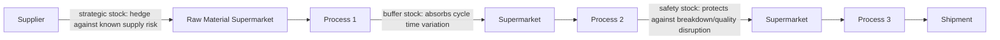

## Distinguishing Buffer Stock, Safety Stock, and Strategic Stock

### Overview

Lean philosophy treats inventory as waste (muda) by default, yet even well-designed pull systems deliberately hold *some* inventory at calculated points, as established in the earlier sections on supermarkets and pull replenishment. The critical distinction Lean practitioners draw is not "inventory versus no inventory," but between inventory held for a specific, named, and periodically reassessed reason versus inventory that has simply accumulated without a defined purpose. Three commonly distinguished categories — buffer stock, safety stock, and strategic stock — each address a different type of variability or risk, and conflating them leads to miscalculated supermarket sizes and poorly targeted inventory reduction efforts.

### Buffer Stock

**Definition**: Buffer stock (sometimes called **process buffer**) is inventory held specifically to absorb *volume* or *timing* variability between two connected processes with different production rates or cycle patterns, ensuring the downstream process is not starved when the upstream process's output rate temporarily lags demand.

**Purpose**: Buffer stock exists to decouple two processes whose cycle times, changeover patterns, or short-term output rates don't perfectly synchronize, even when both processes are, on average, capable of matching the required takt time.

**Key characteristics**:

- Sized based on the *magnitude and duration of expected short-term rate mismatches* between the two connected processes
- Positioned specifically at the interface between two processes with known cycle time variability, not distributed generally across the value stream
- Distinct from safety stock in that it addresses **normal, expected process-to-process rate variation**, not an unplanned disruption

[Inference] Buffer stock is sometimes described in Lean literature as compensating for the natural "breathing" of connected processes — for example, a station whose cycle time fluctuates slightly cycle to cycle due to minor variation in manual task execution — rather than for an exceptional event; this distinguishes it conceptually from safety stock below, though in practice the two are sometimes sized and managed together within the same supermarket calculation.

### Safety Stock

**Definition**: Safety stock is inventory held specifically to protect against **unplanned disruptions** — equipment breakdown, quality problems requiring rework, supplier delivery failure, or unexpected demand spikes — that would otherwise cause a stockout and halt downstream production entirely.

**Purpose**: Where buffer stock addresses routine, expected variability, safety stock addresses the risk of abnormal, less predictable events whose occurrence and magnitude are harder to forecast precisely but whose consequence (a line stoppage) is severe enough to justify holding a calculated reserve against them.

**Sizing considerations**:

- Historical frequency and duration of the specific disruption types the stock is meant to protect against (e.g., observed mean time between failures and mean time to repair for a given piece of equipment)
- Desired service level — the acceptable probability of stockout occurring despite the safety stock reserve
- Supplier reliability data, where safety stock is held against inbound material delivery risk specifically

$$\text{Safety Stock} \approx z \times \sigma_{demand} \times \sqrt{\text{Replenishment Lead Time}}$$

[Unverified] This is a standard simplified statistical safety stock formula referenced across general inventory management and Lean literature (where $z$ represents a service-level factor and $\sigma_{demand}$ the standard deviation of demand), but its direct applicability depends on demand and lead-time variability actually approximating the statistical assumptions (e.g., normally distributed, independent variation) the formula relies on; real supermarket/safety stock sizing in Lean practice often blends this type of calculation with direct observation and practitioner judgment rather than applying the formula in isolation.

### Strategic Stock

**Definition**: Strategic stock (sometimes called **decoupling stock** in a broader sense, or discussed under hedge inventory in supply chain literature) is inventory held for reasons outside normal operational variability — deliberate business decisions made in response to known, specific, often longer-horizon risks or opportunities rather than routine process variation.

**Common reasons for strategic stock**:

- A known upcoming supplier disruption (planned plant shutdown, geopolitical or logistics risk, single-source supplier with long lead time)
- Seasonal demand builds where production capacity cannot feasibly match a sharp seasonal peak, requiring inventory built in advance during lower-demand periods
- New product launches where initial demand uncertainty is high and stockout risk during ramp-up carries significant strategic cost (e.g., losing shelf space or customer trust)
- Regulatory or contractual requirements mandating minimum stock levels for certain materials

[Inference] Strategic stock is the category most explicitly acknowledged in Lean practice as sitting furthest from the "eliminate all inventory" ideal — it typically reflects a deliberate business risk-management decision made above the level of routine process design, and is usually held with an explicit review date or triggering condition for release/reduction, rather than being treated as a permanent fixture.

### Comparison Table

| Category | Protects Against | Typical Duration | Sizing Basis | Review Frequency |
| --- | --- | --- | --- | --- |
| Buffer Stock | Normal cycle time/rate variability between connected processes | Ongoing, structural | Observed short-term rate mismatch magnitude | Periodic, as process capability changes |
| Safety Stock | Unplanned disruptions (breakdown, quality issue, supplier failure) | Ongoing, structural | Historical disruption frequency/duration, desired service level | Periodic, as reliability data updates |
| Strategic Stock | Known, specific, often longer-horizon business risk or event | Often temporary, tied to a specific known event or window | Business judgment against a specific identified risk | Tied to the triggering event's resolution or expiration |

### Diagram: Where Each Stock Type Sits in a Value Stream (svg_diagram)

### Why the Distinction Matters for Lean Practice

**Key Points**

- **Correctly targeting waste-reduction effort**: Attempting to eliminate safety stock through a countermeasure suited to buffer stock (e.g., simply tightening cycle time synchronization) will not address the disruption risk the safety stock was actually protecting against, and may expose the line to stockout
- **Correctly evaluating whether reduction is appropriate**: Buffer and safety stock are generally treated as reducible over time as underlying process capability improves (faster changeovers, higher uptime, more reliable suppliers reduce the *need* for the stock, allowing a deliberate, calculated reduction) — whereas strategic stock reduction depends on the resolution of the specific external condition that justified it, not on internal process improvement
- **Avoiding conflation with "just excess inventory"**: A supermarket sized to include unaccounted, undifferentiated extra stock — inventory that isn't clearly attributable to any of the three named categories — is the actual target of Lean waste elimination; inventory tied to a specific, calculated, periodically reviewed purpose is a deliberate design element, not automatically waste

[Inference] This is a frequently emphasized nuance in Lean training: the goal is not zero inventory everywhere, but zero *unjustified* inventory — every unit of stock held should be traceable to a specific buffer, safety, or strategic rationale with an associated calculation, rather than existing simply because "that's how much we've always kept."

### Example: Diagnosing an Oversized Supermarket

A supermarket between two processes is observed holding 500 units, but current-state analysis reveals the calculated buffer stock requirement (based on observed cycle time variability) is only 80 units, and the calculated safety stock requirement (based on the upstream process's actual breakdown frequency and repair time) is 120 units — a combined justified total of 200 units. The remaining 300 units represents unaccounted excess: neither tied to observed process variability nor to a specific disruption risk calculation, nor to any identified strategic business reason.

This diagnosis, made possible specifically by decomposing the 500 units into its component categories rather than treating it as a single undifferentiated figure, directs the improvement effort precisely: the supermarket can likely be reduced toward the 200-unit justified total, and doing so is a calculated adjustment grounded in the buffer and safety stock analysis, not an arbitrary across-the-board inventory cut that risks reintroducing stockout.

### Common Errors in Practice

- **Treating all inventory as uniformly "bad" without decomposition**: Leads to arbitrary, across-the-board inventory reduction targets that can cut into genuinely necessary buffer or safety stock, increasing stockout risk without addressing the actual excess
- **Sizing safety stock from intuition rather than disruption data**: Without historical breakdown/disruption frequency and duration data, safety stock calculations default to guesswork, commonly resulting in either significant over-protection (excess inventory) or under-protection (recurring stockouts)
- **Allowing strategic stock to become permanent by default**: Strategic stock held against a specific, time-bound risk that is never formally reviewed for expiration tends to persist indefinitely as untracked excess inventory long after the original justifying condition has passed
- **Failing to revisit buffer/safety stock sizing as process capability improves**: A supermarket sized against outdated reliability or cycle-time-variability data understates the achievable reduction available from genuine process improvement work already completed

**Related Topics**

- Supermarket sizing methodology and the supermarket concept's origins
- Kanban card calculation and circulation rules
- Total Productive Maintenance (TPM) as a lever for reducing required safety stock
- SMED and its effect on buffer stock requirements between changeover-sensitive processes
- The bullwhip effect and strategic stock decisions in multi-tier supply chains
- Process cycle efficiency and the relationship between inventory levels and lead time