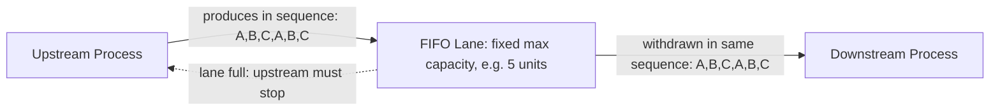

## FIFO Lanes and Sequenced Pull

### Definition

A **FIFO lane** (First-In-First-Out lane) is a capped, strictly ordered pull mechanism connecting two processes, in which units move through in the exact sequence they entered, with no reordering permitted, and with a fixed maximum quantity of units allowed in the lane at any time. It is, alongside the supermarket, one of the two primary pull mechanisms specified in standard future-state design methodology (covered in the earlier section on building a future-state map) for linking processes that cannot be joined in full continuous flow.

### FIFO Lane vs. Supermarket: The Core Distinction

Both mechanisms cap inventory and both replace push scheduling with a consumption-triggered replenishment logic, but they differ in a structurally important way:

| Aspect | Supermarket | FIFO Lane |
| --- | --- | --- |
| Sequence discipline | No fixed order — any unit in stock can be withdrawn to meet a specific need | Strict first-in-first-out order — units must exit in the same order they entered |
| Part variety | Typically holds multiple part numbers/variants, each with its own kanban | Typically holds a single part number or a fixed, pre-sequenced mix |
| Replenishment trigger | Kanban card returned on withdrawal | Simply reaching the lane's fixed maximum capacity, or exiting at the downstream end |
| Signal mechanism | Explicit kanban card per part number | Often no card needed — a full lane is itself the "stop producing" signal |
| Typical use case | Multiple variants, moderate distance, differing cycle times | Single part number or fixed sequence, direct connection, no reordering needed |

[Inference] A commonly cited practical heuristic in future-state design methodology is that FIFO lanes are generally preferred over supermarkets where feasible, since they require less signaling overhead (no card system to design and maintain) and simpler physical implementation — but a FIFO lane is only appropriate where strict sequence preservation is acceptable and where the connected processes don't need the flexibility to withdraw different variants out of the exact entry order.

### Mechanics of a FIFO Lane

**Key Points**

- The lane has a **fixed maximum capacity**, typically expressed as a specific number of units or containers the physical or virtual lane can hold
- When the lane reaches its maximum, the **upstream process must stop producing** until the downstream process withdraws a unit and creates space — this capacity cap is itself the implicit pull signal, requiring no separate card mechanism in many implementations
- Units are withdrawn by the downstream process strictly in entry order — a FIFO lane does not permit "picking" a specific unit out of sequence the way a supermarket, which typically holds multiple variants side by side, might allow
- FIFO lanes are commonly implemented physically as a gravity-fed chute, a numbered/marked conveyor section, or a simple marked floor lane with a defined maximum number of positions

### Why Sequence Matters: Sequenced Pull

The term **sequenced pull** specifically refers to a pull mechanism (often a FIFO lane) that preserves not just quantity discipline but the *exact production sequence* established upstream — typically at the pacemaker process (introduced in the future-state mapping section). This matters particularly in mixed-model production, where a specific, deliberately leveled sequence of different variants (e.g., A-B-C-A-B-C, established via heijunka) must be preserved as units move downstream, since reordering would undo the leveling design's intended effect.

[Inference] Sequenced pull via FIFO lane is the mechanism that allows a heijunka-leveled sequence, established once at the pacemaker, to propagate correctly to downstream processes without requiring each downstream station to independently re-derive or re-schedule that sequence — the FIFO discipline itself guarantees sequence preservation structurally, without needing an explicit scheduling instruction to be re-issued at each subsequent station.

### Diagram: FIFO Lane Mechanics (svg_diagram)

### When to Use a FIFO Lane Versus a Supermarket

**Key Points**

- **Use a FIFO lane** when: the connection involves a single part number or a fixed, already-sequenced mix; the two processes are in close physical or logical proximity; preserving exact production sequence matters (e.g., downstream of a heijunka-leveled pacemaker); and minimizing signaling overhead is desirable
- **Use a supermarket** when: multiple distinct part numbers or variants need to be held and withdrawn independently based on differing downstream needs; the connected processes are geographically or organizationally distant enough that a kanban card round-trip is more practical than maintaining a physically capped lane; or downstream withdrawal timing doesn't naturally follow the same sequence upstream production occurred in

[Inference] In many real future-state maps, both mechanisms appear at different points in the same value stream — a supermarket might sit between a batch-oriented upstream process and a pacemaker (allowing withdrawal flexibility across variants), while a FIFO lane connects the pacemaker directly to final packaging and shipping, preserving the exact leveled sequence all the way to the customer; this combination is a design choice made per-link based on the eight future-state design questions rather than a single mechanism applied uniformly across an entire value stream.

### FIFO Lane Capacity Sizing

Similar in principle to supermarket sizing (covered in the prior section on buffer/safety/strategic stock), a FIFO lane's maximum capacity is calculated rather than arbitrary, typically based on:

$$\text{FIFO Lane Capacity} \approx \text{Cycle Time Difference Buffer} + \text{Minor Disruption Tolerance}$$

Where the calculation accounts for minor, expected fluctuation between the upstream and downstream cycle times (similar in concept to buffer stock) and a modest tolerance for brief disruptions, without holding the larger reserve a dedicated safety-stock supermarket might carry — FIFO lanes are generally sized smaller and tighter than supermarkets, since they are typically used precisely where processes are closely coupled and disruption risk is lower.

### Example: Sequenced Pull From Pacemaker to Shipping

Continuing the recurring furniture manufacturing example used in prior sections: after Assembly (established as the pacemaker process in future-state design) produces chairs in a heijunka-leveled sequence — Model A, Model B, Model C, repeating — the finishing and packaging stations downstream are connected to Assembly and to each other via FIFO lanes rather than supermarkets. Each lane holds a maximum of 6 units.

Because the lane enforces strict sequence, the exact A-B-C-A-B-C order established by heijunka at Assembly is guaranteed to reach Packaging in the same order, without any additional scheduling instruction needing to be communicated to Finishing or Packaging individually — those stations simply process whatever the FIFO lane presents next. If Packaging is temporarily slower and the lane between Finishing and Packaging fills to its 6-unit maximum, Finishing automatically stops producing until Packaging withdraws the next unit, providing the pull signal without any kanban card system needing to be designed for this particular link.

### Common Implementation Errors

- **Allowing reordering "just this once"**: Pulling a specific unit out of sequence to expedite an urgent order undermines the entire sequenced-pull design, since it breaks the guarantee that downstream sequence matches the leveled upstream sequence — urgent-order handling should be designed as an explicit, separate mechanism (if needed at all) rather than an ad hoc exception to FIFO discipline
- **Oversizing the lane "to be safe"**: A FIFO lane sized much larger than its calculated requirement reintroduces the excess-inventory and delayed-problem-visibility issues that motivated moving away from batch processing in the first place
- **Using a FIFO lane where variant flexibility is actually needed**: Forcing strict sequence onto a connection where downstream demand genuinely needs to withdraw different variants out of a fixed order (rather than following a pre-set sequence) is a mismatch better served by a supermarket

**Related Topics**

- The supermarket concept and its origins
- Push versus pull production philosophy
- Heijunka and the pacemaker process in future-state design
- One-piece flow and continuous flow design
- Kanban card design, types, and calculation methodology
- Buffer stock, safety stock, and strategic stock distinctions