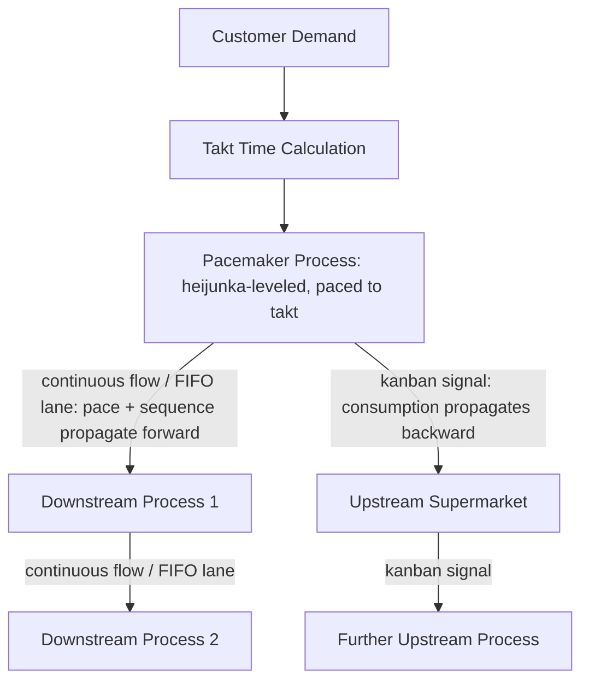

## Synchronizing Upstream and Downstream Processes

### Overview

Synchronization is the design discipline of ensuring that connected processes across a value stream operate at compatible rates and in coordinated timing, so that pull signals, FIFO lanes, and supermarkets (covered in prior sections) function as intended rather than degrading into de facto push behavior. Where earlier sections addressed the individual mechanisms (supermarkets, kanban, FIFO lanes, one-piece flow), this section addresses the systemic question of how those mechanisms are tied together across an entire value stream so that pace, sequence, and information move coherently from customer demand back through every upstream process.

### Why Synchronization Is Necessary

Individually well-designed pull mechanisms can still fail to produce a coherent, low-waste value stream if they are not synchronized with each other. A supermarket correctly sized for its immediate upstream-downstream pair does not, by itself, guarantee that the pace set at one point in the value stream is consistent with the pace at another — without deliberate synchronization, different segments of the same value stream can effectively operate at different rhythms, reintroducing mura at the boundaries between synchronized and unsynchronized segments.

[Inference] This is a frequently underemphasized point in introductory pull-system training: implementing kanban or FIFO lanes locally, one link at a time, without an overarching synchronization design anchored to a single pacemaker, risks producing a value stream that is pull-controlled at each individual link but still uncoordinated end to end — a condition sometimes informally described as "islands of pull" rather than a genuinely synchronized flow.

### The Pacemaker as the Synchronization Anchor

As established in the future-state mapping section, the **pacemaker process** is the single point where external scheduling information enters the value stream, with heijunka leveling applied at that point. Synchronization across the entire value stream is achieved by anchoring every other process's pace, directly or indirectly, to the pacemaker's rate — rather than each process independently attempting to match customer demand or an internal schedule of its own.

$$\text{All process rates} \rightarrow \text{synchronized to} \rightarrow \text{Pacemaker rate} \rightarrow \text{synchronized to} \rightarrow \text{Takt time}$$

### Mechanisms That Propagate Synchronization

**Key Points**

- **Downstream of the pacemaker**: Continuous flow (one-piece flow) or FIFO lanes (sequenced pull) propagate the pacemaker's established pace and sequence directly, since these mechanisms structurally preserve both rate and order without requiring separate scheduling at each subsequent station
- **Upstream of the pacemaker**: Supermarkets and kanban signals propagate consumption-driven replenishment backward through the chain, so that upstream processes respond to the pacemaker's actual consumption rate rather than to an independently issued forecast
- **Pitch**: The work-release increment established at the pacemaker (introduced in the future-state mapping section) provides the practical unit of synchronization — a consistent, monitorable interval (often a multiple of takt time) at which the pacemaker releases work and withdraws material, giving every connected process a shared rhythm to synchronize against

### Diagram: Synchronization Radiating from the Pacemaker (svg_diagram)

### Diagnosing Synchronization Gaps

A value stream map's data — cycle times, inventory levels, and takt time comparisons (covered in the earlier section on calculating takt time, cycle time, and lead time) — is the primary diagnostic tool for identifying where synchronization breaks down:

| Symptom on the Map | Likely Synchronization Issue |
| --- | --- |
| Large inventory triangle at a specific link despite kanban being nominally in place | Kanban card count or size miscalibrated against actual consumption rate; effective sync has degraded into buffered push |
| A station's cycle time significantly under takt, but downstream still experiences shortages | Station may be running to its own local schedule rather than the pacemaker-derived pull signal (an "island of pull") |
| Sequence mismatch between what heijunka scheduled and what downstream actually receives | A supermarket, rather than a FIFO lane, sits where sequence preservation was actually required, allowing reordering to occur |
| Frequent stockouts at a FIFO lane despite adequate average capacity | Lane capacity undersized relative to actual short-term cycle time variability between the connected processes |

### Synchronizing Processes With Different Natural Cycle Times

[Inference] A common practical synchronization challenge arises when connected processes have structurally different natural batch sizes or cycle times — for example, an injection molding process that efficiently produces in batches of 50 due to mold-change economics, feeding an assembly process that consumes one unit at a time. Full one-piece flow is not feasible in this pairing without first addressing the molding process's changeover economics (via SMED); until then, synchronization is achieved through a correctly sized supermarket that decouples the two differing natural rhythms, converting the molding process's batch output into a steady, consumption-paced supply for assembly, rather than either forcing an artificial and costly small-batch mold change schedule or allowing the mismatch to propagate as uncontrolled inventory.

This illustrates that synchronization does not require every process to run at an identical literal cycle time — it requires that whatever rate mismatch exists between connected processes is deliberately managed through an appropriately designed and sized decoupling mechanism (supermarket, buffer), rather than left unmanaged.

### Load Leveling as a Synchronization Tool

Heijunka, applied specifically at the pacemaker, is the primary mechanism for ensuring the pace being propagated through the rest of the synchronized value stream is itself smooth rather than erratic. [Inference] Without leveling at the pacemaker, even a perfectly synchronized downstream chain (via well-designed FIFO lanes and continuous flow) would simply propagate the pacemaker's own unevenness forward and backward through the system — synchronization ensures processes move together, but heijunka ensures what they are moving together *toward* is itself a smooth, sustainable rhythm rather than a volatile one.

### Example: Diagnosing a Synchronization Failure

A value stream map shows Assembly (the designated pacemaker) running a heijunka-leveled sequence at a pitch of every 15 minutes, matched closely to takt time. Downstream, Packaging is connected via a FIFO lane. Upstream, a Sub-Assembly process feeds Assembly via a supermarket with kanban cards.

Despite this design appearing correctly structured on paper, Assembly experiences frequent shortages of a specific sub-assembly component. Investigation reveals that Sub-Assembly's supervisor, under pressure to "keep busy," has been producing ahead of returned kanban signals during periods when the queue looks light, running a locally larger batch than the kanban count authorizes — effectively reintroducing informal push behavior at that single link, out of sync with the pacemaker's actual consumption pattern. Because Sub-Assembly's batches don't align with Assembly's pitch-paced withdrawal rate, the supermarket alternates between periods of unauthorized excess and periods of genuine shortage, despite the kanban mechanism nominally being in place.

The synchronization fix here is not a redesign of the supermarket sizing itself (which was calculated correctly against Assembly's real consumption data), but a discipline correction — reinforcing the kanban rule (see the earlier section on pull replenishment principles) that production occurs only against an authorized signal, restoring Sub-Assembly's rate as genuinely dependent on, and therefore synchronized with, Assembly's actual pacemaker-driven consumption.

### Common Synchronization Failures

- **Islands of pull**: Individual links implement kanban or FIFO correctly in isolation, but no single pacemaker anchors the overall pace, leaving segments of the value stream unsynchronized with each other
- **Discipline erosion**: A correctly designed pull mechanism degrades over time as informal push behavior (producing ahead of signals "to be safe") creeps back in at individual links, as illustrated in the example above
- **Stale synchronization design**: Kanban counts, FIFO lane capacities, and pitch intervals calculated once against historical demand and cycle time data become progressively mismatched as actual conditions change, without periodic re-validation
- **Mismatched mechanism choice**: Using a supermarket where sequence preservation actually mattered (requiring a FIFO lane), or a FIFO lane where variant-withdrawal flexibility was actually needed (requiring a supermarket), produces a structurally unsynchronized result even when card counts or lane capacities are otherwise correctly calculated

**Related Topics**

- The pacemaker process and its role in future-state design
- Pitch calculation and work-release increment design
- Heijunka and production leveling at the pacemaker
- Principles of pull-based replenishment and kanban discipline
- FIFO lanes and sequenced pull
- Line balancing against takt time across multiple connected stations