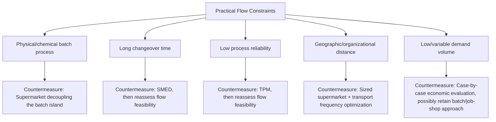

## Practical Constraints on Achieving True Flow

### Overview

Prior sections established one-piece flow as the preferred design target and detailed the mechanisms (supermarkets, FIFO lanes, synchronization, heijunka) used to approximate it where full continuous flow isn't immediately achievable. This section addresses, directly, *why* full one-piece flow across an entire value stream is rarely fully achieved in practice, and what specific categories of real-world constraint force the use of supermarkets, batching, or other flow compromises even in mature Lean implementations.

### Constraint 1: Process Technology and Physical Batch Requirements

Certain processes are physically or chemically constrained to operate on a batch basis regardless of downstream demand pattern, because the underlying technology itself processes multiple units simultaneously as a physical necessity rather than as a scheduling choice.

**Examples**:

- Heat treatment furnaces, which process an entire furnace load simultaneously due to thermal chamber economics
- Chemical or pharmaceutical batch reactors, where a minimum viable batch size is dictated by reaction chemistry or regulatory validation requirements
- Plating or coating baths, where per-unit processing would be economically or physically impractical relative to bath setup and chemistry stabilization time
- Injection molding, where a single mold cycle often produces multiple cavities' worth of parts simultaneously

[Inference] In these cases, one-piece flow is not simply difficult to achieve through better scheduling discipline — it is constrained by the physics or chemistry of the process itself. The Lean countermeasure in such cases is typically not to force single-unit flow through the batch process, but to treat the batch process as a defined "island," decoupled from surrounding one-piece-flow segments via a correctly sized supermarket, as covered in the earlier sections on supermarkets and future-state design.

### Constraint 2: Changeover Time (Absent SMED Investment)

As referenced across several prior sections, one-piece flow across multiple product variants at a single station requires changeover time low enough that switching between variants doesn't introduce meaningful delay. Where changeover time remains long (measured in tens of minutes or hours rather than single-digit minutes), running true mixed-model one-piece flow is not immediately achievable without first undertaking SMED (Single-Minute Exchange of Die) work.

**Key Points**

- This is a *removable* constraint in principle — SMED methodology exists specifically to reduce changeover time — but it typically requires dedicated kaizen investment before flow can be extended through that station
- Until changeover time is addressed, running smaller batches through such a station (rather than true single-unit flow) may represent the practically achievable interim state, sized to balance changeover overhead against the inventory cost of larger batches
- [Inference] This is a commonly cited example in Lean literature of how flow-design constraints and specific improvement methodologies (SMED) are interdependent — the future-state design questions (see the earlier section) explicitly include "what process improvements will be necessary" precisely because achieving the designed flow frequently depends on completing prerequisite capability work first, not merely on reconfiguring layout or signaling

### Constraint 3: Process Reliability and Uptime

One-piece flow structurally removes the inventory buffers that, in batch or supermarket-based systems, absorb the impact of an unreliable upstream process. Where a process has low uptime (frequent unplanned stoppages) or high defect variability, connecting it directly into a one-piece flow cell means that its instability propagates immediately and fully to every downstream station, halting the entire connected line rather than being absorbed locally.

[Inference] This is why Total Productive Maintenance (TPM) is frequently described in Lean literature as a prerequisite capability for extending one-piece flow, rather than an independent, unrelated initiative — a process whose reliability hasn't reached a sufficient threshold is often deliberately left buffered by a supermarket in the future-state design, with direct flow connection treated as a subsequent kaizen target once reliability improves, rather than attempted immediately.

### Constraint 4: Geographic and Organizational Distance

Continuous flow depends on physical or logical proximity between connected processes; where processes are separated by significant distance — a supplier in a different city or country, or even a different building within the same site — the transport time and logistics overhead involved make true one-piece flow impractical regardless of process capability.

**Common manifestations**:

- Overseas or distant domestic suppliers, where transport lead time alone (days to weeks) is incompatible with unit-by-unit flow, necessitating a supermarket sized to cover that lead time
- Multi-facility production, where intermediate goods must travel between plants before final assembly
- Outsourced sub-processes performed by a separate organization with its own scheduling constraints and physical location

[Inference] Extended/end-to-end value stream mapping (covered in an earlier section) is often specifically motivated by this constraint category — since geographic distance prevents flow-based connection, the relevant Lean design question shifts from "how do we achieve flow here" to "how do we minimize and stabilize the lead time and variability of the necessarily batched/transported connection," typically through supermarket sizing, transport frequency optimization, and information flow improvements (e.g., more frequent, smaller shipments) rather than flow conversion itself.

### Constraint 5: Demand Volume and Pattern

[Inference] Very low-volume, highly variable, or highly customized production may not economically justify a dedicated one-piece flow cell, since flow cells typically involve capital investment in cellular layout and cross-trained staffing that assumes a reasonably stable, repeatable volume to amortize that investment against. Extremely intermittent or one-off production runs may be more practically managed through other scheduling approaches (e.g., project-based or job-shop scheduling) even within an otherwise Lean-oriented facility, representing a case-by-case economic judgment rather than a fixed volume threshold below which flow is categorically inappropriate.

### Diagram: Constraint Categories and Their Typical Countermeasure (svg_diagram)

### The Practical Design Response: Selective Flow, Not Universal Flow

**Key Points**

- Future-state design (as covered in the earlier dedicated section) does not assume uniform one-piece flow is achievable across an entire value stream; it explicitly incorporates supermarkets and FIFO lanes precisely because certain links will remain constrained
- Constraints are categorized by whether they are **removable through kaizen investment** (changeover time via SMED, reliability via TPM) versus **structural** (batch process chemistry, geographic distance, which are unlikely to be eliminated through process improvement alone)
- Removable constraints typically appear as kaizen bursts on the future-state map, marking a planned future re-evaluation of flow feasibility at that link once the underlying capability improves
- Structural constraints are typically designed around permanently, with the supermarket or FIFO lane treated as the appropriate long-term solution rather than an interim state awaiting elimination

### Example: A Mixed-Constraint Value Stream

A consumer electronics assembly value stream includes: an overseas supplier for a key component (geographic constraint, addressed via a supermarket sized to cover ocean freight lead time plus safety stock); an internal wave soldering process with a 90-minute changeover between circuit board variants (a SMED-addressable constraint, currently managed via moderate batch sizing while a changeover reduction kaizen project is in progress); a final assembly and test sequence with high measured uptime and short, comparable cycle times across stations (converted to full one-piece flow in a dedicated cell); and a final packaging step shared with several other unrelated product lines in the facility (a low-relative-volume shared-resource constraint, managed via a scheduled, leveled time-slot allocation rather than dedicated flow).

This single value stream illustrates that a mature Lean implementation typically contains a deliberate mixture of true one-piece flow, FIFO lanes, and supermarkets side by side — the target is not uniform flow everywhere, but flow wherever genuinely achievable, with clearly identified, appropriately sized decoupling mechanisms at every point where a specific, named constraint currently prevents it.

### Common Misconceptions About Flow Constraints

- **Misconception**: A supermarket or batch step anywhere in the value stream represents unfinished or failed Lean implementation. In many cases it represents a correctly identified structural constraint, appropriately managed, rather than a gap awaiting elimination
- **Misconception**: All constraints are equally addressable through more kaizen effort. Structural constraints (batch chemistry, fixed geographic distance) do not respond to the same improvement methodologies that resolve changeover time or reliability constraints, and treating them identically risks misallocating improvement resources toward an unachievable goal
- **Misconception**: Achieving flow is purely a scheduling or layout decision. As this section demonstrates, flow feasibility is frequently gated by prerequisite technical capability (SMED, TPM) that must be developed before a flow redesign becomes practically achievable, not merely decided upon

**Related Topics**

- One-piece flow and continuous flow design
- SMED (Single-Minute Exchange of Die) methodology
- Total Productive Maintenance (TPM)
- The supermarket concept and sizing methodology
- Door-to-door versus extended, end-to-end value stream analysis
- Future-state map design and the eight future-state design questions