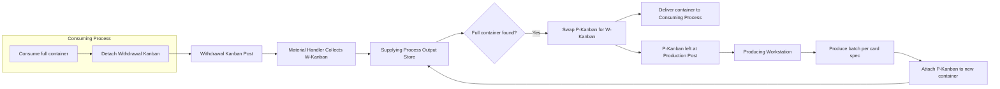

## Kanban Card Types of Production, Withdrawal, and Signal Kanban

### Overview

Kanban cards are the physical or electronic signaling devices that authorize and control the movement and production of materials within a pull system. In the Toyota Production System, three primary card types govern different aspects of material flow: production kanban (authorizes making parts), withdrawal kanban (authorizes moving parts), and signal kanban (authorizes production in batch/lot-based processes such as stamping or die-casting).

**Key Points**

- Kanban cards never authorize both production and movement simultaneously in the classic two-card system — this separation is deliberate and structural.
- No card, no production, no movement — this is the absolute rule underpinning kanban discipline.
- Cards represent standardized quantities, not arbitrary amounts.

### Production Kanban (P-Kanban)

#### Purpose and Function

A production kanban (also called an "in-process kanban" or "production-ordering kanban") authorizes an upstream process to produce a specific part in a specific quantity. It is the only legitimate trigger for a workstation to begin manufacturing.

#### Card Contents

A production kanban typically contains:

- Part number and part name
- Process/workstation that produces the part
- Container capacity (standard quantity per container)
- Storage/output location for the completed container
- Card issue number (e.g., "3 of 8")
- Preceding and succeeding process information
- Sometimes a lot size or changeover indicator

#### Mechanics of Use

1. A full container of parts sits in the outbound storage area of the producing process, with a production kanban attached.
2. When the downstream process withdraws that container (removing the withdrawal kanban and leaving the production kanban behind), the production kanban is placed in a collection post or board at the producing workstation.
3. The producing workstation treats accumulated production kanban cards as its work order queue — it produces exactly what the cards specify, in the order (typically FIFO) that they arrive.
4. Once the batch is produced and placed into a new container, the production kanban is reattached, and the container moves to the output storage location.

**Example**

A machining cell produces bracket P/N 4471-B in containers of 20 units. A production kanban for this part sits at the collection post. When the assembly line consumes a full container, the P-kanban returns to the machining cell's post, instructing the operator to machine another batch of 20 brackets. Only then does the operator proceed — never based on a schedule or forecast.

### Withdrawal Kanban (W-Kanban)

#### Purpose and Function

A withdrawal kanban (also called a "conveyance kanban" or "move kanban") authorizes the transport of a specific quantity of parts from one location (typically a supplying process's output store) to another (a consuming process's input point). It does not authorize production — only movement.

#### Card Contents

A withdrawal kanban typically contains:

- Part number and part name
- Container capacity
- Issuing (consuming) process/location
- Supplying (source) process/location
- Card issue number
- Route or conveyance path, in supermarket-style systems

#### Mechanics of Use

1. When a consuming process opens a new container of parts, it detaches the withdrawal kanban from the empty container and places it in a designated collection box.
2. A material handler (often called a "water spider" or *mizusumashi*) periodically collects withdrawal kanban cards and travels to the supplying process's storage area.
3. At the supplying location, the handler locates full containers of the specified part, exchanges the production kanban on each container for the withdrawal kanban, and returns the parts to the consuming process.
4. The removed production kanban is left behind at the supplying process to trigger replenishment production.

This card exchange is the mechanical heart of the two-card kanban system: withdrawal kanban circulate between the consuming process and the supplying process's store; production kanban circulate between that store and the supplying process itself.

**Example**

An assembly station withdraws a full bin of wire harnesses. The W-kanban rides with the handler to the harness sub-assembly area's supermarket, swaps for the P-kanban on a full bin there, and the bin is delivered back. The P-kanban left behind now queues up another harness production run.

### Signal Kanban (Triangle Kanban)

#### Purpose and Function

A signal kanban (also called a "triangle kanban" or "lot-size kanban," from its traditional triangular physical shape) is a specialized form of production kanban used for processes where changeover times or economic lot sizes make single-piece or small-lot triggering impractical — such as stamping presses, injection molding, or heat-treatment furnaces. Rather than triggering production continuously, the signal kanban triggers production only when inventory reaches a predetermined reorder point.

#### Key Distinguishing Characteristic

Unlike standard production kanban, which are attached to every container, a signal kanban is placed at a specific point within a stack or line of stored containers — the **reorder point** — representing the trigger inventory level. Production is not initiated card-by-card but rather when consumption exposes the card at that predetermined level.

#### Card Contents

A signal kanban typically specifies:

- Part number and name
- Trigger quantity (reorder point) — the inventory level at which the card becomes visible/active
- Lot size to produce once triggered (often larger than the trigger quantity, based on setup/changeover economics)
- Producing process

#### Mechanics of Use

1. Containers of a part are stacked in sequence in a storage location.
2. The signal kanban card is inserted at a specific container in the stack — for example, the container that represents the reorder point (e.g., when 5 containers remain out of 20).
3. As downstream consumption depletes the stack, when the signal kanban's container is reached (i.e., about to be withdrawn), the card is pulled and delivered to the producing process.
4. The producing process is now authorized to run a full production lot — sized to balance changeover cost against inventory carrying cost — replenishing the stack.

Two sub-types are commonly used:

- **Reorder-point (triangle) kanban**: triggers production of a fixed lot size once the trigger point is reached — most common for press/stamping operations.
- **Material-requirement (production-ordering) signal kanban**: used similarly but tied more directly to sequenced material requirements in some implementations.

**Example**

A stamping press produces door panels in lots of 500 due to a 45-minute die-change time. A triangular signal kanban is placed at the 100-unit mark in the panel storage rack. As panels are consumed by downstream assembly, when the stack is drawn down to the marked container, the signal kanban is pulled and sent to the press operator, authorizing a new run of 500 panels. This decouples the press's economically necessary batch size from the downstream process's smaller, continuous consumption rate.

### Comparative Summary

| Card Type | Authorizes | Trigger Mechanism | Typical Use Case |
| --- | --- | --- | --- |
| Production Kanban | Manufacturing a part | One card per container consumed | General fabrication/assembly cells |
| Withdrawal Kanban | Moving a part | One card per container consumed | Inter-process or supplier conveyance |
| Signal Kanban | Manufacturing a lot | Reorder point reached in a stored stack | High changeover-time processes (stamping, molding, casting) |

### Card Flow Diagram

### Signal Kanban Trigger Point Illustration (svg_diagram)

<svg xmlns="http://www.w3.org/2000/svg" viewBox="0 0 480 220">
<text x="240" y="20" text-anchor="middle" font-size="14" font-weight="bold">Signal Kanban Trigger Point (svg_diagram)</text>
<rect x="40" y="40" width="40" height="140" fill="none" stroke="black" stroke-width="1.5" />
<line x1="40" y1="60" x2="80" y2="60" stroke="black" />
<line x1="40" y1="80" x2="80" y2="80" stroke="black" />
<line x1="40" y1="100" x2="80" y2="100" stroke="black" />
<line x1="40" y1="120" x2="80" y2="120" stroke="black" />
<line x1="40" y1="140" x2="80" y2="140" stroke="black" />
<line x1="40" y1="160" x2="80" y2="160" stroke="black" />
<text x="20" y="185" font-size="10">Full stack</text>
<polygon points="90,135 110,135 100,155" fill="orange" stroke="black" />
<text x="115" y="150" font-size="11">Signal Kanban (trigger point)</text>
<line x1="150" y1="145" x2="220" y2="145" stroke="black" stroke-dasharray="4,2" />
<polygon points="220,140 230,145 220,150" fill="black" />
<rect x="235" y="110" width="90" height="70" fill="none" stroke="black" stroke-width="1.5" />
<text x="280" y="100" text-anchor="middle" font-size="11">Producing Process</text>
<text x="280" y="150" text-anchor="middle" font-size="10">Press / Mold /</text>
<text x="280" y="165" text-anchor="middle" font-size="10">Furnace</text>
<line x1="325" y1="145" x2="400" y2="145" stroke="black" stroke-dasharray="4,2" />
<polygon points="400,140 410,145 400,150" fill="black" />
<text x="440" y="150" text-anchor="middle" font-size="10">New lot</text>
<text x="440" y="163" text-anchor="middle" font-size="10">(size = economic</text>
<text x="440" y="176" text-anchor="middle" font-size="10">changeover qty)</text>
</svg>

### Design Considerations and Common Pitfalls

- **[Inference]** The number of production and withdrawal kanban in circulation is typically calculated using a formula analogous to: $N = \frac{D \times L \times (1 + S)}{C}$, where $D$ is average demand rate, $L$ is total lead time, $S$ is a safety factor, and $C$ is container capacity. Exact formula variants differ by implementation.
- Card loss or damage disrupts the entire signaling loop; many operations mitigate this with laminated cards, RFID tags, or electronic kanban (e-kanban) systems.
- Signal kanban sizing requires careful balance: too high a trigger point increases carrying inventory; too low risks stockout during the changeover/run cycle.
- Mixing card types incorrectly (e.g., treating a withdrawal kanban as authorization to produce) breaks the pull discipline and can reintroduce push-style overproduction.
- Electronic kanban systems replace the physical card with digital signals but must preserve the same authorization logic to remain a true pull system.

**Next Steps**

- Kanban calculation formulas and safety stock sizing
- Supermarket design and two-bin systems
- Material handler (*mizusumashi*) route design
- Electronic kanban (e-kanban) system architecture
- Heijunka (production leveling) and its interaction with signal kanban lot sizes
- CONWIP systems as an alternative to card-based kanban