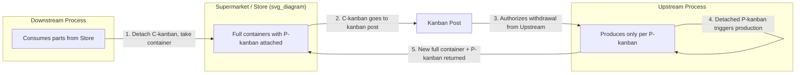

## Kanban Rules and Operating Principles

### Overview

Kanban is a pull-based scheduling and inventory-control mechanism developed within the Toyota Production System (TPS) to regulate the flow of materials and information between processes. The word kanban (看板) translates roughly to "signboard" or "visual card." Its purpose is to authorize and control production and withdrawal strictly according to actual downstream consumption, thereby eliminating overproduction — the most damaging of the seven wastes (muda) identified by Taiichi Ohno.

Kanban is not a scheduling algorithm in the computational sense; it is a physical (or digital) signaling protocol that decentralizes production instructions to the shop floor, replacing centralized push-based forecasting (MRP-style "push" scheduling) with localized, self-regulating pull loops.

### The Six Rules of Kanban (Toyota's Canonical Formulation)

Toyota formalized six rules governing kanban operation. These rules are not optional guidelines — the system's integrity as a control mechanism depends on strict adherence.

**Rule 1: The subsequent (downstream) process withdraws items from the preceding (upstream) process only in the quantity specified by the kanban.**

- No withdrawal is permitted without a kanban.
- No withdrawal may exceed the quantity indicated on the kanban.
- A kanban must always be physically attached to the item being withdrawn.

**Rule 2: The preceding process produces items only in the quantity and sequence specified by the kanban.**

- Overproduction beyond kanban authorization is prohibited, even if capacity is available.
- Production must occur in the order kanbans arrive (typically FIFO at the production kanban post).

**Rule 3: No items are produced or transported without a kanban.**

- This is the enforcement mechanism for Rules 1 and 2. Absence of a kanban is itself the "stop" signal.

**Rule 4: A kanban must always be attached to the physical product.**

- The card and the material it authorizes are inseparable while in transit or in a store (buffer). This ties the information flow directly to the physical flow, preventing information from outrunning material reality (a key failure mode of MRP-style push systems).

**Rule 5: Defective products are not sent to the subsequent process.**

- Kanban assumes 100% good parts move downstream. Any defect must be stopped and corrected at the source (a manifestation of jidoka), because the pull system has no mechanism to compensate for rework once material has moved to the next stage.

**Rule 6: Reduce the number of kanbans over time.**

- The kanban count is a proxy for inventory level and, indirectly, for the total *waste tolerance* of the system. Systematically reducing kanban count exposes hidden problems (the classic "lowering the water level to expose the rocks" metaphor) and drives continuous improvement (kaizen).

### Operating Principles Underlying the Rules

**Pull, Not Push**

Production is triggered only by actual consumption downstream, not by forecast or schedule. This principle inverts the traditional MRP logic: instead of pushing materials based on a predicted demand plan, each process "pulls" only what the next process has just used.

**Just-in-Time (JIT) Synchronization**

Kanban is the operational mechanism that implements JIT: the right part, in the right quantity, at the right time. It links every workstation into a single, self-regulating chain governed by actual takt (the rate of customer demand).

**Visual Control (Andon-Adjacent Principle)**

Kanban cards make the state of work-in-process (WIP) visible at a glance. An empty kanban post signals depletion; a full post signals oversupply. This is part of the broader TPS commitment to *mieruka* (visualization) as a management tool, allowing abnormalities to be seen and addressed immediately rather than hidden in paperwork or ERP systems.

**Decentralization of Control**

Authority to produce is delegated to the point of use rather than dictated from a centralized planning department. This reduces the information lag and distortion inherent in long, centrally-scheduled supply chains (related to the *bullwhip effect* studied in supply chain theory: small demand fluctuations amplify as they propagate upstream through forecast-driven systems — kanban dampens this by keeping every loop local and demand-actual).

**Self-Limiting Inventory**

Because the number of kanban cards in circulation is fixed, total WIP in a loop is mathematically bounded. This is what differentiates kanban from a generic "reorder point" system — it caps inventory structurally, not just procedurally.

### Types of Kanban

| Type | Function |
| --- | --- |
| **Production Kanban (P-kanban)** | Authorizes a process to produce a specific part in a specific quantity |
| **Withdrawal/Conveyance Kanban (C-kanban)** | Authorizes movement of a specific quantity of parts from a supplying process/store to a consuming process |
| **Signal Kanban (triangle kanban)** | Used for batch/lot processes (e.g., stamping, molding) where setup times make single-piece kanban impractical; triggers production only when stock hits a reorder trigger point |
| **Supplier Kanban** | Extends the pull signal to external suppliers, synchronizing outside deliveries with internal consumption |
| **Through Kanban** | Combines production and withdrawal functions across two processes with no intermediate store |
| **Express/Emergency Kanban** | Issued only for genuine abnormal conditions (defect replacement, unexpected demand spike); its use is tracked and audited because frequent use indicates a systemic problem requiring root-cause correction |

### Kanban Card Contents (Standard Data Fields)

A physical kanban card conventionally carries:

- Part number and part name
- Preceding process (where it's made) and subsequent process (where it's consumed)
- Container/lot quantity
- Card sequence number (e.g., "3 of 8")
- Storage location (address in the supermarket/store)
- Kanban type (production or withdrawal)

### The Kanban Formula (Sizing the Loop)

The number of kanban cards circulating in a loop is calculated to hold just enough inventory to cover demand during the replenishment lead time, plus a safety margin:

$$N = \frac{D \times L \times (1 + S)}{C}$$

Where:

- $N$ = number of kanban cards
- $D$ = average demand rate per unit time (e.g., units/hour)
- $L$ = replenishment lead time (time to produce and deliver one container)
- $S$ = safety factor (expressed as a decimal, e.g., 0.1 for 10%)
- $C$ = container capacity (units per kanban/container)

**Example:**

A downstream line consumes 120 units/hour of a component ($D = 120$). The upstream cell's total replenishment lead time (wait + process + move) is 0.5 hours ($L = 0.5$). Management sets a 20% safety factor ($S = 0.2$) to absorb minor variability. Each container holds 10 units ($C = 10$).

$$N = \frac{120 \times 0.5 \times 1.2}{10} = \frac{72}{10} = 7.2 \rightarrow 8 \text{ kanbans}$$

Eight kanban cards (and their associated containers) are authorized to circulate in this loop. Per Rule 6, as the process stabilizes and lead time or variability shrinks, this count should be deliberately reduced — each card removed forces the team to solve the next bottleneck it exposes.

### Kanban Loop Flow (Diagram)

### Kanban Post / Card Cycle (Visual Signal Flow)

<svg xmlns="http://www.w3.org/2000/svg" viewBox="0 0 700 260" font-family="sans-serif">
<text x="350" y="24" text-anchor="middle" font-size="16" font-weight="bold">Kanban Card Circulation Cycle (svg_diagram)</text>
<rect x="20" y="60" width="150" height="80" rx="6" fill="#e8f0fe" stroke="#3b5bdb" stroke-width="1.5" />
<text x="95" y="95" text-anchor="middle" font-size="12">Upstream</text>
<text x="95" y="112" text-anchor="middle" font-size="12">Process</text>
<rect x="270" y="60" width="150" height="80" rx="6" fill="#eafaf1" stroke="#2f9e44" stroke-width="1.5" />
<text x="345" y="95" text-anchor="middle" font-size="12">Store</text>
<text x="345" y="112" text-anchor="middle" font-size="12">(Kanban Post)</text>
<rect x="520" y="60" width="150" height="80" rx="6" fill="#fff4e6" stroke="#e8590c" stroke-width="1.5" />
<text x="595" y="95" text-anchor="middle" font-size="12">Downstream</text>
<text x="595" y="112" text-anchor="middle" font-size="12">Process</text>
<line x1="170" y1="100" x2="265" y2="100" stroke="#333" stroke-width="1.5" marker-end="url(#arrow)" />
<text x="217" y="90" text-anchor="middle" font-size="10">full container + P-kanban</text>
<line x1="420" y1="130" x2="270" y2="130" stroke="#333" stroke-width="1.5" marker-end="url(#arrow)" />
<text x="345" y="150" text-anchor="middle" font-size="10">P-kanban returns (empty)</text>
<line x1="520" y1="100" x2="425" y2="100" stroke="#333" stroke-width="1.5" marker-end="url(#arrow)" />
<text x="472" y="90" text-anchor="middle" font-size="10">container withdrawn</text>
<line x1="670" y1="130" x2="425" y2="130" stroke="#333" stroke-width="1.5" marker-end="url(#arrow)" />
<text x="547" y="150" text-anchor="middle" font-size="10">C-kanban detached, sent to post</text>

<text x="350" y="200" text-anchor="middle" font-size="11" fill="#555">Only an empty kanban post triggers new production (Rule 3)</text>

<text x="350" y="220" text-anchor="middle" font-size="11" fill="#555">Card is never separated from its container while in transit (Rule 4)</text>

</svg>

### Preconditions for a Functioning Kanban System

Kanban is a *control* mechanism, not a *fixer* of unstable processes. Toyota's own literature is explicit that certain conditions must exist before kanban can be deployed effectively:

- **Leveled production (heijunka):** Kanban assumes relatively stable, mixed-model demand at the pull point; large volume/mix swings overwhelm a simple card-count system.
- **Small lot sizes:** Kanban's efficiency depends on quick, frequent replenishment cycles, which in turn depend on short setup/changeover times (SMED).
- **Standardized work:** Predictable cycle times at each station are required to make lead time ($L$ in the formula above) a meaningful, stable quantity.
- **High quality at the source:** Since defective parts cannot be passed downstream (Rule 5), processes feeding a kanban loop need a baseline of process capability and built-in quality checks (poka-yoke, jidoka).
- **Layout enabling short, reliable transport:** Excessive distance or unreliable material handling introduces lead-time variability that the safety factor $S$ must otherwise absorb with more inventory — defeating the purpose.

[Inference] In practice, organizations that introduce kanban onto an unstable, high-variability process without first addressing these preconditions typically see the system either stall (frequent stockouts) or silently accumulate excess WIP as operators informally circumvent the card discipline; this outcome is not guaranteed and depends heavily on specific process variability and management discipline.

### Common Misapplications

- **Treating kanban as a scheduling tool for unique/one-off jobs.** Kanban is designed for repetitive, relatively stable-demand items; make-to-order or highly custom production is generally not compatible with fixed-card-count kanban loops.
- **Using kanban to mask instability.** Adding more cards when a loop keeps running short treats a symptom, not the cause; Rule 6 explicitly points the opposite direction — reduce cards to expose and force resolution of the underlying problem.
- **Digital kanban boards without pull discipline.** Software (e.g., electronic kanban/e-kanban systems) can replicate the card mechanism, but if withdrawal limits and production authorization rules aren't enforced in the tool's logic, it becomes a visual to-do list rather than a genuine pull-control system.
- **Confusing shop-floor kanban with the "Kanban Method" in software/knowledge work.** The latter (popularized by David J. Anderson) borrows the pull/visualization concepts but adapts them for non-repetitive, variable-duration knowledge work; the strict six-rule discipline above applies to physical/manufacturing kanban as codified by Toyota.

### Related Topics

- Heijunka (production leveling) as a kanban precondition
- Single-Minute Exchange of Die (SMED) and its role in enabling small-lot kanban
- Supermarket (store) design and two-bin/min-max replenishment systems
- Signal (triangle) kanban sizing for batch processes
- Electronic kanban (e-kanban) system architecture
- Jidoka and poka-yoke as quality gates within a kanban loop
- Value stream mapping and identifying kanban loop boundaries