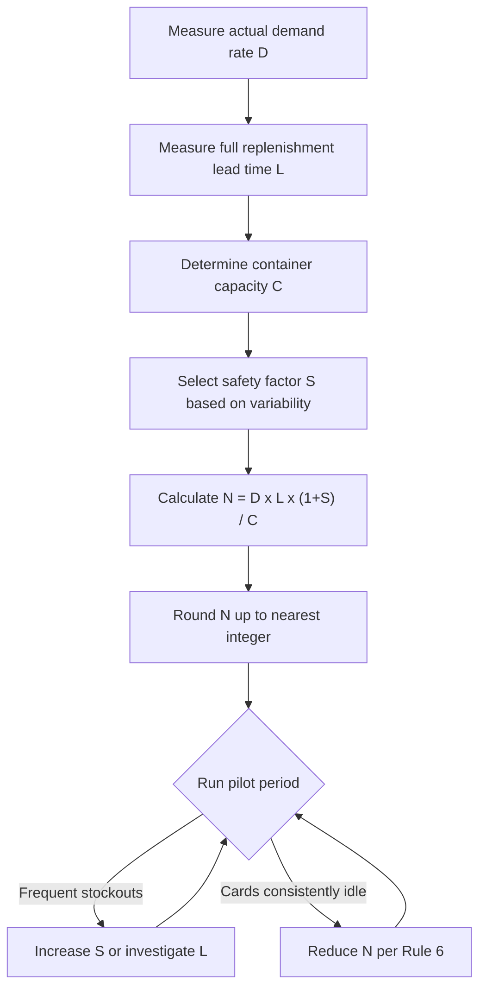

## Calculating the Number of Kanban Cards Required

### Overview

The number of kanban cards circulating within a loop determines the maximum work-in-process (WIP) inventory permitted between a supplying process and a consuming process. Because each card authorizes exactly one container of parts, the total card count is a direct, structural cap on inventory — not a target to be estimated loosely, but a calculated parameter derived from demand rate, replenishment lead time, container size, and a deliberate safety allowance.

Card count is not a "set once" figure. Per the sixth rule of kanban, it is expected to be recalculated and systematically reduced as process stability improves, making the calculation itself a recurring kaizen activity rather than a one-time setup task.

### The Core Kanban Formula

$$N = \frac{D \times L \times (1 + S)}{C}$$

Where:

- $N$ = number of kanban cards (rounded up to the nearest whole number)
- $D$ = average demand rate, expressed in the same time unit as $L$ (e.g., units/hour, units/shift, units/day)
- $L$ = replenishment lead time — the total elapsed time from the moment a kanban is issued to the moment the replenished container is back in the store, ready for use
- $S$ = safety factor (decimal form, e.g., 0.15 for 15%), covering demand variability, process variability, and unplanned downtime
- $C$ = container (standard quantity) capacity — the fixed number of units held per kanban/container

Because $N$ represents physical containers, the result is always rounded **up** to the nearest integer; a fractional card cannot exist.

### Breaking Down Each Variable

**Demand rate ($D$)**

This should reflect actual, observed customer takt or pull rate — not a forecast. It is typically derived from:

$$D = \frac{\text{Total demand over period}}{\text{Available production time over period}}$$

In highly seasonal or promotional environments, $D$ should be based on the peak sustained rate the loop must support, not an average that would starve the line during demand spikes.

**Replenishment lead time ($L$)**

$L$ is the sum of every time component between kanban issuance and container return to the store:

$$L = T_{wait} + T_{setup} + T_{process} + T_{move} + T_{queue}$$

- $T_{wait}$ — time the kanban waits at the post before production starts
- $T_{setup}$ — changeover/setup time if the upstream process is shared across multiple part numbers
- $T_{process}$ — actual run time to produce one container's worth of parts
- $T_{move}$ — transport time from producing process to store
- $T_{queue}$ — any queuing delay at shared resources

**Safety factor ($S$)**

$S$ is a policy decision, not a measured constant — typically set between 10% and 30% depending on:

- Demand variability (coefficient of variation of $D$)
- Process reliability (frequency/duration of unplanned stops)
- Supplier or upstream process consistency

A higher $S$ buys resilience against stockouts but directly inflates WIP; this is the primary lever management tunes when balancing service level against inventory carrying cost.

**Container capacity ($C$)**

Set by packaging standards, ergonomic handling limits, or the standard container (tote, pallet, rack) already in use on the line. Smaller $C$ generally allows finer-grained pull signals (closer to one-piece flow) but increases the number of cards and handling transactions.

### Worked Example 1: Single-Item Steady Demand

A machining cell supplies a downstream assembly line with a bracket.

- Downstream consumption: 300 units per 8-hour shift → $D = 37.5$ units/hour
- Total replenishment lead time (wait + machine cycle for a batch of 25 + move): $L = 0.6$ hours
- Safety factor: $S = 0.20$ (20%, due to moderate demand variability)
- Container size: $C = 25$ units

$$N = \frac{37.5 \times 0.6 \times 1.20}{25} = \frac{27}{25} = 1.08 \rightarrow 2 \text{ kanbans}$$

**Result:** 2 kanban cards (2 containers, 50 units of WIP cap) are authorized in this loop.

### Worked Example 2: High-Variability Environment

A stamping press supplies four different part numbers on a shared changeover cycle to a welding line.

- Consumption rate for Part A: $D = 80$ units/hour
- Total lead time including changeover wait (press runs a 4-part sequence, so $T_{wait}$ includes time waiting behind 3 other parts): $L = 1.5$ hours
- Safety factor: $S = 0.30$ (higher, due to shared-resource contention and changeover variability)
- Container size: $C = 40$ units

$$N = \frac{80 \times 1.5 \times 1.30}{40} = \frac{156}{40} = 3.9 \rightarrow 4 \text{ kanbans}$$

**Result:** 4 kanban cards. Note how the shared-resource lead time ($L$) and elevated safety factor ($S$) — both driven by the changeover sequence — substantially increase card count relative to Example 1, despite a similar container size. This is precisely why signal (triangle) kanban and SMED-driven changeover reduction are closely linked to card-count minimization in batch environments.

### Alternative Formulation: Two-Bin / Min-Max Systems

For simpler loops, some practitioners express the same relationship using inventory min/max levels rather than a card-count formula, then back-calculate cards:

$$\text{Buffer Stock} = D \times L \times (1 + S)$$

$$N = \left\lceil \frac{\text{Buffer Stock}}{C} \right\rceil$$

This is mathematically identical to the primary formula; it is simply expressed as "how much total inventory do we need to cover the loop" before dividing by container size to get card count.

### Sensitivity of Card Count to Each Variable

| Variable | Effect of Increase on $N$ | Typical Improvement Lever |
| --- | --- | --- |
| Demand rate ($D$) | Increases $N$ proportionally | Rarely controllable; drives capacity planning instead |
| Lead time ($L$) | Increases $N$ proportionally | SMED, layout redesign, reducing queue time |
| Safety factor ($S$) | Increases $N$ proportionally | Improving process reliability (OEE), demand smoothing (heijunka) |
| Container size ($C$) | Decreases $N$ (inverse) | Smaller containers reduce WIP volume but raise transaction/handling frequency |

[Inference] Because $L$ and $S$ enter the formula multiplicatively while $C$ enters as a divisor, in most real shop-floor loops the fastest way to reduce card count — and therefore WIP — is attacking lead time (via setup reduction or layout changes) rather than shrinking container size, since container size reductions are usually bounded by handling and packaging practicalities; the relative impact will vary by specific process constraints.

### Kanban Sizing Decision Flow

### Recalculation Triggers

The card count should be recalculated whenever any of the following change materially:

- Demand rate shifts (new product mix, seasonal change, volume ramp)
- Lead time changes (equipment upgrade, layout move, SMED improvement, new supplier)
- Container/packaging standard changes
- A sustained pattern of stockouts or excess idle cards is observed during regular kanban post audits

### Practical Cautions

- **Do not average away peak demand.** Sizing $D$ on a long-run average understates the peaks the loop must actually survive; use the sustained peak rate for the planning horizon in question, or explicitly build peak coverage into $S$.
- **Lead time must be measured, not assumed.** A common error is using nominal/rated process cycle time for $T_{process}$ instead of observed cycle time including minor stops; this systematically undersizes $N$ and causes chronic understock. [Behavioral characteristics of a specific line may vary; validate $L$ empirically before finalizing $N$.]
- **Rounding direction matters.** Always round up — rounding down converts a controlled buffer into a system that starts every cycle already short.
- **Card count is a WIP cap, not a WIP target.** A correctly sized system should have cards occasionally sitting empty at the post; a system where every card is perpetually in use with no slack indicates $N$ is undersized relative to actual variability.

### Related Topics

- The six rules of kanban and their operating principles
- Signal (triangle) kanban sizing for batch/changeover processes
- SMED (Single-Minute Exchange of Die) as a lead-time reduction lever
- Heijunka (production leveling) and its effect on demand variability ($S$)
- Supermarket (store) design and reorder point systems
- Value stream mapping for identifying and measuring $L$ across a loop
- Continuous kanban reduction as a kaizen practice (Rule 6 in operation)