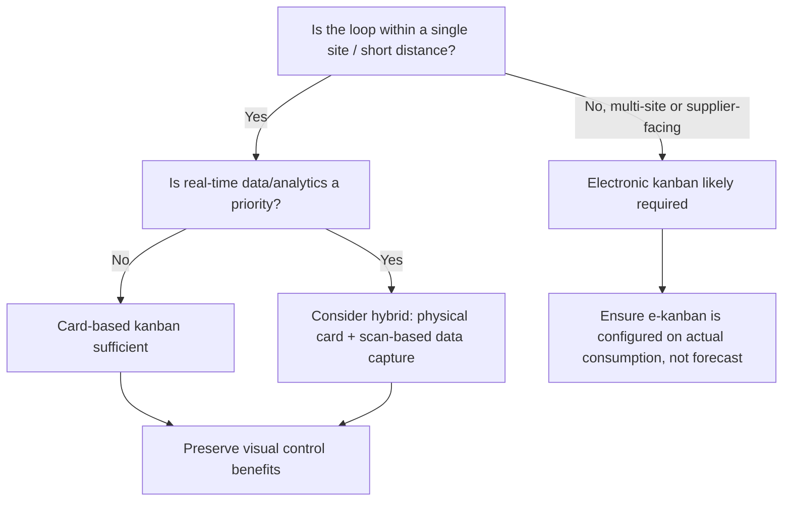

## Electronic Kanban versus Card Based Kanban

### Overview

Both electronic kanban (e-kanban) and traditional card-based (paper) kanban implement the same six underlying rules of the kanban system: pull-only production, quantity limits, kanban-attached transport, zero-defect forwarding, and progressive card-count reduction. The distinction is purely in the *medium* carrying the signal — a physical card versus a digital record transmitted through barcode scans, RFID, or software systems. Choosing between them is an implementation decision, not a change to kanban's operating principles.

### Card-Based (Paper/Physical) Kanban

**Mechanism**

A physical card (or equivalent token — a marked bin, a golf ball, a colored tag) is attached to a container. Withdrawal or production authorization occurs entirely through the physical presence or absence of that card at a kanban post.

**Characteristics**

- Zero dependency on IT infrastructure, network uptime, or software licensing
- Instantly and universally visible on the shop floor — anyone walking past a post can assess system state
- Extremely low cost to implement and modify
- Self-enforcing by physical constraint: a card literally cannot exist in two places at once, and a container cannot move without one (Rule 4 is mechanically guaranteed)

**Limitations**

- Cards can be lost, damaged, or mispackaged, silently breaking the loop's card count integrity
- No automatic data trail; consumption history, cycle counts, and lead-time data must be gathered manually
- Difficult to scale across multi-site or multi-tier supply chains where the physical card would need to travel long distances
- Card count changes (per Rule 6) require manually printing, laminating, and physically redistributing cards
- No real-time visibility for planners or management not physically on the floor

### Electronic Kanban (e-Kanban)

**Mechanism**

The kanban signal is represented as an electronic transaction rather than a physical card. Depending on implementation, the signal can be triggered by:

- Barcode/QR code scan at consumption point
- RFID tag read as a container passes a fixed reader
- Manual entry or button-press in an MES/ERP interface
- Automatic threshold trigger from inventory management software (e.g., when on-hand quantity crosses a reorder point)

The system then transmits the equivalent of a production or withdrawal authorization to the supplying process — often displayed on a shop-floor monitor, printed as a pick ticket, or routed directly into a supplier's order system (supplier e-kanban / VMI integration).

**Characteristics**

- Real-time visibility of kanban status across an entire facility or multi-site network, accessible to planners without floor presence
- Automatic data capture: consumption rates, lead times, and stockout/overage events are logged for analysis without manual effort
- Enables faster card-count adjustment (Rule 6) — parameters can be changed in software rather than reprinting physical cards
- Extends pull signals across long-distance or multi-tier supply chains (e.g., signaling an overseas supplier in real time) where physical card circulation would be impractical
- Reduces card-loss risk, since the "card" is a database record rather than a physical object

**Limitations**

- Dependent on IT infrastructure; network outages, software bugs, or scanner failures can halt production authorization
- Higher implementation and maintenance cost (hardware, software licensing, integration with MES/ERP/WMS)
- Loses the "walk the floor and see the actual state" transparency that a physical card system provides inherently — a screen must be actively checked
- If poorly configured, e-kanban systems can silently become "digital MRP" — generating replenishment signals from forecasts or reorder points rather than genuine consumption-based pull, defeating the core pull principle
- Requires discipline to avoid over-automation eroding the visual-control (mieruka) benefit central to TPS

### Side-by-Side Comparison

| Dimension | Card-Based Kanban | Electronic Kanban |
| --- | --- | --- |
| Signal medium | Physical card/token | Digital record (scan, RFID, software entry) |
| Visibility | Immediate, floor-level, no login required | Requires screen/dashboard access |
| Infrastructure dependency | None | Network, scanners/readers, software uptime |
| Data capture | Manual | Automatic (consumption, lead time, exceptions) |
| Card-count change (Rule 6) | Physical reprint/redistribution | Parameter change in software |
| Loss/damage risk | Card can be lost or destroyed | Low (digital record persists) |
| Scalability across distance | Poor beyond a single site | Strong (multi-site, multi-tier supply chain) |
| Cost to implement | Low | Moderate to high |
| Risk of defeating pull principle | Low (physical constraint enforces Rule 3) | Higher if configured around forecasts rather than actual consumption |
| Integration with ERP/MES | None (standalone) | Native |

### Hybrid Approaches

Many mature TPS implementations use a hybrid model:

- Physical cards remain in use on the shop floor for local, single-site loops between adjacent processes, preserving visual control and low-tech resilience.
- Electronic kanban is layered on top for cross-site, cross-facility, or supplier-facing loops, where distance makes physical card circulation infeasible.
- Barcode/RFID scanning can digitize a physical card's movement for data-collection purposes (recording cycle times, consumption patterns) while the card itself remains the operational, floor-level authorization mechanism — this preserves Rule 4's physical card-to-container binding while adding an analytics layer.

### Selecting Between the Two: Decision Factors

### Common Pitfalls When Migrating from Card-Based to Electronic

- **Losing floor-level visual control.** Replacing a physical post that operators glance at with a screen buried in a software menu removes the ambient visibility that made problems self-evident; effective e-kanban implementations typically retain large visible andon-style displays at the point of use.
- **Reintroducing push logic under a "kanban" label.** If the electronic trigger is tied to a forecasted reorder point rather than an actual downstream withdrawal event, the system functions as a min-max replenishment system, not a true kanban pull loop — the label changes but Rule 1 is violated in substance.
- **Underestimating change management.** Operators accustomed to a tangible card may distrust or bypass a digital signal, especially during outages; a fallback manual/paper process is generally maintained for system downtime in mature e-kanban deployments. [Inference: the specific fallback approach and its necessity vary by organization and criticality of the line in question.]
- **Over-engineering simple loops.** Not every loop benefits from digitization; adding IT dependency to a stable, low-variability, single-site loop can introduce fragility without a corresponding data or scalability benefit.

### Related Topics

- The six rules of kanban and their operating principles
- Calculating the number of kanban cards required
- Signal (triangle) kanban for batch processes
- Supplier kanban and VMI (Vendor-Managed Inventory) integration
- Visual control (mieruka) and andon systems in TPS
- MES/ERP integration patterns for shop-floor pull systems
- Barcode and RFID data capture in lean manufacturing environments