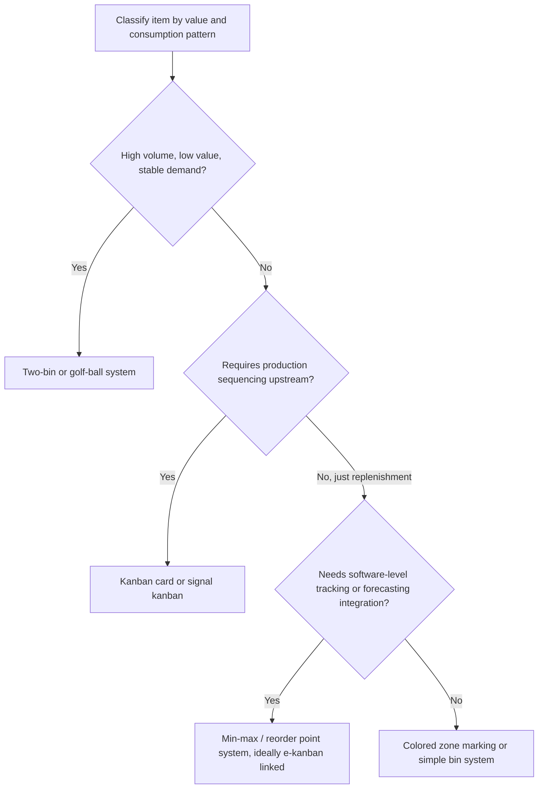

## Two Bin and Other Visual Replenishment Systems

### Overview

Visual replenishment systems are inventory control mechanisms that use physical or spatial cues — rather than paperwork, transactions, or planner intervention — to signal when and how much to reorder or produce. They implement the same pull philosophy as kanban but often with simpler, lower-overhead signaling mechanisms suited to high-volume, low-value, or non-critical items (commonly C-class items in ABC inventory classification). The two-bin system is the most widely used example, but several related visual mechanisms share the same underlying logic.

### The Two-Bin System

**Mechanism**

Inventory for a given part is split across two identical bins (or a single bin with a physical divider). Only one bin is drawn from at a time:

1. Bin A is used first, consumed unit by unit.
2. When Bin A is empty, it is pulled and sent for replenishment (refilled or reordered); Bin B is opened and consumption continues from it.
3. Bin A returns, full, and takes its place in the queue; Bin B is used next once emptied.

The act of *emptying a bin* is itself the reorder signal — no card, scan, or calculation is needed at the point of consumption.

**Sizing Logic**

Each bin must hold enough stock to cover consumption during the replenishment lead time, plus a safety margin — structurally identical to the kanban sizing formula, but expressed per bin rather than per card:

$$\text{Bin Quantity} = D \times L \times (1 + S)$$

Where $D$ = demand rate, $L$ = replenishment lead time, $S$ = safety factor. Two bins of this size in rotation ensure that while one bin is being replenished, the other covers demand for the full lead time.

**Worked Example**

A fastener used in assembly is consumed at $D = 500$ units/day. Replenishment lead time from the supplier is $L = 3$ days. A safety factor of $S = 0.25$ is applied to absorb supplier variability.

$$\text{Bin Quantity} = 500 \times 3 \times 1.25 = 1{,}875 \text{ units per bin}$$

Each bin is sized to hold approximately 1,875 units (rounded to a standard container size, e.g., 2,000), giving roughly 4 days of coverage per bin against a 3-day lead time.

**Advantages**

- Extremely simple to operate — no scanning, no card management, no calculation at the point of use
- Ideal for high-volume, low-cost items (fasteners, fittings, small hardware) where the transaction cost of a formal kanban card system would exceed the value of the tighter control it provides
- Self-evident visual state — an empty bin is unambiguous

**Limitations**

- Coarse-grained: only two discrete states exist (bin full / bin empty), offering less resolution than a multi-card kanban loop
- Less suited to items with highly variable or spiky demand, since there is no intermediate signal between "plenty of stock" and "reorder now"
- Not naturally extensible to production authorization sequencing the way a kanban card is (two-bin systems are almost exclusively used for withdrawal/replenishment, not shop-floor production sequencing)

### Min-Max (Reorder Point) Systems

**Mechanism**

Stock is replenished whenever the on-hand quantity drops to a predefined minimum ("reorder point"), and replenishment brings it back up to a predefined maximum. This can be implemented visually (a marked line on a bin or shelf) or via software (ERP/WMS threshold alert).

$$\text{Reorder Point} = D \times L + \text{Safety Stock}$$

**Relationship to Kanban**

Min-max is a superset concept; kanban and two-bin systems are specific, disciplined implementations of min-max logic. The key distinction is that min-max, especially when software-driven, is more prone to being triggered by *forecasted* consumption rather than *actual* withdrawal — which, if left unchecked, drifts the system back toward push-based MRP logic rather than genuine pull.

### Golf Ball / Marble Systems

**Mechanism**

A colored ball (or marble, chip, or token) is placed in a tube or bin at the reorder trigger point in the stock. As inventory is consumed, the ball is eventually exposed or drops into a collection point, visually and mechanically signaling that replenishment is due. Common in high-volume small-parts bins on assembly lines.

**Characteristics**

- Functions as a physical realization of a reorder point, similar in spirit to signal (triangle) kanban but requiring no printed card
- Well suited to gravity-fed or first-in-first-out bins

### Colored Zone / Line Marking Systems

**Mechanism**

Bins or shelves are marked with colored zones (e.g., green/yellow/red) indicating stock status at a glance:

- **Green zone:** ample stock, no action needed
- **Yellow zone:** approaching reorder point, prepare replenishment
- **Red zone:** at or below reorder point, replenish immediately

This is a direct visual-control (mieruka) analog to a traffic-light andon signal, applied to inventory rather than machine status.

### Heijunka Box (Related but Distinct)

Not a replenishment trigger itself, but frequently paired with visual replenishment systems: a heijunka box uses a grid of time-slot pigeonholes to sequence and level kanban card release, smoothing the demand pattern (D) that all the above systems are sized against. It is mentioned here because a poorly leveled release pattern (high variance in $D$) is often the actual root cause when a two-bin or min-max system appears "undersized" — the fix may be upstream leveling rather than increasing bin quantity.

### Comparison of Visual Replenishment Mechanisms

| System | Signal Granularity | Typical Use Case | Data Capture | Complexity |
| --- | --- | --- | --- | --- |
| Two-bin | Binary (bin empty/full) | High-volume, low-value C-items | None (manual) | Very low |
| Kanban card | Per-card (N discrete levels) | Repetitive parts needing tighter WIP control | Manual or e-kanban | Low–moderate |
| Golf ball/marble | Single trigger point | Small parts, gravity-fed bins | None | Very low |
| Colored zone marking | Three-state (green/yellow/red) | Shelf-stored items needing early warning | None (manual) | Low |
| Min-max (software) | Continuous/threshold-based | ERP/WMS-managed inventory, larger or costlier items | Automatic | Moderate–high |

### Selecting the Right Mechanism

### Practical Cautions

- **Match system complexity to item criticality.** Applying a full kanban card system to a low-value fastener adds transaction overhead disproportionate to its value; conversely, using a crude two-bin system for a high-mix, high-variability, expensive component risks frequent stockouts or excess inventory.
- **Visual systems still require lead-time discipline.** A two-bin or golf-ball system sized against a stale or optimistic lead-time assumption will fail the same way an undersized kanban loop does — regular validation of actual $L$ is required regardless of signaling mechanism.
- **Guard against demand drift.** Because these systems rely on physical bin sizing rather than continuous recalculation, they can silently become mis-sized as consumption patterns shift; periodic review (e.g., during kaizen events) is needed to resize bins as $D$ changes.
- **Avoid conflating simplicity with lack of discipline.** A two-bin system still requires the same rule enforcement as kanban — no informal "borrowing" from the reserve bin before the active bin is truly empty — or its inventory cap collapses in practice even though it appears intact on paper.

### Related Topics

- Calculating the number of kanban cards required
- Signal (triangle) kanban for batch and changeover processes
- Heijunka box design and production leveling
- ABC inventory classification and its link to replenishment method choice
- Supermarket (store) design in pull systems
- Electronic kanban versus card-based kanban
- Safety stock calculation methods in lean environments