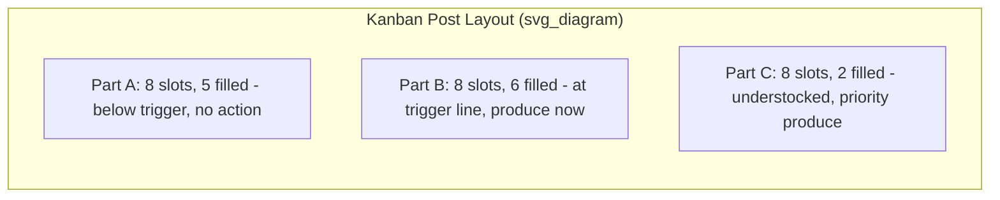

## Kanban Post Design and Card Circulation Logic

### Overview

The kanban post (also called a kanban board, collection post, or heijunka post when combined with scheduling) is the physical or digital location where withdrawal and production kanban cards accumulate, are sequenced, and trigger downstream action. Its design directly determines whether the six rules of kanban are enforced mechanically and visually, or whether they depend on operator discipline alone. A well-designed post makes the system's state — and any abnormality — visible at a glance without requiring interpretation.

### Functions of a Kanban Post

1. **Collection point** — cards removed from containers as they are consumed accumulate here rather than being discarded or carried away.
2. **Sequencing device** — the arrangement of cards on the post determines the order in which the upstream process produces (Rule 2: production in the sequence specified).
3. **Visual signal** — the post's fill state communicates system health: a nearly-empty post signals understock risk; a nearly-full post signals a production bottleneck or stoppage upstream.
4. **Authorization gate** — in most designs, a card is only pulled from the post for production once specific triggering conditions (e.g., reaching a "trigger line" or "full column") are met, preventing premature or excessive production starts.

### Core Physical Layout: The Kanban Board

A standard kanban post is typically a pegboard, slotted panel, or magnetic board with a grid structure:

- **Columns** represent part numbers (one column per SKU/part produced by the upstream process).
- **Rows within a column** represent individual card slots, each corresponding to one container's worth of parts.
- **Trigger line** — a marked threshold within each column (e.g., after the 3rd of 8 slots) indicating the point at which accumulated cards authorize/trigger a new production run for that part.

### Card Circulation Logic (Step-by-Step)

The circulation of a card through a single kanban loop follows a fixed, repeating cycle:

1. **Attachment** — a production kanban (P-kanban) is attached to a full container in the store.
2. **Withdrawal** — the downstream process withdraws the container, detaches the P-kanban, and leaves it in a collection box or at the post; the container (now unmarked, or marked with a C-kanban if conveyance is a separate step) moves to the point of use.
3. **Collection** — P-kanban cards accumulate in the post's column for that part number as consumption continues.
4. **Batching decision** — cards accumulate until either (a) the trigger line is reached, (b) a fixed collection interval elapses (common in leveled/heijunka-integrated posts), or (c) a minimum lot-size threshold of cards is reached, whichever triggering rule the post is designed around.
5. **Release to production** — the accumulated cards (or the oldest/next-in-sequence card, depending on design) are pulled from the post and handed to the upstream process as the authorization to produce.
6. **Production** — the upstream process produces exactly the quantity indicated by the card(s), in the sequence in which cards were released (FIFO discipline).
7. **Return** — the finished container, with its P-kanban reattached, returns to the store, completing the cycle.

### Sequencing Rules at the Post

Because Rule 2 requires production "in the sequence specified by the kanban," the post's release logic must enforce a consistent ordering discipline. Three common approaches:

**FIFO Release**

Cards are pulled from the post strictly in the order they arrived, regardless of part number. Simple, but can cause excessive changeovers if arrival order is not naturally leveled.

**Column-Trigger Release**

Each part-number column has its own independent trigger line; whichever column reaches its trigger first is produced next. This is the most common design for shared upstream resources with multiple part numbers, since it naturally sequences based on actual consumption urgency rather than arrival order alone.

**Heijunka-Integrated Release**

Cards are not released purely based on accumulation; instead, they are placed into a heijunka box — a grid of time-slot pigeonholes — that enforces a leveled, mixed-model production sequence regardless of how cards accumulated. This decouples the *rate* of consumption from the *sequence* of production, smoothing changeovers and protecting the upstream process from demand-driven volatility.

### Visual Control Design Principles for the Post

- **At-a-glance status.** Anyone walking past the post — not just the assigned operator — should be able to determine which parts need production and which are safely stocked, without reading documentation.
- **Color coding.** Trigger zones are frequently color-coded (e.g., green below trigger, red at/above trigger) to reduce interpretation time to near zero, mirroring the colored-zone visual replenishment principle used in two-bin and min-max systems.
- **Physical placement.** The post is located as close as practical to the upstream (producing) process, so the operator responsible for production sees it continuously as part of their normal workflow, rather than requiring a separate checking task.
- **One card, one container — no exceptions.** The post's slot count for a given part number should exactly equal that part's authorized kanban count ($N$, from the kanban card calculation); a post physically incapable of holding more cards than $N$ enforces the WIP cap structurally, similar to how a two-bin system enforces its cap by container count.

### Abnormality Detection via Post State

A properly designed post turns problems into visible signals without requiring separate reporting:

| Post State | Interpretation | Likely Root Cause |
| --- | --- | --- |
| Column consistently near-full | Upstream process not keeping pace | Machine downtime, quality issue at source, changeover delay |
| Column consistently near-empty | Downstream consuming faster than replenishment | Demand spike, undersized $N$, lead time increase |
| Cards missing/unaccounted for | Card discipline breakdown | Lost cards, unauthorized production, informal workarounds |
| Column completely full (production stalled) | Upstream at capacity limit reached | Signals genuine overload; system correctly refuses further production per Rule 2 |

[Inference] A column sitting permanently full is sometimes mistaken for a system failure, but under strict kanban logic it is the system functioning as designed — it is refusing to authorize overproduction; the appropriate response is investigating the upstream constraint, not overriding the card limit. Specific interpretation should still account for the particular process context.

### Kanban Post Combined with Signal Kanban (Batch Processes)

For processes with significant changeover time (e.g., stamping, injection molding), the post design incorporates a **triangle/signal kanban** logic rather than one-card-per-container:

- Signal cards are placed at a specific position in the physical stock itself (not purely on a board) — for example, attached to the container that represents the reorder trigger point within a larger batch.
- When stock is drawn down to the point where the signal card is exposed, it is pulled and taken to the post, authorizing a full batch production run (not a single container).
- The post in this case functions less as a slot-per-container grid and more as a collection point for infrequent, large-lot authorization signals.

### Multi-Process Kanban Post Networks

In a facility with several sequential processes, each pair of adjacent processes typically has its own dedicated kanban post — the posts are not shared globally. This keeps each pull loop local and independently sized, consistent with the decentralization principle underlying kanban; a single global post attempting to manage all part numbers across all process pairs would reintroduce centralized scheduling complexity that kanban is specifically designed to avoid.

### Electronic Post Equivalents

In e-kanban implementations, the physical board is replaced by a dashboard view showing the same column/trigger-line structure digitally, often with:

- Automatic alerts when a column crosses its trigger threshold
- Historical fill-rate charts to support the $L$ and $S$ recalculations used in card-count sizing
- Remote visibility for planners overseeing multiple posts across a facility

The same sequencing logic (FIFO, column-trigger, or heijunka-integrated release) still applies — only the physical medium changes, consistent with the broader electronic-versus-card-based kanban distinction.

### Common Post Design Mistakes

- **Undersized slot count relative to $N$.** If the post has fewer physical slots than the calculated kanban count, cards accumulate off-board informally, breaking the visual-control guarantee.
- **No clear trigger line.** A post that simply collects cards without a defined release threshold devolves into ad hoc, operator-judgment-based scheduling, undermining Rule 2's requirement for a specified sequence.
- **Post located far from the producing operator.** Placing the post in an office or supervisor's area rather than at the point of production removes the ambient-visibility benefit and reintroduces a reporting delay.
- **Mixing signal kanban and standard kanban logic on the same post without clear separation.** Combining batch-trigger cards and per-container cards in the same column can obscure which authorization rule applies to which part number.

### Related Topics

- The six rules of kanban and their operating principles
- Calculating the number of kanban cards required
- Signal (triangle) kanban for batch processes
- Heijunka box design and production leveling
- Electronic kanban versus card-based kanban
- Two bin and other visual replenishment systems
- Visual control (mieruka) and andon systems in TPS