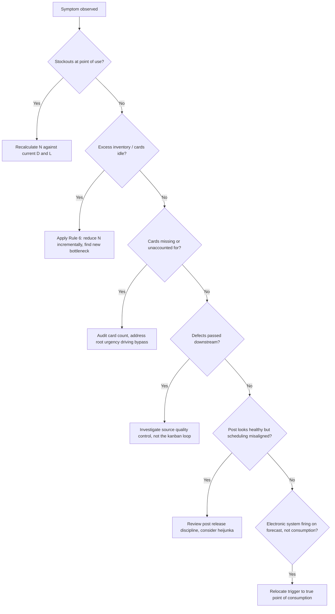

## Troubleshooting Common Kanban System Failures

### Overview

A kanban system that appears to be "not working" is almost always signaling a real problem elsewhere in the process — kanban does not create instability, it exposes it. Effective troubleshooting therefore starts from the assumption that the card mechanism is functioning correctly as a diagnostic tool, and the investigation should trace the symptom back through the six rules and the sizing formula to its root cause, rather than treating the symptom (a stockout, an overflowing post, a lost card) as the problem to be fixed directly.

### Failure Mode 1: Chronic Stockouts at the Point of Use

**Symptoms:** Downstream process frequently finds the store empty; production line stops waiting for parts despite kanban being "in place."

**Likely Root Causes:**

- Kanban count ($N$) undersized relative to actual demand rate ($D$) or lead time ($L$) — often because $L$ was measured under ideal conditions rather than typical conditions including minor stops
- Demand rate has increased since $N$ was last calculated (new product mix, volume ramp) without a corresponding recalculation
- Safety factor ($S$) too low for actual process/demand variability
- Upstream process experiencing unplanned downtime, quality rejects, or changeover delays not accounted for in $L$

**Diagnostic Approach:**

1. Recalculate $N = \frac{D \times L \times (1+S)}{C}$ using *currently measured* values of $D$ and $L$, not the original design assumptions.
2. Compare recalculated $N$ against the actual card count in circulation.
3. If $L$ has grown, investigate whether the cause is a one-time event (equipment failure) or a systemic shift (increased changeover frequency, new part mix).

**Corrective Actions:**

- If demand has genuinely and durably increased: increase $N$ (adding cards is acceptable here — Rule 6 governs *steady-state reduction*, not refusal to respond to a real demand shift)
- If lead time has grown due to a fixable inefficiency: address the inefficiency (SMED for changeovers, TPM for reliability) rather than permanently inflating $N$ to compensate
- If variability has increased: reassess $S$ based on updated variability data rather than guessing upward

### Failure Mode 2: Excess Inventory / Cards Rarely Used

**Symptoms:** Kanban post columns are consistently full; containers sit unused in the store for extended periods; WIP visibly exceeds what downstream actually needs.

**Likely Root Causes:**

- $N$ was set conservatively high and never revisited (violation of Rule 6's continuous reduction principle)
- Demand has decreased since sizing, but card count was not adjusted downward
- Container size ($C$) is too small relative to $N$, causing an oversized total buffer even though each individual container appears reasonable

**Diagnostic Approach:**

1. Track the fill rate of each column over a representative period (e.g., 2–4 weeks); consistently high fill levels indicate an oversized loop.
2. Deliberately remove one card from the loop as a controlled experiment and observe what happens over the following cycles — this is the practical, kaizen-style application of Rule 6.

**Corrective Actions:**

- Remove cards incrementally, monitoring for the *specific new bottleneck* that emerges — this bottleneck is the next kaizen target, not evidence the reduction was a mistake
- Recheck $D$ against current, not historical, consumption

### Failure Mode 3: Physical Cards Lost, Damaged, or Unaccounted For

**Symptoms:** Periodic card counts (audits) reveal fewer cards in circulation than the authorized $N$; containers found in the system without an attached card.

**Likely Root Causes:**

- No regular card audit process exists to catch drift over time
- Cards physically wear out (lamination failure, ink fading) without a replacement protocol
- Operators removing cards informally to "speed up" a perceived shortage, breaking Rule 4 (card must always be attached to the physical product)

**Diagnostic Approach:**

1. Conduct a physical card count against the documented $N$ for each loop; discrepancies indicate leakage.
2. Review recent history for informal workarounds — often surfaced through informal conversation with floor operators rather than data alone.

**Corrective Actions:**

- Institute a scheduled card audit (e.g., weekly) as a standard work task, not an occasional exercise
- Replace physical cards on a maintenance cycle before they degrade to illegibility
- Address the underlying urgency driving informal card bypass — usually traces back to Failure Mode 1 (undersized $N$), meaning the "lost card" complaint may actually be a stockout problem in disguise

### Failure Mode 4: Defective Parts Passed Downstream Despite Kanban

**Symptoms:** Downstream process receives defective parts under valid kanban authorization; Rule 5 (no defects forwarded) is being violated.

**Likely Root Causes:**

- No source inspection or poka-yoke mechanism exists at the upstream process to catch defects before the container is marked complete and kanban-tagged
- Incoming inspection at the downstream process has been removed under the assumption that kanban alone guarantees quality (kanban is a *flow control* mechanism, not a *quality assurance* mechanism)

**Diagnostic Approach:**

1. Trace defect escapes back to the specific process step where the defect originated versus where it was detected.
2. Assess whether jidoka (autonomation with built-in quality checks) is present at the source process.

**Corrective Actions:**

- Implement or strengthen poka-yoke at the point of production, not at the point of consumption
- Treat any Rule 5 violation as a stop-the-line event at the source, consistent with jidoka principles, rather than a kanban-system fix

### Failure Mode 5: Kanban Post Shows Healthy State but Production Still Misaligned

**Symptoms:** The post's fill levels look normal, yet the wrong parts are being produced at the wrong time, or excessive changeovers are occurring.

**Likely Root Causes:**

- Card release sequencing at the post is ad hoc rather than following a defined discipline (FIFO, column-trigger, or heijunka-integrated)
- No heijunka leveling is in place upstream of a shared, multi-part-number resource, so cards arrive in a volatile, unleveled pattern that the post simply reflects rather than corrects

**Diagnostic Approach:**

1. Review the post's actual release logic against its documented design — informal deviation from the intended sequencing rule is common over time.
2. Check whether the upstream shared resource is being driven by leveled release (heijunka box) or by whichever column happens to fill first.

**Corrective Actions:**

- Reinstate or formalize the intended release discipline at the post
- Introduce heijunka-integrated release if changeover cost at the shared resource is high and unleveled card arrival is causing excessive setups

### Failure Mode 6: Electronic Kanban Signals Not Reflecting Actual Consumption

**Symptoms:** In an e-kanban system, replenishment triggers appear to fire on a schedule or forecast pattern rather than genuine withdrawal events; behavior resembles push scheduling despite being labeled "kanban."

**Likely Root Causes:**

- The e-kanban system was configured against a forecasted reorder point rather than a real-time consumption scan (a common drift when integrating with ERP/MRP modules)
- Barcode/RFID scan points were placed at the wrong physical location (e.g., at receiving rather than at actual point of use), causing the digital signal to fire earlier than genuine consumption

**Diagnostic Approach:**

1. Audit where in the physical flow the triggering scan or sensor actually occurs.
2. Compare timestamps of "trigger" events against actual, observed consumption timestamps on the floor.

**Corrective Actions:**

- Relocate the scan/trigger point to the true point of consumption
- Reconfigure the system logic to fire strictly on actual withdrawal, decoupling it from any forecast-driven reorder logic that may have been layered on by default ERP settings — this is the electronic equivalent of enforcing Rule 1

### Diagnostic Decision Flow

### General Troubleshooting Principles

- **Never treat the symptom as the fix target.** Adding cards to solve a stockout without confirming whether $L$ or $D$ actually changed simply masks a process problem under more inventory.
- **Recalculate before adjusting.** Every card-count change should be traceable to a specific, measured change in $D$, $L$, $C$, or $S$ — not intuition alone.
- **Distinguish a one-time event from a systemic shift.** A single equipment breakdown inflating $L$ temporarily does not justify a permanent $N$ increase; a sustained trend does.
- **Audit regularly, not only when a failure is already visible.** Periodic physical card counts and post fill-rate reviews catch drift (Failure Modes 2 and 3) before they manifest as acute stockouts.
- **Kanban failures are frequently quality or reliability failures wearing a kanban costume.** Rule 5 violations and lead-time blowouts often originate in jidoka or TPM gaps rather than in the pull mechanism itself; fixing the card system without addressing the source problem will cause the same failure to recur.

[Inference] Because kanban is designed to surface — not absorb — underlying process variability, a system requiring frequent manual card-count increases over a short period, without an identifiable and durable demand increase, is a strong indicator of an unaddressed reliability or quality problem upstream rather than a sizing error in the kanban formula itself; the specific diagnosis still depends on the process in question.

### Related Topics

- Calculating the number of kanban cards required
- The six rules of kanban and their operating principles
- Kanban post design and card circulation logic
- Jidoka and poka-yoke as quality gates within a kanban loop
- Total Productive Maintenance (TPM) and its effect on lead-time variability
- SMED (Single-Minute Exchange of Die) for changeover-driven lead-time reduction
- Heijunka (production leveling) and its role in stabilizing kanban inputs
- Electronic kanban versus card-based kanban