## Heijunka as the Concept and Purpose of Production Leveling

### Overview

Heijunka (平準化) is the Toyota Production System principle of leveling production volume and mix over a fixed time interval, so that upstream processes and suppliers experience smooth, predictable demand rather than the volatile, lumpy pattern generated by raw customer orders or batch-based scheduling. It is one of the two foundational pillars of TPS alongside Just-in-Time, and is frequently described as the precondition that makes kanban, one-piece flow, and standardized work actually viable at scale.

Without heijunka, even a mathematically well-sized kanban loop or a well-executed pull system will struggle, because the demand rate ($D$) and lead time ($L$) feeding into every downstream calculation become unstable — heijunka's entire purpose is to stabilize the inputs that the rest of the lean toolkit depends on.

### The Core Problem Heijunka Solves

Real customer demand is rarely smooth. A given week might see large orders on Monday, none on Tuesday, and a mix shift toward a different product variant on Friday. If production is scheduled to directly mirror this raw order pattern (build-to-order in strict sequence), several problems cascade through the value stream:

- **Peak capacity requirements spike**, forcing equipment, staffing, and material stockpiles to be sized for the worst-case day rather than the average — a form of *muri* (overburden).
- **Suppliers see the same volatility amplified**, a manifestation of the bullwhip effect, where small demand swings at the customer end become large swings by the time they propagate to upstream tiers.
- **Inventory buffers must grow** at every stage to absorb the unevenness, directly working against JIT's goal of minimal WIP.
- **Uneven mix scheduling** (e.g., building 50 units of Variant A, then 50 of Variant B, in large blocks) creates long lead times for whichever variant is queued last, and forces large individual batch sizes that increase changeover-driven downtime.

Toyota's terminology names this problem *mura* (unevenness) — and heijunka is the primary countermeasure against it. Critically, TPS treats mura as often being the deeper root cause of both *muda* (waste) and *muri* (overburden): eliminating unevenness at the scheduling level prevents much of the waste and strain that would otherwise need to be absorbed downstream.

### The Two Dimensions of Leveling

Heijunka levels production along two independent axes:

**Volume Leveling**

Total daily (or shift) output is smoothed to match average demand over a planning period, rather than fluctuating with actual daily order volume. If total monthly demand is 2,000 units over 20 working days, volume leveling targets producing approximately 100 units every day, rather than, for example, 400 units in the last week to catch up on a slow start.

**Mix Leveling**

Within a leveled daily volume, the sequence of different product variants is interspersed evenly rather than produced in large single-variant batches. Instead of producing AAAAABBBBBCCCCC across a day, mix leveling aims for a repeating small-batch or unit-level sequence such as ABCABCABCABCABC, so that every variant is available in a steady, predictable trickle rather than arriving in large, spaced-out blocks.

### Worked Example: From Raw Demand to Leveled Schedule

Suppose a line produces three sedan trims — Base, Sport, and Luxury — with a monthly order mix of:

- Base: 1,200 units/month
- Sport: 600 units/month
- Luxury: 200 units/month
- Total: 2,000 units/month, over 20 working days → 100 units/day (volume-leveled)

Daily mix ratio: Base : Sport : Luxury = 6 : 3 : 1

A leveled sequence for each block of 10 units might be:

$$\text{B, B, S, B, S, L, B, S, B, B}$$

repeated 10 times across the day to reach 100 units, rather than building all 60 Base units first, then all 30 Sport, then the 10 Luxury units as a single batch each. This repeating pattern is precisely what a heijunka box is designed to physically enforce (covered in the heijunka box topic), converting the ratio into a concrete, repeatable production sequence.

### Purpose Within the Broader TPS Architecture

**Enabling Kanban to Function as Designed**

Every kanban sizing calculation depends on a demand rate $D$ that is assumed to be relatively stable within the loop's lead time window. Heijunka is what makes that assumption realistic — without it, kanban card counts must either be inflated with large safety factors to absorb volatility, or the system suffers chronic stockouts and overstock cycling, as described under kanban failure modes.

**Enabling Small Lot Sizes and Reduced Changeovers**

Because heijunka intersperses variants in small quantities rather than large batches, it creates continuous pressure toward reducing changeover time (SMED) — a line producing single-digit lot sizes of each variant simply cannot tolerate long setup times between them. This is a deliberate design pressure, not an incidental side effect: heijunka is often used specifically to expose the need for SMED improvement.

**Stabilizing the Supply Chain Upstream**

A leveled internal schedule produces a leveled external kanban/order signal to suppliers, which in turn allows suppliers to run their own stable, efficient production rather than absorbing the customer's raw volatility. This directly counters the bullwhip effect at the supply-chain level.

**Supporting Standardized Work and Workload Balance (Heijunka and Takt Time)**

Because volume is leveled to an average daily rate, the corresponding takt time (available time ÷ demand) becomes a stable, predictable pace for the line, which is a prerequisite for meaningful standardized work — standardized work cannot be defined against a constantly shifting pace.

### Heijunka's Relationship to Takt Time

$$\text{Takt Time} = \frac{\text{Available Production Time}}{\text{Customer Demand (leveled)}}$$

Heijunka is precisely what makes the denominator in this formula ("customer demand") a stable, plannable number rather than a raw, volatile order stream — takt time as a meaningful pacing concept presupposes that demand has already been leveled.

### Conceptual Flow: From Raw Orders to Leveled Production

```mermaid
flowchart LR
    A[Raw customer orders - volatile volume and mix] --> B[Aggregate demand over planning period]
    B --> C[Calculate average daily volume]
    C --> D[Determine mix ratio of variants]
    D --> E[Sequence small-lot repeating pattern]
    E --> F[Heijunka box / leveled schedule]
    F --> G[Stable signal to kanban loops and suppliers]
    G --> H[Reduced mura, enabling smaller lots and lower WIP]
```

### Trade-Offs and Limitations

- **Finished goods buffer required.** Because production is smoothed relative to raw demand, some finished-goods (or intermediate) inventory is typically needed to absorb the gap between the leveled production rate and the actual, lumpy arrival of customer orders — heijunka trades WIP-in-process reduction for a controlled, smaller buffer at the output stage.
- **Requires demand predictability at some level.** Heijunka works best when aggregate demand over the planning period (even if daily orders vary) is reasonably forecastable; environments with extreme, unpredictable demand volatility limit how tightly leveling can be applied.
- **Not a replacement for responsiveness.** Heijunka levels the *production schedule*, not the underlying customer demand itself; it is deliberately a buffering and smoothing strategy, not a forecasting or demand-shaping strategy — genuine demand spikes still require either buffer stock or a temporary capacity response.
- **Cultural and process discipline dependency.** Sequencing small lots of mixed variants requires disciplined changeover execution and quality consistency across every variant; a line without adequate SMED capability or consistent quality across variants will experience mix leveling as a source of frequent disruption rather than stability. [Inference: the degree of difficulty scales with the number of variants and their process dissimilarity; specific outcomes vary by product line.]

### Related Topics

- Heijunka box design and mechanics
- Takt time calculation and its relationship to leveled demand
- SMED (Single-Minute Exchange of Die) as an enabler of mix leveling
- Mura, muri, and muda — the three forms of waste in TPS
- Calculating the number of kanban cards required
- Standardized work and its dependency on stable takt time
- The bullwhip effect in supply chain demand amplification