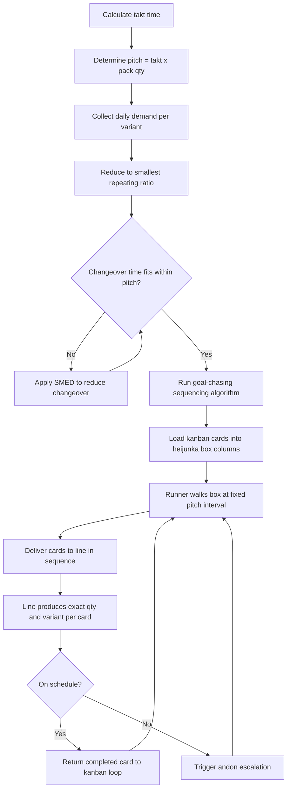

## Building and Operating a Heijunka Box

### Overview

A heijunka box (平準化ボックス) is a physical or visual scheduling tool used to level production by sequencing and pacing work orders (typically represented as kanban cards) across time slots. It converts a leveled production plan into a concrete, visual, operator-executable sequence, translating the abstract goal of heijunka (production leveling) into a tangible shop-floor mechanism.

The box enforces two simultaneous forms of leveling:

- **Volume leveling**: distributing total production quantity evenly across a period
- **Mix leveling (Heijunka sequencing)**: interspersing different product variants in a repeating pattern rather than producing in large batches

### Physical Structure

A standard heijunka box is a wall-mounted grid of slots (pigeonholes):

- **Rows** typically represent product types or part numbers
- **Columns** represent fixed time intervals (pitch increments), such as 20-minute or 1-hour blocks
- Each cell holds one or more kanban cards corresponding to the quantity of that product to be produced in that pitch interval



```
        08:00   08:20   08:40   09:00   09:20   09:40
Model A  [K]     [ ]     [K]     [ ]     [K]     [ ]
Model B  [ ]     [K]     [ ]     [K]     [ ]     [K]
Model C  [ ]     [ ]     [K]     [ ]     [ ]     [K]
```

Each `[K]` slot holds a kanban card. An operator or material handler walks the box at each pitch interval, pulls the cards due for that time slot, and delivers them to the line as the authorization to produce or move that specific quantity of that specific item.

### Core Terminology

**Key Points**

- **Takt time**: the rate of customer demand, calculated as available production time divided by customer demand quantity. Heijunka box design begins with takt time.
- **Pitch**: takt time multiplied by a practical pack-out or transfer quantity, yielding a manageable interval (commonly 5–60 minutes) at which cards are pulled and containers move.
- **EPEI (Every Part Every Interval)**: the cycle length required to produce one of every variant at least once; a target heijunka aims to shrink EPEI as close to one day (or shift) as capacity allows.
- **Runner**: the person (often a water spider / mizusumashi) responsible for walking the heijunka box at each pitch, collecting due cards, and distributing production/withdrawal instructions.
- **Leveled pattern**: the repeating sequence of variants (e.g., A-B-A-C-A-B-A-C) chosen to minimize batch size while respecting changeover constraints.

### Calculating Takt Time

$$T_{takt} = \frac{T_{available}}{D_{customer}}$$

Where $T_{available}$ is net available working time per period and $D_{customer}$ is customer demand for that period.

**Example**

A cell operates 420 available minutes per shift. Daily customer demand is 210 units.

$$T_{takt} = \frac{420 \text{ min}}{210 \text{ units}} = 2 \text{ min/unit}$$

### Calculating Pitch

Pitch converts takt time into an actionable handling interval by attaching it to a standard pack-out quantity (the number of units moved together in a container).

$$Pitch = T_{takt} \times Q_{pack}$$

**Example**

Using the takt time above (2 min/unit) with a pack-out quantity of 10 units per container:

$$Pitch = 2 \text{ min/unit} \times 10 \text{ units} = 20 \text{ min}$$

This means the heijunka box will have columns spaced 20 minutes apart, and each kanban card represents one container of 10 units.

### Designing the Leveled Sequence

**Step 1: Determine daily volume per variant**

Given daily demand for three variants:

| Variant | Daily Demand | Pack-Out Qty | Containers/Day |
| --- | --- | --- | --- |
| A | 120 | 10 | 12 |
| B | 60 | 10 | 6 |
| C | 30 | 10 | 3 |

Total containers/day = 21, matching 21 pitch intervals if the shift is divided accordingly (420 min ÷ 20 min pitch = 21 intervals).

**Step 2: Determine the repeating ratio**

Reduce to a smallest repeating unit: A:B:C = 12:6:3 = 4:2:1

**Step 3: Sequence to avoid clustering**

A naive sequence (AAAA BB C) creates batching and uneven downstream load. A leveled sequence interleaves variants so that no single product dominates consecutive slots:



```
A B A C A B A | A B A C A B A | A B A C A B A
```

This repeating 7-slot pattern (A×4, B×2, C×1) is placed into three cycles to fill 21 slots, ensuring every variant recurs at a short, predictable interval rather than being produced in one large end-of-day batch.

### Sequencing Algorithm (Goal Chasing Method)

For more complex mixes, Toyota's goal chasing algorithm formalizes this interleaving. At each slot $n$, the variant chosen is the one with the largest deviation between its ideal cumulative output and its actual cumulative output so far.

$$D_i(n) = \left(\frac{d_i}{D_{total}} \times n\right) - A_i(n-1)$$

Where:

- $D_i(n)$ = deviation score for variant $i$ at slot $n$
- $d_i$ = daily demand for variant $i$
- $D_{total}$ = total daily demand across all variants
- $A_i(n-1)$ = cumulative units of variant $i$ already scheduled through slot $n-1$

At each slot, select the variant with the maximum $D_i(n)$. This is mathematically equivalent to the "apportionment" problem in political science (e.g., the Jefferson/Webster methods) and produces a maximally even interleaving for any demand ratio, including non-integer ratios that simple round-robin patterns cannot handle cleanly.

**Example (algorithmic trace)**

Using A:B:C = 4:2:1 (7 total), compute $D_i(n)$ for the first 4 slots:

| Slot | $D_A$ | $D_B$ | $D_C$ | Selected |
| --- | --- | --- | --- | --- |
| 1 | 0.571 | 0.286 | 0.143 | A |
| 2 | 0.143 | 0.571 | 0.286 | B |
| 3 | 0.714 | 0.143 | 0.429 | A |
| 4 | 0.286 | 0.714 | 0.571 | B |

[Inference] Hand-run goal chasing on more than 3–4 variants becomes error-prone; production systems with wide mix complexity typically compute the sequence in a spreadsheet or MES module and print/load the resulting card order rather than deriving it manually at the box each cycle.

### Operating Procedure

**Step 1: Card issuance**

At the start of each pitch interval, cards representing due production are placed into the corresponding column slots by the scheduler or the previous shift's setup.

**Step 2: Runner walk**

The runner (water spider) walks the box exactly at pitch intervals (e.g., every 20 minutes), never early and never late, to preserve pacing discipline. Arriving early causes buildup at the line; arriving late causes starvation.

**Step 3: Card pull and delivery**

The runner physically removes all cards present in the current time column and carries them to the line, in the sequence the cards were arranged, along with any material or containers the cards authorize.

**Step 4: Production against the card**

The line produces or moves exactly the quantity and variant specified by the card, in the sequence delivered — no more, no less, and no resequencing at the line.

**Step 5: Cycle closure**

Completed cards are returned to a receiving post (or the supermarket) as either replenishment signals or empty-card confirmation, closing the kanban loop back to the heijunka box for the next planning cycle.

**Step 6: Andon escalation on deviation**

If a column's cards cannot be fulfilled (material shortage, changeover overrun), an andon signal is triggered rather than silently skipping or reordering, preserving the visual and sequencing integrity of the system.

### Box Variants and Implementation Forms

- **Physical pigeonhole box**: rows × columns of slots, cards inserted manually; most transparent for training and shop-floor visibility
- **Runner-based cyclic box**: single-row rotating slot where cards are inserted in sequence and pulled in strict FIFO order, used when only sequence (not fixed time-of-day) matters
- **Digital heijunka board**: MES/ANDON-integrated screen replicating the same grid logic, often paired with electronic kanban (e-kanban); improves traceability but [Inference] can reduce the shop-floor visual-management benefit if not paired with a physical or large-screen display visible from the line
- **Load-leveling board (mixed-model line)**: extended variant used at final assembly where sequence, not discrete time slots, is the primary axis, common in automotive final assembly

### Common Failure Modes

**Key Points**

- **Batch leakage**: operators or schedulers group same-variant cards together "for convenience," collapsing the leveled sequence back into batch production and defeating the box's purpose
- **Pitch drift**: the runner's walk cycle is not disciplined to the clock, causing cumulative timing error that cascades into starved or flooded downstream stations
- **Card fabrication mismatch**: if changeover time exceeds the pitch interval, the sequence is infeasible as designed; this signals a need for SMED (Single-Minute Exchange of Die) work before heijunka can be tightened further, not a reason to abandon leveling
- **Demand volatility outpacing the box**: heijunka assumes reasonably stable, smoothed demand; highly volatile actual orders require a buffer or planning smoothing (often via a fixed planning horizon / frozen window) upstream of the box, since the box itself only sequences what it is given

### Relationship to SMED and Changeover Capacity

For a leveled mixed sequence to be operationally feasible, total changeover time consumed within a pitch interval must fit inside that interval alongside processing time:

$$T_{pitch} \geq T_{process} + T_{changeover}$$

If this inequality is violated, the box cannot execute the designed sequence without falling behind takt. This is why heijunka implementation is typically sequenced *after* changeover reduction efforts (SMED) in a TPS rollout — attempting fine-grained mix leveling before changeover times are compressed produces an infeasible schedule and reinforces the appearance that "leveling doesn't work" when the actual constraint is unreduced setup time.

### Heijunka Box Data Flow (svg_diagram)

<svg xmlns="http://www.w3.org/2000/svg" viewBox="0 0 820 380">
\<style\>
.box { fill: #ffffff; stroke: #333333; stroke-width: 1.5; }
.label { font-family: Arial, sans-serif; font-size: 13px; fill: #222222; }
.title { font-family: Arial, sans-serif; font-size: 15px; fill: #111111; font-weight: bold; }
.arrow { stroke: #333333; stroke-width: 1.5; fill: none; marker-end: url(#arrowhead); }
\</style\>
<text x="270" y="25" class="title">Heijunka Box Operating Cycle (svg_diagram)</text>

<rect x="30" y="50" width="150" height="60" class="box" />
<text x="45" y="75" class="label">Customer Demand</text>
<text x="45" y="93" class="label">(Takt Time calc)</text>
<rect x="230" y="50" width="150" height="60" class="box" />
<text x="245" y="75" class="label">Leveled Sequence</text>
<text x="245" y="93" class="label">(Goal Chasing)</text>
<rect x="430" y="50" width="150" height="60" class="box" />
<text x="445" y="75" class="label">Heijunka Box</text>
<text x="445" y="93" class="label">(cards loaded)</text>
<rect x="630" y="50" width="150" height="60" class="box" />
<text x="645" y="75" class="label">Runner / Water</text>
<text x="645" y="93" class="label">Spider (Pitch Walk)</text>
<path class="arrow" d="M180 80 L230 80" />
<path class="arrow" d="M380 80 L430 80" />
<path class="arrow" d="M580 80 L630 80" />
<rect x="630" y="160" width="150" height="60" class="box" />
<text x="645" y="185" class="label">Production Line</text>
<text x="645" y="203" class="label">(execute card order)</text>
<path class="arrow" d="M705 110 L705 160" />
<rect x="430" y="160" width="150" height="60" class="box" />
<text x="445" y="185" class="label">Andon Escalation</text>
<text x="445" y="203" class="label">(on deviation)</text>
<path class="arrow" d="M630 190 L580 190" />
<rect x="230" y="270" width="150" height="60" class="box" />
<text x="245" y="295" class="label">Completed Card</text>
<text x="245" y="313" class="label">Return</text>
<path class="arrow" d="M705 220 L705 300 L380 300" />
<rect x="30" y="270" width="150" height="60" class="box" />
<text x="45" y="295" class="label">Supermarket /</text>
<text x="45" y="313" class="label">Kanban Loop Close</text>
<path class="arrow" d="M230 300 L180 300" />
<path class="arrow" d="M105 270 L105 110" />
</svg>

### Sequencing Decision Flow



### Related Topics

- Takt time calculation and line balancing
- SMED (Single-Minute Exchange of Die) as a heijunka prerequisite
- Kanban card design and two-bin/withdrawal systems
- Mizusumashi (water spider) route design
- EPEI reduction roadmaps
- Mixed-model line sequencing in final assembly
- Supermarket sizing and buffer stock calculation
- Andon systems and escalation protocols
- Goal chasing / apportionment algorithms in production sequencing