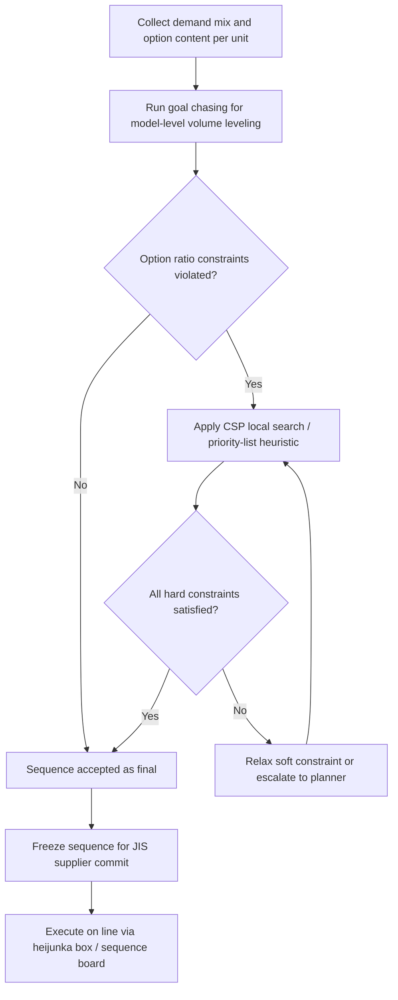

## Mixed Model Sequencing Techniques


### Overview

Mixed model sequencing (MMS) is the set of methods used to determine the order in which different product variants are launched down a single production line so that material consumption, labor load, and station work content stay as level as possible over time. Where heijunka defines the *goal* of leveled, low-batch production, mixed model sequencing supplies the *algorithms* that decide the actual variant-by-variant order of the line.

MMS problems typically fall into two related but distinct optimization families:

- **Level Scheduling (Output Rate Variation problem, ORV)**: minimize the deviation between actual and ideal cumulative output for each variant over the sequence
- **Car Sequencing Problem (CSP)**: satisfy hard constraints of the form "no more than $p$ out of every $q$ consecutive units may require option X," reflecting station capacity or labor limits

### Core Terminology

**Key Points**

- **Mixed-model line**: a single assembly line producing multiple product variants in intermixed sequence rather than in batches, without stopping for changeover between variants
- **Option content / build combination**: the set of features or options a given unit requires (e.g., sunroof, specific engine, RHD/LHD) which determines station-specific work content
- **Station cycle time overload**: the condition where the required work content at a station for a given unit exceeds the available cycle time, forcing the operator to walk downstream (utility work) or halt the line
- **Smoothing / leveling**: reducing the variance of workload or option demand across consecutive units in the sequence
- **Golden zone**: the standard span of the station within which an operator can complete assigned work without triggering a line stop, in lines using a moving conveyor

### Goal Chasing Method (Toyota's Original Algorithm)

The goal chasing method (also called Goal Chasing I/II in the literature) is the sequencing technique Toyota originated for final assembly leveling. It selects, at each sequence position, the variant whose actual production most lags its ideal proportional share.

$$D_i(n) = \left(\frac{d_i}{D} \times n\right) - x_i(n-1)$$

Where:

- $d_i$ = total demand for variant $i$ over the planning horizon
- $D$ = total demand across all variants
- $n$ = current sequence position
- $x_i(n-1)$ = units of variant $i$ already scheduled through position $n-1$

At each position, the variant with maximum $D_i(n)$ is selected. This is equivalent to Jefferson's / Webster's apportionment methods used in seat allocation problems, and reliably produces maximally even spacing for any demand ratio.

**Example**

Demand ratio A:B:C = 5:3:2 (total 10 units).

| Position | $D_A$ | $D_B$ | $D_C$ | Chosen |
| --- | --- | --- | --- | --- |
| 1 | 0.5 | 0.3 | 0.2 | A |
| 2 | 0.0 | 0.6 | 0.4 | B |
| 3 | 0.5 | -0.1 | 0.6 | C |
| 4 | 1.0 | 0.2 | 0.2 | A |
| 5 | 0.5 | 0.5 | 0.4 | A or B (tie-break rule applied) |

[Inference] Ties are typically broken by a secondary priority rule (e.g., fixed variant priority order or smallest option-load variance), since the base algorithm alone does not specify tie resolution.

### Car Sequencing Problem (Constraint-Based Method)

Originating from Renault/Parisis' work and widely used in European automotive final assembly, CSP formulates leveling as hard ratio constraints per option rather than a single deviation score.

**Formulation**

For each option $k$ requiring constraint $H_k/S_k$ (at most $H_k$ units in any window of $S_k$ consecutive positions):

$$\sum_{j=n}^{n+S_k-1} r_k(j) \leq H_k \quad \forall n$$

Where $r_k(j) = 1$ if the unit at position $j$ requires option $k$, else 0.

**Example**

A line has a sunroof-install station capable of handling at most 2 sunroof units in any 5 consecutive units (2/5 constraint), because sunroof installation exceeds standard cycle time and needs utility-worker support that cannot sustain higher density.

Given a build list of 10 units where 4 require sunroofs, a valid CSP-compliant sequence might be:



```
Position: 1  2  3  4  5  6  7  8  9  10
Sunroof:  1  0  0  1  0  0  1  0  0  1
```

Every 5-unit sliding window contains at most 2 sunroof units, satisfying the constraint, while also naturally leveling volume (every-third-unit pattern here happens to also approximate even spacing).

CSP is typically solved via constraint programming (CP) solvers, using techniques such as:

- **Backtracking search with constraint propagation** — assign positions sequentially, pruning branches that violate any option ratio
- **Local search / tabu search** — start from a feasible or near-feasible sequence and iteratively swap positions to resolve violations
- **Priority-list heuristics** — approximate solvers that assign priority scores per unit based on how constrained its option set is, placing highly constrained units first (least-slack-first heuristics)

[Inference] Full backtracking CP solvers guarantee constraint satisfaction but do not scale well to daily automotive volumes (hundreds to low thousands of units with dozens of option constraints) without heuristic pruning; production sequencing systems typically use hybrid CP + heuristic or metaheuristic approaches rather than pure exhaustive search.

### Level Scheduling / Output Rate Variation (ORV) Method

ORV formulates leveling as minimizing total squared or absolute deviation from the ideal cumulative production curve across *all* variants and *all* positions simultaneously, rather than the greedy position-by-position approach of goal chasing.

$$\min \sum_{i=1}^{m} \sum_{n=1}^{N} \left| \frac{d_i}{D} \times n - x_i(n) \right|$$

This is a more globally optimal formulation than goal chasing (which is a greedy heuristic), but is more computationally expensive; goal chasing is an efficient approximation that performs close to optimal for most practical demand ratios. [Inference] The relative gap between goal chasing and a true ORV-optimal solution is generally small for typical automotive-style demand mixes, which is part of why goal chasing remains the standard shop-floor method despite being a heuristic.

### Two-Stage Sequencing in Practice

Many real implementations use a two-stage decomposition:

**Stage 1 — Volume leveling**: apply goal chasing (or ORV) purely on variant/model demand ratios, ignoring options, to produce an evenly spaced model sequence.

**Stage 2 — Option-content leveling**: within the model sequence from Stage 1, apply local swaps or a secondary CSP pass to satisfy option ratio constraints (paint color changeover limits, heavy-option station limits) without disturbing the model-level leveling achieved in Stage 1.

This decomposition reflects the real constraint hierarchy in a plant: body/paint shops care primarily about model-family volume leveling and color-change sequencing, while final assembly cares primarily about option-content station loading.

### Constraint Sources Driving Sequencing Rules

**Key Points**

- **Station labor capacity**: stations with options that add significant work content (sunroof, leather trim, complex wiring harnesses) require spacing rules so utility labor is not overwhelmed
- **Paint shop color changeover**: sequencing may need to cluster or minimize color changes between adjacent units to reduce purge/cleaning losses — often in direct tension with body-shop model leveling, requiring buffer decoupling (paint bank) between body and final assembly
- **Material feeding (line-side kitting)**: high-variance option sequences increase logistics complexity for kanban/sequenced parts delivery (JIS — Just-In-Sequence), especially for bulky or low-frequency options
- **Regulatory/quality holds**: units affected by a quality investigation or engineering change may require explicit exclusion or repositioning within the sequence

### Sequence Freezing and Planning Horizon

Mixed model sequences are typically committed in layered horizons:

- **Frozen zone**: the immediate upcoming sequence (often several hours to one shift) is locked; no further resequencing is permitted so that upstream suppliers (JIS delivery) and line-side logistics can finalize picks
- **Firm zone**: a medium horizon (1–3 days) where sequence is provisionally set but minor swaps remain possible
- **Planning zone**: the outer horizon (days to weeks) still subject to demand-driven resequencing

[Inference] The specific horizon lengths vary considerably by industry and supplier lead time; automotive JIS suppliers with very short lead times often require freeze windows measured in hours, while lines with longer-lead-time components need multi-day freeze zones — the underlying principle (progressively locking the sequence as execution approaches) is the general practice rather than any fixed duration.

### Comparison of Sequencing Methods

| Method | Optimizes For | Computational Cost | Typical Use |
| --- | --- | --- | --- |
| Goal Chasing | Even volume/model spacing | Low (greedy, O(n·m)) | Real-time / shop-floor daily sequencing |
| ORV (global) | Minimum total deviation | High (optimization solver) | Offline planning, benchmark comparison |
| Car Sequencing (CSP) | Hard option ratio constraints | Medium–high (CP/heuristic) | Automotive final assembly with labor/station limits |
| Priority-list heuristic | Approximate CSP feasibility | Low | Real-time resequencing / disruption recovery |

### Mixed Model Sequencing Pipeline (svg_diagram)

<svg xmlns="http://www.w3.org/2000/svg" viewBox="0 0 820 320">
\<style\>
.box { fill: #ffffff; stroke: #333333; stroke-width: 1.5; }
.label { font-family: Arial, sans-serif; font-size: 12px; fill: #222222; }
.title { font-family: Arial, sans-serif; font-size: 15px; fill: #111111; font-weight: bold; }
.arrow { stroke: #333333; stroke-width: 1.5; fill: none; marker-end: url(#arrowhead2); }
\</style\>
<text x="230" y="25" class="title">Mixed Model Sequencing Pipeline (svg_diagram)</text>

<rect x="30" y="60" width="160" height="55" class="box" />
<text x="45" y="82" class="label">Order Book /</text>
<text x="45" y="98" class="label">Demand by Variant</text>
<rect x="240" y="60" width="160" height="55" class="box" />
<text x="255" y="82" class="label">Stage 1:</text>
<text x="255" y="98" class="label">Goal Chasing (volume)</text>
<rect x="450" y="60" width="160" height="55" class="box" />
<text x="465" y="82" class="label">Stage 2:</text>
<text x="465" y="98" class="label">CSP option leveling</text>
<rect x="660" y="60" width="130" height="55" class="box" />
<text x="672" y="82" class="label">Frozen</text>
<text x="672" y="98" class="label">Sequence</text>
<path class="arrow" d="M190 87 L240 87" />
<path class="arrow" d="M400 87 L450 87" />
<path class="arrow" d="M610 87 L660 87" />
<rect x="240" y="170" width="160" height="55" class="box" />
<text x="255" y="192" class="label">Station capacity /</text>
<text x="255" y="208" class="label">option constraints</text>
<path class="arrow" d="M320 170 L320 115" />
<rect x="450" y="170" width="160" height="55" class="box" />
<text x="465" y="192" class="label">Paint changeover /</text>
<text x="465" y="208" class="label">logistics constraints</text>
<path class="arrow" d="M530 170 L530 115" />
<rect x="660" y="170" width="130" height="55" class="box" />
<text x="672" y="192" class="label">JIS supplier</text>
<text x="672" y="208" class="label">pick lists</text>
<path class="arrow" d="M725 170 L725 115" />
</svg>

### Sequencing Decision Logic



### Related Topics

- Goal chasing / apportionment algorithms in production sequencing
- Car sequencing constraint programming and heuristic solvers
- Just-in-Sequence (JIS) supplier delivery systems
- Station cycle time balancing on mixed-model lines
- Paint shop color-change sequencing and buffer banks
- Heijunka box construction and operation
- Line balancing and takt time allocation across stations
- Sequence freeze windows and disruption recovery strategies