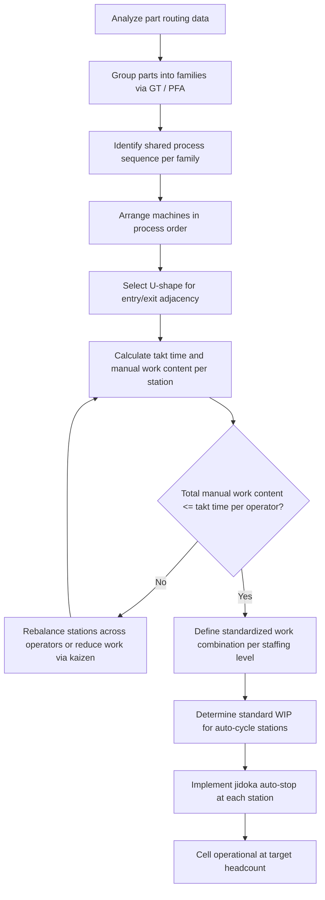

## Cellular Manufacturing and U-Shaped Cell Design


### Overview

Cellular manufacturing organizes machines, workstations, and operators into a compact grouping (a "cell") arranged by process sequence rather than by equipment type, so that a family of similar parts or products flows through the cell with minimal transport, queuing, and handling. The U-shaped cell is the most common physical layout for implementing cellular manufacturing within TPS, chosen specifically because its geometry supports multi-process handling, flexible staffing, and short material travel distance.

Cellular manufacturing is the layout-level enabler of one-piece flow; without regrouping equipment from a functional (process-village) layout into product-family cells, one-piece flow and standardized work combination cannot be physically achieved.

### From Functional Layout to Cellular Layout

**Functional (process village) layout**: identical machines are grouped together (all lathes in one area, all mills in another). Parts travel long, non-sequential distances between areas, batches accumulate as work-in-process (WIP) between departments, and lead time is dominated by queue and transport time rather than actual processing time.

**Cellular layout**: machines needed to complete a part family are placed in process sequence within one physical cell. Parts move one at a time (or in very small transfer batches) directly from machine to machine, eliminating most inter-department queueing and transport.

**Key Points**

- Functional layout optimizes machine utilization per department; cellular layout optimizes flow and lead time of the part
- Moving to cellular layout typically requires grouping parts into families by process similarity (Group Technology) before physical rearrangement
- Cellular manufacturing directly reduces WIP inventory, floor space, and lead time as a geometric consequence of shortened travel distance, independent of any other kaizen activity

### Why U-Shaped (Not Straight-Line)

A straight-line cell places the first and last process at opposite ends of the line, which:

- Forces the operator (if handling multiple stations) to walk the full line length repeatedly
- Makes it difficult to have one operator handle both the first and last operation, which is often desirable for cycle-time balancing and for visually confirming input matches output

The U-shape brings the entry point (raw material in) and exit point (finished part out) physically close together, adjacent to each other at the "mouth" of the U. This provides:

- **Reduced walking distance**: an operator working multiple processes travels a shorter loop instead of a long straight path
- **Load/unload proximity**: the same operator can load the first machine and unload the last machine with minimal movement, enabling entry/exit quality confirmation at a glance
- **Flexible headcount (shojinka)**: as demand changes, the number of operators working the cell can be increased or decreased without redesigning the physical layout — machines are simply reassigned to fewer or more operators walking different loop segments
- **Visual management**: the compact footprint keeps the entire process sequence within an operator's or supervisor's sightline

### U-Cell Design Principles

**Machine placement**: machines are arranged in strict process sequence around the U, spaced closely enough that operators can move between adjacent stations without excess walking, but with enough clearance for safe material handling and machine access/maintenance.

**Entry/exit adjacency**: the cell entrance (raw material staging) and exit (finished goods/next-process handoff) are positioned next to each other at the open end of the U, so a single operator position can serve both.

**Operator walking path**: operators work *inside* the U, walking a compact loop between machines assigned to them, rather than working from outside the shape. This is why the cell is walkable at chest-height counters or open-frame machines rather than requiring the operator to walk around each machine's full footprint.

**Standing/walking work combination**: within a U-cell, standardized work combination sheets define exactly which stations each operator visits, in what order, and with what manual/machine cycle time at each, so that as headcount changes the same physical cell supports multiple staffing configurations (e.g., a "1-person cell," "2-person cell," "3-person cell" configuration for the identical layout).

### Example: Single-Operator Full-Cycle U-Cell

A U-cell has 6 processes (P1–P6) arranged around the U. At low demand, a single operator performs a walking loop through all 6 stations per cycle, loading each machine, initiating its automatic cycle (where applicable), and moving to the next while prior machines run unattended (autonomation / jidoka-equipped stations permit this).



```
       P3 --- P4
      /          \
    P2            P5
      \          /
       P1 --- (gap) --- P6
       ^                 ^
    Material In      Finished Out
    (operator entry/exit point)
```

The operator's walking path is P1 → P2 → P3 → P4 → P5 → P6 → back to P1, collecting a new raw part on the return leg.

### Multi-Operator U-Cell (Chaku-Chaku Style)

At higher demand, the same physical cell splits the walking loop across two or three operators, each responsible for a contiguous segment of stations. This staffing pattern is often called **chaku-chaku** ("load-load"), where the operator's task at each station reduces to loading a part and pressing start, since jidoka-equipped machines auto-eject or signal completion and stop automatically on defect detection, letting the operator move immediately to the next station without watching the cycle run.

**Example (2-operator split of the same 6-station cell)**

- Operator 1: P1 → P2 → P3, then hands off (or places completed part into a small buffer)
- Operator 2: P4 → P5 → P6, then delivers finished part at the exit adjacent to entry

Because the U-shape keeps entry and exit close, rebalancing the split point between operators (e.g., shifting the boundary from P3/P4 to P2/P3) requires no physical relayout — only a change to the standardized work combination sheet.

### Line Balancing Within the Cell

For a cell to run at takt time, the sum of manual work content assigned to each operator (not each machine) must be less than or equal to takt time.

$$\sum_{s \in S_j} t_s \leq T_{takt}$$

Where $S_j$ is the set of stations assigned to operator $j$, and $t_s$ is the manual work time at station $s$.

**Example**

Takt time is 60 seconds. Six stations have manual work content of 12, 10, 15, 8, 9, 11 seconds respectively (total 65 seconds).

- **1-operator configuration**: total manual work = 65s exceeds 60s takt — infeasible without additional automation or standard WIP buffer; the operator would fall behind
- **2-operator configuration**: split into P1–P3 (37s) and P4–P6 (28s) — both operators are under 60s takt, with significant idle time, meaning 2 operators is over-staffed for this demand level relative to a 1-operator near-feasible design once minor work rebalancing or automation closes the 5-second gap

[Inference] In practice, a small work-content overage like the 5 seconds above is typically resolved through minor kaizen (eliminating micro-motions, adding a simple jidoka auto-stop) rather than immediately adding headcount, since adding a second operator to absorb 5 seconds of overage would leave that operator heavily underutilized.

### Standard Work-in-Process (Standard WIP) in U-Cells

Some U-cells require a small, fixed quantity of in-process inventory between certain stations to decouple machine automatic cycle time from operator walking time — this is **standard WIP**, distinct from buffer stock or safety stock, because its quantity is fixed by the standardized work combination and is not intended to absorb demand variability.

$$WIP_{std} = \frac{T_{auto\_cycle}}{T_{takt}}$$

Where $T_{auto\_cycle}$ is the unattended automatic cycle time of a machine the operator does not wait for.

**Example**

A machine has an 90-second unattended automatic cycle, and takt time is 60 seconds.

$$WIP_{std} = \frac{90}{60} = 1.5 \rightarrow 2 \text{ units (rounded up)}$$

Two units of standard WIP are required at that station so the operator is never forced to wait idle for the machine to finish before proceeding on the walking loop.

### Group Technology and Part Family Formation

Before a cell can be designed, parts must be grouped into families sharing a common process route. Common classification approaches:

- **Production Flow Analysis (PFA)**: clusters parts based on shared machine routing sequences extracted from process routing data
- **Classification and coding systems** (e.g., Opitz coding): assign parts a code based on geometric and manufacturing attributes, then group parts with matching or similar codes
- **Cluster analysis on machine-part incidence matrices**: mathematically groups parts and machines simultaneously to minimize inter-cell material movement (exceptional elements)

[Inference] Real-world part families rarely cluster perfectly; some parts requiring rare or expensive equipment (e.g., heat treatment, plating) often cannot be economically dedicated to every cell and remain served by a shared, centralized process outside the cell — designers generally treat this as an acceptable exception (a "remainder cell" or shared resource) rather than a failure of the cellular approach, since attempting to fully eliminate all exceptions can make cell formation infeasible.

### Cellular Manufacturing vs. Functional Layout — Comparison

| Dimension | Functional Layout | Cellular (U-Shaped) Layout |
| --- | --- | --- |
| Material travel distance | Long, non-sequential | Short, sequential |
| WIP between processes | High (batch queues) | Minimal (single-piece or small standard WIP) |
| Lead time | Dominated by queue/transport time | Dominated by actual process time |
| Staffing flexibility | Fixed per department | Adjustable via walking-loop rebalancing (shojinka) |
| Visual management | Difficult (dispersed) | Strong (compact, single sightline) |
| Changeover exposure | Isolated per machine | Cell-wide changeover impacts all stations |

### U-Shaped Cell Layout (svg_diagram)

<svg xmlns="http://www.w3.org/2000/svg" viewBox="0 0 700 420">
\<style\>
.machine { fill: #f2f2f2; stroke: #333333; stroke-width: 1.5; }
.label { font-family: Arial, sans-serif; font-size: 12px; fill: #222222; }
.title { font-family: Arial, sans-serif; font-size: 15px; fill: #111111; font-weight: bold; }
.path { stroke: #1a6ed8; stroke-width: 2; fill: none; stroke-dasharray: 5,4; marker-end: url(#arrowhead3); }
\</style\>
<text x="180" y="25" class="title">U-Shaped Cell Layout (svg_diagram)</text>

<rect x="80" y="60" width="90" height="60" class="machine" />
<text x="95" y="95" class="label">P1</text>
<rect x="80" y="160" width="90" height="60" class="machine" />
<text x="95" y="195" class="label">P2</text>
<rect x="80" y="260" width="90" height="60" class="machine" />
<text x="95" y="295" class="label">P3</text>
<rect x="200" y="330" width="90" height="60" class="machine" />
<text x="215" y="365" class="label">P4</text>
<rect x="320" y="260" width="90" height="60" class="machine" />
<text x="335" y="295" class="label">P5</text>
<rect x="320" y="160" width="90" height="60" class="machine" />
<text x="335" y="195" class="label">P6</text>
<rect x="320" y="60" width="90" height="60" class="machine" />
<text x="335" y="95" class="label">P7 (Exit)</text>

<text x="20" y="55" class="label">Material In</text>

<text x="320" y="50" class="label">Finished Out</text>

<path class="path" d="M170 90 L320 90" />
<path class="path" d="M125 120 L125 160" />
<path class="path" d="M125 220 L125 260" />
<path class="path" d="M170 290 L200 330" />
<path class="path" d="M290 360 L320 290" />
<path class="path" d="M365 260 L365 220" />
<path class="path" d="M365 160 L365 120" />

<text x="60" y="140" class="label">Operator</text>

<text x="60" y="155" class="label">walking loop</text>

</svg>

### Cellular Manufacturing Design Sequence



### Related Topics

- Group Technology and part family classification (Opitz coding, PFA)
- Standardized work combination sheets and shojinka staffing
- Jidoka and autonomation at cell workstations
- Chaku-chaku line design
- Takt time and line balancing calculations
- Standard WIP vs. buffer stock vs. safety stock
- One-piece flow and single-minute exchange of die (SMED) as cell enablers
- Cell layout for high-mix, low-volume production