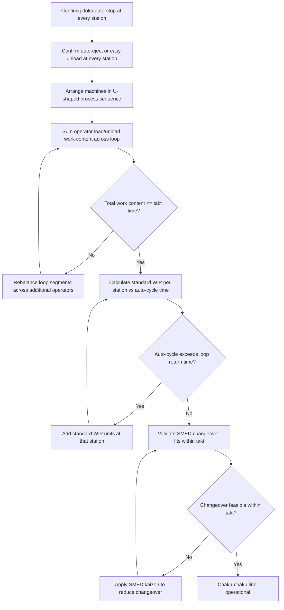

## Chaku Chaku Line Concepts and Load-Load Lines

### Overview

Chaku-chaku (着々, literally "load-load" or "one after another") is a mixed model, single-piece-flow line design in which one operator walks a fixed loop through multiple automated machines, performing only the load, start, and unload actions at each station while the machines themselves execute their process cycles unattended. It is the operational technique that turns a U-shaped cell into a working, low-headcount flow line by combining jidoka-equipped automation with a disciplined operator walking path.

The name reflects the operator's task at each station: load the part, press start ("chaku"), and move immediately to the next station without waiting for or watching the machine's cycle complete — repeated station after station around the loop.

### Prerequisites for a Chaku-Chaku Line

**Key Points**

- **Jidoka (autonomation) at every station**: each machine must be able to run its cycle unattended and automatically stop on completion or on defect detection, since the operator will not be present to intervene mid-cycle
- **Auto-eject or gravity-feed part release**: machines should release the finished part (via auto-eject, chute, or gravity drop) so the operator's unload action is nearly instantaneous rather than requiring extraction
- **Machines physically arranged in process sequence**: almost always in a U-shape, so the walking loop is short and the entry/exit points are adjacent
- **Standard WIP sized to auto-cycle time**: any station whose automatic cycle exceeds the operator's walk-and-load time at that station needs a small fixed buffer so the operator is not forced to wait
- **Quick-changeover capability (SMED)**: since the line handles mixed models in sequence, changeover between variants at each station must fit within the takt time, or the chaku-chaku concept collapses into batch runs

Without jidoka-capable machines, chaku-chaku is not achievable — the entire technique depends on machines being trustworthy enough to run unwatched, which is why chaku-chaku implementation is typically sequenced after jidoka and SMED capability has been established at the individual machine level.

### Operator Task at Each Station

At each station along the loop, the operator performs a repeatable four-part micro-cycle:

1. **Unload** the completed part from the previous machine's output (often already ejected/staged)
2. **Load** that part into the current machine
3. **Start** the machine's automatic cycle (button press, sensor trigger, or automatic start-on-load)
4. **Walk** immediately to the next station, carrying the part removed from *that* station on the way

This produces a continuous walking rhythm where the operator is essentially a conveyance mechanism between machines that do the actual transformation work, while the machines run their cycles in parallel, overlapped with the operator's walk to the next station.

### Worked Example: 5-Station Chaku-Chaku Loop

A cell has 5 processes with the following characteristics:

| Station | Operator Load/Unload Time | Machine Auto-Cycle Time |
| --- | --- | --- |
| P1 (cut) | 4s | 18s |
| P2 (drill) | 3s | 22s |
| P3 (deburr) | 3s | 15s |
| P4 (wash) | 2s | 25s |
| P5 (inspect/pack) | 5s | 10s |

**Total operator work content** (sum of load/unload times) = 4+3+3+2+5 = 17 seconds

If takt time is 20 seconds, a single operator's 17 seconds of walking-loop work content fits comfortably under takt, confirming a 1-operator chaku-chaku configuration is feasible from a labor-content standpoint.

**Standard WIP check**: at each station, compare the machine's auto-cycle time to the time until the operator returns to that station (roughly the sum of all other stations' load/unload + walk time). If the auto-cycle exceeds that return interval, additional standard WIP is required at that station so the operator is never blocked waiting for the machine.

$$WIP_{std,i} = \left\lceil \frac{T_{auto\_cycle,i}}{T_{loop\_return}} \right\rceil$$

Where $T_{loop\_return}$ is the time for the operator to complete the rest of the loop and return to station $i$.

[Inference] Exact WIP requirements depend heavily on walking speed and layout geometry, which are plant-specific; the calculation above gives the standard sizing logic, but real cells typically validate and fine-tune the WIP count through direct time observation on the floor rather than relying solely on the formula.

### Chaku-Chaku vs. Traditional Operator-Attended Line

| Dimension | Traditional Attended Line | Chaku-Chaku Line |
| --- | --- | --- |
| Operator role during machine cycle | Watches / waits at machine | Walks to next station immediately |
| Machine requirement | Can be manually monitored | Must have jidoka auto-stop |
| Headcount flexibility | Fixed per station | High — loop segments reassignable via shojinka |
| Layout shape | Any (often straight/functional) | Almost always U-shaped |
| WIP between stations | Often larger buffer stock | Minimal, only calculated standard WIP |
| Best suited for | Low-automation, manual assembly | Machining, forming, and other automatable unit processes |

### Scaling Headcount on the Same Physical Loop (Shojinka)

Because chaku-chaku relies on a walking loop rather than fixed station assignment, the same physical line can be staffed at different headcounts as demand (and therefore takt time) changes, without any physical relayout:

- **High-demand period (short takt time)**: 2–3 operators each cover a contiguous segment of the loop
- **Low-demand period (long takt time)**: 1 operator covers the entire loop

**Example**

Reusing the 5-station example above (total operator work content 17s):

- At takt = 20s: 1 operator (17s < 20s) — feasible
- At takt = 8s (demand doubles): 17s total work content exceeds 8s takt for a single operator; splitting into 2 operators — e.g., Operator A covers P1–P3 (10s) and Operator B covers P4–P5 (7s) — brings each operator's work content under the 8s takt, restoring feasibility without moving a single machine

This is the practical mechanism behind shojinka (flexible manpower linning): the standardized work combination sheet is rewritten for the new headcount, and operators are retrained on their new loop segment, but the U-shaped chaku-chaku physical layout itself remains unchanged.

### Common Implementation Pitfalls

**Key Points**

- **Machines without reliable auto-stop**: if a machine occasionally requires operator judgment mid-cycle (ambiguous defect signals, jams), the walking rhythm breaks down and the line reverts to attended operation at that station, defeating the purpose
- **Unbalanced walk distances**: if physical spacing between stations is uneven, the "walk" component of the loop can dominate operator time even when load/unload work content is well balanced, requiring layout redesign rather than work-content rebalancing
- **Underestimated auto-cycle overrun**: if a machine's auto-cycle time is close to or exceeds the full loop return time without adequate standard WIP, the operator ends up waiting anyway, silently converting a chaku-chaku line back into an attended line
- **Changeover time creeping into the loop cycle**: if mixed-model changeover at any station cannot be completed within the operator's single pass (i.e., it requires the operator to linger), the walking rhythm is broken for that unit, and the achievable takt time degrades

### Chaku-Chaku Loop Timing Diagram (svg_diagram)

<svg xmlns="http://www.w3.org/2000/svg" viewBox="0 0 800 300">
\<style\>
.label { font-family: Arial, sans-serif; font-size: 12px; fill: #222222; }
.title { font-family: Arial, sans-serif; font-size: 15px; fill: #111111; font-weight: bold; }
.op { fill: #cfe3ff; stroke: #1a6ed8; stroke-width: 1.2; }
.auto { fill: #f2f2f2; stroke: #666666; stroke-width: 1.2; }
.axis { stroke: #333333; stroke-width: 1; }
\</style\>

<text x="200" y="25" class="title">Chaku-Chaku Loop Timing (svg_diagram)</text>

<line x1="60" y1="270" x2="760" y2="270" class="axis" />
<text x="30" y="60" class="label">P1</text>
<text x="30" y="110" class="label">P2</text>
<text x="30" y="160" class="label">P3</text>
<text x="30" y="210" class="label">P4</text>
<rect x="60" y="45" width="30" height="20" class="op" />
<text x="63" y="40" class="label">load 4s</text>
<rect x="90" y="45" width="130" height="20" class="auto" />
<text x="95" y="82" class="label">machine auto-cycle 18s (unattended)</text>
<rect x="220" y="95" width="20" height="20" class="op" />
<text x="215" y="90" class="label">load 3s</text>
<rect x="240" y="95" width="160" height="20" class="auto" />
<text x="245" y="132" class="label">machine auto-cycle 22s</text>
<rect x="400" y="145" width="20" height="20" class="op" />
<text x="395" y="140" class="label">load 3s</text>
<rect x="420" y="145" width="110" height="20" class="auto" />
<text x="425" y="182" class="label">auto-cycle 15s</text>
<rect x="530" y="195" width="15" height="20" class="op" />
<text x="525" y="190" class="label">load 2s</text>
<rect x="545" y="195" width="180" height="20" class="auto" />
<text x="550" y="232" class="label">auto-cycle 25s</text>

<text x="60" y="290" class="label">Operator walks continuously between stations while machines run overlapped</text>

</svg>

### Chaku-Chaku Cell Feasibility Check

### Related Topics

- Jidoka and autonomation design at individual machines
- U-shaped cell layout and design principles
- Standard WIP calculation and sizing
- Shojinka (flexible manpower lining) and headcount scaling
- SMED and quick changeover for mixed-model chaku-chaku lines
- Standardized work combination sheets
- One-piece flow and pitch time control
- Line balancing across multiple operators on a shared loop