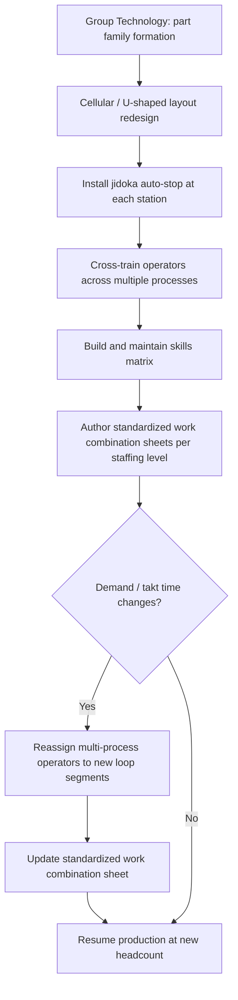

## Multi-Process Handling and Operator Mobility

### Overview

Multi-process handling (多工程持ち, *ta-kotei-mochi*) is the practice of assigning a single operator responsibility for operating multiple distinct machines or processes across a workflow sequence, as opposed to multi-machine handling (multiple identical machines of the same type). It is the staffing principle that makes cellular manufacturing and chaku-chaku lines viable with low headcount, and it requires deliberately cross-trained, mobile operators rather than single-station specialists.

This is a frequently confused distinction in the literature: **multi-machine handling** (one operator running several identical machines, common even in traditional mass production) is fundamentally different from **multi-process handling** (one operator running several *different* process types across the value stream), which is the TPS-specific capability underlying flexible cell staffing.

### Multi-Machine Handling vs. Multi-Process Handling

| Dimension | Multi-Machine Handling | Multi-Process Handling |
| --- | --- | --- |
| Machines operated | Multiple identical machines (same process) | Multiple different processes in sequence |
| Skill requirement | Single skill, repeated | Cross-trained across multiple skills |
| Layout implication | Machines can remain in functional groups | Requires cellular/U-shaped process-sequence layout |
| WIP effect | Does not reduce inter-process WIP | Directly enables single-piece flow (no queue between processes) |
| Typical origin | Efficiency/utilization improvement within a department | Core TPS flow design requirement |

Multi-machine handling alone does not eliminate WIP between processes, because the machines remain organized by function; multi-process handling is what physically relocates and resequences equipment into a flow, which is the actual lead-time-reducing mechanism.

### Why Multi-Process Handling Is Necessary for Flow

In a functional layout with single-process operators, each department completes its full batch before the next department begins, because no operator has visibility or responsibility spanning the sequence. Multi-process handling breaks this by making one operator personally responsible for carrying (or supervising) a part through several consecutive operations, which structurally forces small transfer batches — the operator cannot process a large batch at station 1 before moving to station 2 without idling stations 2–N.

This is the labor-organization counterpart to the physical layout changes described in cellular manufacturing: **the U-shaped cell provides the physical possibility of a short walking loop, while multi-process handling provides the staffing model that actually uses that loop to carry single pieces through multiple operations.**

### Skill Requirements and the Training Matrix

Multi-process handling requires operators trained across multiple, often dissimilar, skill types (e.g., manual assembly, CNC machine operation, inspection, packaging) rather than deep specialization in one operation. This is typically tracked and visually managed via a **skills matrix** (often displayed on the shop floor):



```
Operator     Process A   Process B   Process C   Process D   Process E
Tanaka           ●           ●           ●           ○           ○
Santos            ●           ○           ●           ●           ○
Reyes             ○           ●           ●           ●           ●
Cruz              ●           ●           ○           ○           ●
```

Where ● = fully qualified, ○ = not yet trained/qualified.

**Key Points**

- The matrix makes training gaps visually obvious to supervisors and identifies which operators can flex into which loop segments during headcount changes (shojinka)
- A cell is only as flexible as its least cross-trained operator; if only one person can run Process D, that person becomes a single point of failure for any reconfiguration involving that station
- Training progression is typically staged and tracked (e.g., a certification level per process per operator) rather than treated as binary competent/not-competent, since proficiency affects whether an operator can hold takt time at a newly learned station

### Standardized Work as the Enabler of Mobility

Multi-process handling depends on standardized work combination sheets that define, for each operator at each staffing level, the exact sequence of stations visited, the manual work content at each, and the walking path between them. Without this documentation, operator mobility across processes would produce inconsistent cycle times and quality variation as different operators improvise different sequences.

$$T_{cycle,operator} = \sum_{s \in S_{assigned}} (t_{manual,s} + t_{walk,s \to s+1})$$

Where $S_{assigned}$ is the operator's currently assigned set of stations (which can change with headcount level), $t_{manual,s}$ is manual work time at station $s$, and $t_{walk,s \to s+1}$ is walking time to the next assigned station.

**Example**

An operator is assigned 4 processes with manual times of 8s, 6s, 10s, 7s, and walking times between consecutive stations of 3s, 2s, 4s (loop return walk not shown).

$$T_{cycle} = (8+6+10+7) + (3+2+4) = 31 + 9 = 40 \text{ seconds}$$

If takt time is 45 seconds, this 4-process assignment is feasible with 5 seconds of slack; if demand increases and takt time drops to 35 seconds, the assignment must be rebalanced — either removing one process from this operator's loop (reassigned to another operator) or reducing walk/manual time through kaizen.

### Operator Mobility as a Diagnostic Tool

Because a multi-process operator physically moves between stations, their walking path doubles as a built-in andon/quality check: the operator directly observes the output of station N as they move to load station N+1, providing immediate visual detection of defects, jams, or quality drift without a separate inspection step. This is a structural benefit distinct from — and complementary to — jidoka's automated defect detection at each machine.

[Inference] This diagnostic benefit is generally cited as a secondary advantage of multi-process handling rather than its primary purpose (which is flow and flexible staffing); it is not a substitute for engineered jidoka checks, since an operator walking past a station is not equivalent to a dedicated in-station detection mechanism for defects that are not visually obvious.

### Headcount Reconfiguration via Multi-Process Operators

The same set of cross-trained operators can be regrouped into different loop-segment assignments as takt time changes with demand, without retraining or relayout — this is the practical execution of shojinka, and it depends entirely on the workforce already being multi-process capable.

**Example**

A cell has 6 processes and a trained multi-process workforce. At different demand levels:

| Demand Level | Takt Time | Operators Assigned | Segment Split |
| --- | --- | --- | --- |
| Low | 60s | 1 | All 6 processes (single operator loop) |
| Medium | 30s | 2 | P1–P3 / P4–P6 |
| High | 20s | 3 | P1–P2 / P3–P4 / P5–P6 |

If operators were single-process specialists, this reconfiguration would require either idle specialists at low demand (each capable of only one process, waiting between cycles) or hiring/layoffs at each demand shift; multi-process handling instead allows the *same* workforce to be redeployed across configurations as a scheduling decision rather than a staffing decision.

### Common Implementation Challenges

**Key Points**

- **Training investment and lead time**: building a fully cross-trained team takes sustained investment over time; [Inference] organizations transitioning from single-process to multi-process staffing typically phase in cross-training gradually rather than attempting full multi-process capability across the entire workforce simultaneously, since simultaneous retraining of an entire crew risks quality and output disruption
- **Compensation and job classification friction**: traditional labor structures often tie pay grade to a single job classification; multi-process handling can require renegotiating job classifications or pay structures to reflect broader skill responsibility — [Inference] the specific approach varies significantly by labor market and union agreement structure, and is not a purely technical decision
- **Physical layout constraints**: multi-process handling is only as effective as the layout allows; a functional (process-village) layout with long distances between departments makes true multi-process walking loops impractical regardless of operator skill, which is why cellular/U-shaped layout redesign typically precedes or accompanies multi-process handling rollout
- **Fatigue and ergonomics**: continuous walking loops across multiple stations differ physically from stationary single-process work; cell and loop design must account for reasonable walking distance, station height consistency, and rest/rotation planning

### Multi-Process Handling in the TPS Flow Hierarchy

Multi-process handling sits within a dependency chain of TPS flow concepts: layout must change before staffing can change, and staffing must change before flexible headcount (shojinka) becomes usable in response to demand shifts.



### Skills Matrix Visualization (svg_diagram)

<svg xmlns="http://www.w3.org/2000/svg" viewBox="0 0 700 260">
\<style\>
.cell { fill: #ffffff; stroke: #999999; stroke-width: 1; }
.filled { fill: #1a6ed8; }
.empty { fill: none; stroke: #999999; stroke-width: 1.5; }
.label { font-family: Arial, sans-serif; font-size: 12px; fill: #222222; }
.title { font-family: Arial, sans-serif; font-size: 15px; fill: #111111; font-weight: bold; }
\</style\>

<text x="150" y="25" class="title">Operator Skills Matrix (svg_diagram)</text>

<text x="20" y="65" class="label">Tanaka</text>

<text x="20" y="105" class="label">Santos</text>

<text x="20" y="145" class="label">Reyes</text>

<text x="20" y="185" class="label">Cruz</text>

<text x="130" y="50" class="label">P1</text>

<text x="230" y="50" class="label">P2</text>

<text x="330" y="50" class="label">P3</text>

<text x="430" y="50" class="label">P4</text>

<text x="530" y="50" class="label">P5</text>

<rect x="110" y="55" width="30" height="20" class="cell" />
<circle cx="125" cy="65" r="8" class="filled" />
<rect x="210" y="55" width="30" height="20" class="cell" />
<circle cx="225" cy="65" r="8" class="filled" />
<rect x="310" y="55" width="30" height="20" class="cell" />
<circle cx="325" cy="65" r="8" class="filled" />
<rect x="410" y="55" width="30" height="20" class="cell" />
<circle cx="425" cy="65" r="8" class="empty" />
<rect x="510" y="55" width="30" height="20" class="cell" />
<circle cx="525" cy="65" r="8" class="empty" />
<rect x="110" y="95" width="30" height="20" class="cell" />
<circle cx="125" cy="105" r="8" class="filled" />
<rect x="210" y="95" width="30" height="20" class="cell" />
<circle cx="225" cy="105" r="8" class="empty" />
<rect x="310" y="95" width="30" height="20" class="cell" />
<circle cx="325" cy="105" r="8" class="filled" />
<rect x="410" y="95" width="30" height="20" class="cell" />
<circle cx="425" cy="105" r="8" class="filled" />
<rect x="510" y="95" width="30" height="20" class="cell" />
<circle cx="525" cy="105" r="8" class="empty" />
<rect x="110" y="135" width="30" height="20" class="cell" />
<circle cx="125" cy="145" r="8" class="empty" />
<rect x="210" y="135" width="30" height="20" class="cell" />
<circle cx="225" cy="145" r="8" class="filled" />
<rect x="310" y="135" width="30" height="20" class="cell" />
<circle cx="325" cy="145" r="8" class="filled" />
<rect x="410" y="135" width="30" height="20" class="cell" />
<circle cx="425" cy="145" r="8" class="filled" />
<rect x="510" y="135" width="30" height="20" class="cell" />
<circle cx="525" cy="145" r="8" class="filled" />
<rect x="110" y="175" width="30" height="20" class="cell" />
<circle cx="125" cy="185" r="8" class="filled" />
<rect x="210" y="175" width="30" height="20" class="cell" />
<circle cx="225" cy="185" r="8" class="filled" />
<rect x="310" y="175" width="30" height="20" class="cell" />
<circle cx="325" cy="185" r="8" class="empty" />
<rect x="410" y="175" width="30" height="20" class="cell" />
<circle cx="425" cy="185" r="8" class="empty" />
<rect x="510" y="175" width="30" height="20" class="cell" />
<circle cx="525" cy="185" r="8" class="filled" />

<text x="20" y="230" class="label">Filled = qualified, Outline only = not yet trained</text>

</svg>

### Related Topics

- U-shaped cell layout and design principles
- Chaku-chaku line concepts and load-load lines
- Shojinka (flexible manpower lining) and headcount scaling
- Standardized work combination sheets
- Jidoka and autonomation at individual stations
- Skills matrix design and training progression tracking
- Group Technology and part family formation
- One-piece flow and pitch time control