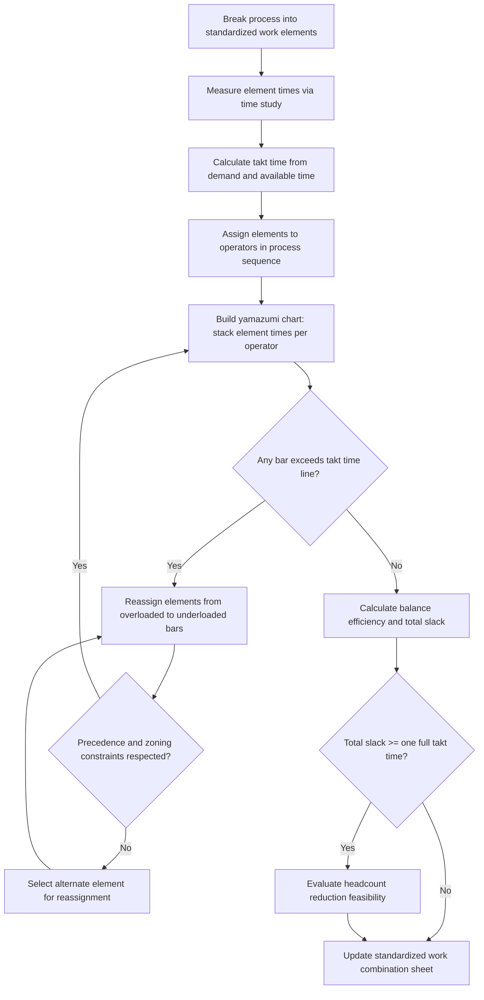

## Line Balancing and Yamazumi Charts

### Overview

Line balancing is the process of distributing work content across stations or operators along a production line so that each assigned workload fits within takt time as evenly as possible, minimizing idle time and eliminating station-level bottlenecks. The **yamazumi chart** (山積み表, literally "stacked mountain" or "piled-up chart") is the primary visual tool used in TPS to perform and communicate this balancing: a stacked bar chart where each bar represents an operator or station, segmented by individual task times, allowing imbalance to be seen at a glance against a horizontal takt time line.

Yamazumi charts convert an abstract balancing calculation into a visual, shop-floor-usable artifact that both engineers and operators can read without specialized training, which is why they remain the standard tool for line balancing communication in TPS even where the underlying analysis may be spreadsheet- or software-driven.

### Core Terminology

**Key Points**

- **Takt time line**: a horizontal reference line drawn across the chart at the calculated takt time value; any bar segment stack exceeding this line indicates that operator/station cannot keep pace with customer demand
- **Element / task time**: the time required for one discrete, standardized unit of manual work (e.g., "pick part," "insert bolt," "torque to spec"), the atomic building block stacked within each bar
- **Bottleneck station**: the station with the highest total work content; this station sets the maximum achievable line output rate regardless of how well other stations are balanced
- **Balance loss / balancing efficiency**: the proportion of total idle time across all stations relative to total available time, quantifying how much capacity is lost to imbalance
- **Line of balance**: the target height (takt time) that all bars should approach without exceeding, representing the ideal fully-balanced state

### Constructing a Yamazumi Chart

**Step 1 — Break the process into elements**

Decompose the full process into discrete work elements with measured or estimated standard times, using time study or standardized work observation.

**Step 2 — Calculate takt time**

$$T_{takt} = \frac{T_{available}}{D_{customer}}$$

**Step 3 — Assign elements to operators/stations**

Group elements into station assignments, typically starting from a natural process sequence and adjusting to balance load.

**Step 4 — Stack and plot**

For each operator/station, stack the element times as segments within one vertical bar, in process order (bottom to top or by task type). Draw the takt time line horizontally across all bars.

**Step 5 — Identify imbalance and rebalance**

Visually identify overloaded bars (exceeding takt) and underloaded bars (well below takt); move elements between adjacent stations to level the bars closer to the takt line.

### Worked Example

A process has 5 work elements with the following standard times, currently assigned to 3 operators:

| Element | Time (s) | Assigned Operator |
| --- | --- | --- |
| E1: Pick and place | 12 | Op 1 |
| E2: Insert component | 18 | Op 1 |
| E3: Fasten | 22 | Op 2 |
| E4: Inspect | 8 | Op 2 |
| E5: Pack | 15 | Op 3 |

Takt time = 30 seconds (calculated from available time and demand).

**Initial (unbalanced) stack totals**:

- Op 1: 12 + 18 = 30s (at takt — no slack)
- Op 2: 22 + 8 = 30s (at takt — no slack)
- Op 3: 15s (15s idle — significantly underloaded)

The yamazumi chart makes this imbalance immediately visible: Op 1 and Op 2 bars sit exactly at the takt line with zero slack (fragile — any minor delay causes a takt violation), while Op 3's bar is roughly half-height, indicating available capacity that is not being used to reduce headcount or absorb work from the other two.

**Rebalanced assignment** (moving E4 from Op 2 to Op 3):

- Op 1: 30s
- Op 2: 22s (8s idle)
- Op 3: 15 + 8 = 23s (7s idle)

This redistribution reduces the risk of Op 1/Op 2 line stops from minor variation and creates more even slack across all three bars, though Op 1 remains the bottleneck at exactly takt time.

### Textual (ASCII) Yamazumi Representation



```
Time (s)
35 |
|                                  --- Takt Time (30s) ---
30 |==========
|  E2:18s  |
25 |----------|===========
|          |  E3:22s   |
20 |----------|           |----------
|  E1:12s  |-----------|  E5:15s  |
15 |----------|  E4:8s    |          |
10 |          |-----------|----------|
|          |           |
 5 |          |           |
|__________|___________|__________
      Op 1        Op 2        Op 3
```

Reading left to right, this shows the *rebalanced* state where E4 has been moved to Op 3; Op 1 (30s) sits exactly on the takt line while Op 2 (22s) and Op 3 (23s) show visible idle headroom below the line.

### Balancing Efficiency Calculation

$$\eta_{balance} = \frac{\sum t_i}{N \times T_{cycle,max}} \times 100\%$$

Where $\sum t_i$ is total work content across all elements, $N$ is number of stations/operators, and $T_{cycle,max}$ is the cycle time of the slowest (bottleneck) station.

**Example**

Using the rebalanced example: total work content = 12+18+22+8+15 = 75s, $N$ = 3, bottleneck = 30s.

$$\eta_{balance} = \frac{75}{3 \times 30} \times 100\% = \frac{75}{90} \times 100\% = 83.3\%$$

The remaining 16.7% represents balance loss — idle time distributed across Op 2 and Op 3 that cannot be eliminated without further rebalancing, reducing the bottleneck, or reducing headcount.

### Reducing Headcount via Yamazumi Analysis

A central use of yamazumi charts in kaizen is determining whether total work content, once minimized through waste elimination, can be redistributed across *fewer* operators while still fitting under takt.

**Example**

If total work content of 75s (from above) is redistributed across 2 operators instead of 3, each would need to absorb roughly 37.5s of work — but this exceeds the 30s takt time, meaning 2-operator staffing is infeasible unless takt time increases (lower demand) or work content is reduced via kaizen (eliminating waste within elements, e.g., removing unnecessary walking or motion inside E3's 22 seconds).

This is the quantitative basis for headcount reduction in kaizen events: the yamazumi chart shows visually whether "one operator's worth" of slack exists across the line (i.e., whether total idle time summed across all bars is close to one full takt-time's worth), which — if achievable — justifies eliminating one station's staffing and redistributing its work among the remaining operators.

$$Slack_{total} = \sum_{j=1}^{N} (T_{takt} - t_j)$$

If $Slack_{total} \geq T_{takt}$, removing one operator and redistributing their work across the remaining $N-1$ operators is numerically feasible (subject to physical/sequence constraints on which elements can actually be reassigned).

### Line Balancing Constraints Beyond Raw Time

**Key Points**

- **Precedence constraints**: some elements must occur in a fixed order (e.g., drilling before deburring) and cannot be freely reassigned regardless of time totals
- **Zoning constraints**: certain elements may need to remain physically co-located (same tool, same fixture, same skill certification) and cannot be split across operators arbitrarily
- **Ergonomic and safety constraints**: rebalancing must avoid concentrating physically demanding tasks disproportionately on one operator even if the time math is even
- **Walking time between reassigned elements**: moving an element to a different operator may introduce new walking distance not captured in the original element time study, requiring the yamazumi chart to be updated with revised walk-inclusive times after any reassignment

[Inference] In practice, purely time-based rebalancing (moving elements solely to minimize the tallest bar) can produce technically balanced but operationally poor assignments if these constraints are ignored; experienced balancing typically iterates between the chart and a walk of the actual physical line before finalizing a new standardized work combination sheet.

### Yamazumi Charts vs. Other Balancing Tools

| Tool | Primary Use | Format |
| --- | --- | --- |
| Yamazumi chart | Visual station/operator load balancing against takt | Stacked bar chart |
| Standardized work combination sheet | Detailed sequence, time, and walk path per operator | Tabular/timeline |
| Precedence diagram | Shows allowable task ordering constraints | Network/node diagram |
| Line balancing heuristics (e.g., Ranked Positional Weight) | Algorithmic station assignment for large task sets | Computational/tabular |

[Inference] For lines with a very large number of discrete elements (dozens to hundreds, as in complex final assembly), algorithmic heuristics such as Ranked Positional Weight or COMSOAL are often used to generate an initial feasible assignment, which is then visualized and fine-tuned using a yamazumi chart — the chart and the algorithm are typically complementary rather than competing approaches, with the algorithm handling combinatorial search and the chart handling human validation and communication.

### Yamazumi Chart Structure (svg_diagram)

<svg xmlns="http://www.w3.org/2000/svg" viewBox="0 0 600 380">
\<style\>
.seg { stroke: #333333; stroke-width: 1; }
.label { font-family: Arial, sans-serif; font-size: 12px; fill: #111111; }
.title { font-family: Arial, sans-serif; font-size: 15px; fill: #111111; font-weight: bold; }
.takt { stroke: #c0392b; stroke-width: 2; stroke-dasharray: 6,4; }
.taktlabel { font-family: Arial, sans-serif; font-size: 12px; fill: #c0392b; font-weight: bold; }
\</style\>

<text x="150" y="25" class="title">Yamazumi Chart (svg_diagram)</text>

<line x1="60" y1="330" x2="560" y2="330" stroke="#333333" stroke-width="1.5" />
<line x1="60" y1="330" x2="60" y2="60" stroke="#333333" stroke-width="1.5" />
<line x1="60" y1="130" x2="560" y2="130" class="takt" />
<text x="480" y="122" class="taktlabel">Takt Time = 30s</text>
<rect x="100" y="192" width="80" height="138" fill="#a8d0f0" class="seg" />
<text x="115" y="270" class="label">E1: 12s</text>
<rect x="100" y="130" width="80" height="62" fill="#5b9bd5" class="seg" />
<text x="115" y="165" class="label">E2: 18s</text>
<text x="110" y="350" class="label">Op 1 (30s)</text>
<rect x="250" y="216" width="80" height="114" fill="#a8d0f0" class="seg" />
<text x="265" y="278" class="label">E3: 22s</text>
<text x="260" y="350" class="label">Op 2 (22s)</text>
<rect x="400" y="203" width="80" height="127" fill="#a8d0f0" class="seg" />
<text x="415" y="272" class="label">E5: 15s</text>
<rect x="400" y="167" width="80" height="36" fill="#5b9bd5" class="seg" />
<text x="415" y="188" class="label">E4: 8s</text>
<text x="405" y="350" class="label">Op 3 (23s)</text>
</svg>

### Line Balancing Process Flow



### Related Topics

- Takt time calculation and demand-driven pacing
- Standardized work combination sheets
- Ranked Positional Weight and other line balancing heuristics
- Multi-process handling and operator mobility
- Chaku-chaku line concepts and load-load lines
- Time study and standard time measurement
- Kaizen events for work content reduction
- Shojinka (flexible manpower lining) and headcount scaling