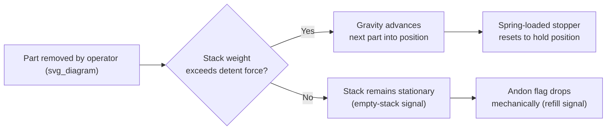

## Karakuri Devices and Low-Cost Mechanical Automation

### Definition and Origin

Karakuri (からくり) refers to mechanisms that use gravity, springs, cams, levers, and counterweights to perform work automatically, without electricity, motors, pneumatics, or electronic controls. The term derives from traditional Japanese karakuri ningyo — mechanical puppets built in the Edo period that used clockwork-like mechanisms to perform tea-serving or archery motions. Toyota and its supplier network adapted the same mechanical principles into shop-floor material handling and assist devices, branding the practice "Karakuri Kaizen" as part of the broader Toyota Production System toolkit for low-cost automation (often called "Jidoka-lite" or informally "poor man's automation," though this term undersells the sophistication involved).

### Position Within TPS and Production Leveling

Within a Production Leveling and Flow Design chapter, karakuri devices matter because they let a line achieve smoothed, one-piece flow and reduced motion waste without the capital cost, changeover complexity, and maintenance burden of servo-driven or PLC-controlled automation. Where full automation may be justified only at high, stable volumes, karakuri is well suited to the variable, mixed-model environments that leveled production (heijunka) creates, since:

- Devices are cheap enough to build, discard, or rebuild as takt time or model mix changes
- They introduce no new failure modes tied to electronics, sensors, or software
- They keep operators engaged with the process (avoiding the "black box" problem of full automation) while removing pure physical burden

**Key Points**

- Karakuri is a *design philosophy*, not a single device — the goal is "wisdom before capital" (chie wo dase, kane wo dasu na — "put out wisdom, not money")
- Devices exploit potential energy (gravity), kinetic energy already present in the process, or stored mechanical energy (springs)
- Because there is no controller, correct behavior must be guaranteed by geometry and physics, which forces very disciplined engineering

### Core Mechanical Principles

Karakuri devices are built from combinations of a small set of classical mechanism types:

- **Gravity feed / decline conveyors**: parts or carts roll or slide downhill between stations, eliminating the need for a powered conveyor
- **Counterweights**: a hanging mass on a pulley or lever offsets the weight of a part or fixture so an operator can lift or lower heavy items with minimal force
- **Cam and linkage mechanisms**: convert one motion (e.g., a cart passing a trigger) into another (e.g., a gate opening, a stopper releasing)
- **Springs and elastic elements**: store energy during a "loading" motion (e.g., pushing a cart into position) and release it to perform a return stroke or ejection
- **Escapements and ratchets**: control timing or prevent back-flow, similar in principle to clock escapements, ensuring one part is released at a time
- **Friction and detent mechanisms**: hold a part in a fixed position until a defined force overcomes the detent, providing simple "click-stop" positioning without a motor

**Example**

A classic karakuri device is a gravity-fed, weight-triggered part dispenser: a chute holds a stack of parts at a slight decline. When an operator removes the front part, the stack's own weight (assisted by a light spring) advances the next part into presentation position. No sensor, no motor — the mechanism reads the physical state of the stack directly and reacts through geometry alone.

### Common Application Categories

**1. Gravity-fed racks and flow racks**

Inclined roller or skate-wheel racks that present parts at a fixed pick point using only gravity. FIFO (first-in-first-out) sequencing is enforced mechanically by the incline and lane width, supporting pull-system replenishment without electronic kanban signals.

**2. Karakuri carts (self-propelled or gravity carts)**

Carts that use a released spring, a falling weight, or an operator's push-energy (captured and redirected via a ratchet) to travel between stations. Some designs use a falling counterweight connected via a cable and pulley system to tow a cart along a track — used extensively in Toyota's supplier andon and parts-delivery systems (often called "karakuri AGVs" informally, though they are not powered guided vehicles in the traditional sense).

**3. Lift-assist and turnover devices**

Counterweighted or cam-driven fixtures that rotate or elevate a heavy workpiece (e.g., flipping an engine block or door panel) using a stored-energy return stroke, reducing operator strain without a powered actuator.

**4. Automatic gates, stoppers, and diverters**

Cam-triggered gates that open when a cart or pallet physically contacts a lever, then close automatically via spring return — used to control WIP (work-in-process) release at a pace matching takt time.

**5. Signal and andon triggers**

Purely mechanical flag or flip-signal devices triggered by a part's weight or position, used to visually indicate line status without electrical wiring.

### Design Process for Karakuri Kaizen

**Next Steps** *(as a design workflow, not future exploration)*

1. **Observe the waste**: identify a specific instance of motion waste, waiting, or operator strain (e.g., "operator bends to lift a 12 kg fixture 40 times per shift")
2. **Quantify the physics**: measure the force, distance, and timing involved — this becomes the engineering spec for the mechanism
3. **Select the energy source**: decide whether gravity, an existing motion, or a stored spring can supply the needed force
4. **Prototype cheaply**: build with wood, PVC pipe, off-the-shelf casters, weights, and hardware-store springs before committing to a permanent build — consistent with the TPS principle of learning through low-cost experimentation
5. **Validate reliability under variation**: test with the full range of expected part weights, cart loads, and operator behaviors, since a mechanical system has no software to handle edge cases
6. **Standardize and document**: once validated, the device becomes part of the standardized work instruction for that station

### Comparison to Powered Automation

| Dimension | Karakuri (mechanical) | Powered/electronic automation |
| --- | --- | --- |
| Capital cost | Very low (hardware-store components) | High (drives, controllers, sensors) |
| Changeover flexibility | High — can be physically reconfigured quickly | Often requires reprogramming |
| Failure modes | Mechanical wear only | Mechanical + electrical + software |
| Maintenance skill required | Basic mechanical | Electrical/controls technician |
| Energy consumption | Zero (passive) | Continuous power draw |
| Scalability to high volume | Limited | High |
| Suitability under heijunka (mixed, leveled volume) | High | Moderate to low unless flexible automation is used |

[Inference] The suitability comparison in the table reflects general TPS practice and published case studies rather than a universal engineering rule; specific applications may favor powered automation even at moderate volumes if precision tolerances exceed what a mechanical device can reliably hold.

### Illustrative Mechanism Diagram

### Counterweight Lift-Assist Schematic (svg_diagram)

<svg xmlns="http://www.w3.org/2000/svg" viewBox="0 0 500 320">
<text x="250" y="24" font-size="14" text-anchor="middle" font-family="sans-serif" font-weight="bold">Counterweight Lift-Assist Mechanism (svg_diagram)</text>
<line x1="120" y1="40" x2="120" y2="280" stroke="black" stroke-width="3" />
<circle cx="120" cy="60" r="10" fill="none" stroke="black" stroke-width="2" />
<line x1="130" y1="60" x2="370" y2="60" stroke="black" stroke-width="2" />
<rect x="360" y="60" width="20" height="40" fill="#888" />
<text x="370" y="115" font-size="11" text-anchor="middle" font-family="sans-serif">Workpiece</text>
<line x1="130" y1="55" x2="220" y2="20" stroke="black" stroke-width="2" />
<rect x="200" y="0" width="30" height="20" fill="#555" />
<text x="215" y="-6" font-size="11" text-anchor="middle" font-family="sans-serif" />
<text x="215" y="14" font-size="10" text-anchor="middle" fill="white" font-family="sans-serif">CW</text>
<text x="215" y="35" font-size="11" text-anchor="middle" font-family="sans-serif">Counterweight</text>
<rect x="90" y="280" width="60" height="15" fill="black" />
<text x="120" y="305" font-size="11" text-anchor="middle" font-family="sans-serif">Pivot support</text>
<path d="M 250 150 Q 300 130 350 150" fill="none" stroke="#c00" stroke-width="1.5" stroke-dasharray="4,3" />
<text x="300" y="145" font-size="10" text-anchor="middle" fill="#c00" font-family="sans-serif">operator applies light force</text>
</svg>

The counterweight is sized so that its moment about the pivot nearly balances the moment of the workpiece, leaving only a small residual force for the operator to overcome — converting a full lift into a light guiding motion.

### Known Toyota and Supplier Examples

- **Gravity roller conveyors between sub-assembly and main line**, feeding parts at the exact rate consumed, enforcing FIFO without powered conveyor drives
- **Spring-return parts-presentation carts** at supplier plants (notably documented in Toyota supplier kaizen case studies) that swing a bin of parts into an operator's reach envelope after each cycle and swing back automatically
- **Weight-driven tow systems** for delivering kitted parts to line-side, using a falling counterweight in a vertical shaft connected via cable to a cart on the shop floor, replacing small powered tow-tractors for short, fixed routes

[Unverified] Specific proprietary internal Toyota device names and exact dimensional specifications are generally not published externally; publicly available material largely consists of conference presentations, consultant case studies, and derivative implementations at other manufacturers rather than official Toyota engineering documentation.

### Relationship to Jidoka and Poka-Yoke

Karakuri devices frequently double as poka-yoke (error-proofing) mechanisms, since a purely mechanical gate or stopper can physically prevent an out-of-sequence part from advancing (e.g., a shaped cam that only releases when a part is correctly oriented). This overlaps with Jidoka's principle of building quality into the process rather than inspecting for it afterward, but karakuri achieves it through geometry rather than through automatic stopping triggered by a sensor.

### Limitations and Constraints

- Precision is bounded by manufacturing tolerances of the mechanical parts themselves; not suitable for micron-level positioning
- Performance can drift with wear (spring fatigue, friction surface degradation), requiring periodic mechanical PM (preventive maintenance) rather than software recalibration
- Force and timing are fixed by physical design; adapting to a significantly different part weight or cycle time may require rebuilding rather than reprogramming
- Best suited to repetitive, well-characterized motions — highly variable or unpredictable material flows are harder to serve reliably with passive mechanisms

**Related Topics**

- Heijunka (production leveling) box design and pull signal integration with gravity racks
- Poka-yoke mechanical error-proofing design patterns
- Standardized work combination sheets incorporating karakuri motion times
- Chaku-chaku (load-load) line design using gravity-assisted part transfer
- Low-cost automation (LCA) cells vs. karakuri vs. full servo automation decision criteria
- Kaizen workshop methods for rapid mechanical prototyping (cardboard/PVC mockups)