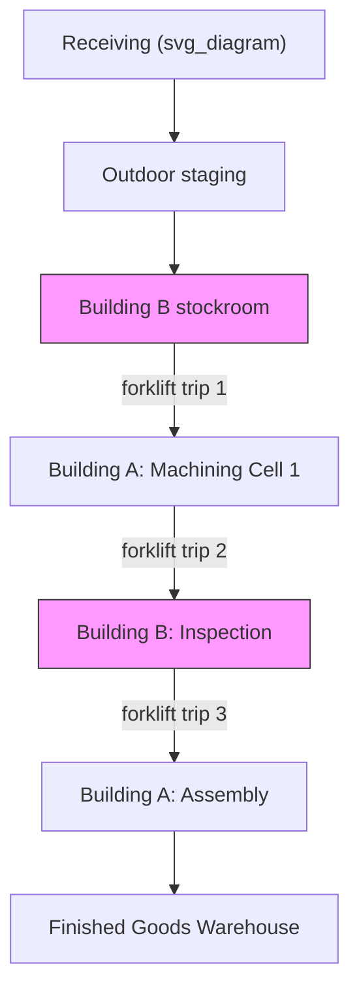

## Designing Layouts That Minimize Transport and Motion

### Purpose and Position in Flow Design

Layout design in TPS is not primarily an aesthetic or space-utilization exercise — it is the physical embodiment of flow. Transportation and motion are two of the seven classical wastes (muda), and a plant's floor layout is the single largest determinant of how much of both wastes are structurally "baked in" before a single unit is ever produced. Where standardized work reduces the *time* an operator spends moving, layout design reduces the *distance and frequency* of movement required by the process architecture itself, for both materials (transportation) and people (motion).

**Key Points**

- Transportation waste = movement of materials, parts, or information between processes
- Motion waste = movement of people (operators) within a process, including reaching, walking, bending, and turning
- Good layout design attacks the *root cause* of both — distance and unnecessary handoffs — rather than merely speeding up movement that shouldn't be happening at all
- Layout decisions are difficult and costly to reverse once concrete is poured and utilities are run, so they warrant disproportionate upfront analysis relative to their apparent simplicity

### Distinguishing Transportation Waste from Motion Waste

| Aspect | Transportation | Motion |
| --- | --- | --- |
| What moves | Materials, parts, WIP, documents | People (operators) |
| Typical cause | Poor process sequencing, batch production, distant storage | Poor workstation ergonomics, poorly placed tools/parts, non-standardized work |
| Layout lever | Process-village vs. flow-line arrangement, point-of-use storage | Workstation micro-layout, tool/part presentation within reach envelope |
| Measurement | Distance × frequency × load (often expressed as a spaghetti diagram or transport matrix) | Time-and-motion study, reach-envelope analysis, operator walk-path diagrams |

Both wastes are considered "non-value-adding but currently necessary" only when they cannot yet be eliminated; the aspirational target of layout design is to reduce both toward zero, not merely optimize them.

### Core Layout Principles in TPS

**1. Flow-based over functional (process-village) layout**

Traditional plants often group machines by function (all lathes together, all mills together — a "job shop" or process-village layout), which forces parts to travel long, criss-crossing distances between departments as they are processed. TPS favors a product-flow layout, where equipment is arranged in the sequence of processing steps for a part family, minimizing travel distance to near zero between consecutive operations.

**2. Cellular manufacturing and U-shaped cells**

Machines and workstations are arranged in a U-shape (or similar compact form) following process sequence. This:

- Minimizes walking distance between the last and first operations (entry and exit points sit near each other)
- Allows one operator to tend multiple machines (multi-process handling) since the U-shape keeps all stations within a short walking loop
- Makes it visually obvious when material is flowing backward or WIP is accumulating

**3. Point-of-use storage (storage at line-side)**

Materials are stored as close as physically possible to where they are consumed, minimizing both the transport distance for material handlers and the motion an operator makes to retrieve a part. This is the physical enabler of small-lot delivery and kanban replenishment.

**4. Minimizing handoffs and queue points**

Every time material is set down, staged, or transferred between systems (e.g., conveyor to cart to shelf), a wait state and a transport event are introduced. Layouts should minimize the number of discrete "landing points" a part touches between raw material and finished good.

**5. Right-sized, mobile equipment over large, fixed equipment**

Large, monument-style machines (very high-throughput but immobile) tend to force process-village layouts because they cannot be repositioned as product mix or volume changes. TPS favors smaller, dedicated, often manually movable equipment that can be reconfigured into flow layouts and easily rearranged as demand or product mix changes (a principle sometimes summarized as avoiding "monuments").

**6. Straight and unidirectional material flow**

Even where a U-cell isn't used, overall plant flow should avoid backtracking, crossing paths, and circular routes. A single, generally unidirectional flow path from receiving through shipping reduces both congestion and confusion about material status.

### The Spaghetti Diagram as a Diagnostic Tool

A spaghetti diagram traces the actual physical path taken by a part (or an operator) over one or more cycles, overlaid on the floor plan. Long, tangled, looping paths visually reveal transport and motion waste that a written process flow chart would hide.

**Example**

A part currently travels: Receiving → outdoor staging → Building B stockroom → forklift to Building A → machining cell 1 → forklift back to Building B for inspection → forklift again to Building A for assembly → finished goods warehouse. A spaghetti diagram of this path, drawn to scale, typically reveals many redundant crossings that a re-sequenced, co-located layout would eliminate — often the single most persuasive artifact for justifying capital investment in re-layout.

### Quantitative Layout Analysis Methods

**Distance-Frequency (Flow) Matrix**

A from-to chart records the volume of material moved between every pair of departments or workstations. Combined with inter-department distances, this produces a transport-work score:

$$T = \sum_{i,j} f_{ij} \cdot d_{ij}$$

where $f_{ij}$ is the frequency (or volume) of moves from location $i$ to $j$, and $d_{ij}$ is the distance between them. Layout alternatives are compared by minimizing total $T$ — departments with high mutual flow should be placed adjacent to one another.

**Systematic Layout Planning (SLP)**

A structured method (originating with Richard Muther, predating but compatible with TPS) that combines the flow matrix with a qualitative relationship chart (rating closeness desirability from "Absolutely necessary" to "Undesirable" for pairs of activities not driven purely by material flow — e.g., placing a quality lab near a noisy stamping press may be undesirable regardless of material flow volume).

**Motion Economy Principles (for workstation-level design)**

Derived from classical time-and-motion study, adapted within TPS ergonomics work:

- Both hands should begin and end their motions simultaneously
- Motions should be confined to the lowest classification that will accomplish the work (finger motion < wrist motion < elbow motion < shoulder motion < full body motion)
- Tools and materials should be located within the normal reach envelope, pre-positioned for the next operation
- Gravity should be used to move material to the point of use wherever possible (linking directly to karakuri-style gravity feed)

### Reach Envelope and Workstation Micro-Layout (svg_diagram)

<svg xmlns="http://www.w3.org/2000/svg" viewBox="0 0 480 300">
<text x="240" y="20" font-size="14" text-anchor="middle" font-family="sans-serif" font-weight="bold">Operator Reach Envelope (svg_diagram)</text>
<circle cx="240" cy="180" r="120" fill="none" stroke="#c00" stroke-width="2" stroke-dasharray="6,4" />
<text x="240" y="60" font-size="10" text-anchor="middle" fill="#c00" font-family="sans-serif">Maximum reach (occasional use)</text>
<circle cx="240" cy="180" r="65" fill="none" stroke="#080" stroke-width="2" />
<text x="240" y="118" font-size="10" text-anchor="middle" fill="#080" font-family="sans-serif">Normal reach (frequent use)</text>
<circle cx="240" cy="180" r="8" fill="black" />
<text x="240" y="205" font-size="10" text-anchor="middle" font-family="sans-serif">Operator</text>
<rect x="215" y="140" width="20" height="15" fill="#555" />
<text x="200" y="135" font-size="9" text-anchor="middle" font-family="sans-serif">Tool</text>
<rect x="290" y="150" width="20" height="15" fill="#555" />
<text x="300" y="140" font-size="9" text-anchor="middle" font-family="sans-serif">Part bin</text>
<rect x="150" y="90" width="20" height="15" fill="#999" />
<text x="150" y="80" font-size="9" text-anchor="middle" font-family="sans-serif">Rare-use item</text>
</svg>

High-frequency items (tools, fasteners, the next part to assemble) belong within the normal (green) reach zone; only rarely accessed items should be placed in the outer (red) zone, since every reach beyond the normal envelope adds motion time and physical strain multiplied across every cycle of the shift.

### Layout Types Compared

| Layout type | Transport characteristic | Best suited for |
| --- | --- | --- |
| Process/functional (job shop) | High — parts travel between distant, function-grouped departments | High product variety, low volume, non-repetitive routings |
| Product/line layout | Low — equipment sequenced to match one product's process flow | High volume, stable product, dedicated flow |
| Cellular (U-shaped cell) | Very low within the cell | Mixed-model, moderate volume, multi-process handling by one operator |
| Fixed-position layout | N/A (product stationary; resources travel to it) | Very large or immobile products (aircraft, ships) |

[Inference] The characterization of which layout type is "best suited" reflects general operations-management consensus rather than a fixed rule; actual suitability depends on specific volume, variety, and capital constraints at a given facility.

### Integration with Production Leveling (Heijunka)

Layout and heijunka are mutually reinforcing: a leveled schedule assumes small, frequent transfers of mixed models through the line, which is only physically efficient if transport distances between processes are already minimized. A layout with long transport distances forces batching (to amortize the transport cost across more units), which directly undermines the small-lot, mixed-model flow that leveling requires. Conversely, once a flow-based layout is achieved, the marginal cost of switching models becomes low enough that heijunka becomes practically feasible.

### Practical Design Process

**Next Steps** *(design workflow)*

1. Map current-state material and operator flow using spaghetti diagrams and a from-to distance/frequency matrix
2. Group parts into families by process routing similarity to identify natural cell boundaries
3. Calculate takt time and required cell/line capacity to size workstations and equipment appropriately (avoiding oversized "monument" equipment)
4. Design U-shaped or flow-line cell arrangement around the sequence of operations for each part family
5. Apply motion economy principles at each individual workstation (reach envelope, gravity feed, two-handed simultaneous motion)
6. Position point-of-use storage and kanban locations at the boundary of each cell to minimize material handler travel
7. Pilot with cardboard/mockup layouts (a common Toyota practice) before committing to permanent fixtures or floor markings
8. Re-validate the layout against a future-state spaghetti diagram, confirming reduced total transport-distance score $T$

### Common Pitfalls

- Designing layout around current department/functional silos rather than product flow, preserving transport waste under a new floor plan
- Oversizing equipment or storage "just in case," which increases footprint and therefore travel distance
- Ignoring information flow (paperwork, kanban card routing) as a form of transport waste alongside physical material movement
- Failing to revisit layout when product mix shifts significantly, allowing an originally efficient flow layout to degrade back into ad hoc, batch-oriented movement

**Related Topics**

- Systematic Layout Planning (SLP) and relationship charts
- Cellular manufacturing and multi-process handling (tajun mochi)
- Point-of-use (POU) storage and line-side kanban design
- Time-and-motion study and operator balance charts
- Karakuri devices and gravity-fed material presentation
- Takt time calculation and cell capacity sizing