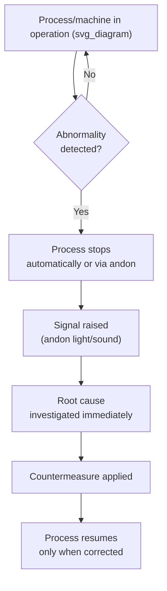

## Autonomation as Automation with a Human Touch

### Definition and Etymology

Autonomation is the English rendering of jidoka (自働化), a term deliberately distinguished from the more common Japanese word for automation, jidoka written with a different character set (自動化) meaning simple, unsupervised mechanization. The character Toyota inserted — 働 (person/labor) — replaces the standard automation character's radical, embedding the concept of a human element directly into the word itself. The resulting compound is often glossed as "automation with a human touch" or "intelligent automation": machines that can detect an abnormal condition and stop themselves, exactly as a skilled human operator would, rather than continuing to run and propagate a defect.

**Key Points**

- Jidoka is one of the two pillars of TPS, alongside Just-in-Time
- The core mechanism is autonomous defect detection plus autonomous stopping, not full unattended operation
- The "human touch" refers to the machine behaving with the judgment a human would exercise, not to a human physically operating the machine at all times

### Origin: Sakichi Toyoda's Automatic Loom

The concept originates with Sakichi Toyoda's automatic loom, invented in the early 20th century. Toyoda's loom would stop itself automatically the instant a thread broke, preventing the machine from continuing to weave defective cloth. Before this innovation, a single operator had to watch several looms continuously, simply to catch thread breaks before flawed fabric accumulated. The self-stopping mechanism decoupled the operator from constant visual monitoring, freeing one worker to oversee many looms — since the machine itself would signal an abnormality and halt.

This is the founding case study for jidoka: **separating human work from machine work** by giving the machine the capability to detect its own abnormal state.

### The Two Core Elements of Jidoka

**1. Detecting an abnormality**

A mechanism — mechanical, electrical, or sensor-based — recognizes when a defect, deviation, or unsafe condition has occurred. This can range from Sakichi Toyoda's simple broken-thread detector to modern in-line sensors checking dimensional tolerance, torque, presence/absence of a part, or vision-system-based surface inspection.

**2. Stopping the process (automatically or by human action)**

Once an abnormality is detected, the process stops immediately — either the machine halts itself, or a human (empowered by the andon system) triggers a stop. The critical principle is that the line does not continue to run while a known defect condition exists.

### Why Stopping Immediately Matters

Allowing a defective process to continue running has compounding costs: every additional unit produced under the same abnormal condition is potentially defective, and the defect may propagate downstream where it becomes more expensive to detect and correct (a principle closely related to the idea that the cost of a defect grows the further it travels from its point of origin). Jidoka forces the cost of a quality problem to be paid immediately, in the form of a stopped line, rather than deferred and multiplied.

**Example**

A stamping press equipped with a jidoka sensor detects that a part has not been fully ejected from the die before the next stroke begins. Rather than continuing (which would crush the retained part and potentially damage the die itself), the press halts automatically. Without this capability, an unattended press could produce scrap for an entire shift, or worse, suffer expensive tooling damage, before a human noticed.

### Poka-Yoke as the Enabling Mechanism

Jidoka is frequently implemented through poka-yoke (error-proofing) devices — mechanical or sensor-based fixtures that make it physically impossible (or immediately detectable) to proceed with an incorrect part, orientation, or sequence. Poka-yoke devices are the concrete engineering means by which "the machine detects an abnormality"; jidoka is the broader principle that the process must stop when that detection occurs.

| Poka-yoke type | Function | Jidoka relationship |
| --- | --- | --- |
| Contact method | Physical fit/shape prevents incorrect assembly | Physically blocks the abnormal condition before it happens |
| Fixed-value method | Counts parts/motions and flags mismatch | Detects abnormality after action, triggers stop/signal |
| Motion-step method | Verifies steps occurred in correct sequence | Detects abnormality in process execution |

### Separating Human Work from Machine Work

A central economic and organizational consequence of jidoka is that it decouples the operator's attention from the machine's cycle time. Because the machine can be trusted to stop itself on an abnormal condition, an operator no longer needs to stand and watch it run to completion. This enables:

- **Multi-machine handling**: one operator can tend several machines, since each machine will signal if something goes wrong rather than requiring continuous supervision
- **Labor cost reduction proportional to headcount actually needed**, since jidoka removes the need to staff purely for defect-watching
- **Operators freed for higher-value work**: quality checks, kaizen activity, and multi-process handling, rather than passive monitoring

[Inference] The magnitude of labor savings from multi-machine handling is highly dependent on cycle time overlap and walking distance between machines; it is not a fixed ratio and varies by specific cell design.

### Jidoka vs. Full (Unattended) Automation

A frequent misunderstanding is treating jidoka as a synonym for "advanced automation." The distinction matters:

| Aspect | Jidoka (autonomation) | Conventional/full automation |
| --- | --- | --- |
| Primary goal | Detect abnormality and stop | Replace human motion/labor entirely |
| Human role | Investigates and corrects root cause upon stop | Often minimal to none during normal operation |
| Defect handling | Line stops immediately, forcing root-cause response | May continue producing until inspected downstream |
| Capital intensity | Can be very low (mechanical detection, as in the automatic loom) | Often high (robotics, servo control, vision systems) |
| Philosophy | Quality built in at the point of occurrence | Throughput and labor reduction |

Jidoka does not oppose automation — it defines *what kind* of automation is valuable: automation that stops on abnormality, not automation that simply runs regardless of output quality. A fully automated but "dumb" machine that keeps producing scrap at high speed is, in TPS terms, worse than a manual process with jidoka principles applied, because it destroys value faster.

### The Andon System as Human-Triggered Jidoka

Where automatic sensor-based detection is not feasible or cost-justified, jidoka is implemented through the andon cord (or andon button): any operator who observes an abnormality — a quality defect, a safety issue, a parts shortage — can stop the line themselves. This extends the jidoka principle to situations where human judgment, rather than a sensor, is the detection mechanism. The andon system typically pairs a visual/audible signal with a defined escalation procedure (e.g., team leader response within a fixed number of seconds) so that a stopped line receives immediate attention rather than becoming a bottleneck.

**Example**

An assembly line operator notices a scratched surface finish on an incoming part that a vision sensor was not configured to catch. Pulling the andon cord halts the line at the current station (or after a defined number of additional stations, depending on line design), triggering supervisor response and preventing the scratched part — and any subsequent parts sharing the same root cause — from continuing further down the line.

### Common Misconceptions

- **"Jidoka means never stopping the line" — incorrect.** Jidoka explicitly values controlled, deliberate stopping over continuous but defective output.
- **"Jidoka is just poka-yoke" — imprecise.** Poka-yoke is one common implementation mechanism; jidoka is the broader principle of autonomous abnormality detection plus stopping, which can also be implemented via andon, sensors, or simple mechanical limits.
- **"Jidoka is about full automation" — incorrect.** The "human touch" in the name explicitly signals that human-equivalent judgment, not human replacement, is the goal.

### Relationship to Just-in-Time (the Other TPS Pillar)

Jidoka and Just-in-Time (JIT) are frequently depicted as the two pillars supporting the "house" of TPS. JIT delivers the right part, in the right quantity, at the right time; jidoka ensures that what is delivered is not defective. Without jidoka, a JIT system with no buffer stock would propagate any defect immediately and completely through the entire downstream flow, since there is no inventory buffer to absorb or catch the problem — making built-in quality a structural prerequisite for a low-inventory pull system to function safely.

**Related Topics**

- Poka-yoke design categories (contact, fixed-value, motion-step methods)
- Andon systems and escalation protocols
- Multi-process handling and multi-machine handling (tajun mochi, tanoukoutei mochi)
- Root cause analysis methods (5 Whys) triggered by jidoka stops
- Sakichi Toyoda's automatic loom as a founding TPS case study
- Standardized work and its relationship to abnormality detection