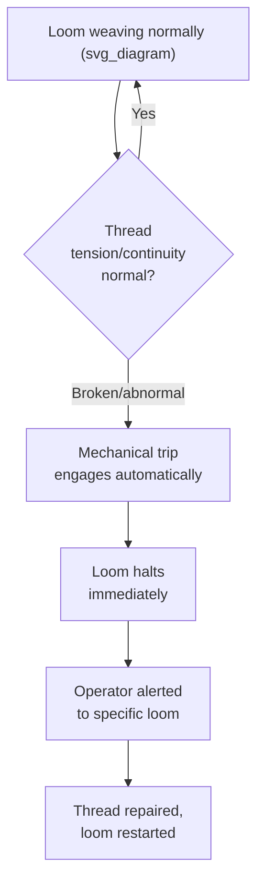

## Tracing Jidoka's Origin to the Automatic Loom

### Historical Context: Sakichi Toyoda and the Toyoda Loom Works

Jidoka's origin traces directly to Sakichi Toyoda (1867–1930), a Japanese inventor and industrialist regarded as the "King of Japanese Inventors," whose work in textile machinery preceded and directly shaped the automobile business that would later become Toyota Motor Corporation. Sakichi began by improving traditional hand looms and progressively automated the weaving process over several decades, founding Toyoda Spinning and Weaving and later Toyoda Automatic Loom Works.

**Key Points**

- The automotive company Toyota emerged from a textile machinery company, not the reverse
- Sakichi Toyoda's son, Kiichiro Toyoda, used proceeds from the sale of automatic loom patent rights to fund the founding of Toyota Motor Corporation's automobile division
- Jidoka is therefore not a manufacturing technique invented for automobiles and later generalized — it is a textile-industry innovation later carried into the automotive business by the same family and cultural lineage

### The Problem: Manual Thread-Break Monitoring

Before Sakichi Toyoda's innovation, power looms of the era had no mechanism to detect when a warp or weft thread broke during weaving. If a thread broke and went unnoticed, the loom would continue running and produce defective, flawed cloth for as long as the break went undetected — potentially an entire bolt of fabric. As a result:

- A single human operator had to watch each loom continuously and constantly, purely to catch thread breaks visually
- Because of this monitoring burden, one operator could typically oversee only one or a very small number of looms at a time
- Any lapse in attention directly produced wasted material and wasted machine time

This created a fundamental inefficiency: the *value-adding* work (weaving) was mechanized, but the human was still fully consumed by *non-value-adding* work (watching for defects), so mechanization alone had not eliminated the labor bottleneck.

### The Innovation: The Self-Stopping Automatic Loom

In 1924, Sakichi Toyoda invented the Toyoda Automatic Loom (Type G), which incorporated a mechanism capable of automatically detecting a broken thread and immediately stopping the loom the instant the break occurred, without any human intervention.

**Example**

The Type G loom used a mechanical sensing mechanism tied to the thread's tension and continuity: as long as thread fed through normally, the mechanism remained in its running state. The moment a thread broke, the loss of tension or continuity triggered a mechanical trip, which halted the loom's operation before additional defective cloth could be woven. Because the stopping action required no electronic sensor or human judgment — only a purely mechanical linkage reacting to the physical state of the thread — this is frequently cited as one of the earliest industrial examples of a self-correcting, autonomous quality-control mechanism in mass manufacturing.

### The Direct Consequence: Decoupling Human Attention from Machine Operation

The self-stopping mechanism fundamentally changed the labor model of weaving. Because the loom itself could be trusted to halt on an abnormal condition, a human no longer needed to watch it continuously — the machine would announce its own failure. This allowed:

- **One operator to oversee many looms simultaneously**, since attention was only required at the moment a loom actually stopped, not continuously across every loom's full run cycle
- **A dramatic productivity increase** without a corresponding increase in labor headcount, since labor scaled with the *number of stoppages requiring attention*, not the *number of machines running*
- **Zero propagation of defects past the point of detection**, since no further defective cloth could be produced once the break occurred and the mechanism engaged

This is the precise mechanism later generalized into jidoka's defining principle: **separate human work from machine work by giving the machine the capacity to detect its own abnormal state and stop.**

### From Loom to Automobile: The Conceptual Transfer

When Kiichiro Toyoda established the automobile manufacturing operations that became Toyota Motor Corporation, the philosophical DNA of the automatic loom — self-detecting, self-stopping mechanisms preventing the propagation of defects — was carried directly into automotive production system design. Toyota engineers, including later figures such as Taiichi Ohno (widely credited with formalizing much of what is now called TPS), applied the same underlying principle across an entirely different manufacturing domain:

| Automatic loom (original context) | TPS jidoka (generalized principle) |
| --- | --- |
| Thread breaks → loom stops | Any process abnormality → process/line stops |
| Mechanical tension sensor | Sensors, poka-yoke devices, or human-triggered andon |
| One operator tends multiple looms | One operator performs multi-machine/multi-process handling |
| Prevents wasted cloth from a known defect | Prevents wasted parts/assemblies from a known defect |
| Labor cost decoupled from continuous per-machine monitoring | Labor cost decoupled from continuous per-station monitoring |

[Inference] The specific internal mechanical design of the Type G loom's stopping mechanism (spring-loaded trip levers reacting to thread tension) is described consistently across secondary and popular accounts of Toyota history, but detailed original engineering drawings and specifications are not widely available in English-language sources, so granular mechanical claims beyond the general principle should be treated as reasonably well-established rather than independently verified against primary Toyoda Loom Works documentation.

### Why This Origin Story Matters Pedagogically

The loom example is retained as the canonical teaching case for jidoka (rather than a later automotive example) for several deliberate reasons:

1. **It isolates the principle from complexity.** A thread break and a mechanical trip lever are simple enough to fully understand in one sitting, unlike a modern automotive assembly line with dozens of interacting quality checkpoints.
2. **It demonstrates that jidoka predates electronics.** The mechanism is entirely mechanical, reinforcing that jidoka is a *principle* (detect abnormality, stop the process) rather than a *technology* (sensors, PLCs, vision systems) — the same lesson karakuri devices teach about low-cost automation more broadly.
3. **It grounds jidoka in Toyota's own institutional history**, giving the concept legitimacy and continuity rather than presenting it as an abstract theoretical framework invented after the fact to describe automotive practices.

### Common Misconceptions About the Historical Origin

- **"The automatic loom was Toyota's invention" — imprecise.** It was Sakichi Toyoda's invention, decades before Toyota Motor Corporation existed as a company; the automobile business is a later, separate venture funded in part by loom patent proceeds.
- **"Jidoka was invented by Taiichi Ohno" — imprecise.** Ohno is credited with formalizing and systematizing jidoka as part of TPS within automotive manufacturing, but the originating conceptual and mechanical innovation belongs to Sakichi Toyoda's loom work, roughly a generation earlier.
- **"The loom's stopping mechanism used sensors" — incorrect in the modern electronic sense.** The original mechanism was purely mechanical (tension/continuity-triggered trip), not an electronic sensor system; this is directly relevant to understanding jidoka as achievable through low-cost mechanical means, not solely through modern instrumentation.

**Related Topics**

- Sakichi Toyoda and the founding lineage of Toyota Motor Corporation
- Autonomation (jidoka) as automation with a human touch
- Karakuri devices and low-cost mechanical automation
- Taiichi Ohno's formalization of the Toyota Production System
- Poka-yoke as the modern implementation layer for abnormality detection
- Andon systems as the human-triggered extension of jidoka