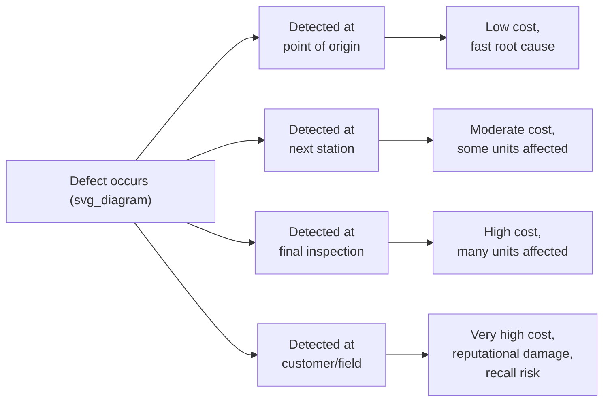

## Stopping the Line at the Point of Abnormality

### Core Principle

Stopping at the point of abnormality means that when a defect, deviation, or unsafe condition is detected, the response occurs at the exact location and moment the abnormality is found — not downstream, not at the next scheduled inspection, and not after the current batch is completed. This is the operational discipline that gives jidoka its teeth: detection without immediate stopping is merely observation, and a system that logs defects for later review without halting production allows the same root cause to keep generating waste.

**Key Points**

- "Point of abnormality" refers to both a *location* (the specific station or process step) and a *moment* (the instant of detection, not a later checkpoint)
- Stopping is a deliberate, structural response, not a failure of the system — a well-functioning jidoka-enabled line is expected to stop periodically
- The goal is to make problems visible immediately, forcing real-time response rather than allowing defects to be absorbed silently into inventory or passed downstream

### Why "At the Point" Matters: The Cost-of-Detection-Delay Principle

A defect discovered at the exact station where it occurred is typically cheap and fast to diagnose, because the causal chain is short: the operator, tooling, material, and method involved are all immediately present and observable. The same defect discovered later — at final inspection, at the customer, or worst of all, in the field — carries substantially higher cost and diagnostic difficulty, because:

- The specific unit, operator, shift, and machine state at the moment of the defect may no longer be identifiable
- Additional value has already been added to the defective unit (and possibly to many subsequent units sharing the same root cause) before detection
- Corrective action must now include containment (finding and isolating any other affected units) in addition to root-cause correction

[Inference] The magnitude of this cost increase is often illustrated with a "cost of quality" curve showing exponential growth in defect cost the further downstream detection occurs; specific multipliers (e.g., "10x more expensive at each stage") vary by source and industry and should be treated as illustrative rather than as a precise universal ratio.

### Mechanisms for Stopping at the Point of Occurrence

**1. Automatic machine stops (jidoka-equipped equipment)**

Sensors or mechanical detectors built into the equipment itself halt the specific machine or station the instant an abnormal condition is sensed — following the same principle as Sakichi Toyoda's automatic loom, where the stopping mechanism was physically integrated into the point of production.

**2. Andon cord / andon button**

Any operator can stop the line themselves at their station upon observing a defect, safety concern, or process abnormality that automated sensors may not catch. This extends "point of abnormality" stopping to conditions requiring human judgment rather than sensor-detectable thresholds.

**3. Fixed-position stop systems**

On a moving assembly line, pulling an andon cord does not necessarily halt the entire line instantaneously — many implementations allow the line to continue moving for a defined additional distance or time (often matched to the station cycle time) before stopping, giving the team leader a window to respond and potentially resolve the issue before a full stop occurs. This preserves the "point of abnormality" principle (the issue is addressed at or very near its origin station) while limiting unnecessary full-line downtime for issues resolvable within the response window.

**Example**

A worker on a moving line notices a component is missing a required sub-assembly. Pulling the andon cord starts a countdown (commonly illustrated as a fixed number of stations or seconds) during which the team leader arrives to assess the issue. If resolved within that window, the line never fully stops; if not resolved, the line halts at a fixed position, preventing the defective unit — and the station itself — from moving further into subsequent operations while unaddressed.

### Distinguishing "Point of Abnormality" from Downstream Inspection

Traditional quality models often rely on inspection stations positioned after a batch of production, or at the end of a line, to catch defects. Stopping at the point of abnormality replaces or supplements this model with real-time, in-process detection and immediate local response.

| Aspect | Downstream/batch inspection | Stopping at point of abnormality |
| --- | --- | --- |
| Detection timing | After production of a batch or unit run | At the moment of occurrence |
| Units affected before detection | Potentially many (entire batch) | Typically one, or very few |
| Root cause traceability | Difficult — process conditions may have changed | Immediate — conditions still present |
| Response urgency | Scheduled/batched correction | Immediate line stop and response |
| Inventory implications | Requires buffer stock to avoid starving downstream while investigating | Naturally compatible with low/no buffer (JIT) flow |

### Relationship to Just-in-Time and Low Inventory

Stopping at the point of abnormality is only organizationally tolerable in a system designed to support it. If a plant carries large buffer inventories between stations, a line stop at one station does not immediately halt the rest of the plant — but it also delays visibility of the problem to downstream stations, and defective units already in the buffer may still propagate. In a true JIT environment with minimal WIP, a stop at any single point quickly ripples to affect the entire flow, which is precisely the intended effect: it forces immediate, plant-wide attention to the problem rather than allowing it to be quietly absorbed by inventory cushions.

This creates a structural tension that TPS treats as a *feature*: low inventory buffers make problems impossible to hide, while stopping at the point of abnormality ensures those exposed problems are addressed immediately rather than accumulating.

### Escalation and Response Protocol

A stop at the point of abnormality is typically governed by a defined escalation structure so the stop does not become indefinite or unmanaged:

1. **Detection** — sensor trip, andon pull, or operator observation
2. **Signal** — andon light/sound indicates the specific station and nature of the issue
3. **First response** — team leader or group leader responds within a defined time window (commonly measured in seconds)
4. **Immediate containment** — the specific unit or units affected are identified and isolated
5. **Root cause investigation** — often using a structured method (e.g., 5 Whys) conducted at the actual point of occurrence, not from a report after the fact
6. **Countermeasure and restart** — the line resumes only once the immediate cause is addressed, even if only as a temporary countermeasure pending a permanent fix

**Example**

A torque-check sensor on an engine assembly station detects an under-torqued bolt. The station stops automatically. The team leader arrives within the defined response window, confirms the specific fastener and unit affected, checks whether the torque tool itself has drifted out of calibration (root cause investigation at the point of occurrence), and either recalibrates the tool or swaps it before restarting — rather than allowing the station to continue and flagging the issue for a later quality audit.

### Common Misconceptions

- **"Stopping the line at the point of abnormality means production halts entirely and often" — imprecise.** In a mature jidoka system, most abnormalities are resolved within the response window (e.g., via the andon cord's built-in delay) before a full line stop occurs; frequent full-line stoppages typically indicate an underlying process capability problem rather than the jidoka system "working as intended."
- **"Any employee stopping the line is a sign of poor discipline" — incorrect.** Within TPS philosophy, an operator's willingness to stop the line is treated as desired behavior and is actively encouraged, since it surfaces problems that would otherwise be hidden or passed downstream.
- **"Point of abnormality only applies to physical defects" — incomplete.** The same principle applies to missing parts, safety hazards, incorrect information/instructions, and process deviations — any condition falling outside standardized work parameters.

### Design Implications for Layout and Process

For stopping at the point of abnormality to be effective, the physical and organizational design must support fast localization and response:

- Stations must have clear andon signaling visible from a distance (visual management)
- Response personnel (team leaders) must be positioned close enough to reach any station within the defined response window
- Layout should avoid long transport distances or queues between stations that would allow a defect to travel far before detection (directly connecting this principle back to flow-oriented layout design)
- Standardized work must be documented precisely enough that "abnormal" can be objectively distinguished from "normal" at each station

**Related Topics**

- Andon systems and escalation response protocols
- Poka-yoke error-proofing mechanisms
- 5 Whys and root cause analysis at the point of occurrence
- Autonomation (jidoka) as automation with a human touch
- Standardized work as the baseline for defining "abnormal"
- Designing layouts that minimize transport and motion