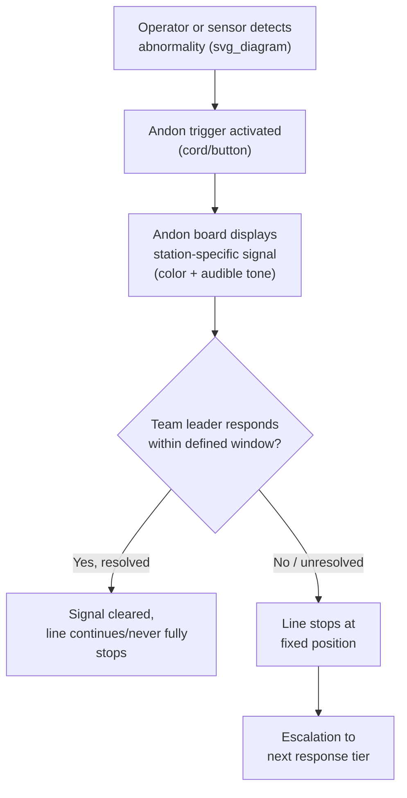

## Andon System Design and Escalation Protocols

### Definition and Purpose

Andon (行灯), originally a Japanese paper lantern, refers within TPS to a visual and/or audible signaling system that makes the operational status of a process instantly visible — normal running, abnormality detected, or line stopped — to everyone on the floor, without requiring anyone to walk over and ask. The andon system is the primary mechanism through which jidoka's principle of "stop at the point of abnormality" is made organizationally actionable: it converts a single operator's or sensor's detection of a problem into a plant-wide, immediately visible signal that triggers a defined human response.

**Key Points**

- Andon serves two simultaneous functions: real-time visual management (showing current status) and an escalation trigger (initiating a defined response chain)
- The system must be visible from a distance, unambiguous in meaning, and tied to a specific, known location
- Andon is as much an organizational protocol as it is a physical device — the signal is only useful if a reliable, timed human response is guaranteed to follow it

### Core Physical Components

**1. Andon board (line status display)**

A overhead or wall-mounted board, typically using colored lights, numbers, or a combination, showing the real-time status of every station along a line. Common conventions:

- **Green**: running normally
- **Yellow/amber**: attention needed but line still moving (e.g., approaching a defined andon-pull response window)
- **Red**: line stopped, or the response window has expired without resolution

**2. Andon trigger (cord or button)**

The physical mechanism an operator uses to initiate a signal. Historically implemented as a pull-cord running the length of a workstation (allowing activation from anywhere within reach), but frequently implemented today as a fixed call button, and increasingly with wireless call buttons that page a specific responder directly.

**3. Audible signal**

A distinct sound (chime, buzzer, or recorded phrase) accompanying the visual signal, ensuring the call is noticed even by personnel not looking directly at the andon board — particularly important in noisy plant environments where a purely visual signal could be missed.

**4. Station/zone identification**

The signal must unambiguously indicate *which* station or zone triggered it — typically via a numbered board position corresponding to a physical station number — so responders do not need to search for the source.

### The Escalation Protocol Structure

A well-designed andon system pairs the physical signal with a strict, timed, tiered response chain. Escalation exists because a single-tier response (only the original operator handling the issue) does not scale — the protocol defines who is responsible for responding, within what time window, and what happens if that window is missed.

**Typical tiered escalation structure:**

| Tier | Responder | Response window (illustrative) | Action |
| --- | --- | --- | --- |
| 1 | Team leader / group leader | Immediate to ~60 seconds | Assess issue at the station, attempt resolution within remaining cycle time |
| 2 | Supervisor / area manager | If Tier 1 unresolved within the fixed window | Line stops at a defined fixed position; supervisor engages additional resources |
| 3 | Engineering / quality / maintenance specialist | If root cause is technical/equipment-related | Diagnoses underlying cause (e.g., tooling wear, sensor miscalibration) |
| 4 | Plant management | Repeated or extended stoppages | Reviews systemic countermeasures, resource allocation, possible process redesign |

[Inference] Specific response-window durations (such as "60 seconds" or a fixed number of downstream stations before a full stop) vary considerably across companies and even across lines within the same plant, depending on cycle time, line length, and product criticality; the structure of tiered escalation is well-established, but exact timing values should be treated as illustrative rather than a universal standard.

### Fixed-Position Stop Logic

On many moving assembly lines, an andon pull does not stop the line instantaneously at the exact moment of the pull. Instead, the line continues moving for a predetermined additional distance (commonly expressed as a number of stations or a fixed time corresponding to the takt time), giving the Tier 1 responder a defined window to resolve the issue before the line reaches its designated "fixed stop position." This design balances two competing needs:

- Avoiding unnecessary full-line stoppages for issues quickly resolvable at the originating station
- Guaranteeing that an unresolved issue *will* eventually force a full stop, rather than being carried indefinitely downstream

**Example**

An andon pull at station 12 starts a countdown equivalent to three station-cycles. If the team leader resolves the issue (e.g., swaps a missing fastener) before the line reaches the fixed stop position, the signal clears and the line never fully halts. If unresolved, the entire line stops with the affected unit positioned precisely at the fixed stop location, and Tier 2 escalation begins.

### Andon Beyond Quality: Multi-Purpose Signaling

While originally conceived around quality abnormalities, modern andon systems typically extend to several categories of signal, each potentially using distinct colors, tones, or board zones:

- **Quality abnormality**: defect detected, out-of-spec condition
- **Equipment malfunction**: machine fault, tooling failure
- **Material shortage**: parts or components not available at point of use (linking andon to kanban/pull-system replenishment failures)
- **Safety concern**: any condition posing risk to personnel — typically given the highest priority and fastest mandated response
- **Process/cycle-time deviation**: a station falling behind takt time, signaling potential line imbalance even without an outright defect

### Design Principles for Effective Andon Systems

**1. Visibility from a distance**

Boards and lights must be positioned and sized so status is legible from typical viewing distances across the shop floor — a design constraint closely tied to overall visual management practice.

**2. Unambiguous mapping to location**

Every signal must map to exactly one identifiable station or zone; ambiguity in "which station triggered this" defeats the purpose of rapid response.

**3. Mandatory, not optional, response**

The protocol must guarantee response occurs within the defined window every time — an andon system that is frequently ignored or delayed trains operators that pulling the cord doesn't matter, undermining the entire jidoka discipline.

**4. Low activation friction**

The trigger mechanism (cord, button) must be easy and fast to activate from the operator's normal working position, without requiring them to leave their station or search for the control.

**5. Data capture for kaizen**

Modern andon systems frequently log every activation — station, time, duration, and resolution — creating a dataset used to identify chronic problem stations, recurring root causes, and opportunities for targeted kaizen activity, distinguishing one-off issues from systemic ones.

### Comparison: Manual vs. Sensor-Triggered Andon

| Aspect | Manual (operator-triggered) | Automatic (sensor-triggered) |
| --- | --- | --- |
| Detection basis | Human judgment/observation | Threshold-based sensor reading |
| Coverage | Catches issues sensors aren't configured for (e.g., unusual noise, visible-but-unmeasured defects) | Consistent, fatigue-free detection of specified parameters |
| Implementation cost | Low (cord/button, signage) | Higher (sensors, integration, calibration) |
| False positive/negative risk | Depends on operator training and vigilance | Depends on sensor calibration and threshold-setting accuracy |
| Best use case | Judgment-based or novel abnormalities | Well-characterized, repeatable, measurable defect modes |

Most mature jidoka implementations combine both: automatic sensors for defined, measurable failure modes, and manual andon triggers as a catch-all for anything a sensor was not designed to detect.

### Common Pitfalls in Andon System Design and Operation

- **Escalation windows set too long**, allowing minor issues to be quietly absorbed without genuine urgency, undermining the "stop at the point of abnormality" principle
- **Chronic non-response or slow response** from designated Tier 1/Tier 2 personnel, which trains operators to stop pulling the cord (a serious cultural failure mode, since it silently reverts the plant to hidden-defect behavior)
- **Punitive treatment of frequent andon activation**, which discourages operators from raising legitimate issues — TPS philosophy explicitly treats frequent, appropriate andon use as evidence of a healthy detection culture, not a performance failure
- **Signal ambiguity** (e.g., a single color used for both minor and safety-critical issues), causing responders to misjudge urgency
- **Lack of data capture/review**, treating each stop as an isolated event rather than mining the pattern of stops for systemic kaizen opportunities

### Organizational and Cultural Prerequisites

An andon system's technical design is only as effective as the surrounding management culture. For the system to function as intended:

- Leadership must genuinely prioritize responding to andon calls over maintaining uninterrupted line speed
- Operators must trust that raising an andon call will not result in blame or negative performance evaluation
- Response times must be tracked and reviewed as a management metric in their own right, not merely as a side effect of quality metrics

**Related Topics**

- Autonomation (jidoka) as automation with a human touch
- Stopping the line at the point of abnormality
- Visual management systems on the shop floor
- 5 Whys and root cause analysis workflows
- Poka-yoke as automatic (sensor-based) andon triggers
- Standardized work as the baseline defining "normal" vs. "abnormal"