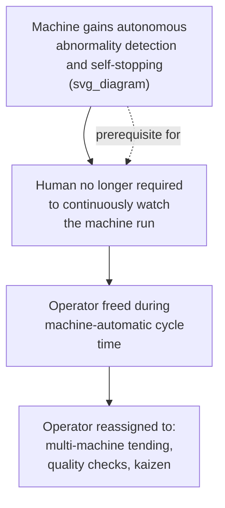

## Separating Human Work from Machine Work

### Definition and Core Idea

Separating human work from machine work refers to the deliberate design principle, central to jidoka, of identifying which portions of a task genuinely require human judgment, dexterity, or decision-making, and which portions are purely mechanical repetition that a machine can perform unattended — then structuring the workstation and process so the human is not required to be physically present or attentive during the machine's automatic portion of the cycle. This separation is the direct organizational payoff of building autonomous stopping capability into machines: once a machine can be trusted to halt itself on an abnormal condition, a human no longer needs to stand and watch it run.

**Key Points**

- The principle originates directly from Sakichi Toyoda's automatic loom, where the self-stopping mechanism first made this separation possible
- The goal is not to eliminate human involvement, but to eliminate *unnecessary continuous human attendance* during machine-automatic cycle time
- Time freed from machine-watching is redirected to value-adding human activity: multi-machine tending, quality checks, or kaizen work

### The Underlying Waste Being Eliminated

Before this separation is designed in, a common failure pattern is that an operator's cycle time is dictated entirely by the machine's cycle time, even though the human is only physically needed for a fraction of that cycle (loading material, initiating the cycle, unloading the finished part). The remaining time — the machine's automatic run time — is waiting waste (muda) from the human's perspective, disguised as "the operator is working" because they are physically standing at the machine.

**Example**

A CNC machining operation has a 90-second automatic cutting cycle. The operator's actual required tasks are: load the raw part (10 seconds), press start, and unload the finished part after the cycle completes (8 seconds). Without separation of human and machine work, the operator stands at the machine for the full 90 seconds, of which roughly 72 seconds is pure waiting. With separation designed in — via an automatic cycle-complete signal and a machine capable of running unattended safely — the operator can walk away during the 90-second automatic cycle and tend a second, third, or fourth machine, returning only when a signal indicates completion or an abnormality.

### The Enabling Precondition: Autonomous Stopping Capability

Separation of human and machine work is only safe and reliable once a machine possesses jidoka-style autonomous abnormality detection — otherwise, removing continuous human attendance simply means defects run unchecked and equipment damage goes unnoticed. This creates a direct dependency:

Without the autonomous-stop capability on the left side of this chain, none of the downstream organizational benefits can be safely realized — this is why jidoka (the detection/stopping capability) is treated as foundational, and separation of human/machine work is treated as its consequence, not an independent technique.

### Classifying Work: Human-Essential vs. Machine-Automatic

A structured work analysis typically separates the elements of a task cycle into categories:

| Work category | Description | Example |
| --- | --- | --- |
| Manual/human-essential | Requires human dexterity, judgment, or decision-making | Loading an irregular part, visual inspection requiring judgment, adjusting a fixture |
| Machine-automatic | Repetitive, mechanically defined, no judgment required once initiated | Cutting cycle, welding sequence, curing/cooling time |
| Walking/transition | Movement between stations or machines | Operator walking from machine A to machine B |
| Waiting (to be eliminated) | Human idle time caused by dependency on machine cycle without other assigned work | Standing and watching a machine run with nothing else to do |

The design objective is to shrink the "waiting" category toward zero by either reassigning that freed time to other productive work (multi-machine handling) or, where machine-automatic time cannot be overlapped with other tasks, at minimum ensuring the human is not required to be physically present for it.

### Multi-Machine and Multi-Process Handling

The direct organizational technique enabled by this separation is often referred to using two related but distinct Japanese terms:

- **Tajun-mochi (多台持ち)** — multi-machine handling: one operator tends several machines performing the *same* type of operation (e.g., three identical CNC lathes), cycling between them to load/unload while each machine runs its automatic cycle independently
- **Tanoukoutei-mochi (多工程持ち)** — multi-process handling: one operator tends several *different* sequential process steps (e.g., a mill, then a drill, then a deburring station), often within a U-shaped cell, following the part through its process sequence rather than tending duplicate machines

**Example**

In a U-shaped cell with four different machines representing four sequential operations, one operator walks the interior of the U, loading and starting each machine in sequence and unloading the previous machine's completed part on the way past. Because each machine can run its automatic cycle unattended and will stop or signal if something goes wrong, the operator's walking path and task sequence — not the individual machine's cycle time — becomes the determinant of the cell's overall output rate, provided the cell is properly balanced.

### Workstation and Layout Implications

Designing for separated human and machine work has direct consequences for physical layout and equipment specification:

- **Automatic ejection or presentation mechanisms**: machines should eject or present a finished part in a way that doesn't require the operator to be standing there at the exact moment of completion (often achieved via simple karakuri-style gravity chutes or mechanical stops)
- **Clear completion signaling**: a light, sound, or andon-board indication that a machine's automatic cycle has finished and it is ready for unload/reload, so the operator (potentially tending multiple machines) knows when to return
- **Walking-path design in multi-machine cells**: machines must be arranged so the operator's walking route between them is short and non-overlapping with other operators' paths, directly connecting this principle to layout design for minimizing transport and motion
- **Standardized work combination sheets**: document precisely how manual time, walking time, and machine-automatic time interleave across multiple machines, ensuring the cycle is fully accounted for and balanced against takt time

### Economic Rationale

Separating human and machine work directly changes the labor-to-output ratio achievable in a process:

$$\text{Operators required} = \frac{\text{Total manual + walking time per cycle across all machines}}{\text{Takt time}}$$

Without separation, the number of operators required scales roughly one-to-one with the number of machines, because each machine "consumes" a dedicated operator for its full cycle. With effective separation and multi-machine handling, the number of operators required scales instead with the *sum of manual and walking time* across the machines a single operator can reach within takt time — allowing one operator to profitably tend several machines simultaneously as long as machine-automatic time is not the binding constraint.

[Inference] The exact number of machines a single operator can effectively tend depends heavily on the ratio of automatic cycle time to manual/walking time and on layout-specific walking distances; this is calculated per-application via standardized work combination analysis rather than following a fixed universal ratio.

### Common Misconceptions

- **"Separating human and machine work means replacing operators with machines" — incorrect.** The principle is about reallocating *when and how* human attention is applied, not reducing overall human involvement in the process; often, the same or similar headcount is redeployed to cover more machines or add quality/kaizen activity, rather than being eliminated outright.
- **"Multi-machine handling is the same as speeding up the operator" — incorrect.** The operator's individual task pace (loading, unloading) is unchanged; what changes is the elimination of idle waiting time during the machine's own automatic cycle, which is unrelated to how fast the human physically works.
- **"This principle only applies to heavily automated, high-capital equipment" — incomplete.** The same separation logic applies to simple karakuri devices and manual jigs with self-resetting mechanisms, not solely to CNC or robotic equipment.

### Relationship to Other TPS Concepts

Separating human and machine work sits at the intersection of several TPS principles:

- It is the direct organizational consequence of **jidoka's** autonomous stopping capability
- It requires **standardized work** to precisely define and balance manual, walking, and automatic time across a multi-machine or multi-process assignment
- It depends on **layout design** (particularly cellular, U-shaped layouts) to make short walking paths between multiple machines physically feasible
- It often leverages **karakuri devices** for low-cost automatic part presentation, ejection, or signaling, avoiding the need for expensive electronic completion-signaling systems

**Related Topics**

- Multi-machine handling (tajun-mochi) and multi-process handling (tanoukoutei-mochi)
- Standardized work combination sheets and takt time balancing
- Autonomation (jidoka) as automation with a human touch
- Cellular manufacturing and U-shaped cell design
- Karakuri devices for automatic part presentation and ejection
- Line balancing and operator loading analysis