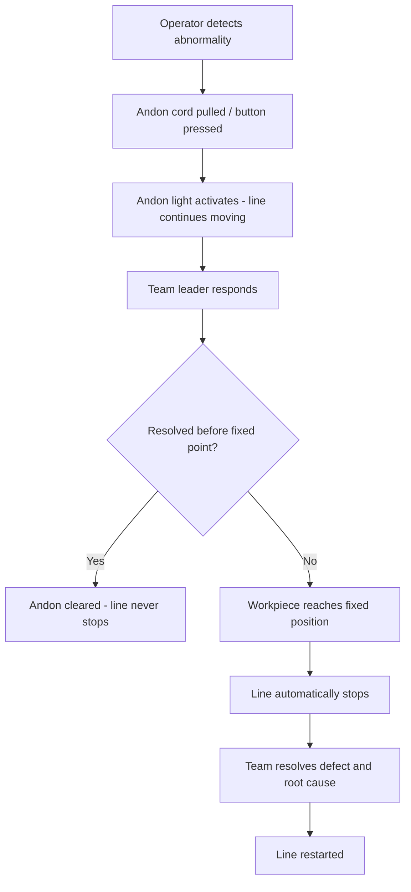

## Fixed Position Stop Systems on Moving Lines

### Definition and Purpose

A fixed position stop system is a Jidoka mechanism used on moving assembly lines (as opposed to intermittent or asynchronous lines) that allows the line to continue moving physically while giving operators a bounded window in which to complete their task or signal an abnormality. Rather than stopping the conveyor instantly at the exact point a problem is detected, the line is permitted to keep moving until the workpiece reaches a predetermined fixed point — the "fixed position" — at which the line halts automatically if the abnormality has not been resolved.

This is distinct from an immediate-stop (line-stop-anywhere) system. The fixed position approach is specifically designed for continuously moving lines where stopping the physical conveyor at an arbitrary point is mechanically disruptive, unsafe, or would misalign work at every station simultaneously.

### Core Problem It Solves

On a continuously moving line (e.g., automotive final assembly), the line itself is a physically moving conveyor with workpieces attached at fixed intervals. If a single operator could stop the conveyor at any arbitrary point:

- Every other operator downstream and upstream would be stopped at an inconsistent point in their own work cycle
- Vehicles/units already spanning multiple stations could be left in structurally awkward positions (e.g., partially through a press or robotic zone)
- Restart complexity increases because operators must re-orient to a non-standard stopping point each time

The fixed position stop solves this by decoupling the moment of **problem detection** from the moment of **physical stoppage**, while preserving the discipline that the line *will* stop if the root problem isn't fixed within the cycle.

### How It Works

1. **Detection**: An operator or an automated sensor (poka-yoke device, vision system, torque sensor, etc.) detects an abnormality — a defect, missing part, misalignment, or unsafe condition.
2. **Signal (Andon activation)**: The operator pulls an andon cord or presses an andon button. This does not stop the line immediately.
3. **Andon light/tone activation**: A visual (colored light on the andon board) and/or audible signal alerts the team leader/supervisor to the station.
4. **Grace window**: The line continues moving. The team leader has a limited window — the physical distance/time remaining until the workpiece reaches the fixed stop point — to reach the station and assist.
5. **Resolution or Stop**:
   - If the team leader resolves the issue before the fixed point is reached, the andon call is cleared and the line proceeds without stopping.
   - If unresolved when the workpiece reaches the fixed position, the line automatically halts.
6. **Root Cause Response**: Once stopped, the team addresses the root cause before restarting, in line with Jidoka's principle of building in quality rather than passing defects downstream.

### Key Points

- **Line keeps moving during the grace period** — this is the defining characteristic distinguishing it from a "stop-the-line-instantly" system.
- **The fixed point is physically marked** on the line (often a painted line, marker, or sensor-triggered position) and is calculated based on line speed and the standard time required to resolve typical issues.
- **Escalation is time-boxed by physical distance**, not by a countdown timer alone — the workpiece's travel down the line *is* the timer.
- **Automatic and non-negotiable stop** — when the fixed position is reached without resolution, the stop is not a judgment call by the operator; it is enforced by the system (often via a limit switch, position sensor, or PLC logic tied to the andon status).
- **Supports single-piece flow disciplines** without sacrificing continuous line movement, which is critical in high-volume industries like automotive OEM assembly.

### Toyota Production System Context

This mechanism is a hallmark implementation of Jidoka ("automation with a human touch") at Toyota and is often cited in descriptions of the Toyota assembly line andon system. Toyota's approach reflects two Jidoka pillars simultaneously:

- **Autonomation**: The system has the authority and mechanism to stop itself/the process automatically upon detecting an unresolved abnormality — it does not rely purely on human judgment to physically halt the equipment.
- **Built-in quality (Jidoka's "quality at the source")**: Defects are not allowed to pass to the next station; the fixed stop point acts as a hard boundary preventing a defective or incomplete unit from continuing indefinitely down the line.

The fixed position stop is a pragmatic compromise: it preserves respect for people and the flow of work (giving the team leader realistic time to solve real problems on the floor) while preserving the non-negotiable rule that unresolved abnormalities must stop production.

### Example

Consider a vehicle final trim line moving continuously at a fixed speed, with each station having a cycle time of 60 seconds and stations spaced along the conveyor.

- An operator at Station 12 notices a wiring harness connector isn't seating correctly.
- The operator pulls the andon cord immediately. The andon light for Station 12 turns yellow, and a chime sounds.
- The line continues moving. The team leader, alerted by the signal, walks to Station 12.
- The fixed position stop point for Station 12 is set 2 stations downstream (representing roughly 120 seconds of line travel, matching typical resolution time for known issue types).
- If the team leader helps the operator reseat the connector correctly before the vehicle passes the fixed point, the andon is cleared (light returns to green), and the line never stops.
- If the issue is not resolved by the time the vehicle reaches the fixed point, the line automatically stops. Production halts until the defect is fixed, at which point the team can decide whether to also address the root cause (e.g., connector design, training gap) before resuming.

### Fixed Position Stop vs. Related Andon Mechanisms

| Mechanism | Line Behavior on Signal | Typical Use Case |
| --- | --- | --- |
| Fixed position stop | Line keeps moving; auto-stops only if unresolved by a set point | Continuously moving lines (e.g., auto assembly) |
| Immediate/instant stop | Line halts the moment the signal is triggered | Lines where any defect risk is safety-critical or line speed is very low |
| Andon call without stop authority | Line never stops automatically; only alerts supervisor | Lower-maturity implementations, non-critical processes, or advisory-only signals |
| Automatic equipment stop (machine-level Jidoka) | Individual machine halts itself on detecting a defect (e.g., via sensor) | Automated/semi-automated equipment, not full-line conveyors |

### Design Considerations

- **Determining fixed point distance**: Set based on statistical analysis of typical resolution times for the most common abnormality types at that station, balanced against the cost of a full line stop.
- **Sensor/mechanical implementation**: Often realized via a photoelectric sensor or limit switch positioned at the fixed point, wired into the line's PLC-controlled andon logic, which cuts drive power or engages a line brake when triggered while an andon call is still active.
- **Visual management integration**: The fixed position stop point is usually marked on the andon board or floor with a physical marking, and its status is reflected on the digital andon display so all stations can see how much time/distance remains. [Inference — exact visual conventions vary by plant and are not universally standardized]
- **Variable vs. fixed grace windows**: Some implementations use a uniform fixed distance for all stations; more sophisticated systems vary the distance per station based on that station's typical defect resolution profile. [Inference — this varies significantly by facility and is not a single documented universal standard]

### Common Pitfalls

- **Setting the fixed point too far downstream**: Encourages complacency, effectively behaving like a system with no meaningful stop discipline, since operators rarely reach the actual stop point.
- **Setting it too close**: Causes frequent, disruptive full-line stops for minor issues that could have been resolved with slightly more time, eroding trust in the system among production staff.
- **Treating the stop as punitive**: Jidoka principles emphasize that a line stop is a positive signal — an opportunity to surface and fix a root cause — not a failure to be hidden or discouraged. Cultural buy-in is required for the andon system to function as intended.
- **Under-resourcing team leader response capacity**: If team leaders are overloaded and cannot reliably reach the station within the fixed-point window, most calls will result in stops regardless of severity, undermining the intended function of the grace period.

### Line Stop Flow Diagram

### Fixed Position Stop Zone (svg_diagram)

<svg xmlns="http://www.w3.org/2000/svg" viewBox="0 0 800 260">
<text x="400" y="24" font-size="16" font-weight="bold" text-anchor="middle" fill="#1a1a1a">Fixed Position Stop Zone (svg_diagram)</text>

<line x1="60" y1="140" x2="740" y2="140" stroke="#555" stroke-width="4" />

<polygon points="740,140 725,132 725,148" fill="#555" />
<text x="700" y="120" font-size="12" fill="#555">Line direction</text>

<circle cx="180" cy="140" r="8" fill="#e53935" />
<text x="180" y="175" font-size="12" text-anchor="middle" fill="#1a1a1a">Station 12</text>
<text x="180" y="190" font-size="11" text-anchor="middle" fill="#e53935">Andon pulled</text>

<rect x="180" y="130" width="260" height="20" fill="#ffe0b2" opacity="0.6" />
<text x="310" y="115" font-size="12" text-anchor="middle" fill="#e65100">Grace window (line still moving)</text>

<line x1="440" y1="110" x2="440" y2="170" stroke="#1565c0" stroke-width="3" stroke-dasharray="6,4" />
<circle cx="440" cy="140" r="8" fill="#1565c0" />
<text x="440" y="195" font-size="12" text-anchor="middle" fill="#1565c0">Fixed Position</text>
<text x="440" y="210" font-size="11" text-anchor="middle" fill="#1565c0">(auto-stop if unresolved)</text>

<text x="600" y="100" font-size="12" text-anchor="middle" fill="`#2e7d32`">If resolved before this point:</text>

<text x="600" y="118" font-size="12" text-anchor="middle" fill="`#2e7d32`">line continues, no stop</text>

<rect x="60" y="220" width="14" height="14" fill="#e53935" />
<text x="80" y="231" font-size="11" fill="#1a1a1a">Abnormality detected</text>
<rect x="260" y="220" width="14" height="14" fill="#1565c0" />
<text x="280" y="231" font-size="11" fill="#1a1a1a">Fixed stop position</text>
<rect x="460" y="220" width="14" height="14" fill="#ffe0b2" />
<text x="480" y="231" font-size="11" fill="#1a1a1a">Grace window zone</text>
</svg>

### Next Steps

- Andon systems and visual management boards
- Autonomation (Jidoka) vs. traditional automation
- Poka-yoke (error-proofing) devices as abnormality detectors
- Standardized work and cycle time calculation
- Line balancing on continuously moving assembly lines
- Root cause analysis methods used during line-stop events (e.g., 5 Whys)
- Team leader response protocols and staffing ratios in Jidoka systems