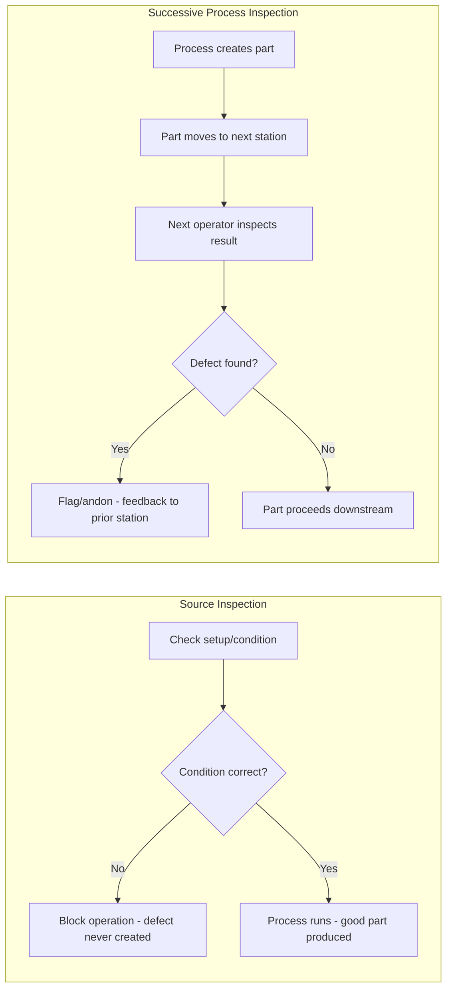

## Source Inspection Versus Successive Process Inspection

### Definition

Both source inspection and successive process inspection are quality control approaches within the Jidoka philosophy, aimed at catching defects before they propagate through a production system. They differ fundamentally in **where** and **when** the inspection occurs relative to the process that creates the defect.

- **Source inspection** (also called source inspection or "inspection at the source") checks the *conditions* that could cause a defect *before or during* the operation that would produce it — the goal is to prevent the defect from ever being created.
- **Successive process inspection** (also called "next-process check" or "checking by the next process") checks the *completed output* of one process at the very next process/station in the line, catching defects immediately after they occur rather than preventing them.

Both stand in contrast to traditional end-of-line inspection or statistical sampling inspection, which detects defects long after they were created, often after many additional defective units have already been produced.

### Position in the Inspection Hierarchy

Shigeo Shingo's framework for inspection systems (developed alongside Toyota's production system and poka-yoke methodology) ranks inspection approaches by effectiveness at reducing defects, generally in this order from most to least effective:

1. **Source inspection (checking conditions/causes, ideally with poka-yoke)** — prevents defects from occurring at all
2. **Successive/self-inspection with 100% checks** — catches defects immediately, one unit at a time, right after creation
3. **Statistical/sampling inspection** — catches defects probabilistically, often too late to prevent large batches of bad output
4. **Judgment/end-of-line inspection** — sorts good from bad after the fact, does nothing to prevent recurrence

### Source Inspection: Mechanics

Source inspection targets the **causes** of defects, not the defects themselves. It works by checking the setup conditions, materials, tooling, or process parameters *before* the operation runs, so that a defect-causing condition is caught and corrected before any defective part is ever made.

**Key characteristics:**

- Focuses on conditions (e.g., correct part orientation, correct tool selection, correct torque setting) rather than results (e.g., a finished hole diameter)
- Frequently implemented via poka-yoke (error-proofing) devices: mechanical guides, sensors, jigs, or interlocks that physically prevent an incorrect condition from allowing the operation to proceed
- Achieves **zero defects in principle**, because the defect-generating condition is intercepted before the product is affected
- Requires deep process knowledge to identify which upstream conditions causally lead to which downstream defects

**Example**: A fixture is designed so a part can only be clamped in the correct orientation — if the operator tries to insert it backward, the fixture's pins physically block it from seating. No defective part can be produced because the wrong condition is mechanically impossible.

### Successive Process Inspection: Mechanics

Successive process inspection checks the **result** of a process, performed by the operator at the very next station (rather than by a separate quality inspector at the end of the line). Because the check happens immediately downstream, a defect is caught within one cycle time of its creation.

**Key characteristics:**

- Inspects finished output, not upstream conditions
- Performed by the next operator in the line as part of their normal work, not a dedicated inspection role
- Feedback loop to the previous station is very short (often just one unit/cycle of delay), enabling fast root-cause correction
- Does not prevent the defect from being created, only prevents it from propagating further downstream
- Commonly paired with the andon system: if the next-process operator finds a defect, they can trigger a stop or call for help immediately

**Example**: Station 5 receives a welded bracket from Station 4. Before installing it, the Station 5 operator visually and physically checks weld integrity and hole alignment. If a defect is found, it is flagged immediately, and Station 4 is notified before another five or ten defective brackets are produced.

### Comparative Analysis

| Dimension | Source Inspection | Successive Process Inspection |
| --- | --- | --- |
| Timing relative to defect | Before the defect is created | Immediately after the defect is created |
| What is checked | Causal conditions (setup, tooling, material state) | Finished output/result of the prior process |
| Defect prevention potential | Can achieve zero defects (prevention) | Cannot prevent; can only catch quickly (detection) |
| Typical mechanism | Poka-yoke devices, condition sensors, interlocks | Visual/manual check by next-station operator |
| Feedback loop length | N/A — defect doesn't occur | One process step / one cycle time |
| Implementation difficulty | Higher — requires causal process analysis | Lower — easier to implement broadly and quickly |
| Role of the inspector | Often automated or built into the process itself | Human operator at the next station, as part of normal work |

### Why Both Are Needed

Source inspection is the ideal end state because it eliminates defects rather than merely catching them, but it is not always immediately achievable for every defect type — some causal relationships are complex, expensive to engineer against, or not yet fully understood. Successive process inspection serves as a practical, rapidly deployable safety net that is far superior to end-of-line inspection because of its short feedback loop, while an organization works toward identifying and engineering out root causes through source inspection.

[Inference] In mature Jidoka implementations, successive process inspection findings are commonly used as a diagnostic input to eventually design a source inspection/poka-yoke solution for that specific defect mode, effectively using successive inspection as a stepping stone toward source inspection rather than a permanent end state. This progression pattern is a common continuous improvement approach but is not a rigidly documented universal rule.

### Key Points

- **Source inspection prevents; successive process inspection detects quickly.** This is the single most important distinction.
- Both reject the traditional model of a separate, centralized "quality department" that inspects finished goods at the end of the line — Jidoka pushes inspection responsibility into the process and onto the people directly doing the work.
- Successive process inspection relies on **built-in quality** at each station: every operator is simultaneously a producer and an inspector of the previous station's work.
- Source inspection is most closely associated with **poka-yoke** devices, though not all poka-yoke is source inspection — some poka-yoke devices perform inspection at the point of successive process checking instead.
- Neither approach relies on sampling; both are typically implemented as 100% checks, consistent with Jidoka's zero-defect orientation.

### Example: Applying Both in Sequence

Consider a stamped metal bracket that occasionally has a missight (missing) hole due to tooling wear.

1. **Immediate mitigation (successive process inspection)**: The next station's operator uses a simple go/no-go pin gauge to confirm both holes exist before installing the bracket. Any defective bracket is caught within one cycle and flagged.
2. **Root cause investigation**: The team traces the missing-hole defect to intermittent tooling wear that isn't reliably detected until output is checked.
3. **Source inspection implementation**: A proximity sensor is added to the stamping press die itself, detecting whether the punch that creates the hole actually retracted and engaged correctly on each cycle. If the sensor detects a failed punch stroke, the press stops before ejecting the part, preventing the defective bracket from ever being produced.
4. **Outcome**: The successive process check becomes redundant for this specific defect mode (though it may remain in place for other defect types), because the source inspection now prevents the root cause entirely.

### Process Flow Comparison

### Inspection Timing Relative to Defect Creation (svg_diagram)

<svg xmlns="http://www.w3.org/2000/svg" viewBox="0 0 800 220">
<text x="400" y="24" font-size="16" font-weight="bold" text-anchor="middle" fill="#1a1a1a">Inspection Timing Relative to Defect Creation (svg_diagram)</text>

<line x1="60" y1="120" x2="740" y2="120" stroke="#555" stroke-width="3" />
<polygon points="740,120 725,112 725,128" fill="#555" />

<circle cx="180" cy="120" r="8" fill="#2e7d32" />
<text x="180" y="90" font-size="12" text-anchor="middle" fill="#2e7d32">Source Inspection</text>
<text x="180" y="105" font-size="11" text-anchor="middle" fill="#2e7d32">(checks condition)</text>
<text x="180" y="150" font-size="11" text-anchor="middle" fill="#1a1a1a">Process step begins</text>

<line x1="400" y1="100" x2="400" y2="140" stroke="#e53935" stroke-width="2" stroke-dasharray="4,3" />
<text x="400" y="165" font-size="11" text-anchor="middle" fill="#e53935">Point where defect</text>
<text x="400" y="180" font-size="11" text-anchor="middle" fill="#e53935">would be created</text>

<circle cx="560" cy="120" r="8" fill="#1565c0" />
<text x="560" y="90" font-size="12" text-anchor="middle" fill="#1565c0">Successive Process</text>
<text x="560" y="105" font-size="11" text-anchor="middle" fill="#1565c0">Inspection (checks result)</text>
<text x="560" y="150" font-size="11" text-anchor="middle" fill="#1a1a1a">Next station, one cycle later</text>

<circle cx="700" cy="120" r="8" fill="#9e9e9e" />
<text x="700" y="90" font-size="11" text-anchor="middle" fill="#9e9e9e">End-of-Line</text>
<text x="700" y="105" font-size="11" text-anchor="middle" fill="#9e9e9e">Inspection</text>
<text x="700" y="150" font-size="11" text-anchor="middle" fill="#1a1a1a">Many cycles later</text>
</svg>

### Next Steps

- Poka-yoke device design and classification (contact, fixed-value, motion-step methods)
- Shigeo Shingo's Zero Quality Control (ZQC) framework
- Andon system integration with successive process inspection
- Statistical process control vs. 100% inspection approaches
- Root cause analysis (5 Whys) applied to recurring defect modes
- Standardized work as a precondition for reliable inspection
- Quality circles and operator-driven continuous improvement