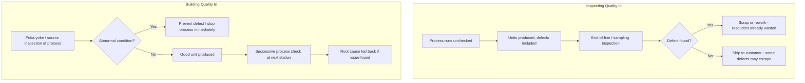

## Building Quality In Versus Inspecting Quality In

### Definition

"Building quality in" and "inspecting quality in" describe two fundamentally opposed philosophies for achieving product quality in a production system.

- **Building quality in** (also expressed as "quality at the source") means designing the process itself so that defects cannot be created or cannot pass undetected, making quality an inherent property of how work is performed at each step.
- **Inspecting quality in** means allowing the process to produce output as-is, and then relying on a separate inspection step (often after production, sometimes by a dedicated quality department) to find and remove defective units before they reach the customer.

This distinction is foundational to Jidoka and to the broader Toyota Production System's rejection of traditional mass-production quality control models.

### The Core Philosophical Difference

Inspecting quality in treats defects as an unavoidable byproduct of production that must be filtered out afterward. Quality is a **sorting problem**: separate good units from bad units after the fact.

Building quality in treats defects as a **process failure** that should be prevented, detected, and corrected at the moment and location they occur — or, ideally, prevented from occurring at all. Quality is a **process design problem**, not a sorting problem.

[Inference] This reframing is often summarized in TPS literature with the idea that "you cannot inspect quality into a product" — inspection can only remove defective units after resources (materials, labor, machine time) have already been consumed producing them. The value already lost in creating a defective unit is not recovered by catching it later; it is simply prevented from reaching the customer. Building quality in, by contrast, avoids that wasted resource expenditure altogether. This is a widely cited framing within lean literature though attributed with varying original sources.

### Comparative Analysis

| Dimension | Inspecting Quality In | Building Quality In |
| --- | --- | --- |
| When defects are addressed | After production, often in a separate step or department | During production, at the point of occurrence |
| Responsibility for quality | Concentrated in a dedicated quality/inspection function | Distributed to every operator/station in the process |
| Waste implication | Resources already spent on defective units are wasted regardless of catch rate | Resource waste is minimized or eliminated because defects are prevented or caught immediately |
| Feedback loop to root cause | Long — defect may be discovered far downstream or after shipment | Short — defect is discovered at or near the point of creation |
| Typical mechanisms | End-of-line inspection, sampling, quality control (QC) departments | Jidoka, poka-yoke, andon, source inspection, successive process inspection, standardized work |
| Effect on defect recurrence | Does not inherently reduce recurrence; same defect can repeat indefinitely | Drives root-cause correction, reducing recurrence over time |
| Underlying assumption | Defects are inevitable; focus on containment | Defects are avoidable; focus on prevention |

### How Building Quality In Is Implemented in TPS

Building quality in is not a single tool but an integrated set of practices, most of which fall under the Jidoka pillar:

- **Poka-yoke (error-proofing)**: Physical or procedural mechanisms that make incorrect actions impossible or immediately obvious.
- **Source inspection**: Checking causal conditions before an operation runs, preventing the defect from ever occurring.
- **Successive process inspection**: The very next station checks the previous station's output, catching any defect within one cycle.
- **Andon system**: Any operator can signal an abnormality, and depending on system design, the line may stop (immediately or via fixed position stop) until the issue is addressed.
- **Standardized work**: Clearly defined, consistent work sequences reduce variation, which is itself a major source of defects.
- **Autonomation (automation with a human touch)**: Equipment is designed to detect abnormal conditions and stop itself automatically, rather than continuing to run and produce defective output at machine speed.

Each of these mechanisms pushes quality responsibility to the point of value creation, rather than to a downstream checkpoint.

### Why Inspecting Quality In Is Considered Inferior in TPS

- **Delayed feedback**: A defect discovered at the end of a long line (or after shipment) may have been repeated across dozens or hundreds of units before detection, since nothing in the process itself signaled a problem.
- **Sunk resource waste**: All labor, material, and machine time invested in a defective unit are wasted the moment the defect occurs — inspection afterward only prevents the defect from reaching the customer, it does not undo the resource loss.
- **Sampling risk**: When end-of-line inspection uses statistical sampling rather than 100% checks (common when inspection is costly or slow), some defective units will inevitably escape detection.
- **Organizational silo effect**: Concentrating quality responsibility in a separate department can reduce the sense of ownership among production operators, since "someone else checks it," weakening the incentive to prevent defects during production itself.
- **No inherent mechanism for root-cause correction**: Sorting out bad units doesn't by itself investigate or fix why they were produced; a plant can operate indefinitely with a stable defect rate as long as inspection catches enough of them.

### Key Points

- "Building quality in" is often expressed in TPS materials as **quality at the source**, tying it directly to source inspection and poka-yoke.
- The Toyota andon cord is the clearest cultural artifact of building quality in: any operator has the authority (and obligation) to stop production over a quality concern, rather than deferring to a separate inspector.
- Inspecting quality in is not eliminated entirely in mature lean systems — final functional or safety-critical checks may still exist — but it is treated as a **backstop**, not the primary quality strategy.
- The shift from inspecting-in to building-in quality generally requires investment in process design, tooling (e.g., poka-yoke fixtures), training, and — critically — a cultural willingness to stop production when a defect is found, rather than prioritizing throughput over quality.

### Example

**Traditional (inspecting quality in) approach**: A garment factory sews thousands of shirts per shift. At the end of the line, a quality control team inspects a sample of finished shirts for stitching defects, sizing errors, and fabric flaws. Defective shirts found are pulled and either reworked or scrapped. Any defect not caught in sampling ships to the customer.

**TPS-aligned (building quality in) approach**: Each sewing station has a simple template or fixture to guide correct seam placement (a form of poka-yoke). The operator at the next station visually checks the previous seam before adding their own stitch (successive process inspection). If an error is spotted, the operator flags it immediately, and the line addresses it within that cycle rather than after hundreds of units have been produced. Over time, recurring defect types identified this way prompt fixture redesigns that eliminate the error mode at the source.

### Building Quality In vs. Inspecting Quality In — Process Flow

### Cost and Detection Point Relationship (svg_diagram)

<svg xmlns="http://www.w3.org/2000/svg" viewBox="0 0 800 260">
<text x="400" y="24" font-size="16" font-weight="bold" text-anchor="middle" fill="#1a1a1a">Cost and Detection Point Relationship (svg_diagram)</text>

<line x1="70" y1="220" x2="740" y2="220" stroke="#555" stroke-width="2" />
<line x1="70" y1="220" x2="70" y2="50" stroke="#555" stroke-width="2" />
<text x="400" y="245" font-size="12" text-anchor="middle" fill="#1a1a1a">Point of defect detection (later along process/time)</text>
<text x="30" y="140" font-size="12" text-anchor="middle" fill="#1a1a1a" transform="rotate(-90 30 140)">Cost of defect</text>

<polyline points="90,210 200,205 300,190 400,160 500,120 600,90 690,60" fill="none" stroke="#e53935" stroke-width="3" />

<circle cx="140" cy="207" r="7" fill="#2e7d32" />
<text x="140" y="190" font-size="11" text-anchor="middle" fill="#2e7d32">Build In</text>
<text x="140" y="177" font-size="10" text-anchor="middle" fill="#2e7d32">(source/successive)</text>

<circle cx="600" cy="90" r="7" fill="#1565c0" />
<text x="600" y="75" font-size="11" text-anchor="middle" fill="#1565c0">Inspect In</text>
<text x="600" y="62" font-size="10" text-anchor="middle" fill="#1565c0">(end-of-line)</text>

<circle cx="690" cy="60" r="7" fill="#9e9e9e" />
<text x="690" y="45" font-size="11" text-anchor="middle" fill="#9e9e9e">Customer</text>
</svg>

### Next Steps

- Jidoka principle: autonomation with a human touch
- Poka-yoke device classification and design methods
- Source inspection versus successive process inspection (component distinctions)
- Andon system design and escalation protocols
- Standardized work as a quality foundation
- Cost-of-quality models (prevention, appraisal, internal failure, external failure costs)
- Cultural and management prerequisites for stop-the-line authority