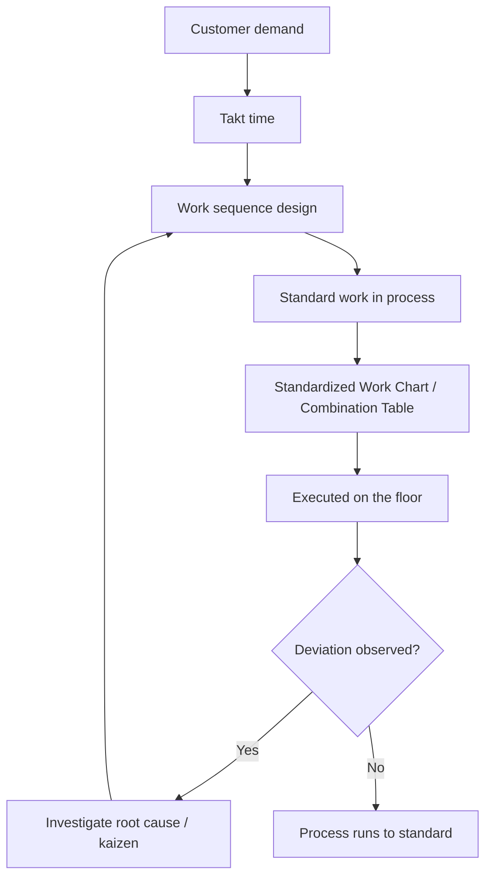

## The Three Elements of Takt Time, Work Sequence, and Standard Work In Process

### Definition

Standardized work in the Toyota Production System is built on three interdependent elements that together define the current best-known method for performing a task. These three elements must be documented and used together — omitting any one of them leaves standardized work incomplete and unable to serve its purpose as a baseline for consistency and continuous improvement.

1. **Takt time** — the rate at which a single unit must be produced to meet customer demand
2. **Work sequence** — the specific order in which an operator performs each task element within their cycle
3. **Standard work in process (standard WIP)** — the minimum quantity of in-process inventory, including units on machines, required to keep the process flowing without interruption

### Element 1: Takt Time

**Definition**: Takt time is the maximum allowable time per unit to produce products at the rate of customer demand. It is derived from the German word "Takt," meaning a precise interval or beat, referencing musical timing.

**Formula**:

$$T_{takt} = \frac{T_{available}}{D_{demand}}$$

Where $T_{available}$ is the net available production time in a given period (e.g., per shift), and $D_{demand}$ is the customer demand quantity for that same period.

**Example**: If a shift provides 27,000 seconds of net available working time (after breaks) and customer demand is 450 units per shift:

$$T_{takt} = \frac{27{,}000 \text{ seconds}}{450 \text{ units}} = 60 \text{ seconds/unit}$$

This means one unit must be completed, on average, every 60 seconds to exactly meet demand — no faster, no slower, in a purely leveled system.

**Key Points**:

- Takt time is **not** the same as cycle time. Cycle time is the actual time it takes an operator or machine to complete one cycle of work; takt time is the *target* rate demand requires. Standardized work aims to align actual cycle time to takt time.
- Takt time changes whenever customer demand changes or available time changes (e.g., different shift patterns, planned downtime, holidays).
- Takt time applies to the pace of the entire line, not to an individual operation in isolation — every station's actual cycle time should be at or below takt time to avoid becoming a bottleneck.
- Takt time is a planning and pacing concept; it does not by itself say *how* work should be sequenced or *how much* WIP is needed — that is the role of the next two elements.

### Element 2: Work Sequence

**Definition**: Work sequence is the specific, documented order in which an operator performs the individual task elements that make up their job cycle — not the order in which the line or machines are arranged, but the order of human motion and action within a single worker's standardized cycle.

**Key Points**:

- Work sequence is distinct from the physical process flow layout; it describes the operator's exact motions, part pickups, tool usage order, and inspection points within their own repeating cycle.
- A well-defined work sequence ensures consistency in **how** the work is done, which directly supports quality (reducing variation-induced defects) and safety (avoiding awkward or unsafe motion patterns).
- Work sequence is typically documented on a Standardized Work Chart or Standardized Work Combination Table, showing each task element, its time, and the walking/movement pattern.
- The sequence is not necessarily the fastest theoretically possible order — it is the order determined to reliably achieve quality, safety, and the target cycle time simultaneously.
- Deviating from the established work sequence (even if a step seems faster) undermines the ability to diagnose problems, since abnormal outcomes can no longer be reliably traced back to a known, controlled sequence of actions.

**Example**: An operator assembling a small subassembly might have a work sequence such as: (1) pick up baseplate, (2) insert bracket into pre-position jig, (3) apply two screws in a fixed order, (4) perform a visual defect check on the previous station's weld, (5) place finished unit on the outbound conveyor, (6) return to starting position for the next cycle. Each of these steps and their order is fixed and documented, not left to individual operator preference.

### Element 3: Standard Work In Process (Standard WIP)

**Definition**: Standard work in process is the minimum quantity of parts or units that must be held within the process — including any units currently loaded on machines — for the operator's work sequence to be completed smoothly and repeatedly without interruption or waiting.

**Key Points**:

- Standard WIP is **not** a buffer for absorbing variability or a safety stock concept in the traditional inventory sense — it is the minimum quantity structurally required for the defined work sequence to function.
- It commonly includes units that are physically inside machines mid-cycle (e.g., a part currently being machined) as well as any small quantity of parts staged between operations that the sequence depends on.
- Excess WIP beyond the standard level is treated as waste (the "inventory" waste category in the seven/eight wastes) and obscures problems by providing slack that hides line imbalances or quality issues.
- Insufficient WIP (below standard) causes the operator to wait or the process to stall, since the work sequence cannot be completed as designed.
- Standard WIP is directly determined by the physical layout and the work sequence — if the work sequence changes (e.g., due to a kaizen improvement), the standard WIP level typically must be recalculated.

**Example**: If an operator's work sequence requires them to load a part into a machine, walk to a second machine to unload its finished part while the first machine cycles automatically, and then return to load the first machine again, then one unit must be present *inside* the first machine and one finished unit *inside or at* the second machine at all times for this sequence to function — this quantity (commonly one or two units, depending on the specific layout) is the standard WIP for that segment of the process.

### How the Three Elements Interact

The three elements are not independent — they form a single interlocking system:

- **Takt time sets the pace target.**
- **Work sequence defines how each operator's cycle achieves that pace while maintaining quality and safety.**
- **Standard WIP defines the minimum inventory needed for the work sequence to be physically executable without gaps.**

Changing any one element typically forces a recalculation of the others. For example, if customer demand increases (takt time decreases), the work sequence may need to be redesigned (e.g., rebalancing tasks across operators), which may in turn change the standard WIP required at each station.

### Comparative Summary

| Element | What It Defines | Primary Purpose | Typical Documentation |
| --- | --- | --- | --- |
| Takt time | The required pace of production | Aligns production rate to customer demand | Calculated value, posted visually at the line |
| Work sequence | The order of operator task elements | Ensures consistent, safe, quality-controlled execution | Standardized Work Chart / Combination Table |
| Standard WIP | Minimum in-process inventory required | Enables the work sequence to run without interruption | Standardized Work Chart (WIP markers) |

### Why All Three Are Required Together

Standardized work is considered incomplete if only one or two of these elements are documented. For instance:

- Defining takt time alone tells you the *target* pace but says nothing about *how* to reliably hit it or what inventory is needed to sustain it.
- Defining work sequence alone without reference to takt time risks an operator sequence that is internally consistent but too slow (or unnecessarily fast, masking imbalance elsewhere) relative to actual demand.
- Defining takt time and work sequence without standard WIP can leave gaps in the physical flow, causing operators to wait on parts that haven't been correctly staged, even if their individual motions are well-sequenced.

All three together allow a process to be run consistently, evaluated objectively against a known baseline, and improved deliberately — since any deviation from the standard becomes visible and diagnosable, rather than being lost in ambiguity about how the work was "supposed" to be done.

### Standardized Work Elements Interaction

### The Three Elements of Standardized Work (svg_diagram)

<svg xmlns="http://www.w3.org/2000/svg" viewBox="0 0 800 300">
<text x="400" y="24" font-size="16" font-weight="bold" text-anchor="middle" fill="#1a1a1a">The Three Elements of Standardized Work (svg_diagram)</text>

<polygon points="400,60 200,240 600,240" fill="none" stroke="#555" stroke-width="2" />

<circle cx="400" cy="60" r="10" fill="#1565c0" />
<text x="400" y="45" font-size="13" text-anchor="middle" fill="#1565c0" font-weight="bold">Takt Time</text>
<text x="400" y="30" font-size="11" text-anchor="middle" fill="#1565c0">(pace of production)</text>

<circle cx="200" cy="240" r="10" fill="#2e7d32" />
<text x="150" y="265" font-size="13" text-anchor="middle" fill="#2e7d32" font-weight="bold">Work Sequence</text>
<text x="150" y="280" font-size="11" text-anchor="middle" fill="#2e7d32">(order of operations)</text>

<circle cx="600" cy="240" r="10" fill="#e65100" />
<text x="650" y="265" font-size="13" text-anchor="middle" fill="#e65100" font-weight="bold">Standard WIP</text>
<text x="650" y="280" font-size="11" text-anchor="middle" fill="#e65100">(minimum in-process inventory)</text>

<text x="400" y="160" font-size="13" text-anchor="middle" fill="`#1a1a1a`" font-weight="bold">Standardized</text>

<text x="400" y="178" font-size="13" text-anchor="middle" fill="`#1a1a1a`" font-weight="bold">Work</text>

</svg>

### Next Steps

- Standardized Work Chart and Standardized Work Combination Table construction
- Line balancing and yamazumi (workload balance) charts
- Cycle time versus takt time gap analysis
- Kaizen methodology for revising standardized work
- Poka-yoke integration within a defined work sequence
- Heijunka (production leveling) and its relationship to takt time stability
- Calculating net available time (accounting for breaks, planned downtime, changeovers)