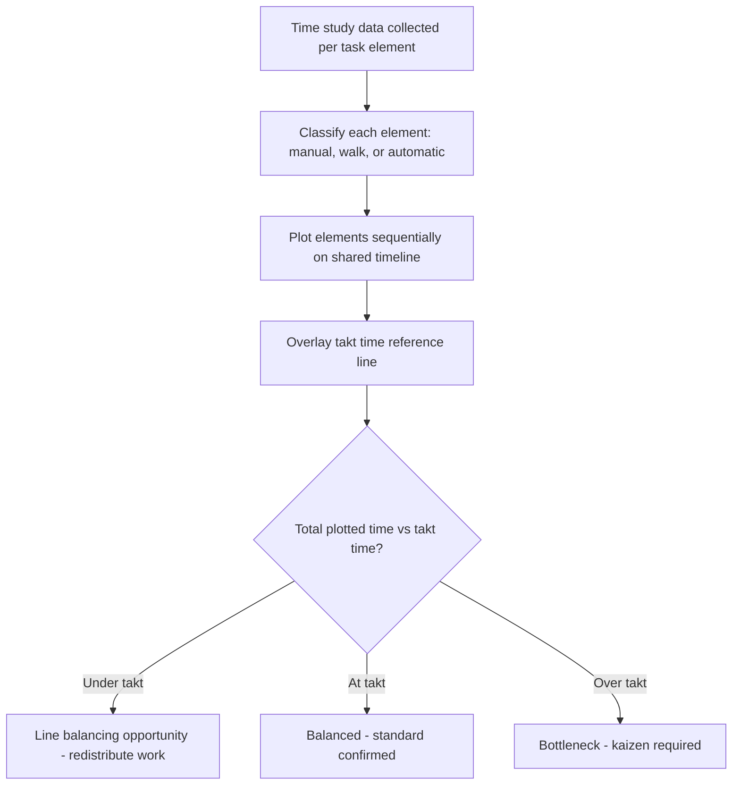

## Standardized Work Combination Tables

### Definition

A Standardized Work Combination Table (often abbreviated SWCT, and also referred to as a Standard Operations Combination Sheet or Yamazumi-style combination chart in some usages) is a documentation tool used in the Toyota Production System that shows, for a single operator's work cycle, the precise combination and timing relationship between **manual work**, **walking time**, and **automatic (machine) time**, plotted against takt time.

It is one of the three core standardized work documents (alongside the Standardized Work Chart and the Process Capacity Sheet) and is generally considered the most detailed and analytically useful of the three because it visually exposes the exact timing interaction between a human operator and the machines/equipment they operate.

### Purpose

The SWCT exists to answer a specific question that a simple task list cannot: **does this operator's combination of manual work, walking, and waiting for machines fit within takt time, and where exactly is the slack or overage?**

It serves several functions simultaneously:

- Verifies that an operator's total cycle time (manual + walk + wait) does not exceed takt time
- Visually identifies idle/waiting time within the cycle, which is a target for kaizen (waste elimination)
- Shows the exact sequencing relationship between operator actions and machine automatic cycles, which a simple sequential task list would not reveal
- Provides a baseline for detecting abnormalities (a deviation from the plotted pattern indicates a problem)
- Supports line balancing decisions when work is redistributed between operators

### Structure of the Table

A Standardized Work Combination Table is organized as a table with a timeline running horizontally (typically in seconds), and rows for each task element performed in the operator's cycle. Each row uses distinct line/bar styles to represent three types of time:

| Time Type | Typical Representation | Meaning |
| --- | --- | --- |
| Manual work time | Solid line | Time the operator is physically performing a task element (handling, assembling, inspecting) |
| Walking time | Dashed or wavy line | Time the operator spends moving between stations or machines |
| Automatic/machine time | Dotted line or distinct bracket | Time a machine runs automatically while the operator is free to do other tasks or waits |

A vertical line marking the takt time is drawn across the chart, so it is immediately visible whether the total plotted time for the operator's cycle exceeds, meets, or falls under the takt time target.

### Typical Columns/Fields in the Table

- **Task element number and description**: Each discrete step of the work sequence, in order
- **Manual time**: Duration of manual work for that element
- **Walk time**: Duration of walking associated with that element
- **Automatic time**: Duration of any machine auto-cycle time associated with that element (during which the operator may be free)
- **Cumulative time**: Running total of elapsed time as elements are completed in sequence
- **Graphical timeline**: The visual bar/line representation described above, plotted against a shared horizontal time axis with the takt time line overlaid

### Key Points

- The SWCT is built at the level of a **single operator's cycle**, not the whole line — each operator (or each station, if one operator covers multiple machines) typically has their own combination table.
- Automatic/machine time is a critical inclusion because it reveals **multi-machine handling opportunities**: if a machine's automatic cycle is long enough, the operator may be able to walk away and tend a second machine during that time, which is a common lean layout strategy (multi-process handling).
- The visual, graphical nature of the tool is intentional — it is designed to make imbalance and waste immediately visible to anyone looking at the chart, not just to someone doing a numerical calculation.
- A properly constructed SWCT should show the operator's total plotted cycle time landing **at or just under** takt time — significantly under indicates potential for further work redistribution (line balancing opportunity), while over indicates the station is a bottleneck.
- The SWCT is a living document: whenever a kaizen improvement changes the work sequence or timing, the chart must be updated to reflect the new standard.

### Relationship to the Other Standardized Work Documents

| Document | Primary Focus | Level of Detail |
| --- | --- | --- |
| Process Capacity Sheet | Machine-by-machine capacity calculation across the line | Equipment-focused, calculates max output per machine |
| Standardized Work Chart | Overall layout and work sequence for one operator/area, shown on a floor-plan-style diagram | Spatial — shows movement and part flow physically |
| Standardized Work Combination Table | Detailed timing breakdown of manual, walk, and machine time for one operator's cycle | Temporal — shows exact time relationships against takt time |

These three documents are typically used together and posted visibly at the workstation, forming the complete standardized work documentation set.

### Example

Consider an operator running two machines (a drilling machine and a deburring station) in a cell, with a takt time of 40 seconds.

Work sequence and timing:

1. Load part into drilling machine (manual, 5 sec)
2. Start drilling cycle (automatic, 15 sec) — operator is free during this time
3. Walk to deburring station (walk, 3 sec)
4. Unload previously deburred part and load new part (manual, 6 sec)
5. Start deburring cycle (automatic, 10 sec) — operator is free
6. Walk back to drilling machine (walk, 3 sec)
7. Unload finished drilled part (manual, 4 sec)

Total manual time: 5 + 6 + 4 = 15 seconds

Total walk time: 3 + 3 = 6 seconds

Automatic time overlaps with the operator's other activities rather than adding sequentially to their own busy time, so the operator's **total occupied cycle time** is manual + walk = 21 seconds, well under the 40-second takt time.

On the SWCT, this would be plotted as:

- Solid line segments for the manual work portions
- Dashed segments for the two walk portions
- Dotted/bracketed segments for the two automatic cycles, shown running in parallel with (not sequential to) the operator's other work where the layout allows it
- A vertical takt time line at 40 seconds, visually confirming the operator's plotted total (21 seconds of occupied time, with the two automatic cycles extending the *elapsed* cycle further but not requiring the operator's continuous attention) fits comfortably within takt

This chart would make visually obvious that there is significant slack (up to the 40-second takt line), which might prompt the team to consider adding a third machine or additional task to this operator's cycle during a kaizen review.

### Common Pitfalls

- **Confusing automatic time with idle time**: Automatic machine time is not waste if the operator is productively engaged elsewhere during it; it becomes waste only if the operator is simply standing and waiting with no other task assigned.
- **Failing to update the chart after changes**: A stale SWCT that doesn't reflect the actual current work sequence undermines its value as a standard against which to detect abnormalities.
- **Building the chart without validating against actual time studies**: Task element times must come from direct observation and time study, not estimation, or the resulting takt time comparison will be misleading.
- **Treating the SWCT as a one-time exercise**: It should be revisited during every kaizen event that touches the affected work sequence.

### Standardized Work Combination Table Layout

### Standardized Work Combination Table (svg_diagram)

<svg xmlns="http://www.w3.org/2000/svg" viewBox="0 0 820 300">
<text x="410" y="24" font-size="16" font-weight="bold" text-anchor="middle" fill="#1a1a1a">Standardized Work Combination Table (svg_diagram)</text>

<line x1="140" y1="260" x2="780" y2="260" stroke="#555" stroke-width="2" />
<text x="460" y="285" font-size="12" text-anchor="middle" fill="#1a1a1a">Time (seconds)</text>

<line x1="700" y1="60" x2="700" y2="260" stroke="#e53935" stroke-width="2" stroke-dasharray="6,4" />
<text x="700" y="50" font-size="12" text-anchor="middle" fill="#e53935">Takt time (40s)</text>

<text x="60" y="95" font-size="12" fill="`#1a1a1a`">1. Load drill</text>

<text x="60" y="130" font-size="12" fill="`#1a1a1a`">2. Drill cycle</text>

<text x="60" y="165" font-size="12" fill="`#1a1a1a`">3. Walk</text>

<text x="60" y="200" font-size="12" fill="`#1a1a1a`">4. Load deburr</text>

<text x="60" y="235" font-size="12" fill="`#1a1a1a`">5. Deburr cycle</text>

<line x1="140" y1="90" x2="190" y2="90" stroke="#2e7d32" stroke-width="6" />

<line x1="190" y1="125" x2="340" y2="125" stroke="#1565c0" stroke-width="6" stroke-dasharray="2,4" />

<line x1="340" y1="160" x2="380" y2="160" stroke="#e65100" stroke-width="6" stroke-dasharray="8,4" />

<line x1="380" y1="195" x2="440" y2="195" stroke="#2e7d32" stroke-width="6" />

<line x1="440" y1="230" x2="540" y2="230" stroke="#1565c0" stroke-width="6" stroke-dasharray="2,4" />

<line x1="140" y1="40" x2="170" y2="40" stroke="#2e7d32" stroke-width="6" />
<text x="180" y="45" font-size="11" fill="#1a1a1a">Manual</text>
<line x1="260" y1="40" x2="290" y2="40" stroke="#e65100" stroke-width="6" stroke-dasharray="8,4" />
<text x="300" y="45" font-size="11" fill="#1a1a1a">Walk</text>
<line x1="370" y1="40" x2="400" y2="40" stroke="#1565c0" stroke-width="6" stroke-dasharray="2,4" />
<text x="410" y="45" font-size="11" fill="#1a1a1a">Automatic</text>
</svg>

### Next Steps

- Standardized Work Chart (layout/spatial documentation)
- Process Capacity Sheet and machine-based capacity calculation
- Takt time, work sequence, and standard WIP (the three foundational elements)
- Multi-process handling and cell design for multi-machine operators
- Yamazumi charts for line balancing across multiple operators
- Time study methodology and data collection standards
- Kaizen event structure for revising standardized work documentation