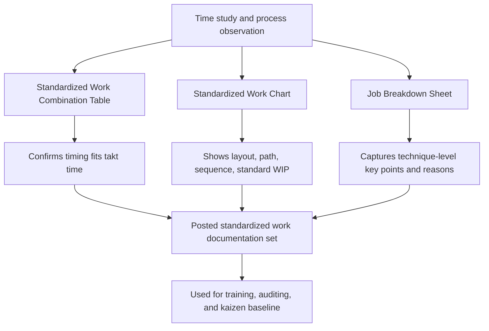

## Standardized Work Charts and Job Breakdown Sheets

### Definition

Standardized Work Charts and Job Breakdown Sheets are two related but distinct documentation tools used to define and communicate standardized work at the operator level in the Toyota Production System.

- **Standardized Work Chart** (also called the Standard Operations Chart) is a spatial/layout diagram showing the physical work area, machine positions, and the operator's walking path and work sequence overlaid on that layout, typically including takt time, cycle time, and standard WIP quantities.
- **Job Breakdown Sheet** (also called Job Instruction Sheet or Element Breakdown Sheet) is a detailed, step-by-step training and reference document that decomposes a job into its individual elements, specifying not just *what* to do at each step but *how* to do it correctly and, critically, *why* — the key points that affect quality, safety, or efficiency.

Both documents support standardized work, but they answer different questions: the Standardized Work Chart shows the **layout and flow** of the job, while the Job Breakdown Sheet shows the **precise technique** required to perform each element correctly.

### Standardized Work Chart

**Purpose**: To provide a single-page visual reference, typically posted at the workstation, that shows how the operator moves through their work area, in what sequence, and how that maps to takt time and inventory requirements.

**Typical contents**:

- A scaled or representative diagram of the physical layout: machines, workbenches, storage locations, conveyors
- A numbered path showing the operator's walking route and the sequence in which stations/machines are visited
- Symbols marking key control points: quality checks, safety hazards, standard WIP locations
- Header information: part name/number, process name, takt time, cycle time, number of operators, and the standard WIP quantity for the depicted area

**Key Points**:

- The Standardized Work Chart is fundamentally **spatial** — its defining feature is that it is drawn over or alongside an actual representation of the physical workspace, not just a list of steps.
- It is the tool most useful for quickly identifying wasted motion (excess walking, backtracking, awkward layouts) because the physical path is visually traced.
- It typically includes quality check symbols (often a circle or triangle) marking exactly where in the sequence and layout a quality verification occurs, and safety symbols marking hazard points requiring caution.
- Standard WIP locations and quantities are marked directly on the layout, showing where in-process inventory is expected to sit and how much.
- This chart is generally posted visibly at the workstation so both the operator and any supervisor/auditor can immediately compare actual practice against the documented standard.

### Job Breakdown Sheet

**Purpose**: To serve as a training and standardization document at a finer grain than the Standardized Work Chart, breaking each task element down into its important steps and, crucially, the technique-level "key points" that make the difference between doing it correctly and doing it incorrectly.

**Typical structure** (a common three-column format, sometimes attributed to Training Within Industry (TWI) Job Instruction methodology, which heavily influenced Toyota's approach to work standardization):

| Column | Content |
| --- | --- |
| Major Steps | The main, logical steps required to complete the job — "what" is done |
| Key Points | Anything in a step that could: (a) make or break the job, (b) injure the worker, or (c) make the work easier to do — "how" and critical technique detail |
| Reasons for Key Points | The underlying reason a key point matters — "why" it is important, which supports genuine understanding rather than rote compliance |

**Key Points (of the concept itself)**:

- The Job Breakdown Sheet is the primary tool used for **training new operators**, since it captures tacit, experience-based knowledge (e.g., "apply steady pressure, not a jerking motion, to avoid damaging the seal") that a simple task list would omit.
- It is more granular than the Standardized Work Chart — where the chart shows *that* an operator performs an assembly step at position 3, the breakdown sheet explains exactly *how* to perform that assembly step correctly, including grip technique, force, orientation cues, or sensory checks (sound, feel, visual cue) that indicate correct execution.
- Capturing "key points" is considered one of the most difficult parts of creating a good Job Breakdown Sheet, because experienced operators often perform these techniques unconsciously and may not initially articulate them without deliberate observation and questioning.
- The "reasons" column is what distinguishes genuine understanding-based training from rote memorization — an operator who understands *why* a key point matters is more likely to recognize and respond correctly to an abnormal condition.

### Comparative Summary

| Dimension | Standardized Work Chart | Job Breakdown Sheet |
| --- | --- | --- |
| Primary focus | Spatial layout, movement path, sequence overview | Detailed technique within each task element |
| Grain of detail | Station/task level | Sub-task/motion level |
| Primary use case | Visual reference posted at the station; waste (motion) identification | Training new operators; capturing tacit technique knowledge |
| Format | Diagram/floor-plan style with overlaid path and symbols | Multi-column text table (steps, key points, reasons) |
| Includes takt time/cycle time | Yes, typically in the header | Not typically the focus, though may be referenced |
| Typical origin | TPS-specific standardized work documentation | Heavily influenced by TWI Job Instruction methodology |

### Relationship to Standardized Work Combination Tables

Standardized Work Charts and Job Breakdown Sheets are typically used alongside the Standardized Work Combination Table (which documents the timing relationship between manual, walk, and automatic time). Together, these documents form a layered documentation set:

- The **Combination Table** answers: does the timing fit within takt time?
- The **Standardized Work Chart** answers: what is the physical layout and movement path?
- The **Job Breakdown Sheet** answers: exactly how is each element performed correctly, and why?

### Example: Job Breakdown Sheet Excerpt

For a task element "Insert bolt into housing and tighten with torque wrench":

| Major Step | Key Point | Reason |
| --- | --- | --- |
| Align bolt with housing hole | Hold bolt perpendicular to surface before starting thread | Prevents cross-threading, which damages the housing |
| Hand-thread bolt 2–3 turns | Turn by hand only, do not use torque wrench to start | Using the wrench to start the thread risks cross-threading undetected |
| Apply torque wrench to final spec | Listen/feel for the wrench's click at set torque | Confirms correct clamping force without over-tightening, which can crack the housing |

This level of detail would never appear on the Standardized Work Chart (which would simply show "bolt tightening" as one step in the operator's path/sequence), but it is essential for a new operator to perform the task correctly and consistently.

### Common Pitfalls

- **Treating the Standardized Work Chart as sufficient for training**: Its spatial/sequence focus does not convey technique-level detail; relying on it alone for training new operators risks inconsistent quality even if the sequence is followed correctly.
- **Writing Job Breakdown Sheets with vague key points**: A key point like "be careful" provides no actionable guidance; effective key points are specific, observable, and tied to a concrete technique or sensory cue.
- **Failing to update either document after a kaizen change**: Both documents lose their value as a standard the moment actual practice diverges from what is documented, since deviations can no longer be reliably identified as abnormalities.
- **Omitting the "reasons" column in Job Breakdown Sheets**: Without stated reasons, training reduces to rote step-following, which is more fragile when an operator encounters a variation not explicitly covered by the steps.

### Documentation Set Relationship

### Standardized Work Chart Layout (svg_diagram)

<svg xmlns="http://www.w3.org/2000/svg" viewBox="0 0 800 300">
<text x="400" y="24" font-size="16" font-weight="bold" text-anchor="middle" fill="#1a1a1a">Standardized Work Chart Layout (svg_diagram)</text>

<rect x="100" y="80" width="90" height="60" fill="none" stroke="#555" stroke-width="2" />
<text x="145" y="115" font-size="11" text-anchor="middle" fill="#1a1a1a">Machine A</text>
<rect x="330" y="80" width="90" height="60" fill="none" stroke="#555" stroke-width="2" />
<text x="375" y="115" font-size="11" text-anchor="middle" fill="#1a1a1a">Machine B</text>
<rect x="560" y="80" width="90" height="60" fill="none" stroke="#555" stroke-width="2" />
<text x="605" y="115" font-size="11" text-anchor="middle" fill="#1a1a1a">Machine C</text>

<path d="M145,140 L145,200 L375,200 L375,140" fill="none" stroke="#1565c0" stroke-width="2" stroke-dasharray="6,3" />
<path d="M375,200 L605,200 L605,140" fill="none" stroke="#1565c0" stroke-width="2" stroke-dasharray="6,3" />
<polygon points="600,145 610,145 605,135" fill="#1565c0" />

<circle cx="145" cy="110" r="10" fill="#2e7d32" />
<text x="145" y="114" font-size="10" text-anchor="middle" fill="white">1</text>
<circle cx="375" cy="110" r="10" fill="#2e7d32" />
<text x="375" y="114" font-size="10" text-anchor="middle" fill="white">2</text>
<circle cx="605" cy="110" r="10" fill="#2e7d32" />
<text x="605" y="114" font-size="10" text-anchor="middle" fill="white">3</text>

<polygon points="375,60 385,75 365,75" fill="none" stroke="#e53935" stroke-width="2" />
<text x="375" y="52" font-size="10" text-anchor="middle" fill="#e53935">QC check</text>

<rect x="255" y="150" width="20" height="20" fill="#ffe0b2" stroke="#e65100" stroke-width="1" />
<text x="265" y="185" font-size="10" text-anchor="middle" fill="#e65100">Std WIP: 1</text>

<text x="60" y="250" font-size="11" fill="`#1a1a1a`">Takt time: 45s</text>

<text x="220" y="250" font-size="11" fill="`#1a1a1a`">Cycle time: 42s</text>

<text x="400" y="250" font-size="11" fill="`#1a1a1a`">Standard WIP: 2 units</text>

</svg>

### Next Steps

- Standardized Work Combination Tables (timing detail)
- Takt time, work sequence, and standard WIP fundamentals
- Training Within Industry (TWI) Job Instruction methodology
- Kaizen event workflow for updating standardized work documents
- Visual management symbols and conventions on the shop floor
- Line balancing using yamazumi charts
- Andon integration with quality check points shown on Standardized Work Charts