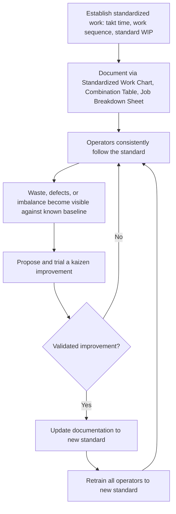

## Standardized Work as the Baseline for Kaizen

### Definition

Standardized work as the baseline for kaizen refers to the foundational TPS principle that continuous improvement (kaizen) cannot be meaningfully sustained without first establishing a documented, consistently followed current standard. Standardized work provides the fixed reference point against which any change can be objectively measured, tested, and validated — without it, "improvement" has nothing stable to improve upon, and gains cannot be reliably distinguished from ordinary process variation.

This principle is often summarized in TPS literature as: **there is no kaizen without standardization, and standardization without kaizen is stagnation** — the two are treated as a continuous, cyclical relationship rather than separate activities.

### The Core Logic

Kaizen means incremental, continuous improvement. For an improvement to be verifiable, three conditions must hold:

1. There must be a known, documented **current state** (the standard) against which a proposed change can be compared.
2. The current state must be **consistently followed** in practice, so that any measured outcome reflects the standard itself and not undocumented variation between operators or shifts.
3. Once an improvement is validated, it must become the **new standard**, immediately documented and used as the baseline for the next cycle of improvement.

Without standardized work, none of these conditions can be reliably met. If every operator performs a task slightly differently, there is no single "current state" to compare against — a change that appears to improve one operator's output might simply reflect that operator's existing technique, unrelated to the change itself.

### The Standardize-Improve-Standardize Cycle

TPS treats standardization and kaizen as a repeating cycle, distinct from (but often paired conceptually with) the more general PDCA (Plan-Do-Check-Act) cycle:

1. **Establish the standard**: Document takt time, work sequence, and standard WIP; create the Standardized Work Chart, Combination Table, and Job Breakdown Sheet.
2. **Follow the standard consistently**: Train operators to the documented standard; deviations are treated as abnormalities to investigate, not as personal technique choices.
3. **Identify waste or improvement opportunity**: Because everyone is working to the same known baseline, any waste (excess motion, imbalance, quality issue) becomes visible and attributable to the process itself rather than obscured by inconsistent individual practices.
4. **Test and validate a change (kaizen)**: A proposed improvement is trialed, and its effect is measured against the known baseline.
5. **Re-standardize**: If validated, the improved method becomes the new standard, documented and trained to all operators performing that work.
6. **Repeat**: The new standard becomes the baseline for the next round of kaizen.

This cycle is sometimes visualized as a ratchet — standardization "locks in" a gain so that the process does not slide backward, while kaizen pushes the standard forward incrementally over time.

### Key Points

- **Standardized work is the "best known method today," not a permanent or final method.** It is explicitly understood to be temporary — the current best practice until a better one is found and validated, at which point it is updated.
- **Consistency is a precondition for visibility.** Waste, defects, and imbalance are far easier to detect when the underlying process is stable and known; inconsistent execution buries these signals in noise.
- **Without a standard, kaizen efforts risk producing unverifiable or unsustainable results.** A change that seems to work may simply reflect natural variation, and without a documented baseline to revert to, an unsuccessful change may also be difficult to fully undo.
- **The operator who performs the work is typically the one best positioned to identify kaizen opportunities**, precisely because they are the one following (and therefore intimately familiar with) the current standard — this reflects the broader TPS principle of respect for people and frontline problem-solving.
- **Standardization is not the same as rigidity.** The point is not to freeze work forever, but to create a known, stable baseline specifically so that it *can* be deliberately and verifiably improved, rather than left to drift unpredictably.

### Why Skipping Standardization Undermines Kaizen

- **No reliable measurement baseline**: Improvement claims cannot be validated against a moving or undocumented target.
- **Gains erode over time**: Without documentation and training to a new standard, improvements made by one operator or shift are not transferred to others, and the process can quietly regress to old habits.
- **Root cause analysis becomes unreliable**: If work is not performed consistently, it becomes difficult to determine whether a defect or delay originated from the process design itself or from an individual deviation from best practice.
- **Training new operators becomes inconsistent**: Without a documented standard, each new hire may be trained informally by whichever experienced operator happens to train them, perpetuating inconsistent practices rather than the actual best-known method.

### Example

A packaging line operator currently follows a standardized work sequence with a cycle time of 48 seconds against a 50-second takt time (2 seconds of slack).

1. **Observation**: During normal work, following the documented standard, the operator notices that reaching for a box flap requires an awkward twisting motion that occasionally causes a mis-fold (a minor quality issue), and this happens consistently at the same point in the sequence for every operator who works this station.
2. **Kaizen proposal**: The team suggests repositioning the box supply rack closer to the fold station to eliminate the twisting motion, hypothesizing this will reduce mis-folds and or slightly reduce cycle time.
3. **Trial against baseline**: The change is tested for a set period. Because the *existing* standard was well-documented and consistently followed beforehand, the team can attribute any change in mis-fold rate or cycle time specifically to the rack repositioning, rather than to unrelated variation between operators or shifts.
4. **Validation**: The trial shows a measurable reduction in mis-folds and a cycle time drop to 45 seconds.
5. **Re-standardization**: The Standardized Work Chart, Combination Table, and Job Breakdown Sheet are all updated to reflect the new rack position and the (now slightly revised) work sequence. All operators at this station are retrained to the new standard.
6. **New baseline**: This updated standard now becomes the reference point for the next kaizen cycle — for instance, the team might next investigate whether the 5 seconds of remaining slack (45 seconds versus 50-second takt) could be used to absorb an additional task from a neighboring, over-takt station.

### Common Pitfalls

- **Treating standardized work as a one-time documentation exercise**: If the standard is written once and never revisited, it stops functioning as a live kaizen baseline and becomes disconnected from actual practice.
- **Allowing informal deviation without updating the standard**: If operators quietly adopt a "better" method without formal validation and re-documentation, the organization loses the ability to confirm the change is genuinely better, and other operators/shifts do not benefit from it.
- **Pursuing kaizen changes without an existing standard to compare against**: Improvement attempts in an unstandardized process risk chasing noise rather than addressing genuine root causes.
- **Viewing standardization as management imposing rigid control**: When implemented well, standardized work is typically developed collaboratively with the operators who do the work, and it is explicitly framed as improvable — resistance often stems from standardization being applied top-down without operator involvement or without a genuine commitment to updating it based on frontline input.

### Standardize-Improve-Standardize Cycle

### Standardization and Kaizen as a Ratchet (svg_diagram)

<svg xmlns="http://www.w3.org/2000/svg" viewBox="0 0 800 260">
<text x="400" y="24" font-size="16" font-weight="bold" text-anchor="middle" fill="#1a1a1a">Standardization and Kaizen as a Ratchet (svg_diagram)</text>

<polyline points="80,220 200,220 200,180 320,180 320,140 440,140 440,100 560,100 560,60 680,60" fill="none" stroke="`#1565c0`" stroke-width="4" />

<circle cx="200" cy="220" r="7" fill="#2e7d32" />
<text x="200" y="240" font-size="10" text-anchor="middle" fill="#2e7d32">Standard v1</text>
<circle cx="320" cy="180" r="7" fill="#2e7d32" />
<text x="320" y="200" font-size="10" text-anchor="middle" fill="#2e7d32">Standard v2</text>
<circle cx="440" cy="140" r="7" fill="#2e7d32" />
<text x="440" y="160" font-size="10" text-anchor="middle" fill="#2e7d32">Standard v3</text>
<circle cx="560" cy="100" r="7" fill="#2e7d32" />
<text x="560" y="120" font-size="10" text-anchor="middle" fill="#2e7d32">Standard v4</text>

<text x="260" y="205" font-size="10" fill="`#e65100`">kaizen</text>

<text x="380" y="165" font-size="10" fill="`#e65100`">kaizen</text>

<text x="500" y="125" font-size="10" fill="`#e65100`">kaizen</text>

<text x="60" y="240" font-size="11" fill="`#1a1a1a`">Time</text>

<text x="30" y="130" font-size="11" text-anchor="middle" fill="`#1a1a1a`" transform="rotate(-90 30 130)">Process performance</text>

</svg>

### Next Steps

- Takt time, work sequence, and standard work in process (foundational elements)
- Standardized Work Charts and Job Breakdown Sheets
- Standardized Work Combination Tables
- PDCA (Plan-Do-Check-Act) cycle in continuous improvement
- Kaizen event structure and facilitation
- Respect for people and frontline-driven problem solving
- Andon and quality feedback as kaizen trigger mechanisms