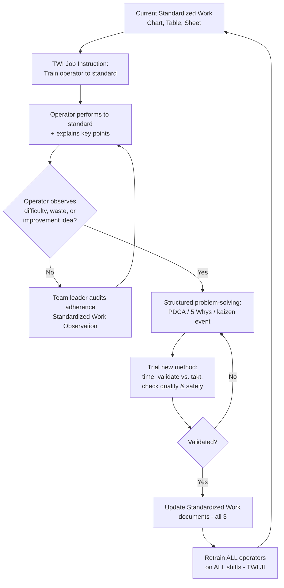

## Training Operators to Follow and Improve Standards

### Overview

Training operators is the mechanism that makes Standardized Work real rather than aspirational. A perfectly designed Standardized Work Chart, Combination Table, and Work Sheet accomplish nothing if the operator performing the job was never actually trained to the current standard, or was trained once and never retrained after a revision. Training in this context has two distinct, sequential purposes that are often conflated: first, teaching an operator to reliably execute the *current* standard exactly as documented (compliance training), and second, developing the operator's capability to *identify and propose improvements* to that standard (kaizen capability). Toyota Production System practice treats both as essential and uses a specific, structured method — rooted in Training Within Industry (TWI) — to deliver the first, while relying on a broader set of practices (kaizen circles, suggestion systems, gemba coaching) to develop the second.

### Key Points

- Training to follow a standard and training to improve a standard are two different skills, developed through two different mechanisms, and both are required
- TWI Job Instruction (JI) is the classical, structured method for teaching an operator to perform Standardized Work correctly and consistently
- "Telling" an operator the steps is not the same as training; TWI JI requires demonstration, operator practice, and verification of understanding
- Operators cannot meaningfully improve a standard they do not fully understand, including the *why* (key points) behind each step
- A trained operator who identifies a deviation or difficulty is a primary early-warning signal for the team leader — training includes teaching operators *what to do* when they encounter a problem, not just how to perform the nominal sequence
- Retraining after any standard revision is mandatory and applies to every operator who performs the job, not only the one involved in the improvement

### Two Distinct Training Objectives

**1. Training to follow the standard (compliance / consistency)**

The goal here is that any qualified operator, on any shift, produces the same quality output at the same pace using the same method — this is what "standardized" actually means in practice. This training must cover not just the sequence of motions but the reasoning behind each critical step (the key points on the Standardized Work Sheet), because an operator who understands *why* a step exists is far less likely to unconsciously drift away from it under time pressure, fatigue, or a minor parts variation.

**2. Training to improve the standard (kaizen capability)**

The goal here is different: developing the operator's ability to notice waste, notice difficulty, notice near-misses, and propose changes — and then to participate credibly in validating whether a proposed change is actually better (via the same rigor used in "Updating standards after improvement": timing, quality-checking, and safety-checking the new method before it replaces the old one). This is not a natural byproduct of compliance training; it requires deliberate development, typically through structured problem-solving training (e.g., PDCA, A3 thinking), kaizen event participation, and a management culture that treats operator-identified problems as valuable signals rather than complaints.

These two objectives are sequential, not parallel: an operator cannot meaningfully identify what is *wrong* with a standard, or propose a valid alternative, if they have not first been rigorously trained in what the standard *is* and *why* it exists. Kaizen capability is built on top of a solid compliance foundation, not instead of it.

### TWI Job Instruction (JI): The Structured Method

Training Within Industry was developed in the United States during World War II to rapidly train a wartime workforce, and its Job Instruction module was adopted and refined within Toyota's production system as the standard method for teaching Standardized Work. It exists specifically as a corrective to "show them once and let them figure out the rest" training, which reliably produces inconsistent methods across operators.

TWI JI has four steps:

**Step 1: Prepare the Worker**

- Put the operator at ease; reduce anxiety about being watched or evaluated
- State the job and find out what the operator already knows
- Get the operator interested in learning the job; explain its importance
- Position the operator correctly to observe the operation

**Step 2: Present the Operation**

- Tell, show, and illustrate one *important step* at a time
- For each important step, state the associated *key point* — the specific technique, quality check, or safety consideration that makes that step succeed or fail
- Repeat at a pace the operator can absorb; do not present the entire job in one uninterrupted pass
- Instruct clearly, completely, and patiently, but no more information than the operator can retain at once

**Step 3: Try Out Performance**

- Have the operator perform the job while the trainer observes silently
- Have the operator explain each key point aloud while performing the step (this verifies understanding, not just muscle memory — an operator can mimic a motion without understanding why it matters)
- Correct errors immediately and calmly
- Continue until the trainer is confident the operator both *can do* the job and *knows the key points*

**Step 4: Follow Up**

- Put the operator on their own, but designate who they go to for help
- Check on the operator frequently in the early period
- Encourage questions
- Taper off extra coaching and normal follow-up as competency is demonstrated

The core discipline TWI JI enforces is: **an important step is not fully taught until the trainer has verified the operator can both perform it and explain the key point behind it.** This is the mechanism by which "why" transfers from the standard document into the operator's working knowledge — without it, the operator has only memorized a sequence, which is fragile under variation.

[Inference] The specific historical detail that TWI JI was adopted by Toyota is well documented in lean literature; the precise internal adaptations Toyota made to the original 1940s TWI curriculum are less uniformly documented across sources and may vary by account.

### Building Kaizen Capability

Beyond JI, developing an operator's capacity to *improve* (not just follow) standards typically involves:

- **Structured problem-solving training** — teaching operators the basic PDCA cycle and simple root-cause tools (5 Whys, cause-and-effect) so their improvement ideas are testable hypotheses, not just opinions
- **Kaizen event participation** — direct experience in a structured kaizen event teaches operators the full loop: identify waste, propose change, trial it, measure it, and — critically — see it formalized into a new standard (reinforcing that their input has real authority)
- **Suggestion systems with fast feedback** — a suggestion system where ideas are acknowledged and responded to quickly (even if declined, with a stated reason) teaches operators that raising ideas is worthwhile; slow or silent suggestion systems teach the opposite
- **Team leader coaching at the gemba** — routine, non-punitive gemba walks where the team leader asks "what's difficult about this step today?" rather than only checking for compliance, normalizes surfacing problems
- **Visual management of standard performance** — posting takt-time attainment, defect data, or andon pull frequency near the workstation gives operators the same information a team leader uses, enabling them to reason about where improvement effort is most valuable

### Common Failure Modes

- **"Sit and watch" training**: an experienced operator shows a new hire the job once without structured key points or a verification step, producing silent method drift from day one
- **Training only the "important steps," never the "why"**: operators can perform the sequence but cannot explain the key points, so when a minor variation occurs (different part batch, tool wear) they cannot reason about whether their adaptation is safe
- **No retraining after a standard update**: the operator who proposed or trialed the improvement is trained, but other shifts/operators performing the same job are not, reintroducing method variation immediately after a standard was just harmonized
- **Treating kaizen capability as innate rather than trained**: expecting operators to "just speak up" with improvement ideas without ever having taught them a structured way to test and present those ideas, then concluding (incorrectly) that the workforce "isn't engaged"
- **Punishing the messenger**: an operator who reports a difficulty with the current standard is treated as underperforming rather than as providing a valuable signal, extinguishing future reporting
- **Confusing certification with competency**: signing a training record as complete because the operator sat through a presentation, without the TWI JI "try out performance" verification step actually occurring
- **Trainer without training-the-trainer**: assigning the most senior operator to train new hires without that senior operator having been taught *how to train* (the JI method itself is a skill, not automatic from job expertise)

### The Training-Standardization Feedback Loop

### Roles and Responsibilities

- **Trainer / Team Leader**: delivers TWI JI training, verifies both performance and key-point understanding, conducts follow-up checks, and is the first point of contact for operator-reported difficulties
- **Operator**: learns and executes the current standard to criteria; is expected and encouraged to surface difficulties, near-misses, and improvement ideas through defined channels
- **Group Leader / Supervisor**: ensures training records are current, ensures retraining is completed after every standard revision (not just documented as required), and models the non-punitive response to reported problems
- **Kaizen facilitator / Continuous Improvement staff**: delivers structured problem-solving training (PDCA, root-cause tools) and facilitates kaizen events where operators practice full-cycle improvement
- **Quality / Engineering**: defines which key points are safety- or quality-critical so training emphasizes them appropriately, and participates in validating operator-proposed changes that touch specification-controlled steps

### Example

A new operator joins a sub-assembly line. Using TWI JI, the team leader breaks the job into six important steps, demonstrating each with its key point (e.g., "orient the bracket with the stamped logo facing up — key point: prevents installing it backward, which causes a downstream fit issue that isn't caught until final assembly"). The operator practices each step while stating the key point aloud, and the team leader corrects a grip technique that risked a pinch-point injury. Over the following week, the team leader checks in daily, tapering to weekly.

Three months later, the same operator notices that reaching for a fastener bin requires an awkward twist that isn't captured as a key point and seems to slow the cycle slightly. Because the operator was also taught the basic PDCA framework during a prior kaizen event, they bring this observation to the team leader with a simple proposal: move the bin 15 cm closer. The team leader times the change over several cycles, confirms no torque or quality step is affected, and — following the standardize-after-improvement procedure — updates the Standardized Work Chart and retrains both shifts using TWI JI on the revised layout.

### Conclusion

Training operators for Standardized Work is not a single event but two connected disciplines: rigorous, verified instruction in the current standard (best delivered through TWI Job Instruction, which insists on demonstrated performance and explained key points, not passive observation), and deliberate development of the capability to identify and validate improvements to that standard. Skipping the first produces inconsistent execution; skipping the second produces a workforce that complies but never contributes to kaizen. Sustained Standardized Work requires both, delivered continuously and revisited fully — for every operator on every shift — every time the standard itself changes.

### Related Topics

- TWI Job Instruction four-step method in detail
- Training Within Industry: Job Relations and Job Methods modules
- Updating standards after improvement (standardize-after-improve loop)
- PDCA and 5 Whys as operator-level problem-solving tools
- Kaizen event structure and operator participation
- Suggestion systems and idea-to-implementation cycle time
- Standardized Work Observation and audit cadence
- Gemba walks and non-punitive problem surfacing
- Skills matrix and multi-skilling (Shojinka) for flexible staffing
- Team leader as first-line trainer and coach