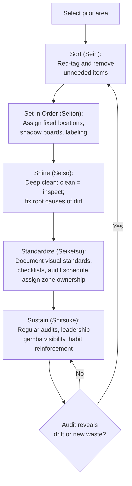

## 5S Methodology of Sort, Set in Order, Shine, Standardize, and Sustain

### Overview

5S is a structured method for organizing a workplace so that everything needed is present, everything unneeded is absent, everything has a designated place, the area is kept clean enough to reveal abnormalities immediately, and these conditions are maintained through discipline rather than one-time effort. The name comes from five Japanese terms — *Seiri*, *Seiton*, *Seiso*, *Seiketsu*, *Shitsuke* — conventionally translated into English as Sort, Set in Order, Shine, Standardize, and Sustain. Within the Toyota Production System, 5S is not a standalone housekeeping initiative; it is foundational infrastructure that makes visual management, Standardized Work, and waste identification possible. A cluttered, inconsistent, or dirty workstation hides abnormalities (a leak, a missing tool, a defect) that a well-executed 5S workstation makes instantly visible.

### Key Points

- 5S is sequential and cumulative — each S builds on the discipline of the previous one; skipping Sort and jumping to organizing (Set in Order) means organizing things that shouldn't be there in the first place
- The first three S's (Sort, Set in Order, Shine) are largely one-time or periodic *activities*; the last two (Standardize, Sustain) convert those activities into an ongoing *system*
- 5S's core purpose in TPS is to make abnormalities visible at a glance — a missing tool, an oil leak, a misplaced part should be immediately obvious to anyone looking at the area
- 5S is a prerequisite for effective Standardized Work: a workstation where tool location and material presentation vary day to day cannot support a consistent, repeatable work sequence
- Sustain (Shitsuke) is consistently identified as the hardest S to maintain and the most common point of program failure — the first four S's produce a visible, satisfying before/after result; Sustain produces no visible event at all, only the absence of regression

### The Five S's in Detail

**1. Sort (Seiri) — 整理**

Distinguish needed items from unneeded items at the workstation, and remove the unneeded ones. This is not a light tidy-up; it is a deliberate evaluation of every item — tool, fixture, document, material — against the question "is this needed for this operation, and if so, how often?"

- **Red-tag technique**: items whose necessity is uncertain are tagged with a red tag noting the item, location found, date, and evaluator. Tagged items are moved to a holding area for a defined period (commonly 30 days, though this varies by operation); if unclaimed or unused, they are disposed of, relocated, or sold
- Items used constantly stay at or near the point of use; items used occasionally are stored further away; items rarely or never used are removed from the area entirely
- Sort applies to more than physical tools: obsolete work instructions, outdated visual aids, and unused fixtures or jigs are equally in scope

**2. Set in Order (Seiton) — 整頓**

Arrange the needed items so they are easy to find, use, and return, with a specific, marked location for everything. The guiding principle is "a place for everything, and everything in its place," applied with enough rigor that a missing item is visible from a distance.

- **Shadow boards**: tool silhouettes outlined on a board so a missing tool is instantly visible as an empty silhouette
- **Location labeling and floor marking**: floor tape, bin labels, and address systems (e.g., aisle/rack/shelf coding) so any item's home location is unambiguous
- **Point-of-use storage**: frequently used items are positioned within arm's reach or minimal walking distance, directly informed by the same motion-waste analysis used in Standardized Work design
- **Quantity indication**: min/max markings or kanban-style visual signals showing correct stock levels at a glance, distinguishing "enough," "reorder," and "too much"
- Set in Order should be informed by actual frequency-of-use and motion-path data, not guesswork — this is where 5S and Standardized Work's motion analysis directly intersect

**3. Shine (Seiso) — 清掃**

Clean the workstation and equipment thoroughly and repeatedly, treating cleaning as inspection rather than mere appearance. In TPS, "clean to inspect" is the operative principle: a machine kept spotless makes a new oil leak, a loose bolt, or a metal shaving from unexpected wear visible within a single shift, whereas a chronically dirty machine hides those same signals indefinitely.

- Cleaning responsibility is typically assigned to the operators who use the equipment, not solely to a separate janitorial function — this ties cleanliness to ownership and to the operator's own inspection routine
- A cleaning checklist or schedule specifies what is cleaned, how often, by whom, and what to look for while cleaning (early signs of wear, leaks, looseness)
- Root causes of contamination (a leaking seal, a chip-generating process) should be addressed, not just the resulting mess repeatedly cleaned up — Shine should feed back into a broader problem-solving effort, not become an endless mopping cycle

**4. Standardize (Seiketsu) — 清潔**

Establish the rules, schedules, and visual controls that maintain the first three S's as the normal condition of the workplace, and make deviation from that condition visible to anyone. This S is where 5S stops being an event and starts becoming a system.

- Visual controls (floor markings, shadow boards, labeled bins, color coding) are themselves the "standard" — an observer should be able to tell, without asking, whether the area currently matches the standard condition
- 5S checklists and audit schedules are formalized: who checks what, how often, using what criteria
- Standardize also assigns and displays ownership — who is responsible for which zone, often shown on a 5S map or responsibility chart posted in the area
- This is distinct from, but directly analogous to, "Standardized Work" — Standardize (Seiketsu) applies the same "the current best condition is documented and visible" logic to the workplace itself rather than to the operator's task sequence

**5. Sustain (Shitsuke) — 躾**

Maintain and continually reinforce the established standards through discipline, habit, audit, and leadership behavior, indefinitely. Sustain has no discrete "activity" the way Sort or Shine do; it is the ongoing absence of backsliding, which makes it structurally harder to manage and far more likely to be neglected.

- Regular 5S audits (often using a scored checklist, sometimes displayed publicly as a scoreboard) provide the feedback loop that prevents silent decay
- Leadership visibility matters disproportionately here: if managers stop participating in or referencing 5S audits, the organization reads that as the initiative no longer mattering, regardless of what is said officially
- Sustain is built, not commanded — it depends on habit formation, peer accountability, and making the 5S-compliant way the *easiest* way to work (not merely the *correct* way), so operators don't have to expend extra willpower to maintain it
- [Inference] Common practitioner guidance suggests integrating 5S checks into existing routines (start-of-shift checks, team leader gemba walks) rather than treating 5S audits as a separate, additional burden — this improves adherence, though the specific mechanism's effectiveness will vary by organization and culture.

### 5S and Its Relationship to Standardized Work and Visual Management

5S is frequently taught as a standalone "housekeeping" program, but within TPS it functions as infrastructure for two other core disciplines:

- **Standardized Work depends on 5S**: a Standardized Work Chart specifies a precise operator walking path and tool/material locations; this is only meaningful if those locations are actually fixed and marked (Set in Order) and kept in a working, clean condition (Shine). Without 5S, Standardized Work documents describe an idealized workstation that doesn't match reality.
- **Visual management depends on 5S**: the entire premise of visual management — that a problem should be detectable "at a glance" — requires a baseline of order. An andon light, a kanban card, or a shadow board's empty silhouette only functions as a visual signal against a background that is otherwise orderly and predictable; in a cluttered area, the signal is lost in the noise.

### Common Failure Modes

- **Treating 5S as a one-time event ("5S Day")**: a single intensive cleanup produces a good "after" photo but reverts within weeks without Standardize and Sustain infrastructure
- **Skipping Sort**: organizing (Set in Order) items that should have been discarded, resulting in a tidy area still full of unnecessary items
- **Shine as cosmetic cleaning only**: cleaning for appearance without using the activity as inspection, missing the early-warning function that justifies the time spent
- **No visual audit criteria**: "Standardize" exists only as a verbal expectation, with no checklist or scoring system, making drift invisible until it's severe
- **Sustain treated as self-executing**: assuming that once an area looks good, it will stay that way without scheduled audits, management attention, or a defined response to backsliding
- **5S imposed without operator involvement**: an area is organized by outside staff (engineering, a consultant) without operator input, producing a layout that looks orderly but doesn't match actual workflow, leading operators to quietly abandon it
- **Confusing 5S scores with actual improvement**: a high audit score achieved by "cleaning for the audit" rather than maintaining the condition day-to-day, indicating the metric has become the target rather than a proxy for the real goal

### 5S Implementation Sequence

### 5S Audit Scoring (Illustrative Structure)

A typical 5S audit checklist scores each S on a simple scale (e.g., 0–4 or 1–5) against defined criteria, summed into an area score tracked over time.

$$\text{5S Score} = \sum_{i=1}^{5} w_i \cdot s_i$$

where $s_i$ is the observed score for S-category $i$ and $w_i$ is an optional weighting factor if some categories are prioritized. [Inference] Scoring scales, weighting, and audit frequency are organization-specific conventions, not a fixed TPS standard — the arithmetic form above illustrates the general structure, not a universally mandated formula.

Example criteria for scoring "Set in Order" at a workstation might include: every tool has a marked location (yes/no), no items found outside their marked location during the audit, min/max stock indicators are present and accurate, and walking paths and safety zones are clearly marked and unobstructed.

### Roles and Responsibilities

- **Operator**: performs daily Shine and Sustain activities at their own station, follows Set in Order locations, and flags when the standard condition cannot be maintained (e.g., insufficient storage, recurring contamination source)
- **Team Leader**: conducts regular 5S audits, coaches operators on standard visual conditions, and escalates recurring root causes (e.g., a persistent leak) rather than accepting repeated cleanup as the permanent solution
- **Area/Zone Owner**: assigned responsibility for a specific 5S zone, visible on a posted responsibility map, accountable for that zone's audit score
- **Management/Leadership**: participates visibly in audits or gemba walks referencing 5S conditions, allocates resources for root-cause fixes identified during Shine, and ensures Sustain doesn't quietly become deprioritized under production pressure

### Example

A machining cell begins a 5S implementation. During Sort, the team removes three obsolete fixtures, three years of unused work-instruction revisions, and a broken cart, red-tagging borderline items for a 30-day holding period. During Set in Order, they install a shadow board for hand tools, add floor tape marking the operator's walking path and a designated scrap bin location, and label bins with min/max quantities for consumables. During Shine, the team discovers a small coolant leak at a fitting that had been masked by a permanently oily floor; this triggers a maintenance work order rather than just an added cleaning task.

For Standardize, the team posts a laminated photo of the "standard condition" for the cell alongside a weekly audit checklist and assigns the afternoon-shift lead as zone owner. For Sustain, the team leader incorporates a two-minute 5S check into the existing start-of-shift huddle rather than creating a separate audit event, and the cell's 5S score is reviewed monthly alongside safety and quality metrics — with a corrective discussion (not punishment) triggered whenever the score drops for two consecutive audits.

### Conclusion

5S is a five-stage discipline — Sort, Set in Order, Shine, Standardize, Sustain — that converts a workplace from an unpredictable environment into one where the correct condition is visible at a glance and any deviation stands out immediately. The first three S's are concrete activities that produce a visible before/after transformation; the final two convert that transformation into a durable system through documented visual standards and ongoing audit discipline. 5S is not a standalone housekeeping program in TPS terms — it is the physical and organizational foundation that makes Standardized Work repeatable and visual management functional, and its most common failure mode is treating it as a one-time event rather than the self-reinforcing system the fifth S, Sustain, is meant to establish.

### Related Topics

- Visual management and andon systems
- Standardized Work and its dependency on fixed tool/material locations
- Red-tag technique and disposition decision criteria
- Point-of-use storage and motion-waste (Muda) reduction
- Kanban and min/max visual stock signals
- Gemba walks and leadership standard work
- Total Productive Maintenance (TPM) and "clean to inspect"
- 5S audit scoring systems and scorecard design
- Zone ownership and responsibility mapping
- Shitsuke (Sustain) and organizational habit formation