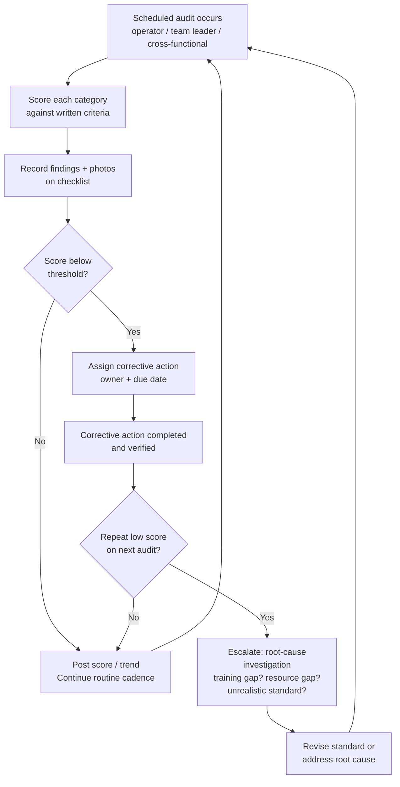

## Conducting and Auditing 5S Implementation

### Overview

Conducting and auditing 5S implementation is the operational discipline that turns 5S from a philosophy into a repeatable, measurable business process. Where the five S's (Sort, Set in Order, Shine, Standardize, Sustain) describe *what* a well-organized workplace looks like, conducting and auditing describes *how an organization actually gets there and stays there*: how a rollout is sequenced, who does what, what tools and forms are used, how progress is scored, and how the audit findings feed back into corrective action rather than becoming a paperwork exercise. Without a disciplined audit system, even a well-executed initial 5S event decays within months — audits are the mechanism that makes Sustain (Shitsuke) actually sustain.

### Key Points

- 5S implementation should proceed area by area (often starting with a visible pilot area) rather than attempting a simultaneous plant-wide rollout, which typically overwhelms both training capacity and follow-up bandwidth
- An audit needs three things to function: a written checklist with objective criteria, a defined frequency, and a defined owner who is accountable for both scoring and acting on results
- Audit scoring should be simple enough to complete quickly and consistently between different auditors (inter-rater reliability matters — if two auditors score the same area very differently, the checklist criteria are too subjective)
- The audit's value comes entirely from what happens *after* scoring — a scored checklist with no corrective-action follow-up is equivalent to not auditing at all
- Layering audits (operator self-check, team leader audit, cross-functional or management audit at wider intervals) catches different failure modes and reinforces that 5S matters at every organizational level

### Planning and Conducting a 5S Implementation

**1. Select and scope the pilot area**

Choose an area that is visible, manageable in size, and where a successful before/after result will build credibility for wider rollout. Avoid starting with the most chaotic, highest-pressure production area — early wins matter more than early ambition.

**2. Form the 5S team**

Include the operators who work in the area (essential — a layout designed without their input will not match actual workflow), a team leader or supervisor, and often a 5S champion or continuous-improvement facilitator to guide the process and keep it on schedule.

**3. Baseline the area**

Photograph and, ideally, score the area's current condition before any changes are made. This baseline is what makes the eventual improvement demonstrable and is also the reference point for judging whether later audits show genuine sustained improvement or reversion.

**4. Execute Sort**

Run a red-tag event: every item in the area is evaluated against clear criteria (needed for this operation? used how often?). Tag uncertain items, move them to a holding area with a defined disposition date, and physically remove clearly unneeded items immediately.

**5. Execute Set in Order**

Using frequency-of-use and motion-path analysis, assign and mark a fixed location for every remaining item — shadow boards, floor marking, bin labeling, min/max quantity indicators. This step often benefits from timing the operator's current motion pattern first, the same way a Standardized Work time study would, so the new layout is based on data rather than intuition.

**6. Execute Shine**

Conduct a deep clean of the area and equipment, explicitly framing the activity as inspection: what does the cleaning reveal about wear, leaks, looseness, or other early failure signs? Any root cause identified (a leaking seal, a chip-generating process) should be logged and assigned for correction, not simply cleaned up repeatedly.

**7. Establish Standardize**

Document the new "standard condition" — commonly a labeled reference photo posted in the area — along with a written cleaning/organization schedule specifying who does what and how often. Assign zone ownership visibly (a responsibility map or chart).

**8. Establish the audit system (this is where Sustain begins)**

Design the checklist, scoring method, frequency, and audit ownership before declaring the implementation "complete." An implementation without an audit plan in place at handover is incomplete by definition, since Sustain has no separate "activity" of its own — only the audit and follow-up system carries it forward.

**9. Train and hand over**

Train the operators and team leader on the standard condition and the audit procedure itself (how to use the checklist, what each score level means), then formally hand ongoing ownership to the area team.

**10. Schedule the first follow-up audits**

Set the cadence for the first several audits tighter than the long-term steady-state frequency (e.g., weekly for the first month, then monthly), since new habits are most fragile immediately after implementation.

### Designing the Audit Checklist

An effective 5S audit checklist has several structural properties:

- **One or more objective criteria per S category**, phrased so two different auditors would score them the same way (e.g., "every visible item has a marked storage location" is auditable; "the area looks organized" is not)
- **A simple, consistent scale** — commonly 0–4 or 1–5 per item or per category, with each score level defined in writing (what does a "2" look like versus a "4"?) to reduce subjectivity
- **Category subtotals and an overall score**, so trends can be tracked both by individual S and in aggregate over time
- **A photo requirement** for at least the lowest-scoring items, providing an evidence trail and making the follow-up conversation concrete rather than abstract
- **A comments/corrective-action field** directly on the checklist, so a low score is immediately paired with an assigned action and owner rather than requiring a separate meeting to generate one

Example checklist structure (illustrative, not a fixed universal standard):

| Category | Sample audit criterion | Score (0–4) |
| --- | --- | --- |
| Sort | No unneeded items, obsolete documents, or broken equipment present in area |  |
| Set in Order | Every tool/item has a marked, unique location; nothing found out of place |  |
| Set in Order | Min/max stock indicators present and stock levels within range |  |
| Shine | Equipment and floor free of unaddressed leaks, spills, or debris |  |
| Shine | Cleaning schedule is current and signed off |  |
| Standardize | Reference photo/standard-condition visual is posted and current |  |
| Standardize | Zone ownership is clearly assigned and displayed |  |
| Sustain | Prior audit's corrective actions have been closed |  |
| Sustain | Operators can explain the current 5S standard for their station |  |

[Inference] Exact scoring scales, item weighting, and pass/fail thresholds are organization-specific conventions rather than a single fixed TPS standard; the structure above illustrates common practice, not a mandated format.

### Audit Cadence and Layering

Most mature 5S systems use multiple layers of audit at different frequencies, each catching a different kind of drift:

- **Operator self-check** (daily or per-shift): quick, informal check against the posted standard photo, often built into start-of-shift routine rather than treated as a separate task
- **Team leader audit** (weekly): a structured walk using the checklist, generating scored data and immediate corrective actions for anything found out of standard
- **Cross-functional or peer audit** (monthly): auditors from outside the immediate area audit it (and vice versa), which surfaces blind spots that people who work in an area every day stop noticing, and cross-pollinates good practices between areas
- **Management/leadership audit** (monthly or quarterly): senior leaders participate directly in an audit walk; this layer matters less for its scoring precision and more for its visible signal that 5S has ongoing organizational priority

### Scoring, Trending, and Escalation

$$\text{Area Score (\%)} = \frac{\text{Points Achieved}}{\text{Points Possible}} \times 100$$

Individual audit scores matter less than the *trend* over successive audits. A single low score may simply reflect a busy production week; a declining trend across three or more consecutive audits indicates the standard has actually eroded and needs active intervention, not just another audit.

- Scores are commonly displayed visually in the area itself (a posted trend chart) so operators see their own area's trajectory, reinforcing ownership
- A defined escalation trigger (e.g., two consecutive audits below a threshold) should automatically prompt a root-cause discussion — is the standard unrealistic, is training insufficient, is there a resource constraint, or has attention simply lapsed — rather than a repeat of the same corrective action that already failed once
- Comparing scores *between* areas can motivate healthy competition but carries a risk: if scores become a target used for ranking or discipline, areas may optimize for "passing the audit" (cleaning right before a scheduled audit) rather than maintaining the actual standard day to day — an instance of Goodhart's-law-type metric distortion that undermines the audit's real purpose

### Common Failure Modes

- **Audit checklist too subjective**: criteria like "looks clean" or "seems organized" produce inconsistent scores between auditors and make trends meaningless
- **No corrective-action loop**: findings are recorded but never assigned an owner or due date, so the same issues reappear audit after audit with no resolution
- **Auditing without leadership visibility**: if management never participates in or reviews audit results, the organization reads 5S as a lower-tier activity regardless of official messaging
- **"Cleaning for the audit"**: operators learn the audit schedule and restore the standard condition only shortly beforehand, producing an artificially high score that doesn't reflect the area's actual day-to-day state — often solvable by making some audits unannounced
- **Rollout too broad, too fast**: attempting to implement and audit 5S across an entire facility simultaneously outstrips training and follow-up capacity, producing shallow, unsustained results everywhere instead of solid results in a few areas
- **Scores used punitively**: treating a low audit score as grounds for individual blame rather than a system-level signal discourages honest reporting and can lead operators to hide problems rather than surface them
- **No re-baseline after layout or process changes**: an audit checklist that isn't updated after a genuine process change (new equipment, revised Standardized Work) keeps auditing against an obsolete "standard condition"

### 5S Audit and Corrective-Action Cycle

### Roles and Responsibilities

- **Operator**: performs daily self-checks, participates in corrective actions assigned to their area, and provides input when the standard itself seems unworkable
- **Team Leader**: owns the weekly structured audit, ensures corrective actions are assigned and closed, and escalates recurring or unresolved issues
- **5S Champion / Continuous Improvement Facilitator**: designs and maintains the checklist, coordinates cross-functional audits, compiles trend data across areas, and coaches other auditors toward scoring consistency
- **Management/Leadership**: participates in higher-tier audits, reviews trend data at a facility level, allocates resources for corrective actions that exceed local authority (capital, maintenance, staffing), and visibly reinforces that 5S performance matters alongside safety, quality, and delivery metrics

### Example

A fabrication shop rolls out 5S starting with a single welding cell as the pilot. The team photographs the cell's cluttered baseline, runs a red-tag event removing two unused fixtures and a stack of outdated drawings, installs a shadow board and floor marking, and performs a deep clean that reveals a slow hydraulic leak on a positioner previously masked by an oily floor — logged as a maintenance work order rather than just wiped up.

The team posts a labeled "standard condition" photo and builds a nine-item checklist scored 0–4 per item. For the first month, the team leader audits weekly; scores climb from 58% at baseline to 91% by week four. At month two, a cross-functional audit from an unrelated area scores the cell at 74% — lower than the team leader's most recent 90% — revealing that a bin's min/max labels had drifted out of date after a parts-numbering change the team leader's checklist hadn't been updated to reflect. The checklist is corrected, and the discrepancy becomes a talking point for the plant's broader monthly leadership audit review, reinforcing that outside eyes catch things internal routine can miss.

### Conclusion

Conducting a 5S implementation well means sequencing Sort, Set in Order, and Shine as concrete, team-involved activities on a manageable pilot scope, then treating Standardize and the audit system as the deliverable that actually makes the result last — not an afterthought once the "real work" is done. Auditing well means objective, consistently scorable criteria; a defined, layered cadence from operator self-checks up through leadership walks; and, most importantly, a tight loop from every low score to an assigned, verified corrective action. An audit program that scores but never acts, or that management never visibly participates in, produces the appearance of Sustain without its substance — and 5S, like Standardized Work, only delivers ongoing value when the system built to maintain it is taken as seriously as the initial transformation.

### Related Topics

- 5S methodology: Sort, Set in Order, Shine, Standardize, Sustain
- Red-tag technique and item disposition criteria
- Visual management and standard-condition reference photos
- Gemba walks and layered audit structures
- Standardized Work Observation as an analogous audit discipline
- Root-cause analysis (5 Whys) for recurring audit failures
- Goodhart's law and metric distortion in operational scorecards
- Total Productive Maintenance (TPM) and "clean to inspect"
- Kaizen event structure and pilot-area selection
- Zone ownership and responsibility mapping