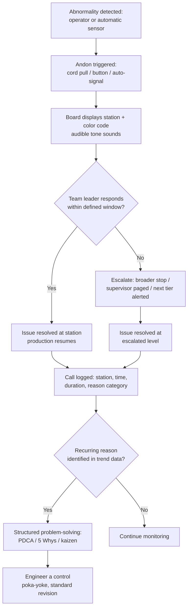

## Andon Boards and Real Time Performance Visualization

### Overview

Andon boards are a specific class of visual control device: a display, typically overhead and visible across a wide area, that shows the real-time status of a production line or process — normal operation, a stopped station, a quality concern, a material shortage — so that abnormalities are visible to everyone in the area the instant they occur, not just to the operator at the affected station. The term *andon* derives from a Japanese paper lantern; in TPS, it evolved into a status board paired with a call system (the andon cord or button) that operators use to signal a problem, request help, or stop the line. Andon is one of the clearest embodiments of *jidoku* (autonomation, or "automation with a human touch") — the principle that a process should be able to detect its own abnormalities and stop or signal rather than continuing to run and propagate a defect.

### Key Points

- An andon board is not merely a status dashboard — it is the visible half of a control loop that includes a triggering mechanism (cord, button, sensor), an escalation path, and an expected response
- Andon exists to surface problems immediately, not to summarize them after the fact — its value collapses if response time is slow or inconsistent
- Real-time performance visualization (takt-time attainment, running count vs. target, cycle-time trend) is often integrated into the same board or an adjacent one, but this data-display function is distinct from the stop/call function and should not be confused with it
- The core operating principle is "stop the line to fix the problem" rather than "let the line run and inspect quality afterward" — andon is fundamentally about surfacing problems at their source, in real time, so they can be addressed before more defective work is produced
- An andon system without a fast, reliable, defined response degrades into a passive visual display and loses most of its value, regardless of how sophisticated the board hardware is

### How an Andon System Works

**1. Trigger**

An operator pulls a cord, presses a button, or a sensor automatically detects an abnormal condition (a missing part, an out-of-tolerance measurement, a machine fault). In some implementations, any operator can stop the line; in others, pulling the cord signals for help without an automatic full-line stop, giving a brief window for the team leader to respond before an automatic stop occurs at a defined boundary (this graduated response is common in moving assembly lines where an instant full stop is highly disruptive).

**2. Signal**

The andon board immediately displays which station or zone triggered the call, typically via colored lights (commonly a simple color code: green for running normally, yellow for a call for help or a minor issue, red for a stopped line or serious problem) and a station number or name. An audible tone or the line's normal ambient sound changing (e.g., a distinctive melody) often accompanies the visual signal so the alert isn't missed by anyone facing away from the board.

**3. Response**

A team leader (or a designated responder) is expected to reach the calling station within a defined time window. This response-time expectation is itself often measured and tracked as a metric — a fast, consistent average response time is a strong indicator of a well-functioning andon culture; a slow or inconsistent one indicates the system has decayed into ignored noise.

**4. Resolution or escalation**

If the team leader resolves the issue within the available time (often tied to a defined number of seconds or a fixed distance before the next station on a moving line), production resumes without a full line stop. If not resolved in time, escalation occurs: a broader stop, a supervisor is paged, or the call is escalated up a defined chain until resolved.

**5. Reset and log**

Once resolved, the andon call is cleared, and — ideally — the reason for the call is logged (station, time, duration, root cause category) so recurring problems become visible in aggregate, feeding back into structured problem-solving (PDCA, 5 Whys) rather than being treated as isolated incidents.

### Andon Board Design Elements

- **Station/zone-level granularity**: the board shows status per station or defined zone, not just a single line-wide status, so responders know exactly where to go without walking the line to find the source
- **Color coding**: a small, consistent palette (commonly green/yellow/red) that requires no interpretation — color meaning should be immediately learnable and never require checking a legend
- **Visibility**: mounted high enough and positioned so it's visible from anywhere in the relevant work area, including to team leaders who may be elsewhere on the floor
- **Audible signal paired with visual**: ensures the call is noticed even by someone not currently looking at the board; distinct tones for different call types (help request vs. quality issue vs. material shortage) are common in more developed systems
- **Response-time tracking**: many modern andon boards log call time, response time, and resolution time automatically, feeding a response-time metric that is itself audited
- **Call reason categorization**: buttons or a simple menu at the point of the call let the operator indicate the reason (material, quality, equipment, other), enabling aggregate analysis of what's actually driving stops

### Real-Time Performance Visualization

Beyond the stop/call function, many production areas display real-time production performance on the same or an adjacent board — this is closely related to andon but serves a distinct function: informing pace and target attainment rather than triggering an immediate stop/response.

Common elements:

- **Hour-by-hour production tracking**: planned quantity versus actual quantity for each hour of the shift, updated continuously, making it immediately obvious whether the line is on pace for the shift target
- **Takt-time countdown or pacing indicator**: a visual cue (often a simple light or digital timer) showing the target cycle time, helping operators self-pace against takt without needing a stopwatch
- **Running OEE or downtime accumulation**: a running total of unplanned downtime for the shift, so a growing gap between target and actual becomes visible well before shift-end rather than being discovered only in an end-of-shift report

The important distinction is that this performance-visualization function is a visual *display* in the control-versus-display sense: it informs, and typically a team leader or supervisor decides what to do about a widening pace gap — it doesn't itself trigger an automatic response the way an andon call does, unless the organization has explicitly built an escalation rule around it (e.g., "if hourly attainment falls below 85% for two consecutive hours, escalate to the value-stream manager").

### Comparison: Andon Call Function vs. Performance Display Function

| Aspect | Andon Call/Signal Function | Performance Visualization Function |
| --- | --- | --- |
| Purpose | Surface an abnormality and trigger immediate response | Inform pace, trend, and target attainment |
| Trigger | Operator action or automatic sensor detection | Continuous or periodic data update |
| Expected response | Defined, timed, escalating | Typically discretionary, reviewed by team leader/supervisor |
| Granularity | Per station/zone, immediate | Per hour/shift, aggregated |
| Relationship to jidoka | Direct embodiment — stop-the-line-to-fix principle | Supporting context, not itself a stop mechanism |
| Failure if ignored | Directly enables continued production of defects | Gap discovered late, but doesn't in itself compound at the same defect-propagation rate |

### Common Failure Modes

- **Andon fatigue / normalized ignoring**: if response time is consistently slow, operators learn that pulling the cord doesn't produce timely help, and either stop pulling it (hiding problems) or the signal becomes background noise that team leaders tune out
- **No consequence-free escalation path**: if there is no defined behavior when a call goes unanswered past its time window, the system has no actual "control" function, regardless of the board's visual sophistication
- **Punishing andon pulls**: if operators are informally discouraged from pulling the cord (production pressure, blame for "causing" a stop), the fundamental jidoka principle is undermined and defects will be allowed to pass rather than be caught at the source
- **Conflating the display with the control**: treating a well-designed real-time performance dashboard as equivalent to a functioning andon system, when the dashboard has no built-in trigger/response mechanism at all
- **Board shows status but not reason**: a board that only shows "red" without indicating the call category (quality, material, equipment) makes it harder to triage response priority or later analyze recurring root causes
- **No logging or trend analysis**: treating each andon call as a one-off event rather than aggregating call reasons and frequency over time, missing the opportunity to route recurring issues into structured problem-solving and eventually into engineered controls (poka-yoke) that prevent the call from being needed at all
- **Overly complex color/signal scheme**: adding so many status colors or zones that responders must consult a legend, defeating the "understood at a glance" purpose of the visual signal

### Andon Call Lifecycle

### Response-Time as a Managed Metric

$$\text{Average Response Time} = \frac{\sum \text{(response timestamp} - \text{call timestamp)}}{\text{number of calls}}$$

Tracking this metric over time — and, importantly, tracking it *without* punishing the operators generating the calls — gives management an honest signal of whether the andon system is functioning as a real control mechanism or has decayed into a passive display that happens to have lights on it. [Inference] Specific target response-time thresholds (e.g., "respond within 30 seconds") vary substantially by industry, line type (moving assembly vs. discrete cell), and organizational maturity, and are not fixed by a universal TPS standard.

### Roles and Responsibilities

- **Operator**: triggers the andon call when an abnormality is detected, without fear of blame; provides the call-reason category when the system supports it
- **Team Leader**: is the primary responder, expected to reach the calling station within the defined window; if unable to resolve the issue in time, initiates escalation
- **Supervisor/Group Leader**: receives escalated calls, tracks response-time trends across the area, and ensures recurring call reasons are routed into structured problem-solving
- **Engineering/Maintenance**: is looped in via escalation for equipment-related andon calls, and is a key stakeholder when recurring call patterns point toward the need for an engineered fix (poka-yoke, equipment upgrade)
- **Value-stream/Plant Management**: reviews aggregate andon data (call frequency, response time, reason breakdown) as part of tiered daily/weekly management reviews, and ensures the cultural message ("pulling the cord is expected and valued") is reinforced from the top

### Example

On a moving assembly line, an operator at station 6 notices a fastener that doesn't seat correctly and pulls the andon cord. The board immediately shows station 6 in yellow with an audible tone, and a graduated response window begins — the line continues moving for a set distance (a common design so a brief pause doesn't fully halt the entire line for minor, quickly resolved issues). The team leader, positioned nearby, reaches the station within 15 seconds and helps clear the issue; the line never reaches the automatic full-stop boundary, and the board returns to green.

The call is logged automatically: station 6, 15-second response, category "fastener seating." Over the following two weeks, the same reason code recurs at station 6 eleven times — a pattern invisible from any single incident but obvious in the aggregated log. This triggers a structured problem-solving effort, which traces the root cause to a fastener supplier's slightly out-of-spec thread pitch on a specific batch. The fix is addressed at the supplier level, and the recurring andon call disappears from the trend entirely — a case where andon's real-time control function (immediate response) and its aggregate logging function (pattern detection feeding into root-cause correction) worked together.

### Conclusion

Andon boards combine a real-time status display with a defined trigger-and-response control loop, making them one of the clearest practical expressions of jidoka: the ability of a process to make its own abnormalities visible and stop or call for help rather than silently continuing to produce defective work. The board's visual design (color coding, station granularity, audible signal) matters, but the system's real effectiveness lives in the response — a fast, consistent, non-punitive response to every call, paired with logging and trend analysis that routes recurring problems into structured problem-solving. Real-time performance visualization (pace, takt attainment, running OEE) is a valuable complementary display often shown alongside andon, but it is functionally different: it informs discretionary management response rather than triggering the immediate, defined action that defines a true andon control.

### Related Topics

- Jidoka (autonomation) and stop-the-line philosophy
- Poka-yoke as the engineered endpoint of recurring andon patterns
- Visual controls versus visual displays
- Tiered daily management meetings and escalation structures
- Takt time and hourly production tracking boards
- Response-time metrics and non-punitive escalation culture
- OEE (Overall Equipment Effectiveness) real-time tracking
- Root-cause analysis (5 Whys, fishbone) for recurring line stops
- Standardized Work and the role of the team leader as first responder
- Kaizen event structure for chronic andon-triggered problems